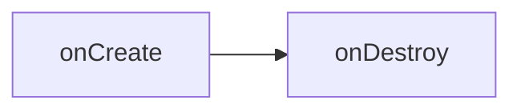
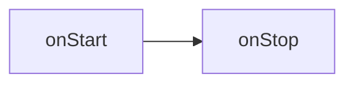
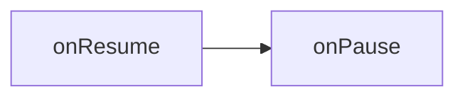
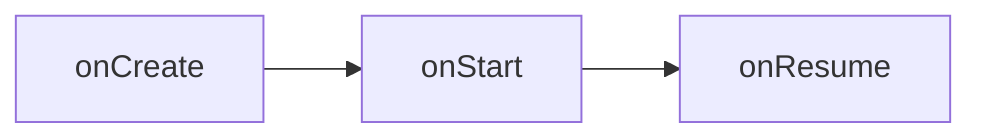
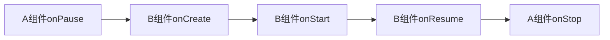
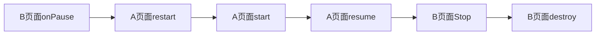
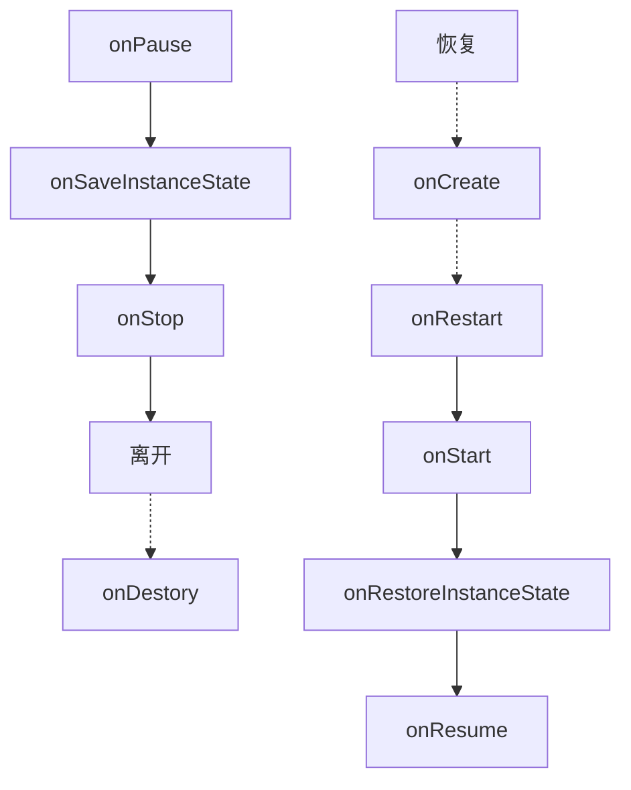
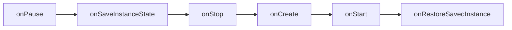

# 一、模拟器启动问题

## 使用Genymotion模拟器启动项目

**问题**

```shell
adb server version (32) doesn't match this client (35); killing...
error: could not install *smartsocket* listener: Address already in use
ADB server didn't ACK
* failed to start daemon *
error: cannot connect to daemon
```

**解决方法**

命令行的 adb 是用 Android SDK 自带的，而Genymotion 根本不知道 sdk 的位置。因此Genymotion 的 adb 和Android sdk 里的adb 冲突了。只要修改 Genymotion 里的 adb 为 Android SDK 的，就可以识别了。

具体去修改Genymotion的偏好设置即可


## adb 环境配置

### adb mac环境变量

```shell
# Setting Path for ADB
export ANDROID_HOME="/Users/keyang/Library/Android/sdk"
export ANDROID_HOME
export PATH=${PATH}:${ANDROID_HOME}/tools
export PATH=${PATH}:${ANDROID_HOME}/platform-tools
```

### adb install

adb -s {seria number} install xxx.apk 在指定设备上安装apk


## 打包命令：

```shell
./gradlew clean assemblequickbrokerReleaseChannels
```


# 二、Gradle基础知识

## 安卓Gradle配置文件

1. ### 根目录下的build.gradle

   根目录下的build.gradle文件用于添加子工程或模块共用的配置项

   buildscript: 用来设置整个项目的classpath

   allprojects: 项目的所有子工程都会用到这个配置，

2. ### 根目录下的gradle.properties

   gradle.properties里面定义的属性是全局的，可以在各个模块的build.gradle里面直接引用.

3. ### app目录下的build.gradle

  ```groovy
  // com.android.application 这是一个application
  // com.android.library 这是一个库
  apply plugin: 'com.android.application'
  // 配置项目的各种属性
  android {
    compiledSdkVersion 28 //项目编译的sdk版本，也就是API level
    // 程序默认配置，指定应用程序包名，最小sdk版本，目标sdk版本，版本号，版本名
    defaultConfig {
      
    }
    // 指定生成安装文件的配置，常有两个子包:release,debug，
    // 注：直接运行的都是debug安装文件
    buildTypes {
      debug {
        applicationIdSuffix ".debug"
      }
      release {
        proguardFiles getDefaultProguardFile('proguard-android.txt'), 'proguard-rules.pro'
      }
    }
    // 文件配置
    sourceSets {
      main {
        res.srcDirs = ['src/main/res', 'src/main/res-night']
      }
      quickbroker {
        java.srcDirs = ['src/quickbroker/java']
        res.srcDirs += ['src/quickbroker/res']
        manifest.srcFile 'src/quickbroker/AndroidManifest.xml'
      }
    }
    // 声明有哪些flavor的维度
    flavorDimensions "broker"
    // productFlavors是可定义的产品特性
    productFlavors {
      dimension "broker" // 每一个flavor都必须有一个dimension
      //buildConfigField用于给BuildConfig文件添加一个字段
      //三个参数:1.要定义的常量的类型 2.该常量的命名 3.该常量的值
      buildConfigField("String", "DOMAIN", "\"$DOMAIN\"")
    }
  }
  ```

  

## 配置Flavors

- productFlavors与buildTypes是多对多的关系
- productFlavor 其实是defaultConfig的子集

- productFlavors下可以新增多个flavor，每个flavor都可以覆盖defaultConfig下的属性实现差异化。如：包名、应用名、编译版本；


## BuildConfig类

BuildConfig类是Android打包以后自动生成的一个类,它位于build/generated/source/buildConfig/**/debug中或者release中


1. ### 使用BuildConfig自定义常量

2. ### 可以配置BuildConfig的地方

```
// 在buildConfig里面使用
defaultConfig {
	buildConfigField("String","testKey","\"testValue\"")
}
// 在buildTypes里使用
buildTypes {
  debug {
    buildConfigField("String","testKey","\"testValue\"")
  },
  release {
    buildConfigField("String","testKey","\"testValue\"")
  }
}
// 在productFlavors中配置
productFlavors {
	flavorName {
  	buildConfigField("String", "key", "\"value\"")
	}
}
```

3. ### 结合gradle.properties使用

   第一步：在gradle.properties里定义值

   ```properties
   DOMAIN = bhopb.cloud
   ```

   第二步：在app/build.gradle设置BuildConfig

   ```
   android {
       ...
       buildTypes {
           release {
               minifyEnabled true
               proguardFiles getDefaultProguardFile('proguard-android.txt'), 'proguard-rules.pro'
               buildConfigField("String","DOMAIN","\"${DOMAIN}\"")
           }
           debug{
               buildConfigField("String","KDOMAINY","\"${DOMAIN}\"")
           }
       }
       ...
   }
   ```


# 三、Activity生命周期


上图展示了整个Activity所有相关的生命周期，所有的生命周期可以看成3种不同级别的闭环。

### 全局生命周期



第一种闭环：onCreate -> onDestroy。当Activity创建时，系统会调用activity的onCreate方法；当Activity被销毁时，系统则会触发onDestroy方法，释放内存；

通常在onCreate时完成下面几件事：

1）实例化组件，并设置页面视图(setContentView)

2)  引用已实例化的组件(findViewById)

3）为组件设置监听器

4）访问外部数据Model


### 可视化生命周期



第二种闭环：onStart -> onStop。当系统调用Activity的onStart方法之后，页面就可以进入可视化阶段。当Activity进入到onStop生命周期时，当前activity就进入到不可视阶段；


### 可交互生命周期



第三种闭环：onResume->onPause。当Activity进入onResume时，当前Activity必须位于系统调用栈的最顶层，此时Activity可以处理一些用户的交互。当Activity进入onPause时，用户失去了与此activity交互的能力，界面变得不可操作。


### 几种生命周期变化的过程

- #### 通过返回键来跳转不同Activity

当Activity-A被创建时，Activity-A经历了下面3个生命周期过程



从A跳转到B时, 需要等A进入onPause生命周期之后，B才开始进入onCreate生命周期，之后开始进入B其它的生命周期



从B返回A组件时，B组件先进入onPause周期，如果A组件在这段时间内没有被系统回收，那A组件不需要进入onCreate周期，直接进入到onRestart，一直到onResume周期；



最后B进入到onStop周期，最后被系统销毁，进入onDestroy周期；


- #### 通过Home键跳转到系统界面再恢复时

当前Activity会经历以下几个生命周期过程：

首先Activity会进入onPause周期，因为可能会被系统回收，所以会进入到onSaveInstanceState周期，再进入到onStop周期，然后系统会切回到系统的主页面。==注：onSaveInstanceState需要在onPause之后进去，因为避免用户的输入状态没有被保存；== 如果在系统因为内存过高，回收了当前Avtivity的内存，那么Activity还会进入onDestroy周期；

当用户从Home界面再回到当前Activity时：当前Activity会先进入到onRestart生命周期，==如果之前系统回收了该Activity，那么会先进入到onCreate周期==； 然后进入onStart周期，再进入onRestoreInstanceState周期，最后进入到onResume周期，恢复视图；




- #### 设备旋转时


设备旋转时，系统会销毁当前Activity实例，然后创建一个新的Activity实例。

原理：

​	`设置配置`是用来描述设备当前状态的一系列特征。特征包括：屏幕方向、屏幕密度、屏幕尺寸、键盘类型、底座模式、语言等。

​	==在应用运行时，只要`设备配置`发生了改变，Android就会销毁当前Activity，重新创建新的activity。==

​	因次，当屏幕发生旋转时，方向改变了，所以设备配置发生了变化，因此activity会重新创建。

整个activity的生命周期过程如下：




# 四、

## Theme

#### Theme版本变化

| 主题                        |                            |
| --------------------------- | -------------------------- |
| android:Theme               | API 1 开始                 |
| android:Theme.Holo          | API 11（android3.0） 开始  |
| android:Theme.DeviceDefault | API 14（android4.0） 开始  |
| android:Theme.Material      | API 21（android5.0） 开始  |
| Theme.AppCompat             | 兼容包AppCompat_v7中的主题 |

在Android 5.0 （API 21）之后，引入了Material Design。5.0以上的版本，如果想用Material Design，需要引入support-library支持库。

#### 如何自定义主题颜色


1. **colorPrimary** 应用的主要色调，actionBar默认使用该颜色，Toolbar导航栏的底色
2. **colorPrimaryDark** 应用的主要暗色调，statusBarColor默认使用该颜色
3. **statusBarColor** 状态栏颜色，默认使用colorPrimaryDark
4. **colorAccent** CheckBox，RadioButton，SwitchCompat等一般控件的选中效果默认采用该颜色

```xml
其他配置：
colorPrimary                     应用的主要色调，actionBar默认使用该颜色，Toolbar导航栏的底色
colorPrimaryDark             应用的主要暗色调，statusBarColor默认使用该颜色
textColorPrimary            应用的主要文字颜色，actionBar的标题文字默认使用该颜色
statusBarColor                 状态栏颜色，默认使用colorPrimaryDark
windowBackground          窗口背景颜色
navigationBarColor           底部栏颜色
colorForeground              应用的前景色，ListView的分割线，switch滑动区默认使用该颜色
colorBackground              应用的背景色，popMenu的背景默认使用该颜色
colorAccent                  CheckBox，RadioButton等一般控件的选中效果默认采用该颜色
colorControlNormal          CheckBox，RadioButton等默认状态的颜色。
editTextColor：               默认EditView输入框字体的颜色。
textColor                      Button，textView的文字颜色

// styles.xml
<resources>
    <!-- Base application theme. -->
    <style name="AppTheme" parent="Theme.AppCompat.Light.DarkActionBar">
        <!-- Customize your theme here. -->
        <item name="colorPrimary">@color/colorPrimary</item>
        <item name="colorPrimaryDark">@color/colorPrimaryDark</item>
        <item name="colorAccent">@color/colorAccent</item>
    </style>
</resources>
```

#### 如何使用主题

```xml
<application
        android:allowBackup="true"
        android:icon="@mipmap/ic_launcher"
        android:label="@string/app_name"
        android:networkSecurityConfig="@xml/network_security_config"
        android:roundIcon="@mipmap/ic_launcher_round"
        android:supportsRtl="true"
        android:theme="@style/AppTheme" -- 这里指定主题

        >
```


## 导航栏

Android系统的历史演变中，也出现了以下几种Bar的变化；

TitleBar、ActionBar(原生)、Toolbar(支持库)、AppBar


在Android 3.0 的版本里，所有使用Theme.Holo主题的Activity都会包含actionBar；当 app 运行在 Andriod 3.0 以下版本（不低于 Android 2.1）时，如果要添加 action bar，需要加载 Android Support 库。

### 如何隐藏StatusBar

**状态栏(Status Bar)：**屏幕最上面的，显示时间等

**导航栏(Navigation Bar)：**最下面的反馈按钮

```java
// 隐藏title
if(getSupportActionBar()!=null){
  getSupportActionBar().hide();
}
```


### 如何在NoActionBar时向Activity里添加Toolbar

1. 引入支持库 `implementation 'com.android.support:appcompat-v7:28.0.0'`

2. 确保Activity继承AppCompatActivity

3. 使用NoActionBar的主题背景

   ```xml
   <application
           android:allowBackup="true"
           android:icon="@mipmap/ic_launcher"
           android:label="@string/app_name"
           android:networkSecurityConfig="@xml/network_security_config"
           android:roundIcon="@mipmap/ic_launcher_round"
           android:supportsRtl="true"
           android:theme="@style/AppTheme.NoActionBar">
   ```

4. 向布局中，添加toolbar

   ```xml
   <android.support.v7.widget.Toolbar
          android:id="@+id/my_toolbar"
          android:layout_width="match_parent"
          android:layout_height="?attr/actionBarSize"
          android:background="?attr/colorPrimary"
          android:elevation="4dp"
          android:theme="@style/ThemeOverlay.AppCompat.ActionBar"
          app:popupTheme="@style/ThemeOverlay.AppCompat.Light"/>
   ```

5. 在Activity的onCreate方法中，调用 Activity 的 `setSupportActionBar()` 方法，将Toolbar作为ActionBar

   ```java
     @Override
       protected void onCreate(Bundle savedInstanceState) {
           super.onCreate(savedInstanceState);
           setContentView(R.layout.activity_my);
           Toolbar myToolbar = (Toolbar) findViewById(R.id.my_toolbar);
           setSupportActionBar(myToolbar);
       }
   ```


### 如何在导航栏添加菜单

1、添加菜单(新建Menu Resource File)


2、添加菜单item

```xml
<?xml version="1.0" encoding="utf-8"?>
<menu xmlns:android="http://schemas.android.com/apk/res/android"
    xmlns:app="http://schemas.android.com/apk/res-auto">

    <item
        android:id="@+id/menu_item_new_crime"
        android:icon="@drawable/ic_menu_send"
        android:title="@string/new_crime"
        app:showAsAction="ifRoom|withText"
        />
</menu>
```

3、新建菜单按钮图标


新建Image Asset，类型选择Action Bar and Tab Icons，选择Asset Type为Clip Art，然后从Clip Art里面选择；

4、在代码里设置菜单栏


## 常用单位

> px、dp、dip、sp

px: 像素

dpi:  每英寸点数，即每英寸包含像素个数。比如320X480分辨率的手机，宽2英寸，高3英寸, 每英寸包含的像素点的数量为320/2=160dpi（横向）或480/3=160dpi（纵向），160就是这部手机的dpi，横向和纵向的这个值都是相同的

density: 屏幕密度 = dpi/160;

dp/dip: dp和dip是同一种单位，都是指"设备独立像素"。在屏幕密度dpi = 160屏幕上，1dp = 1px

sp: 和dp很类似，一般用来设置字体大小，和dp的区别是它可以根据用户的字体大小偏好来缩放。


我们新建一个Android项目后应该可以看到很多drawable文件夹，分别对应不同的dpi

- drawable-ldpi (dpi=120, density=0.75)
- drawable-mdpi (dpi=160, density=1)
- drawable-hdpi (dpi=240, density=1.5)
- drawable-xhdpi (dpi=320, density=2)
- drawable-xxhdpi (dpi=480, density=3)


#### 


## Drawable

### 什么是Drawable？

字面上可以理解为`可绘制物`，表示可以在Canvas上绘制的对象。

图片、颜色、形状都可以是Drawable

### 常用的Drawable类型

① **Shape Drawables** - 定义具有个性化属性的形状。比如矩形、圆角矩形、椭圆等。

② **StateList Drawables** - 定义用于不同状态的Drawable。一般是selector类型

③ **LayerList Drawables** - 定义分组在一起成为复合结果的Drawable

④ **NinePatch Drawables** - 具有可伸缩区域的PNG图片，以允许适当调整大小

⑤ **Vector Drawables** - 定义复杂的基于XML的矢量图像


#### Shape Drawable

在drawable目录下面创建一个drawable资源：

stroke_shape.xml

```xml
<?xml version="1.0" encoding="utf-8"?>
<shape xmlns:android="http://schemas.android.com/apk/res/android"
    android:shape="rectangle">
    <corners android:radius="4dp" />
    <stroke android:width="4dp"
        android:color="#C1E1A6"
        />
    <padding
        android:left="20dp"
        android:top="20dp"
        android:right="20dp"
        android:bottom="20dp"
        />
</shape>
```

在textview的background属性里应用：

```xml
<TextView
   android:layout_width="wrap_content"
   android:layout_height="wrap_content"
   android:background="@drawable/stroke_shape"
   android:textColor="#ffffff"
   android:text="@string/hello_world" />
```

drawables可以应用于任何View及ViewGroup，通常是通过background属性来设置Drawable资源的。

------


#### StateListDrawable

一般会根据不同的状态，通过多个不同的图像来表示相同的图形；

比如设置Button的按下、聚焦、失焦等状态时的背景颜色。


场景1:在drawable目录下面创建一个xml资源——selector_button.xml

```xml
<?xml version="1.0" encoding="utf-8"?>
<selector xmlns:android="http://schemas.android.com/apk/res/android">
    <item
        android:state_pressed="true"
        android:state_enabled="true"
        android:drawable="@drawable/button_pressed" />
    <item
        android:state_focused="true"
        android:state_enabled="true"
        android:drawable="@drawable/button_focused" />
    <item
        android:state_enabled="true"
        android:drawable="@drawable/button_enabled" />
  	<item
        android:state_enabled="false"
        android:drawable="@drawable/button_disabled" />
  	<item
        android:state_focused="false"
        android:state_enabled="false"
        android:drawable="@drawable/button_disabled_focused" />
  	<item
        android:drawable="@drawable/button_normal" />
</selector>
```

设置到`background`属性上

```xml
Button
        android:text="LifeCycle"
        android:layout_width="match_parent"
        android:layout_height="wrap_content"
        android:textAllCaps="false"
        android:background="@drawable/shape_solid"
        />
```

场景2：也可以设置不同状态下的字体颜色

```xml
<?xml version="1.0" encoding="utf-8"?>
<selector xmlns:android="http://schemas.android.com/apk/res/android">
    <item android:state_pressed="true" android:color="#ffff0000"/> 
    <item android:state_focused="true" android:color="#ff0000ff"/>
    <item android:state_selected="true" android:color="#ff0000ff"/>
    <item android:color="#ff000000"/> 
</selector>
```

将它设置到任意`color`属性上

```xml
<Button
        android:text="MVPActivity"
        android:layout_width="match_parent"
        android:layout_height="wrap_content"
        android:textAllCaps="false"
        android:textColor="@drawable/selector_button"
    />
```

**注**：踩过坑的，不然会报错；

　　==1、selector作为drawable背景用时，item**必须**使用**android:drawable**属性指定；==

　　==2、selector作为color时，item**必须**使用**android:color**属性指定；==

------


#### LayerList Drawable

可以用来绘制多个图层，后面的图层会叠加在上一个图层上面。可以通过left/top/right/bottom来移动图层；

常见的使用场景：

① [View边框阴影]

② [View单边添加边框]

③ [View分层背景]

④ [View卡片背景]

⑤ [绘制三角形]


------

#### Nine-Patch

可以伸缩

------


#### ColorDrawable

#### BitmapDrawable

```java
Resources res = getResources();
Bitmap bmp = BitmapFactory.decodeResource(res, R.drawable.adt_48);
BitmapDrawable bitmapDrawable = new BitmapDrawable(res, bmp);
bitmapDrawable.setTileModeX(TileMode.MIRROR);
bitmapDrawable.setGravity(Gravity.CENTER_HORIZONTAL | Gravity.BOTTOM);
```

​	

通过代码如何获取颜色

```java
Resources resources = mContext.getResources();
@Deprecate // 过时了
int text_selected_color = resources.getColor(R.color.text_pressed);

// 新的方式
ContextCompat.getColor(mContext, R.color.white)
```


### 资源匹配目录 ：res、drawable与mipmap的区别


## 通用布局—TabLayout

tablayout是单独的design support中, 想要用tablayout, 需要在gradle里单独引用他

```
implementation 'com.android.support:design:28.0.0-rc02'
```

- ### 简单使用

1）在布局文件中声明Tablayout

```xml
<?xml version="1.0" encoding="utf-8"?>
<LinearLayout xmlns:android="http://schemas.android.com/apk/res/android"
              xmlns:app="http://schemas.android.com/apk/res-auto"
              android:layout_width="match_parent"
              android:layout_height="match_parent"
              android:orientation="vertical">

    <android.support.design.widget.TabLayout
        android:id="@+id/tabLayout"
        android:layout_width="match_parent"
        android:layout_height="wrap_content" />
</LinearLayout>
```

2) 在Activity或者Fragment的onCreate周期中，手动创建tab，并且绑定tab clickListener

```java
@Override
protected void onCreate(@Nullable Bundle savedInstanceState) {
    super.onCreate(savedInstanceState);
    setContentView(R.layout.activity_tab_layout);
    mTabLayout = (TabLayout) findViewById(R.id.tabLayout);
    // 添加多个tab
    for (int i = 0; i < title.length; i++) {
        TabLayout.Tab tab = mTabLayout.newTab();
        tab.setText(title[i]);
        mTabLayout.addTab(tab);
    }
    // 给tab设置点击事件
    mTabLayout.setOnTabSelectedListener(new TabLayout.OnTabSelectedListener() {
        @Override
        public void onTabSelected(TabLayout.Tab tab) {
            Toast.makeText(getApplicationContext(), title[tab.getPosition()], Toast.LENGTH_SHORT).show();
        }
        @Override
        public void onTabUnselected(TabLayout.Tab tab) {
        }
        @Override
        public void onTabReselected(TabLayout.Tab tab) {
        }
    });
}
```


- ### 与ViewPager结合使用

  1) 先在布局文件中放好TabLayout和ViewPager：

```xml
...
<android.support.design.widget.TabLayout
        android:id="@+id/tab"
        android:layout_width="match_parent"
        android:layout_height="?attr/actionBarSize"
        app:tabIndicatorColor="@color/colorPrimaryDark"
        app:tabIndicatorHeight="3dp"
        />

    <android.support.v4.view.ViewPager
        android:layout_width="match_parent"
        android:layout_height="wrap_content"
        android:layout_weight="1"
        android:id="@+id/tab_view_pager"
        />
...
```


2）设置TabLayout和ViewPager相互关联

```java
public class TabViewActivity extends BaseCoreActivity {

    private List<Fragment> mFragment = new ArrayList<>();

  @Override
    protected void onCreate(@Nullable Bundle savedInstanceState) {
      super.onCreate(savedInstanceState);
      setContentView(R.layout.activity_tab_view);
      // 1. 声明布局中的tablayout
      mTabLayout = findViewById(R.id.tab);
      // 2. 声明viewpager
      mViewPager = findViewById(R.id.tab_view_pager);
      // 3. 初始化fragments
      initFragments();
      // 4. 为viewPager声明FragmentPagerAdapter类的实例
      mViewPager.setAdapter(new TabFragmentPagerAdapter(mFragment, getSupportFragmentManager()));
      // 5. 设置tabLayout的启动viewPager,这个方法会创建tab，并且重置title
      mTabLayout.setupWithViewPager(mViewPager, false);
      // 6. 最后设置每个tab的text
      for (int i = 0; i < TAB_TITLES.length; i++) {
        mTabLayout.getTabAt(i).setText(TAB_TITLES[i]);
      }
    }

    /**
     * 添加Fragment
     */
    private void initFragments() {
      for (int i = 0; i < TAB_TITLES.length; i++) {
        mFragment.add(new TabFragment());
      }
    }
}
```


## 3.4 通用布局—FrameLayout

FrameLayout是最简单的ViewGroup组件，它不以特定的方式来安排子视图的位置；FrameLayout子视图的位置排列取决于他们各自的android:layout_gravity属性

### Fragment

> 首先介绍一下Fragment:
>
> Fragment可以展示整个屏幕或者屏幕的某一部分UI，由activity来托管；Fragment可以灵活的应用在不同的地方，不会受到限制。

### 使用Fragment的两种方式

- #### 一、静态添加Fragment

  静态添加fragment分几个步骤：

  1.在activity.xml布局文件里声明fragment

  ```xml
  <?xml version="1.0" encoding="utf-8"?>
  <LinearLayout xmlns:android="http://schemas.android.com/apk/res/android"
      android:orientation="horizontal"
      android:layout_width="match_parent"
      android:layout_height="match_parent">
    	<!-- android:name 属性指定要在布局中实例化的 Fragment 类 -->
      <!-- fragment必须用id或者tag作为唯一标识。-->
      <fragment android:name="com.example.news.ArticleListFragment"
              android:id="@+id/list"
              android:layout_weight="1"
              android:layout_width="0dp"
              android:layout_height="match_parent" />
      <fragment android:name="com.example.news.ArticleReaderFragment"
              android:id="@+id/viewer"
              android:layout_weight="2"
              android:layout_width="0dp"
              android:layout_height="match_parent" />
  </LinearLayout>
  ```

  当系统创建这个activity时，会去实例化Fragment的类，并且调用它的onCreateView()方法,来替换这个fragment。

  2.创建一个类，继承fragment类，重写onCreateView

  ```java
  public static class ExampleFragment extends Fragment {
      @Override
      public View onCreateView(LayoutInflater inflater, ViewGroup container,
                               Bundle savedInstanceState) {
          // Inflate the layout for this fragment
          return inflater.inflate(R.layout.example_fragment, container, false);
      }
  }
  ```

  3.创建fragment的布局xml ，此处代码省略

  

- #### 二、动态添加Fragment

  动态添加fragment的方式是唯一可以在运行时控制fragment的方式。我们可以通过代码编程，将fragment动态添加、替换、删除。动态添加分为以下几个步骤：

  1. 定义容器视图

     ```xml
     <?xml version="1.0" encoding="utf-8"?>
     <LinearLayout xmlns:android="http://schemas.android.com/apk/res/android"
         android:layout_width="match_parent"
         android:layout_height="match_parent">
     <!-- 虽然是动态添加fragment，但是也需要在Activity的视图中为fragment安排位置 -->
     <FrameLayout
             android:id="@+id/fragment_container"
             android:layout_width="match_parent"
             android:layout_height="match_parent" />
     </LinearLayout>
     ```

     使用FrameLayout来作为fragment的容器视图，当然一个托管的Activity可以有多个容器视图。

     

  2. 创建fragment类

     ```java
     public class CrimeListFragment extends Fragment {
     
       private RecyclerView mRecyclerView;
     
       private List<CrimeBean> list;
     
       private CrimeAdapter mCrimeAdapter;
     
       public static CrimeListFragment createInstance() {
         CrimeListFragment fragment = new CrimeListFragment();
         return fragment;
       }
     
       /**
        * onCreate方法是public的，需要被托管的Activity调用
        * onCreate方法并没有创建fragment视图，视图是在onCreateView里创建的
        * @param savedInstanceState
        */
       @Override
       public void onCreate(@Nullable Bundle savedInstanceState) {
         super.onCreate(savedInstanceState);
         list = DataServer.getCrimes(100);
       }
     
       /**
        * inflater和container是用来生成fragment视图的必须参数
        * savedInstanceState可以用来恢复视图数据
        * @param inflater
        * @param container
        * @param savedInstanceState
        * @return
        */
       @Nullable
       @Override
       public View onCreateView(@NonNull LayoutInflater inflater, @Nullable ViewGroup container, @Nullable Bundle savedInstanceState) {
         View view = inflater.inflate(R.layout.fragment_crime_list, container,false);
         mRecyclerView = view.findViewById(R.id.rv_crime_list);
         mRecyclerView.setLayoutManager(new LinearLayoutManager(getActivity()));
         updateUI();
         return view;
       }
     
       private void updateUI() {
         mCrimeAdapter = new CrimeAdapter(list);
         mRecyclerView.setAdapter(mCrimeAdapter);
         mCrimeAdapter.setOnItemClickListener(this);
       }
     
     
       @Override
       public void onActivityResult(int requestCode, int resultCode, Intent data) {
         super.onActivityResult(requestCode, resultCode, data);
       }
     }
     ```

     

  3. 获取fragmentManager，添加fragment到Activity中

     ```java
     public class CrimeActivity extends AppCompatActivity {
     
       @Override
       protected void onCreate(Bundle savedInstanceState) {
         super.onCreate(savedInstanceState);
         setContentView(R.layout.activity_crime);
     //    获取fragmentManager
         FragmentManager fragmentManager = getSupportFragmentManager();
     //    通过fragmentManager找到内存中的fragment
         Fragment fragment = fragmentManager.findFragmentById(R.id.fragment_container);
         if (fragment == null) {
           fragment = CrimeListFragment.createInstance();
           // 开启事物
           FragmentTransaction fragmentTransaction = fragmentManager.beginTransaction();
           fragmentTransaction.add(R.id.fragment_container, fragment);
            // 提交事物
           fragmentTransaction.commit();
         }
       }
     }
     ```

     

### Fragment的事物管理

事物的顺序：beginTransaction —> add/remove/replace... —> commit

### Fragment的生命周期

fragment的声明周期类似于activity，但是它的生命周期不是由系统来管理，而是由Activity来管理。具体如下图：


​	当向运行中的Activity添加fragment时，FragmentManger会立即执行fragment的必要方法，保持fragment和Activity两者状态一致。以下方法会依次被调用：

- onAttach(Activity)

- onCreate(Bundle): 

- onCreateView(...): 系统会在Fragment首次绘制时调用此方法。如果需要绘制UI，需要在这个方法里返回UI的根视图

- onActivityCreated(Bundle)

- onStart

- onResume 

  

### getSupportFragmentManager、getChildFragmentManager的区别

getChildFragmentManager： 返回一个私有的FragmentManager，这个manager是属于当前Fragment内部的

getSupportFragmentManager： 返回Activity的FragmentManager，他能管理属于Activy的fragment。

所以主要的不同点在于：每个Fragment有他们自己内部的`FragmentManager`，他们能管理自己内部的`Fragment`。但是其他FragmentManager能管理整个activity的。


### Fragment和Activity间传递消息


最后：不要滥用fragment。一个页面中，最好的设计是存在2~3个fragment。


## 3.5 高阶布局——ConstraintLayout

约束布局


## SplashScreen

一般app从click启动，到进入MainActivity，中间会有一段空白页面的时间。这一段时间，一般系统会用来做初始化工作的。在一个Activity打开时，如果该Activity所属的Application还没有启动，系统会为这个Activity创建一个进程；每创建一个进程，都会执行一次Application的onCreate()方法；在Application的onCreate方法中执行耗时间的操作，就会出现白屏。

如果空白的时间太长，会降低客户的体验效果。所以一般我们会在app启动后加一个SplashActivity，用来做缓冲。

```xml

<application
        android:name=".app.Application"
        android:allowBackup="false"
        android:hardwareAccelerated="true"
        android:icon="@mipmap/ic_launcher"
        android:label="@string/app_name"
        android:largeHeap="true"
        android:roundIcon="@mipmap/ic_launcher"
        android:supportsRtl="false"
        android:theme="@style/AppTheme"
        android:networkSecurityConfig="@xml/network_security_config"
       tools:replace="android:label,android:icon,android:theme,android:allowBackup,android:supportsRtl">
   			<!-- 指明样式主题 -->
        <activity
            android:name=".main.ui.SplashActivity"
            android:screenOrientation="portrait"
            android:theme="@style/SplashTheme" 
            >
          <!-- 告诉app，SplashActivity是启动后第一个进入的主页面 -->
            <intent-filter>
                <action android:name="android.intent.action.MAIN" />
                <category android:name="android.intent.category.LAUNCHER" />
            </intent-filter>
        </activity>
</application>
```

一般Splash的屏幕都是全屏的页面，所以在设置好SplashActivity后，我们还需要设置一下SplashTheme，来设置一下页面的样式。

```xml
<style name="SplashTheme" parent="Theme.AppCompat.Light.NoActionBar">
  <!-- 设置window的背景图片，默认是白屏 -->
  <!-- 另外：除了图片，也可以设置drawable，不过我还不会用drawable画一个页面出来 -->
  <item name="android:windowBackground">@mipmap/launch_bg</item>
  <!-- 设置全屏，默认是false -->
  <item name="android:windowFullscreen">true</item>
  <item name="android:fitsSystemWindows">true</item>
  <item name="android:windowNoTitle">true</item>
  <item name="android:clipToPadding">true</item>
  <item name="android:windowTranslucentNavigation">true</item>
</style>


```

在SplashActivity里，一般还会判断做一下引导页和倒计时欢迎页面；引导页只在安装后第一次使用时出现。

```java
在Activity的onCreate里判断
public void startApp() {
    boolean firstlaunch = SPEx.get("firstlaunch", true);
    if (firstlaunch) {
      SPEx.set("firstlaunch", false);
      Intent intent = new Intent(getActivity(), BootPageActivity.class);
      getActivity().startActivity(intent);
    } else {
      Intent intent = new Intent(getActivity(), WelcomeActivity.class);
      getActivity().startActivity(intent);
    }
    getActivity().finish();
  }
```

倒计时欢迎页面关键代码：

```java
public Handler mHandler = new Handler() {
    @Override
    public void handleMessage(Message msg) {
      super.handleMessage(msg);
      // 跳转到主页面
      Intent intent = new Intent(act, MainActivity.class);
      startActivity(intent);
      //执行一次后销毁本页面
      finish();
    }
};

// 在onResume或者其他生命周期方法里调用
mHandler.sendEmptyMessageDelayed(0, n * 1000) // 倒计时n秒
  
  /** 这种方式也可以
  new Handler().postDelayed(new Runnable() {
            @Override
            public void run() {
                Intent intent=new Intent(act, MainActivity.class);
                startActivity(intent);
                finish();
            }
        }, 3000);**/
```

**踩坑**：需要注意的是，有一些教程让配置：android:windowIsTranslucent 为true
他的原理是将背景颜色设置为透明色，在启动页出现前屏幕一直显示桌面。这样会给人一种app没有点到的错觉，不建议设置。


## 全屏处理

两种方式：一种通过style的theme主题配置；一种通过代码来控制全屏或者取消全屏；

方法1：xml配置式

```xml
<resources xmlns:tools="http://schemas.android.com/tools">
	<style name="AppTheme" parent="Theme.AppCompat.Light.DarkActionBar">
			<item name="android:windowFullscreen">false</item>
  </style>
</resources>
```


方法2：java编程式

```java
//全屏
getWindow().setFlags(WindowManager.LayoutParams.FLAG_FULLSCREEN, WindowManager.LayoutParams.FLAG_FULLSCREEN);

// 取消全屏
getWindow().clearFlags(WindowManager.LayoutParams.FLAG_FULLSCREEN);
```


## 安卓适配刘海屏


### 


## 列表视图

### 1.ListView

#### 视图：

在xml里声明一个ListView控件

#### 适配器：	

​	**Adapter**:  创建一个`MyListAdapter`继承`BaseAdapter`，也可以用Android自带的`ArrayAdapter`; 

​	将listView的适配器设置为此处创建的Adapter实例；

#### 监听器:  

​	clickListener：如果需要对list-item的点击事情做监听，可以在listView的实例上添加onItemClickListener;


代码：

```xml
<?xml version="1.0" encoding="utf-8"?>
<LinearLayout xmlns:android="http://schemas.android.com/apk/res/android"
    xmlns:tools="http://schemas.android.com/tools"
    android:layout_width="match_parent"
    android:layout_height="match_parent"
    tools:context=".views.list.ui.ListViewActivity">
    <ListView
        android:id="@+id/lv"
        android:layout_width="wrap_content"
        android:layout_height="wrap_content"
        android:divider="@color/colorPrimary"
        android:dividerHeight="1dp"
        android:scrollbars="none"
    />
</LinearLayout>
```

```java
@Override
  protected void onCreate(Bundle savedInstanceState) {
    super.onCreate(savedInstanceState);
    setContentView(R.layout.activity_list_view);
    mlv = findViewById(R.id.lv);
    // 这里的例子是用了ArrayAdapter，需要传list-item的视图，list—item_text的id，数组
    adapter = new ArrayAdapter<String>(this, R.layout.layout_list_item_text, R.id.lv_item_text, datas);
    mlv.setAdapter(adapter);
    mlv.setOnItemClickListener(new ListView.OnItemClickListener() {
      @Override
      public void onItemClick(AdapterView<?> parent, View view, int position, long id) {
        Toast.makeText(ListViewActivity.this, datas[position], Toast.LENGTH_SHORT).show();
      }
    });
  }
```

自定义Adapter

```

```


### 2.GridView

> GridView和ListView的用法基本一致，只是布局变化了，会以宫格的形式展示。
>
> GridView可以结合BaseAdapter使用，也可以结合SimpleAdapter使用

- #### 2.1 结合BaseAdapter


```java
class GridViewAdapter extends BaseAdapter { // 自己写一个Adapter类，继承BaseAdapter
  
   private Context context;
   private Inflater mInflater 
   
   public GridViewAdapter(Context context) {
   	 this.mInflater = LayoutInflater.from(context);
     this.list = list;
   }

  @Override
  public View getView(int position, View convertView, ViewGroup parent) {
    // 这个地方是返回一个视图
    // 第一种：不做任何处理，每次都重新创建view
    View view = mInflater.inflate(R.layout.item_filter_exchange_list, null);
    TextView textView = convertView.findViewById(R.id.exch_name);
    textView.setText(list.get(position).getExch_name());
    return view;
    
    // 第二种：通过converView来
    if (convertView == null) {
      convertView = mInflater.inflate(R.layout.item_filter_exchange_list, null);
    }
    TextView textView = convertView.findViewById(R.id.exch_name);
    textView.setText(list.get(position).getExch_name());
    return convertView;
  }
} 

```


- #### 2.2 结合SimpleAdapter


### 3.RecyclerView

> RecyclerView是GroupView的子类，每一个列表项都作为一个View的对象来显示。

RecyclerView需要Adapter和ViewHolder结合来使用

- #### 	Adapter的作用


​	每一个listview都需要adapter。在RecyclerView里，adapter负责两件事情：

1. 创建必要的ViewHolder以及对应的视图，提供给RecyclerView
2. 负责根据传入的位置，找到对应的model，绑定到ViewHolder上；

Adapter的实现步骤：

​	a.创建一个Adapter继承RecyclerView.Adapter，在Adapter里实现对应的方法。

​	b.创建ViewHolder继承RecyclerView.ViewHolder

```java
// RecyclerView.Adapter实现代码
// 可以自定义一个ViewHolder的类，传入给Adapter作为泛型。
public class RecyclerViewAdapter extends RecyclerView.Adapter<RecyclerViewAdapter.MyViewHodler> {
  
  private LayoutInflater myLayoutInflater;
  private Context mContext;
  private List<String> list;


  public RecyclerViewAdapter(Context context) {
    this.mContext = context;
    myLayoutInflater = LayoutInflater.from(context);
  }
  
  public void setList(List<String> list) {
    this.list = list;
  }

  // 自定义的ViewHolder类
  public static class MyViewHodler extends RecyclerView.ViewHolder {
    public TextView textView;
    public MyViewHodler(@NonNull View itemView) {
      super(itemView);
      textView = itemView.findViewById(R.id.rcv_text);
    }
  }
  @Override
  public RecyclerView.ViewHolder onCreateViewHolder(@NonNull ViewGroup viewGroup, int i) {
    // 这个方法是为了个每一个item从layout文件inflate出一个view。
    // 这个方法的返回对象是一个ViewHolder.
    View view = myLayoutInflater.inflate(R.layout.layout_recycler_item, viewGroup, false);
    MyViewHodler viewHolder = new MyViewHodler(view);
    return viewHolder;
  }

  @Override
  public void onBindViewHolder(@NonNull MyViewHodler viewHolder, int i) {
    // 传入的位置，找到对应的model，绑定到ViewHolder上
    TextView textView = viewHolder.textView;
    String text = list.get(i);
    textView.setText(text);
  }

  @Override
  public int getItemCount() {
    return list.size();
  }
}
```


## LayoutInflater

layoutInflater是一个将xml布局文件转换为View对象的工具

1. ### 获取LayoutInflater

   ```java
   LayoutInflater inflater = LayoutInflater.from(context); 
   ```

2. #### 将Layout转化为View

   ```java
   convertView = mLayoutInflater.inflate(R.layout.layout_grid_item, null);
   ```


## ViewPager

ViewPager的Adapter有三种：PageAdapter、FragmentPagerAdapter、FragmentStatePagerAdapter

### PageAdapter

### FragmentPagerAdapter


## Dialog

```java

```


## DialogFragment


#### 修改DialogFragment样式

## 


# 


## 多线程

4种多线程使用方式，4种场景

https://www.jianshu.com/p/5225824ec967

### 方式1：Handler + Thread

通过handler send message或post runnable对象; 然后handler会把message或者runnable对象传递到消息队列中。UI线程获取到Runnable或者message时，会去运行runnable的run方法，或者处理消息；

工作原理如下：


**post runnable**

```java
// 首先创建在主线程里创建一个Handler，它会自动绑定到MainThread中
private Handler handler=new Handler();

// 通过handler来处理业务：我这里的处理逻辑是，当点击按钮时，通过handler post一个runnable，然后去修改主线程的UI
class MyClickListener implements View.OnClickListener {
        @Override
        public void onClick(View view) {
          System.out.println("main thread id " + Thread.currentThread().getId());
          Runnable runnable = new Runnable() {
            @Override
            public void run() {
              Drawable drawable = getResources().getDrawable(R.drawable.ic_launcher_background, null);
              imageView.setImageDrawable(drawable);
              System.out.println("sub thread id " + Thread.currentThread().getId());
            }
          };
          handler.post(runnable);
        }
    }
```

打印结果：

```verilog
2019-10-11 21:01:26.469 10849-10849/com.koda.demo I/System.out: main thread id 2
2019-10-11 21:01:26.479 10849-10849/com.koda.demo I/System.out: sub thread id 2
```

两个线程其实就是同一个线程，说明handler post线程最后是交给主线程处理的；


**send message**

```java
// 声明handler，并且重写handleMessage方法
private Handler handler = new Handler() {
        @Override
        public void handleMessage(@NonNull Message msg) {
            super.handleMessage(msg);
            System.out.println("handler thread : " + Thread.currentThread().getName());
            // 会接收到msg消息；
            if (msg.what == 1) {
                Drawable drawable = getResources().getDrawable(R.drawable.ic_launcher_foreground, null);
                imageView.setImageDrawable(drawable);
            }
        }
    };
    
// 向handler发送message
new Thread() {
  @Override
  public void run() {
    try {
      // System.out.println("send thread : " + Thread.currentThread().getName());
      // 模拟处理事件，然后异步通知handler
      Thread.sleep(1000);
    } catch (InterruptedException e) {
      e.printStackTrace();
    }
    Message message = new Message();
    message.what = 1;
    message.arg1 = 1;
    handler.sendMessage(message);
  }
}.start();
```

主线程会接收到消息，然后进行处理

```verilog
2019-10-12 09:58:43.761 21083-21135/com.koda.demo I/System.out: send thread : Thread-4
2019-10-12 09:58:43.762 21083-21083/com.koda.demo I/System.out: handler thread : main
```

#### 使用注意：

##### **内存泄露**：

由于这里`Handler`声明的是一个匿名内部类；而java里非静态内部类和匿名内部类都会默认持有外部类的引用。所以这里handler持有了Activity实例的引用。

当Activity发生重绘（旋转设备或者意外）而导致销毁时，如果handler的消息队列里还有没处理好的消息，那么消息实例会持有handler的引用，而handler引用了Activity的实例，最终导致Activity内存无法被回收，而新的Activity创建。最终导致泄露；


解决方案：静态内部类 + 弱引用

因为java中静态内部类不默认持有外部类的引用。所以handler实例不会引用Activity实例；同时，如果加上**使用WeakReference弱引用Activity**，GC在进行垃圾回收时，就会忽略handler，回收Activity的内存。

```java
    // 设置为：静态内部类
    private static class FHandler extends Handler{
        // 定义 弱引用实例
        private WeakReference<Activity> reference;

        // 在构造方法中传入需持有的Activity实例
        public FHandler(Activity activity) {
            // 使用WeakReference弱引用持有Activity实例
            reference = new WeakReference<Activity>(activity); }

        // 通过复写handlerMessage() 从而确定更新UI的操作
        @Override
        public void handleMessage(Message msg) {
            switch (msg.what) {
                case 1:
                    Log.d(TAG, "收到线程1的消息");
                    break;
                case 2:
                    Log.d(TAG, " 收到线程2的消息");
                    break;
            }
        }
    }
```


参考文章：https://www.jianshu.com/p/ed9e15eff47a

#### 适用场景： 

在多个异步任务的更新UI


缺点:  编写代码复杂，创建和销毁线程其实是需要消耗资源的；


------


### 方式2：AsyncTask

**作用**:

1. #### 实现多线程

   在工作线程中执行任务，如 耗时任务；

2. #### 异步通信、消息传递

   **实现工作线程 & 主线程（UI线程）之间的通信**，即：将工作线程的执行结果传递给主线程，从而在主线程中执行相关的`UI`操作；

**使用**：

```java
public abstract class AsyncTask<Params, Progress, Result> { 
 ... 
}

```

AsyncTask类中参数为3种泛型类型，控制AsyncTask子类执行线程任务时各个阶段的返回类型

a. Params：开始异步任务执行时传入的参数类型	

​	


b.Progress：异步任务执行过程中，返回进度值的类型。类型和onProgressUpdate()方法的入参数一致

​	


c. Result：异步任务执行完成后，返回的结果类型，与doInBackground()的返回值类型保持一致


# 数据存储

文件存储的5种方式：

1.SharedPreferences

2.文件存储

3.ContentProvider

4.SQLite

5.网络存储


## 文件存储

安卓文件存储分为内部存储和外部存储两大块；

### 内部存储

app有一个自己专用的存储目录：`/data/data/${PackageName}`.这个目录里存放了WebView 缓存页面信息，SharedPreferences 和 数据库数据等信息。


系统会自动在package的目录里面创建几个子目录, 通过context的方法来获取


- `File getFilesDir()`：返回内部存储的Files文件夹
- `File getCacheDir()`：返回内部存储的cache文件夹
- `File getCodeCacheDir()` ：返回内部存储的code_cache文件夹，要求Android5.0+
- `File getDataDir()`  ： 返回内部存储的根文件夹，要求Android7.0+

```java
Context context = getContext();
// 内部存储
String fileStreamPath = context.getFileStreamPath("").getAbsolutePath();
String filesDir = context.getFilesDir().getAbsolutePath();
String enviornmentDataDir = Environment.getDataDirectory().getAbsolutePath();
DebugLog.d("file--", "fileStreamPath: " + fileStreamPath);
DebugLog.d("file--", "filesDir: " + filesDir);
DebugLog.d("file--", "enviornmentDataDir: " + enviornmentDataDir);

// 文件写
FileOutputStream fos = getActivity().openFileOutput("hello.txt", Context.MODE_PRIVATE);
fos.write("Hello World".getBytes());
fos.close();

```

> 当用户卸载 App 时，系统自动删除 data/data/package 目录文件夹及其内容。


### 外部存储

>  内部存储文件都是私有的，但是因为空间有限，所以Android在外部存储空间中也提供了特殊的目录来存储私有文件。目录如下：

```
/storage/emulated/0/Android/data/${package}

extraFileDir: /storage/emulated/0/Android/data/com.example.koda.imagewrapper/files
externalCacheDir: /storage/emulated/0/Android/data/com.example.koda.imagewrapper/cache

```

​	除了一些私有目录之外，还有一些目录是公用的。比如说用户通过APP来保存的图片、下载的文件。这些内容一般不希望随着APP卸载而被清除，所以Android单独开辟了一个目录来存放。 开发者可以通过 Environment 类提供的方法`getExternalStoragePublicDirectory`直接获取相应目录的绝对路径。

Android默认创建了几个不同的类型目录，通过传递不同的 type 参数类型可以获取到目录：

```
 /storage/emulated/0/Music
 /storage/emulated/0/Download
```


# 四、编程框架

## MVP

为了解决mvc中，逻辑处理与视图展示无法分离的问题；

**m**：model/bean 数据层，主要负责处理业务逻辑

**v**:  activity/fragment 视图层，只用来展示界面，逻辑处理交给presenter来处理；

**p**:  presenter 展示层，和view一一对应；


```java
// 基础类
BaseFragment<P extends BaseFragmentPresenter<V>, V extends AppUI> 


```

presenter 里面有UI

fragment里面传入了presenter


```mermaid
onResume --> 
```


## Flux框架


## 事件总线

- ### Bus

  文档链接：[http://square.github.io/otto/](http://square.github.io/otto/)

- ### EventBus

  EventBus原理：通过事件类型，来进行订阅发布

  

  

  // todo 待补充

- 文档链接：[http://greenrobot.org/eventbus/documentation/delivery-threads-threadmode/](http://greenrobot.org/eventbus/documentation/delivery-threads-threadmode/)

  事件处理模式

  ​	1. ThreadMode.POSTING: 

  ​	订阅者被调用的线程和提交事件的线程是同一个线程，

  ​	这个模式下，开销最小，因为它完全不需要切换线程；

  

  ​	2. ThreadMode.MAIN：在主线程中处理。一般会涉及到UI的处理。

  ​	3. ThreadMode.MAIN_ORDERED： 在主线程中处理，并且严格按照提交的顺序，并保持一致。

  ​	4. ThreadMode.BACKGROUND：

  ​	5. ThreadMode.ASYNC：

  ​	

  ```java
// Called in the same thread (default)
  // ThreadMode is optional here
  @Subscribe(threadMode = ThreadMode.POSTING)
  public void onMessage(MessageEvent event) {
      log(event.message);
  }
  ```
  
  ## 


## RxJava

RxJava概述

R：reactive响应式的，x:代表任何的意思。Rxjava表示以java语言实现的响应式的编程。

Rxjava核心

响应式编程核心思想就是观察者模式。本质上要求`观察者(A)`高度敏感的关注`被观察者(B)`的状态变化。当B状态发生变化时，A需要做出及时的反应。

一般观察者模式有两种：主动模式、被动模式；

主动的观察者模式是：`观察者`主动去监听`被观察者`状态变化

被动的观察者模式是：`观察者`向`被观察者`订阅消息，`被观察者`状态发生变化时，向订阅者发送消息.

Rxjava的模式是被动观察者模式


# 五、三方组件

## SmartRefreshLayout 

地址：https://github.com/scwang90/SmartRefreshLayout

组成

- SmartRefreshLayout 刷新布局核心实现，自带ClassicsHeader（经典）、BezierRadarHeader（贝塞尔雷达）两个 Header.

- SmartRefreshHeader 各种Header的集成，除了Layout自带的Header，其它都在这个包中.

- SmartRefreshFooter 各种Footer的集成，除了Layout自带的Footer，其它都在这个包中.


## 第三方Adapter

BRVAH: https://www.jianshu.com/p/b343fcff51b0

使用：

```
notifyDataSetChanged
```


## BHOP组件

1.交易盘口： BookListView

2.TopBar 包含了交易界面里面的下拉币对


# 六、升级策略

## 强制更新策略

当发布新的版本时，或者有一些改动较大的功能时，往往需要强制用户更新版本。

一般检测的策略是根据版本号来判断。在app启动时，检测本地app的版本号。如果用户安装的版本号 < 最新的版本号，通过弹出toast的方式，强制app更新。 

检测最新的版本可以通过一个简单的json文件来实现。以下是我在实际项目中用到的一种方式：

```java
// checkVersionUpdate
// 在MainActivity的onCreate方法里, 检测app的版本
UtilsApi.RequestCheckVersionUpdate(context, new SimpleResponseListener<UpdateResponse>() {
      @Override
      public void onSuccess(UpdateResponse data) {
        super.onSuccess(data);
        if (CodeUtils.isSuccess(data, false)) {
          // 比较当前版本和服务器上的版本
          if (DevicesUtil.getAppVersion(context) >= data.versionCode) {
            if (showToast) {
              ToastUtils.showLong(context, context.getString(R.string.string_version_new));
            }
            return;
          }
          String url = data.downloadUrl;
          String descp = data.newFeatures;
          boolean forceUpdate = data.needForceUpdate;
          if (data.needUpdate == true && !TextUtils.isEmpty(url)) {
            // 弹出强制更新dialog
            showForceUpdateDialog(context, url, descp, forceUpdate);
          }
        }
      }

      @Override
      public void onError(Throwable error) {
        super.onError(error);
      }
    });
```

```java
/**
   * showForceUpdateDialog
   */
  private static void showForceUpdateDialog(final Context context, final String url, String descp, final boolean forceUpdate) {
    final VersionUpdateDialog builder = new VersionUpdateDialog(context);
    builder.setTitle(context.getString(R.string.string_version_find_new));
    builder.setMessage(descp);
    if (forceUpdate == true) {
      builder.setCancelable(false);
      builder.setCanceledOnTouchOutside(false);
    }
    builder.setPositiveButton(context.getString(R.string.string_version_update), new View.OnClickListener() {
      @Override
      public void onClick(View v) {
        // 我们系统里面是通过浏览器去下载安装包的方式更新应用
        // 如果需要，还可以做到通过启动下载线程的方式更新应用包，这种方式体验会更好。
        context.startActivity(new Intent(Intent.ACTION_VIEW, Uri.parse(url)));
        if (builder.isShowing()) {
          builder.dismiss();
        }
      }
    });
    builder.setNegativeButton(context.getString(R.string.string_version_cancel), new View.OnClickListener() {
      @Override
      public void onClick(View v) {
        // 取消的操作
        if (builder.isShowing()) {
          builder.dismiss();
        }
      }
    });
    builder.setNegativeButtonEnable(!forceUpdate);
    builder.show();
  }
```


也可以通过第三方平台来实现，比如[腾讯的buggly](https://bugly.qq.com/v2/product/apps/a14de22571?pid=1)：

`buggly`支持全量更新和热更新两种模式，还可以通过配置的方式来选择是否强制更新。

图1：全量更新


图2：发布补丁


Buggy底层的检测策略应该一样，都是通过versionCode来比较，并且会校验MD5值。

关于Buggly的其他用法，参考后面的[集成平台-Buggly](#Buggly)


# 七、集成平台

## Buggly
