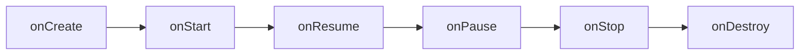
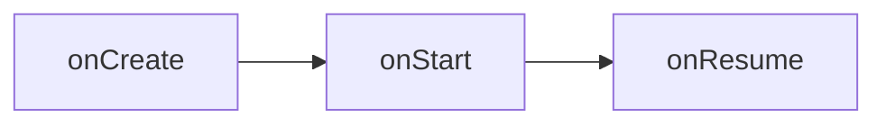
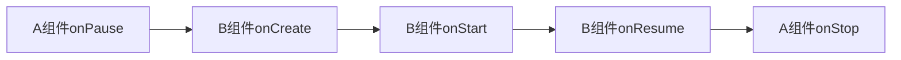
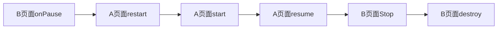
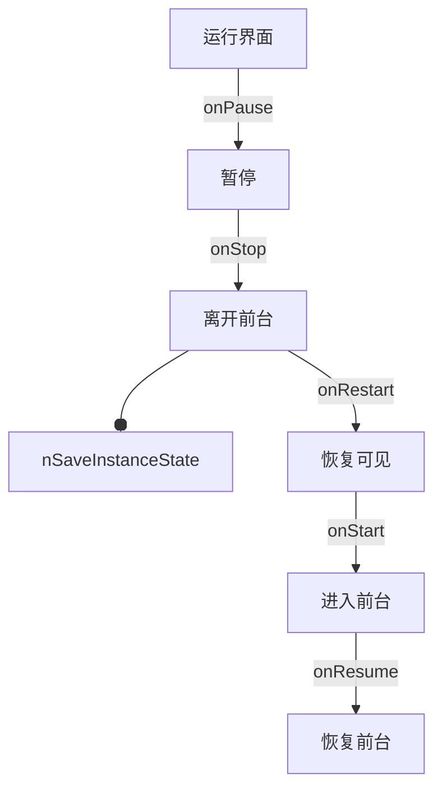

# 模拟器启动问题

## 使用Genymotion模拟器启动项目

**问题**

```shell
adb server version (32) doesn't match this client (35); killing...
error: could not install *smartsocket* listener: Address already in use
ADB server didn't ACK
* failed to start daemon *
error: cannot connect to daemon
```

**解决方法**

命令行的 adb 是用 Android SDK 自带的，而Genymotion 根本不知道 sdk 的位置。因此Genymotion 的 adb 和Android sdk 里的adb 冲突了。只要修改 Genymotion 里的 adb 为 Android SDK 的，就可以识别了。

具体去修改Genymotion的偏好设置即可


## adb 环境配置

### adb mac环境变量

```shell
# Setting Path for ADB
export ANDROID_HOME="/Users/keyang/Library/Android/sdk"
export ANDROID_HOME
export PATH=${PATH}:${ANDROID_HOME}/tools
export PATH=${PATH}:${ANDROID_HOME}/platform-tools
```

### adb install

adb -s {seria number} install xxx.apk 在指定设备上安装apk


## 打包命令：

```shell
./gradlew clean assemblequickbrokerReleaseChannels
```


# 基础知识

## 安卓Gradle配置文件

1. ### 根目录下的build.gradle

   根目录下的build.gradle文件用于添加子工程或模块共用的配置项

   buildscript: 用来设置整个项目的classpath

   allprojects: 项目的所有子工程都会用到这个配置，

2. ### 根目录下的gradle.properties

   gradle.properties里面定义的属性是全局的，可以在各个模块的build.gradle里面直接引用.

3. ### app目录下的build.gradle

  ```groovy
  // com.android.application 这是一个application
  // com.android.library 这是一个库
  apply plugin: 'com.android.application'
  // 配置项目的各种属性
  android {
    compiledSdkVersion 28 //项目编译的sdk版本，也就是API level
    // 程序默认配置，指定应用程序包名，最小sdk版本，目标sdk版本，版本号，版本名
    defaultConfig {
      
    }
    // 指定生成安装文件的配置，常有两个子包:release,debug，
    // 注：直接运行的都是debug安装文件
    buildTypes {
      debug {
        applicationIdSuffix ".debug"
      }
      release {
        proguardFiles getDefaultProguardFile('proguard-android.txt'), 'proguard-rules.pro'
      }
    }
    // 文件配置
    sourceSets {
      main {
        res.srcDirs = ['src/main/res', 'src/main/res-night']
      }
      quickbroker {
        java.srcDirs = ['src/quickbroker/java']
        res.srcDirs += ['src/quickbroker/res']
        manifest.srcFile 'src/quickbroker/AndroidManifest.xml'
      }
    }
    // 声明有哪些flavor的维度
    flavorDimensions "broker"
    // productFlavors是可定义的产品特性
    productFlavors {
      dimension "broker" // 每一个flavor都必须有一个dimension
      //buildConfigField用于给BuildConfig文件添加一个字段
      //三个参数:1.要定义的常量的类型 2.该常量的命名 3.该常量的值
      buildConfigField("String", "DOMAIN", "\"$DOMAIN\"")
    }
  }
  ```

  

## 配置Flavors

- productFlavors与buildTypes是多对多的关系
- productFlavor 其实是defaultConfig的子集

- productFlavors下可以新增多个flavor，每个flavor都可以覆盖defaultConfig下的属性实现差异化。如：包名、应用名、编译版本；


## BuildConfig类

BuildConfig类是Android打包以后自动生成的一个类,它位于build/generated/source/buildConfig/**/debug中或者release中


1. ### 使用BuildConfig自定义常量

2. ### 可以配置BuildConfig的地方

```
// 在buildConfig里面使用
defaultConfig {
	buildConfigField("String","testKey","\"testValue\"")
}
// 在buildTypes里使用
buildTypes {
  debug {
    buildConfigField("String","testKey","\"testValue\"")
  },
  release {
    buildConfigField("String","testKey","\"testValue\"")
  }
}
// 在productFlavors中配置
productFlavors {
	flavorName {
  	buildConfigField("String", "key", "\"value\"")
	}
}
```

3. ### 结合gradle.properties使用

   第一步：在gradle.properties里定义值

   ```properties
   DOMAIN = bhopb.cloud
   ```

   第二步：在app/build.gradle设置BuildConfig

   ```
   android {
       ...
       buildTypes {
           release {
               minifyEnabled true
               proguardFiles getDefaultProguardFile('proguard-android.txt'), 'proguard-rules.pro'
               buildConfigField("String","DOMAIN","\"${DOMAIN}\"")
           }
           debug{
               buildConfigField("String","KDOMAINY","\"${DOMAIN}\"")
           }
       }
       ...
   }
   ```


## Activity生命周期


### 完整生命周期



通常在onCreate时完成下面几件事：

1）实例化组件，并且将组件放置在屏幕上(setContentView)

2) 引用已实例化的组件

3）为组件设置监听器

4）访问外部数据Model


### AB组件跳转生命周期

A组件打开时：



B组件打开时, A组件进入onPause



返回A组件时，B组件先进入onPause




### Home返回主屏生命周期




### 设备旋转与Activity生命周期

设备旋转时，系统会销毁当前Activity实例，然后创建一个新的Activity实例。

原理：

​	设置配置是用来描述设备当前状态的一系列特征。特征包括：屏幕方向、屏幕密度、屏幕尺寸、键盘类型、底座模式、语言等。在应用运行时，只要`设备配置`发生了改变，Android就会销毁当前Activity，重新创建新的activity。

​	因为屏幕发生旋转时，方向改变了，所以设备配置发生了变化，因此activity会重新创建。


onSave


## 布局样式

### 4种应用资源

1. **colorPrimary** 应用的主要色调，actionBar默认使用该颜色，Toolbar导航栏的底色
2. **colorPrimaryDark** 应用的主要暗色调，statusBarColor默认使用该颜色
3. **statusBarColor** 状态栏颜色，默认使用colorPrimaryDark
4. **colorAccent** CheckBox，RadioButton，SwitchCompat等一般控件的选中效果默认采用该颜色


### 安卓单位

> px、dp、dip、sp

px: 像素

dpi:  每英寸点数，即每英寸包含像素个数。比如320X480分辨率的手机，宽2英寸，高3英寸, 每英寸包含的像素点的数量为320/2=160dpi（横向）或480/3=160dpi（纵向），160就是这部手机的dpi，横向和纵向的这个值都是相同的

density: 屏幕密度 = dpi/160;

dp/dip: dp和dip是同一种单位，都是指"设备独立像素"。在屏幕密度dpi = 160屏幕上，1dp = 1px

sp: 和dp很类似，一般用来设置字体大小，和dp的区别是它可以根据用户的字体大小偏好来缩放。

我们新建一个Android项目后应该可以看到很多drawable文件夹，分别对应不同的dpi

- drawable-ldpi (dpi=120, density=0.75)
- drawable-mdpi (dpi=160, density=1)
- drawable-hdpi (dpi=240, density=1.5)
- drawable-xhdpi (dpi=320, density=2)
- drawable-xxhdpi (dpi=480, density=3)


## Drawable

​	shape: 定义一些形状。最常见的比如矩形，圆角矩形，椭圆。

​	selector: 定义一些页面中和交互相关的样式。比如按钮的按压状态、是否禁用、checkbox的选中状态等等。


## ListView、GridView

​	**基础属性**：

​	**Adapter**:  创建一个LlistAdapter继承BaseAdapter

​	**监听器**:  每一个item都可以去绑定clickListener


## RecyclerView

### 	基础布局

### 	Adapter

> ​	每一个listview都需要adapter，用来提供数据

- ​	创建一个Adapter继承RecyclerView.Adapter，在Adapter里实现对应的方法。见下面代码		
- ​	创建ViewHolder继承RecyclerView.ViewHolder
- ​	把ViewHolder传递给Adapter
- ​	

```java
// RecyclerView.Adapter实现代码
  @Override
  public RecyclerView.ViewHolder onCreateViewHolder(@NonNull ViewGroup viewGroup, int i) {
    // 这个方法是为了个每一个list-item从layout文件inflate出一个view。但是这个方法的返回对象是一个ViewHolder.
    // 可以自定义一个ViewHolder的类，传入给Adapter作为泛型。
    return null;
  }

  @Override
  public void onBindViewHolder(@NonNull RecyclerView.ViewHolder viewHolder, int i) {

  }

  @Override
  public int getItemCount() {
    return list.size();
  }
```

### 第三方Adapter

BRVAH: https://www.jianshu.com/p/b343fcff51b0

使用：


```
notifyDataSetChanged
```


## Fragment

- ### 静态添加Fragment

  静态添加fragment分几个个步骤：

  1.在activity.xml布局文件里声明fragment

  ```xml
  <?xml version="1.0" encoding="utf-8"?>
  <LinearLayout xmlns:android="http://schemas.android.com/apk/res/android"
      android:orientation="horizontal"
      android:layout_width="match_parent"
      android:layout_height="match_parent">
    	<!-- android:name 属性指定要在布局中实例化的 Fragment 类 -->
      <!-- fragment必须用id或者tag作为唯一标识。-->
      <fragment android:name="com.example.news.ArticleListFragment"
              android:id="@+id/list"
              android:layout_weight="1"
              android:layout_width="0dp"
              android:layout_height="match_parent" />
      <fragment android:name="com.example.news.ArticleReaderFragment"
              android:id="@+id/viewer"
              android:layout_weight="2"
              android:layout_width="0dp"
              android:layout_height="match_parent" />
  </LinearLayout>
  ```

  当系统创建这个activity时，会去实例化Fragment的类，并且调用它的onCreateView()方法,来替换这个fragment。

  2.创建一个类，继承fragment类，重写onCreateView

  ```java
  public static class ExampleFragment extends Fragment {
      @Override
      public View onCreateView(LayoutInflater inflater, ViewGroup container,
                               Bundle savedInstanceState) {
          // Inflate the layout for this fragment
          return inflater.inflate(R.layout.example_fragment, container, false);
      }
  }
  ```

  3.创建fragment的xml 

  

- ### 动态添加Fragment

  也可以通过编程，将fragment动态添加到某一个ViewGroup里。

  1. 获取fragmentManager
  2. 开始事物
  3. 创建fragment，add或者replace到某一个ViewGroup里面
  4. 提交事务


  ```java
  FragmentManager fragmentManager = getFragmentManager();
  FragmentTransaction fragmentTransaction = fragmentManager.beginTransaction();
  Fragment fragment = AFragment.createInstance("我是FragmentA");
  fragmentTransaction.add(R.id.fragment_container, fragment); // ViewGroup是一LinearLayout或者RelativeLayout
  fragmentTransaction.commit();
  ```

  

- ### Fragment的事物管理

  事物的顺序：beginTransistion —> add/remove/replace... —> commit

- ### Fragment的生命周期

  

  

  - onCreate:  Fragment初始化时被调用，可以在这里初始化组件
  - onCreateView: 系统会在Fragment首次绘制时调用此方法。如果需要绘制UI，需要在这个方法里返回UI的根视图
  - onPause: 


- ### getSupportFragmentManager、getChildFragmentManager的区别

  getChildFragmentManager： 返回一个私有的FragmentManager，这个manager是属于当前Fragment内部的

  getSupportFragmentManager： 返回Activity的FragmentManager，他能管理属于Activy的fragment。

  所以主要的不同点在于：每个Fragment有他们自己内部的`FragmentManager`，他们能管理自己内部的`Fragment`。但是其他FragmentManager能管理整个activity的。


## LayoutInflater

layoutInflater是一个将xml布局文件转换为View对象的工具

1. ### 获取LayoutInflater

   ```java
   LayoutInflater inflater = LayoutInflater.from(context); 
   ```

2. #### 将Layout转化为View

   ```java
   convertView = mLayoutInflater.inflate(R.layout.layout_grid_item, null);
   ```


## ViewPager

ViewPager的Adapter有三种：PageAdapter、FragmentPagerAdapter、FragmentStatePagerAdapter

### PageAdapter


### FragmentPagerAdapter


# 布局知识

## TabLayout

tablayout是单独的design support中, 想要用tablayout, 需要在gradle里单独引用他

```
implementation 'com.android.support:design:28.0.0-rc02'
```


### 1.简单使用

1）在布局文件中声明Tablayout

```xml
<?xml version="1.0" encoding="utf-8"?>
<LinearLayout xmlns:android="http://schemas.android.com/apk/res/android"
              xmlns:app="http://schemas.android.com/apk/res-auto"
              android:layout_width="match_parent"
              android:layout_height="match_parent"
              android:orientation="vertical">

    <android.support.design.widget.TabLayout
        android:id="@+id/tabLayout"
        android:layout_width="match_parent"
        android:layout_height="wrap_content" />
</LinearLayout>
```

2) 在Activity或者Fragment的onCreate周期中，手动创建tab，并且绑定tab clickListener

```java
@Override
protected void onCreate(@Nullable Bundle savedInstanceState) {
    super.onCreate(savedInstanceState);
    setContentView(R.layout.activity_tab_layout);
    mTabLayout = (TabLayout) findViewById(R.id.tabLayout);
    // 添加多个tab
    for (int i = 0; i < title.length; i++) {
        TabLayout.Tab tab = mTabLayout.newTab();
        tab.setText(title[i]);
        mTabLayout.addTab(tab);
    }
    // 给tab设置点击事件
    mTabLayout.setOnTabSelectedListener(new TabLayout.OnTabSelectedListener() {
        @Override
        public void onTabSelected(TabLayout.Tab tab) {
            Toast.makeText(getApplicationContext(), title[tab.getPosition()], Toast.LENGTH_SHORT).show();
        }
        @Override
        public void onTabUnselected(TabLayout.Tab tab) {
        }
        @Override
        public void onTabReselected(TabLayout.Tab tab) {
        }
    });
}
```


### 2.与ViewPager结合

#### 1）先在布局文件中放好TabLayout和ViewPager：

```xml
<android.support.design.widget.TabLayout
        android:id="@+id/tab"
        android:layout_width="match_parent"
        android:layout_height="?attr/actionBarSize"
        app:tabIndicatorColor="@color/colorPrimaryDark"
        app:tabIndicatorHeight="3dp"
        />

    <android.support.v4.view.ViewPager
        android:layout_width="match_parent"
        android:layout_height="wrap_content"
        android:layout_weight="1"
        android:id="@+id/tab_view_pager"
        />
```


2）设置TabLayout和ViewPager相互关联

```java
@Override
  protected void onCreate(@Nullable Bundle savedInstanceState) {
    super.onCreate(savedInstanceState);
    setContentView(R.layout.activity_tab_view);
    // 1. 声明布局中的tablayout
    mTabLayout = findViewById(R.id.tab);
    // 2. 声明viewpager
    mViewPager = findViewById(R.id.tab_view_pager);
    // 3. 初始化fragments
    initFragments();
    // 4. 为viewPager声明FragmentPagerAdapter类的实例
    mViewPager.setAdapter(new TabFragmentPagerAdapter(mFragment, getSupportFragmentManager()));
    // 5. 设置tabLayout的启动viewPager,这个方法会创建tab，并且重置title
    mTabLayout.setupWithViewPager(mViewPager, false);
    // 6. 最后设置每个tab的text
    for (int i = 0; i < TAB_TITLES.length; i++) {
      mTabLayout.getTabAt(i).setText(TAB_TITLES[i]);
    }
  }

  /**
   * 添加Fragment
   */
  private void initFragments() {
    for (int i = 0; i < TAB_TITLES.length; i++) {
      mFragment.add(new TabFragment());
    }
  }
```


## FrameLayout

FrameLayout是最简单的ViewGroup组件，它不以特定的方式来安排子视图的位置。

FrameLayout子视图的位置排列取决于他们各自的android:layout_gravity属性


## 布局重用<include/>

<include/>可以


# 事件传递

## 事件的处理方式：


### Handler处理

handler.set

```

```

# MVP框架

### 基本框架思想

类似于mvc框架，mvp是安卓开发中常用的编程思维框架。

**m**：model/bean 主要负责处理业务逻辑

**v**: activity/fragment 视图

**p**: presenter 桥接model和view的一些工作


BHEX的设计模式

```java
// 基础类
BaseFragment<P extends BaseFragmentPresenter<V>, V extends AppUI> 


```

presenter 里面有UI

fragment里面传入了presenter


```mermaid
onResume --> 
```


item_market_list_layout.xml 是RecycleView的item布局


# 三方组件

## SmartRefreshLayout 

地址：https://github.com/scwang90/SmartRefreshLayout

组成

- SmartRefreshLayout 刷新布局核心实现，自带ClassicsHeader（经典）、BezierRadarHeader（贝塞尔雷达）两个 Header.

- SmartRefreshHeader 各种Header的集成，除了Layout自带的Header，其它都在这个包中.

- SmartRefreshFooter 各种Footer的集成，除了Layout自带的Footer，其它都在这个包中.

  

## BHOP组件

1.交易盘口： BookListView

2.TopBar 包含了下拉币对