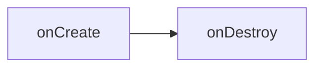
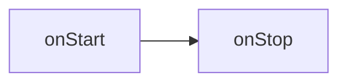
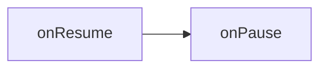
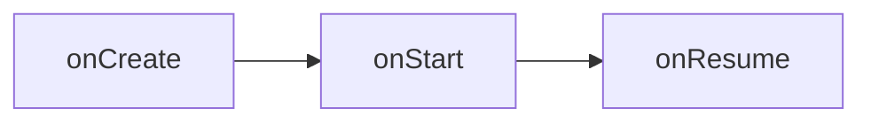
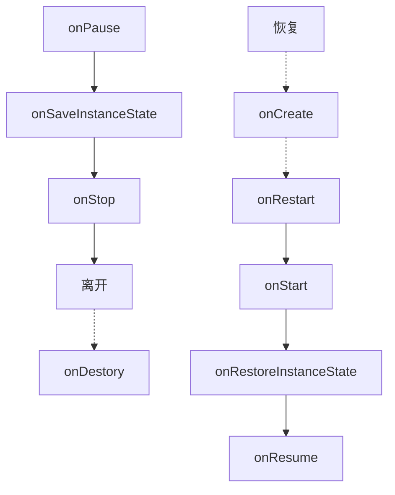
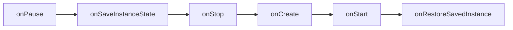

> https://github.com/JsonChao/Awesome-Android-Notebook

# 一、搭建开发环境

## 问题 1：找不到 sdk

**问题描述**

```shell
adb server version (32) doesn't match this client (35); killing...
error: could not install *smartsocket* listener: Address already in use
ADB server didn't ACK
* failed to start daemon *
error: cannot connect to daemon
```

**解决方法**

命令行的 adb 是用 Android SDK 自带的，而 Genymotion 根本不知道 sdk 的位置。因此 Genymotion 的 adb 和 Android sdk 里的 adb 冲突了。只要修改 Genymotion 里的 adb 为 Android SDK 的，就可以识别了。

具体去修改 Genymotion 的偏好设置即可

## 问题 2：无法联网

**问题描述**：模拟器 app 无法连接网络

**解决方法**

在 virtual box 里面配置网络，截图如下：


## adb 环境配置

## adb shell 连接上手机

### adb mac 环境变量

```shell
# Setting Path for ADB
export ANDROID_HOME="/Users/keyang/Library/Android/sdk"
export ANDROID_HOME
export PATH=${PATH}:${ANDROID_HOME}/tools
export PATH=${PATH}:${ANDROID_HOME}/platform-tools
```

### adb install

adb -s {seria number} install xxx.apk 在指定设备上安装 apk

### adb pull&push

作用： 修改模拟器 host 文件

操作步骤：

1. 获取 root 权限

./adb root

【Q】如果出现错误：“adb cannot run as root in production builds”， 那是由于 root 不完全；

【A】安装“超级 adb“；

2. 修改 system 权限：./adb remount

3. 获取 host 文件到本地： ./adb pull /system/etc/hosts 修改 host 文件

4. 回写文件到虚拟机：./adb push hosts /system/etc/

   若出现文件只读不可回写，执行./adb reboot 重启，并再次获取权限，再回写文件。

## 打包 APK 命令

```shell
./gradlew clean assemblequickbrokerReleaseChannels
```

# 二、Gradle

## 安卓 Gradle 配置文件

1. ### 根目录下的 build.gradle

   根目录下的 build.gradle 文件用于添加子工程或模块共用的配置项

   buildscript: 用来设置整个项目的 classpath

   allprojects: 项目的所有子工程都会用到这个配置，

2. ### 根目录下的 gradle.properties

   gradle.properties 里面定义的属性是全局的，可以在各个模块的 build.gradle 里面直接引用.

3. ### app 目录下的 build.gradle

```groovy
// com.android.application 这是一个application
// com.android.library 这是一个库
apply plugin: 'com.android.application'
// 配置项目的各种属性
android {
  compiledSdkVersion 28 //项目编译的sdk版本，也就是API level
  // 程序默认配置，指定应用程序包名，最小sdk版本，目标sdk版本，版本号，版本名
  defaultConfig {

  }
  // 指定生成安装文件的配置，常有两个子包:release,debug，
  // 注：直接运行的都是debug安装文件
  buildTypes {
    debug {
      applicationIdSuffix ".debug"
    }
    release {
      proguardFiles getDefaultProguardFile('proguard-android.txt'), 'proguard-rules.pro'
    }
  }
  // 文件配置
  sourceSets {
    main {
      res.srcDirs = ['src/main/res', 'src/main/res-night']
    }
    quickbroker {
      java.srcDirs = ['src/quickbroker/java']
      res.srcDirs += ['src/quickbroker/res']
      manifest.srcFile 'src/quickbroker/AndroidManifest.xml'
    }
  }
  // 声明有哪些flavor的维度
  flavorDimensions "broker"
  // productFlavors是可定义的产品特性
  productFlavors {
    dimension "broker" // 每一个flavor都必须有一个dimension
    //buildConfigField用于给BuildConfig文件添加一个字段
    //三个参数:1.要定义的常量的类型 2.该常量的命名 3.该常量的值
    buildConfigField("String", "DOMAIN", "\"$DOMAIN\"")
  }
}
```

## 配置 Flavors

- productFlavors 与 buildTypes 是多对多的关系
- productFlavor 其实是 defaultConfig 的子集

- productFlavors 下可以新增多个 flavor，每个 flavor 都可以覆盖 defaultConfig 下的属性实现差异化。如：包名、应用名、编译版本；

## BuildConfig 类

BuildConfig 类是 Android 打包以后自动生成的一个类,它位于 build/generated/source/buildConfig/\*\*/debug 中或者 release 中


1. ### 使用 BuildConfig 自定义常量

2. ### 可以配置 BuildConfig 的地方

```
// 在buildConfig里面使用
defaultConfig {
	buildConfigField("String","testKey","\"testValue\"")
}
// 在buildTypes里使用
buildTypes {
  debug {
    buildConfigField("String","testKey","\"testValue\"")
  },
  release {
    buildConfigField("String","testKey","\"testValue\"")
  }
}
// 在productFlavors中配置
productFlavors {
	flavorName {
  	buildConfigField("String", "key", "\"value\"")
	}
}
```

3. ### 结合 gradle.properties 使用

   第一步：在 gradle.properties 里定义值

   ```properties
   DOMAIN = bhopb.cloud
   ```

   第二步：在 app/build.gradle 设置 BuildConfig

   ```
   android {
       ...
       buildTypes {
           release {
               minifyEnabled true
               proguardFiles getDefaultProguardFile('proguard-android.txt'), 'proguard-rules.pro'
               buildConfigField("String","DOMAIN","\"${DOMAIN}\"")
           }
           debug{
               buildConfigField("String","KDOMAINY","\"${DOMAIN}\"")
           }
       }
       ...
   }
   ```

# 四、样式篇

## Theme 主题

#### Theme 版本变化

| 主题                        |                              |
| --------------------------- | ---------------------------- |
| android:Theme               | API 1 开始                   |
| android:Theme.Holo          | API 11（android3.0） 开始    |
| android:Theme.DeviceDefault | API 14（android4.0） 开始    |
| android:Theme.Material      | API 21（android5.0） 开始    |
| Theme.AppCompat             | 兼容包 AppCompat_v7 中的主题 |

在 Android 5.0 （API 21）之后，引入了 Material Design。5.0 以上的版本，如果想用 Material Design，需要引入 support-library 支持库。

#### 如何自定义主题颜色


1. **colorPrimary** 应用的主要色调，actionBar 默认使用该颜色，Toolbar 导航栏的底色
2. **colorPrimaryDark** 应用的主要暗色调，statusBarColor 默认使用该颜色
3. **statusBarColor** 状态栏颜色，默认使用 colorPrimaryDark
4. **colorAccent** CheckBox，RadioButton，SwitchCompat 等一般控件的选中效果默认采用该颜色

```xml
其他配置：
colorPrimary                     应用的主要色调，actionBar默认使用该颜色，Toolbar导航栏的底色
colorPrimaryDark             应用的主要暗色调，statusBarColor默认使用该颜色
textColorPrimary            应用的主要文字颜色，actionBar的标题文字默认使用该颜色
statusBarColor                 状态栏颜色，默认使用colorPrimaryDark
windowBackground          窗口背景颜色
navigationBarColor           底部栏颜色
colorForeground              应用的前景色，ListView的分割线，switch滑动区默认使用该颜色
colorBackground              应用的背景色，popMenu的背景默认使用该颜色
colorAccent                  CheckBox，RadioButton等一般控件的选中效果默认采用该颜色
colorControlNormal          CheckBox，RadioButton等默认状态的颜色。
editTextColor：               默认EditView输入框字体的颜色。
textColor                      Button，textView的文字颜色

// styles.xml
<resources>
    <!-- Base application theme. -->
    <style name="AppTheme" parent="Theme.AppCompat.Light.DarkActionBar">
        <!-- Customize your theme here. -->
        <item name="colorPrimary">@color/colorPrimary</item>
        <item name="colorPrimaryDark">@color/colorPrimaryDark</item>
        <item name="colorAccent">@color/colorAccent</item>
    </style>
</resources>
```

#### 如何使用主题

```xml
<application
        android:allowBackup="true"
        android:icon="@mipmap/ic_launcher"
        android:label="@string/app_name"
        android:networkSecurityConfig="@xml/network_security_config"
        android:roundIcon="@mipmap/ic_launcher_round"
        android:supportsRtl="true"
        android:theme="@style/AppTheme" -- 这里指定主题

        >
```

## 导航栏样式

Android 系统的历史演变中，也出现了以下几种 Bar 的变化；

TitleBar、ActionBar(原生)、Toolbar(支持库)、AppBar


在 Android 3.0 的版本里，所有使用 Theme.Holo 主题的 Activity 都会包含 actionBar；当 app 运行在 Andriod 3.0 以下版本（不低于 Android 2.1）时，如果要添加 action bar，需要加载 Android Support 库。

### 如何隐藏 StatusBar

**状态栏(Status Bar)：**屏幕最上面的，显示时间等

**导航栏(Navigation Bar)：**最下面的反馈按钮

```java
// 隐藏title
if(getSupportActionBar()!=null){
  getSupportActionBar().hide();
}
```

### 如何在 NoActionBar 时向 Activity 里添加 Toolbar

1. 引入支持库 `implementation 'com.android.support:appcompat-v7:28.0.0'`

2. 确保 Activity 继承 AppCompatActivity

3. 使用 NoActionBar 的主题背景

   ```xml
   <application
           android:allowBackup="true"
           android:icon="@mipmap/ic_launcher"
           android:label="@string/app_name"
           android:networkSecurityConfig="@xml/network_security_config"
           android:roundIcon="@mipmap/ic_launcher_round"
           android:supportsRtl="true"
           android:theme="@style/AppTheme.NoActionBar">
   ```

4. 向布局中，添加 toolbar

   ```xml
   <android.support.v7.widget.Toolbar
          android:id="@+id/my_toolbar"
          android:layout_width="match_parent"
          android:layout_height="?attr/actionBarSize"
          android:background="?attr/colorPrimary"
          android:elevation="4dp"
          android:theme="@style/ThemeOverlay.AppCompat.ActionBar"
          app:popupTheme="@style/ThemeOverlay.AppCompat.Light"/>
   ```

5. 在 Activity 的 onCreate 方法中，调用 Activity 的 `setSupportActionBar()` 方法，将 Toolbar 作为 ActionBar

   ```java
     @Override
       protected void onCreate(Bundle savedInstanceState) {
           super.onCreate(savedInstanceState);
           setContentView(R.layout.activity_my);
           Toolbar myToolbar = (Toolbar) findViewById(R.id.my_toolbar);
           setSupportActionBar(myToolbar);
       }
   ```

### 如何在导航栏添加菜单

1、添加菜单(新建 Menu Resource File)


2、添加菜单 item

```xml
<?xml version="1.0" encoding="utf-8"?>
<menu xmlns:android="http://schemas.android.com/apk/res/android"
    xmlns:app="http://schemas.android.com/apk/res-auto">

    <item
        android:id="@+id/menu_item_new_crime"
        android:icon="@drawable/ic_menu_send"
        android:title="@string/new_crime"
        app:showAsAction="ifRoom|withText"
        />
</menu>
```

3、新建菜单按钮图标


新建 Image Asset，类型选择 Action Bar and Tab Icons，选择 Asset Type 为 Clip Art，然后从 Clip Art 里面选择；

4、在代码里设置菜单栏


## Android 单位

> px、dp、dip、sp
>
> 安卓的单位里常用的就是 dp、sp

px: 代表着像素，做过 web 端开发的应该能理解。

density: 屏幕密度 = dpi/160;

dpi: 每英寸点数，即每英寸包含像素个数。比如 320X480 分辨率的手机，宽 2 英寸，高 3 英寸, 每英寸包含的像素点的数量为 320/2=160dpi（横向）或 480/3=160dpi（纵向），160 就是这部手机的 dpi，横向和纵向的这个值都是相同的

dp/dip: dp 和 dip 是同一种单位，都是指"设备独立像素"。在屏幕密度 dpi = 160 屏幕上，1dp = 1px

sp: 和 dp 很类似，一般用来设置字体大小。它和 dp 的区别是，sp 会根据用户的字体大小偏好来缩放。

安卓获取一些像素的工具类

```java
public class PixelUtils {

    /**
     * 获取状态栏的高度
     * @param context
     * @return
     */
    public static int getStatusBarHeight(Context context) {
        int result = 0;
        int resourceId = context.getResources().getIdentifier("status_bar_height", "dimen", "android");
        if (resourceId > 0) {
            result = context.getResources().getDimensionPixelSize(resourceId);
        }
        return result;
    }

    /**
     * 获得屏幕高度
     *
     * @return
     */
    public static int getScreenWidth() {
        WindowManager wm = (WindowManager) CApplication.getInstance()
                .getSystemService(Context.WINDOW_SERVICE);
        DisplayMetrics outMetrics = new DisplayMetrics();
        wm.getDefaultDisplay().getMetrics(outMetrics);
        return outMetrics.widthPixels;
    }

    /**
     * 获得屏幕宽度
     *
     * @return
     */
    public static int getScreenHeight() {
        WindowManager wm = (WindowManager) CApplication.getInstance()
                .getSystemService(Context.WINDOW_SERVICE);
        DisplayMetrics outMetrics = new DisplayMetrics();
        wm.getDefaultDisplay().getMetrics(outMetrics);
        return outMetrics.heightPixels;
    }

    public static int dp2px(float value) {
        final float scale = CApplication.getInstance().getResources().getDisplayMetrics().density;
        return (int) (value * scale + 0.5f);
    }

    public static int px2dp(float value) {
        final float scale = CApplication.getInstance().getResources().getDisplayMetrics().density;
        return (int) (value / scale + 0.5f);
    }
}
```

## Drawable 资源

### 什么是 Drawable？

字面上可以理解为`可绘制物`，表示可以在 Canvas 上绘制的对象。

图片、颜色、形状都可以是 Drawable

### 常用的 Drawable 类型

① **Shape Drawables** - 定义具有个性化属性的形状。比如矩形、圆角矩形、椭圆等。

② **StateList Drawables** - 定义用于不同状态的 Drawable。一般是 selector 类型

③ **LayerList Drawables** - 定义分组在一起成为复合结果的 Drawable

④ **NinePatch Drawables** - 具有可伸缩区域的 PNG 图片，以允许适当调整大小

⑤ **Vector Drawables** - 定义复杂的基于 XML 的矢量图像

#### Shape Drawable

在 drawable 目录下面创建一个 drawable 资源：

stroke_shape.xml

```xml
<?xml version="1.0" encoding="utf-8"?>
<shape xmlns:android="http://schemas.android.com/apk/res/android"
    android:shape="rectangle">
    <corners android:radius="4dp" />
    <stroke android:width="4dp"
        android:color="#C1E1A6"
        />
    <padding
        android:left="20dp"
        android:top="20dp"
        android:right="20dp"
        android:bottom="20dp"
        />
</shape>
```

在 textview 的 background 属性里应用：

```xml
<TextView
   android:layout_width="wrap_content"
   android:layout_height="wrap_content"
   android:background="@drawable/stroke_shape"
   android:textColor="#ffffff"
   android:text="@string/hello_world" />
```

drawables 可以应用于任何 View 及 ViewGroup，通常是通过 background 属性来设置 Drawable 资源的。

eg: 一个灰色圆角的背景色

```xml
<?xml version="1.0" encoding="utf-8"?>
<shape xmlns:android="http://schemas.android.com/apk/res/android"
    android:shape="rectangle">
    <!--边框颜色-->
    <stroke android:width="2dp" android:color="#FFF"/>
    <!--填充色-->
    <solid android:color="#80FFFFFF"/>
    <corners android:radius="@dimen/dip_20"/>
</shape>
```

---

#### StateListDrawable

一般会根据不同的状态，通过多个不同的图像来表示相同的图形；

比如设置 Button 的按下、聚焦、失焦等状态时的背景颜色。


场景 1:在 drawable 目录下面创建一个 xml 资源——selector_button.xml

```xml
<?xml version="1.0" encoding="utf-8"?>
<selector xmlns:android="http://schemas.android.com/apk/res/android">
    <item
        android:state_pressed="true"
        android:state_enabled="true"
        android:drawable="@drawable/button_pressed" />
    <item
        android:state_focused="true"
        android:state_enabled="true"
        android:drawable="@drawable/button_focused" />
    <item
        android:state_enabled="true"
        android:drawable="@drawable/button_enabled" />
  	<item
        android:state_enabled="false"
        android:drawable="@drawable/button_disabled" />
  	<item
        android:state_focused="false"
        android:state_enabled="false"
        android:drawable="@drawable/button_disabled_focused" />
  	<item
        android:drawable="@drawable/button_normal" />
</selector>
```

设置到`background`属性上

```xml
Button
        android:text="LifeCycle"
        android:layout_width="match_parent"
        android:layout_height="wrap_content"
        android:textAllCaps="false"
        android:background="@drawable/shape_solid"
        />
```

场景 2：也可以设置不同状态下的字体颜色

```xml
<?xml version="1.0" encoding="utf-8"?>
<selector xmlns:android="http://schemas.android.com/apk/res/android">
    <item android:state_pressed="true" android:color="#ffff0000"/>
    <item android:state_focused="true" android:color="#ff0000ff"/>
    <item android:state_selected="true" android:color="#ff0000ff"/>
    <item android:color="#ff000000"/>
</selector>
```

将它设置到任意`color`属性上

```xml
<Button
        android:text="MVPActivity"
        android:layout_width="match_parent"
        android:layout_height="wrap_content"
        android:textAllCaps="false"
        android:textColor="@drawable/selector_button"
    />
```

**注**：踩过坑的，不然会报错；

==1、selector 作为 drawable 背景用时，item**必须**使用**android:drawable**属性指定；==

==2、selector 作为 color 时，item**必须**使用**android:color**属性指定；==

如何将图片应用到 selector 上? 可以直接使用图片资源

```xml
<item android:drawable="@drawable/image" />
```

```xml
<item>
  <!-- 可以避免图片被缩放了 -->
  <bitmap android:src="@drawable/image"
          android:gravity="center" />
</item>
```

#### LayerList Drawable

可以用来绘制多个图层，后面的图层会叠加在上一个图层上面。可以通过 left/top/right/bottom 来移动图层；

常见的使用场景：

① [View 边框阴影]

② [View 单边添加边框]

③ [View 分层背景]

④ [View 卡片背景]

⑤ [绘制三角形]

---

#### Nine-Patch

可以伸缩

---

#### ColorDrawable

**通过代码如何获取颜色**

```java
Resources resources = mContext.getResources();
@Deprecate // 过时了
int text_selected_color = resources.getColor(R.color.text_pressed);

// 新的方式
ContextCompat.getColor(mContext, R.color.white)
```

#### BitmapDrawable

可以通过 java 代码——[BitmapDrawable](https://developer.android.com/reference/android/graphics/drawable/BitmapDrawable.html)

```java
Resources res = getResources();
Bitmap bmp = BitmapFactory.decodeResource(res, R.drawable.adt_48);
BitmapDrawable bitmapDrawable = new BitmapDrawable(res, bmp);
bitmapDrawable.setTileModeX(TileMode.MIRROR);
bitmapDrawable.setGravity(Gravity.CENTER_HORIZONTAL | Gravity.BOTTOM);
```

也可以通过 xml 来定义 bitmap 文件

```xml
<?xml version="1.0" encoding="utf-8"?>
<bitmap
    xmlns:android="http://schemas.android.com/apk/res/android"
    android:src="@[package:]drawable/drawable_resource"
    android:antialias=["true" | "false"]
    android:dither=["true" | "false"]
    android:filter=["true" | "false"]
    android:gravity=["top" | "bottom" | "left" | "right" | "center_vertical" |
                      "fill_vertical" | "center_horizontal" | "fill_horizontal" |
                      "center" | "fill" | "clip_vertical" | "clip_horizontal"]
    android:mipMap=["true" | "false"]
    android:tileMode=["disabled" | "clamp" | "repeat" | "mirror"] />
```

### Drawable 文件

我们新建一个 Android 项目后应该可以看到很多 drawable 文件夹，分别对应不同的 dpi

- drawable-ldpi (dpi=120, density=0.75)
- drawable-mdpi (dpi=160, density=1)
- drawable-hdpi (dpi=240, density=1.5)
- drawable-xhdpi (dpi=320, density=2)
- drawable-xxhdpi (dpi=480, density=3)

资源寻找的流程：


比如在一个中等分辨率的手机上，Android 就会选择 drawable-mdpi 文件夹下的图片，文件夹下有这张图就会优先被使用，在这种情况下，图片是不会被缩放的；

但是如果没有在 drawable-mdpi 的文件夹下找到相应图片的话，Android 系统会首先从更高一级的 drawable-hdpi 文件夹中查找，如果找到图片资源就进行缩放处理，显示在屏幕上；

如果 drawable-hdpi 文件夹下也没有的话，就依次往 drawable-xhdpi 文件夹、drawable-xxhdpi 文件夹、drawable-xxxhdpi 文件夹、drawable-nodpi；

如果更高密度的文件夹里都没有找到，就往更低密度的文件夹里寻找，drawable-ldpi 文件夹下查找；

如果都没找到，最终会在默认的 drawable 文件夹中寻找，如果默认的 drawable 文件夹中也没有那就会报错啦。

**举个例子：**

假如当前设备的 dpi 是 320，系统会优先去 drawable-xhdpi 目录查找，如果找不到，会依次查找 xxhdpi → xxxhdpi → hdpi → mdpi → ldpi。对于不存在的 drawable-[density]目录直接跳过，中间任一目录查找到资源，则停止本次查找。

#### dpi 范围密度对应范围

| 设备密度        | 适配资源文件密度 |
| --------------- | ---------------- |
| 0dpi ~ 120dpi   | ldpi             |
| 120dpi ~ 160dpi | mdpi             |
| 160dpi ~ 240dpi | hdpi             |
| 240dpi ~ 320dpi | xhdpi            |
| 320dpi ~ 480dpi | xxhdpi           |
| 480dpi ~ 640dpi | xxxhdpi          |

对于每种密度下的 icon 应该设计成什么尺寸其实 Android 也是给出了最佳建议，建议尺寸如下表所示：

| 资源文件密度   | 建议尺寸                             |
| -------------- | ------------------------------------ |
| mipmap-mdpi    | 48 \* 48（实测图标 16 就够了）       |
| mipmap-hdpi    | 72 \* 72（博主实测图标 32 就够了）   |
| mipmap-xhdpi   | 96 \* 96（实测图标 48 就够了）       |
| mipmap-xxhdpi  | 144 \* 144（实测图标 64 就够了）     |
| mipmap-xxxhdpi | 192 \* 192（博主实测图标 72 就够了） |

**总体匹配规则：**

如果图片所在目录 dpi 低于匹配目录，那么该图片被认为是为低密度设备需要的，现在要显示在高密度设备上，图片会被放大。

如果图片所在目录 dpi 高于匹配目录，那么该图片被认为是为高密度设备需要的，现在要显示在低密度设备上，图片会被缩小。

如果图片所在目录为 drawable-nodpi，则无论设备 dpi 为多少，保留原图片大小，不进行缩放。

那么六种通用密度下的缩放倍数是多少呢？以 mdpi 为基线，各密度目录下的放大倍数（即缩放因子 density）如下

| 密度    | 放大倍数 |
| ------- | -------- |
| ldpi    | 0.75     |
| mdpi    | 1.0      |
| hdpi    | 1.5      |
| xhdpi   | 2.0      |
| xxhdpi  | 3.0      |
| xxxhdpi | 4.0      |

例如，当前设备的 dpi 是 480（即 xxhdpi），那么对于存放于 mdpi 目录中的图片会被放大三倍。

缩放倍数（缩放因子）计算方法：对于任意设备，各 drawable-[density]目录下的图片放大倍数的计算公式


### res、drawable 与 mipmap 的区别

###

## 全屏处理

两种方式：一种通过 style 的 theme 主题配置；一种通过代码来控制全屏或者取消全屏；

方法 1：xml 配置式

```xml
<resources xmlns:tools="http://schemas.android.com/tools">
	<style name="AppTheme" parent="Theme.AppCompat.Light.DarkActionBar">
			<item name="android:windowFullscreen">false</item>
  </style>
</resources>
```

方法 2：java 编程式

```java
//全屏
getWindow().setFlags(WindowManager.LayoutParams.FLAG_FULLSCREEN, WindowManager.LayoutParams.FLAG_FULLSCREEN);

// 取消全屏
getWindow().clearFlags(WindowManager.LayoutParams.FLAG_FULLSCREEN);
```

## Shadow 阴影的处理

> https://segmentfault.com/a/1190000011809297

方式 1：使用 elevation 属性

方式 2：使用 translationZ 属性

方式 3：ViewCompat 兼容

```java
public static void setShadowDrawable(View view, int shapeRadius, int shadowColor, int shadowRadius, int offsetX, int offsetY) {
  ShadowDrawable drawable = new ShadowDrawable.Builder()
    .setShapeRadius(shapeRadius)
    .setShadowColor(shadowColor)
    .setShadowRadius(shadowRadius)
    .setOffsetX(offsetX)
    .setOffsetY(offsetY)
    .builder();
  view.setLayerType(View.LAYER_TYPE_SOFTWARE, null);
  ViewCompat.setBackground(view, drawable);
}
```

方式 4：使用`.9` png

`.9`图的使用很简单，只需要在 drawable 里加入一张`.9`的 png，再使用以下方式即可。


使用 `.9` 图设置的阴影，效果一般都是有保障的。不过它会作为 View 的背景被设置，所以阴影上占据 View 的大小的，所以使用图片模拟出来的阴影，View 本身的视觉效果会小。

将一个使用 ViewCompat 实现的效果，放在一起，你就可以看到对比的效果。


这里，两个 ImageView ，实际设置的大小，都是 100dp，但是视觉上，使用 .9 实现的效果，视觉效果就会小。

另外：`.9` 的图，一般都是设计师会提供给我们。这里也推荐一个可以制作阴影效果的[在线工具](http://inloop.github.io/shadow4android/)。

## 字体样式

如果想使用样式，请使用 textAppearance 属性

如果单纯的指定加粗的话，使用 textStyle 属性

```xml
<TextView
          android:layout_width="match_parent"
          android:layout_height="match_parent"
          android:text="@string/string_margin_safety_tip"
          android:textAppearance="@style/Body_Grey"
          />
```

## Gravity

gravity 的中文意思就是”重心“，就是表示 view 横向和纵向的停靠位置

（1）.**android:gravity：**是对 view 控件本身来说的，是用来设置 view 本身的内容应该显示在 view 的什么位置，默认值是左侧。也可以用来设置布局中的控件位置

（2）.**android:layout_gravity：**是相对于包含改元素的父元素来说的，设置该元素在父元素的什么位置；

比如 TextView: android:layout_gravity 表示 TextView 在界面上的位置，android:gravity 表示 TextView 文本在 TextView 的什么位置，默认值是左侧.

### Layout_gravity 失效

当父控件 android:orientation 设置成 vertical 时，layout_gravity 只有水平方向设置才起作用，如水平方向的 left ,center ,right

当父控件 android:orientation 设置成 horizontal 时，layout_gravity 只有垂直方向设置才起作用，如垂直方向的 top,center,bottom

## TabLayout 怎么设置左对齐？

abMode = scrollable 模式下 tab 的 width 能正常自定义了，而且是向左对齐的

## 安卓适配刘海屏

#五、弹框篇

## Dialog

```java
public class MainActivity extends Activity {
	private Button clk;
	private Dialog dialog;
	@Override
	protected void onCreate(Bundle savedInstanceState) {
		super.onCreate(savedInstanceState);
		setContentView(R.layout.activity_main);

		clk = (Button) findViewById(R.id.clk);
    //1. 创建了dialog
		dialog = new Dialog(this);
    //2. 显示视图
		dialog.setContentView(R.layout.dialog);
    //3. 按钮点击时显示dialog
		clk.setOnClickListener(new OnClickListener() {

			@Override
			public void onClick(View v) {
				dialog.show();
			}
		});

		//用户恢复对话框的状态
		if(savedInstanceState != null && savedInstanceState.getBoolean("dialog_show"))
			clk.performClick();
	}

	/**
	 * 用于保存对话框的状态以便恢复
	 */
	@Override
	protected void onSaveInstanceState(Bundle outState) {
		super.onSaveInstanceState(outState);
		if(dialog != null && dialog.isShowing())
			outState.putBoolean("dialog_show", true);
		else
			outState.putBoolean("dialog_show", false);
	}

	/**
	 * 在Activity销毁之前，确保对话框以关闭
	 */
	@Override
	protected void onDestroy() {
		super.onDestroy();
		if(dialog != null && dialog.isShowing())
			dialog.dismiss();
	}
}
```

## DialogFragment

> Android 比较推荐采用 DialogFragment 实现 Dialog。

原因：DialogFragment 能够完全实现 Dialog 的所有功能。并且他继承自 Fragment, 所以能复用 Fragment 的生命周期管理。

在手机配置变化时，比如旋转屏幕后，导致 Activity 重新创建。基于 DialogFragment 的对话框可以通过 FragmentManager 管理器来自动重建，实现自动恢复的功能，但是 Dialog 不行。

### 使用 DialogFragment 的两种方式

#### **方式 1**

> **继承 DialogFragment，重写 onCreateDialog(Bundle savedInstanceState)方法**

```java
  @Override
    public Dialog onCreateDialog(Bundle savedInstanceState) {
        return new 		AlertDialog.Builder(getActivity()).setTitle("Title").setMessage("onCreateDialog")
                .setPositiveButton("确定", new DialogInterface.OnClickListener() {

                    @Override
                    public void onClick(DialogInterface dialog, int which) {
                        dismiss();
                    }
                }).setNegativeButton("取消", null)
                .create();
    }
```

#### **方式 2**

> **继承 DialogFragment，实现 onCreateView(LayoutInflater inflater, ViewGroup container) 方法**

```java
 @Override
 public View onCreateView(LayoutInflater inflater, @Nullable ViewGroup container, @Nullable Bundle savedInstanceState) {
   View view = inflater.inflate(R.layout.dialog_custom, container, false);
   //视图初始化，事件监听

   return view;
 }
```

#### **使用区别**

**区别 1：应用场景不同**

方式 1 内部其实还是使用了 Dialog.Builder,只是代替了传统的 Dialig 对话框。适用于 UI 简单的，功能单一的情况；

方式 2 适合创建复杂的内容弹框，或者全屏展示的。

区别 2：

#### 调用方式

使用 DialogFragment 一般使用`show`和`dismiss`方式显示和隐藏。其实内部是用了`FragmentTransaction`的`add`方法和`remove`方法。

```java
FragmentManager fragmentManager = getFragmentManager();
CrimePhotoDialogFragment fragment = CrimePhotoDialogFragment.newInstance(mPhotoFile.getPath());
fragment.show(fragmentManager, PHOTO_TAG);
```

### DialogFragment 生命周期

正常的生命周期顺序如下：

```
onCreateDialog -> onCreateView
```

### DialogFragment 样式修改：

其实，Dialog, DialogFragment, Activity 能看到的界面,都是基于 Window 显示的; 所以修改 DialogFragment 样式本质上都是修改 window。唯一不同点在于获取 window 对象的方法不同。

Dialog 获取 window 的方法： getWindow();

DialogFragment 获取 window 的方法: getDialog().getWindow();

#### **修改 dialogFragment 中 window 宽度和高度**


# 六、布局篇

## Activity 生命周期


上图展示了整个 Activity 所有相关的生命周期，所有的生命周期可以看成 3 种不同级别的闭环。

### 全局生命周期



第一种闭环：onCreate -> onDestroy。当 Activity 创建时，系统会调用 activity 的 onCreate 方法；当 Activity 被销毁时，系统则会触发 onDestroy 方法，释放内存；

通常在 onCreate 时完成下面几件事：

1）实例化组件，并设置页面视图(setContentView)

2.  引用已实例化的组件(findViewById)

3）为组件设置监听器

4）访问外部数据 Model

### 可视化生命周期



第二种闭环：onStart -> onStop。当系统调用 Activity 的 onStart 方法之后，页面就可以进入可视化阶段。当 Activity 进入到 onStop 生命周期时，当前 activity 就进入到不可视阶段；

### 可交互生命周期



第三种闭环：onResume->onPause。当 Activity 进入 onResume 时，当前 Activity 必须位于系统调用栈的最顶层，此时 Activity 可以处理一些用户的交互。当 Activity 进入 onPause 时，用户失去了与此 activity 交互的能力，界面变得不可操作。

### 几种生命周期变化的过程

- #### 通过返回键来跳转不同 Activity

当 Activity-A 被创建时，Activity-A 经历了下面 3 个生命周期过程



从 A 跳转到 B 时, 需要等 A 进入 onPause 生命周期之后，B 才开始进入 onCreate 生命周期，之后开始进入 B 其它的生命周期


从 B 返回 A 组件时，B 组件先进入 onPause 周期，如果 A 组件在这段时间内没有被系统回收，那 A 组件不需要进入 onCreate 周期，直接进入到 onRestart，一直到 onResume 周期；


最后 B 进入到 onStop 周期，最后被系统销毁，进入 onDestroy 周期；

- #### 通过 Home 键跳转到系统界面再恢复时

当前 Activity 会经历以下几个生命周期过程：

首先 Activity 会进入 onPause 周期，因为可能会被系统回收，所以会进入到 onSaveInstanceState 周期，再进入到 onStop 周期，然后系统会切回到系统的主页面。==注：onSaveInstanceState 需要在 onPause 之后进去，因为避免用户的输入状态没有被保存；== 如果在系统因为内存过高，回收了当前 Avtivity 的内存，那么 Activity 还会进入 onDestroy 周期；

当用户从 Home 界面再回到当前 Activity 时：当前 Activity 会先进入到 onRestart 生命周期，==如果之前系统回收了该 Activity，那么会先进入到 onCreate 周期==； 然后进入 onStart 周期，再进入 onRestoreInstanceState 周期，最后进入到 onResume 周期，恢复视图；



- #### 设备旋转时

设备旋转时，系统会销毁当前 Activity 实例，然后创建一个新的 Activity 实例。

原理：

`设置配置`是用来描述设备当前状态的一系列特征。特征包括：屏幕方向、屏幕密度、屏幕尺寸、键盘类型、底座模式、语言等。

==在应用运行时，只要`设备配置`发生了改变，Android 就会销毁当前 Activity，重新创建新的 activity。==

因次，当屏幕发生旋转时，方向改变了，所以设备配置发生了变化，因此 activity 会重新创建。

整个 activity 的生命周期过程如下：



### 几种在页面里初始化组件的方式以及区别

#### 方式 1：LayoutInflater;

layoutInflater 是一个将 xml 布局文件转换为 View 对象的工具

1. ### 获取 LayoutInflater

   ```java
   LayoutInflater inflater = LayoutInflater.from(context);
   ```

2. #### 将 Layout 转化为 View

   ```java
   convertView = mLayoutInflater.inflate(R.layout.layout_grid_item, null);
   ```

#### 方式 2: findViewById

方式 3：

## ViewPager 的使用

ViewPager 的 Adapter 有三种：PageAdapter、FragmentPagerAdapter、FragmentStatePagerAdapter

### PageAdapter

### Fragment 结合 ViewPager

通过`FragmentPagerAdapter`可以将`Fragment`和`ViewPager`结合起来使用。

## TabLayout

tablayout 是单独的 design support 中, 想要用 tablayout, 需要在 gradle 里单独引用他

```
implementation 'com.android.support:design:28.0.0-rc02'
```

### 简单使用

1）在布局文件中声明 Tablayout

```xml
<?xml version="1.0" encoding="utf-8"?>
<LinearLayout xmlns:android="http://schemas.android.com/apk/res/android"
              xmlns:app="http://schemas.android.com/apk/res-auto"
              android:layout_width="match_parent"
              android:layout_height="match_parent"
              android:orientation="vertical">

    <android.support.design.widget.TabLayout
        android:id="@+id/tabLayout"
        android:layout_width="match_parent"
        android:layout_height="wrap_content" />
</LinearLayout>
```

2. 在 Activity 或者 Fragment 的 onCreate 周期中，手动创建 tab，并且绑定 tab clickListener

```java
@Override
protected void onCreate(@Nullable Bundle savedInstanceState) {
    super.onCreate(savedInstanceState);
    setContentView(R.layout.activity_tab_layout);
    mTabLayout = (TabLayout) findViewById(R.id.tabLayout);
    // 添加多个tab
    for (int i = 0; i < title.length; i++) {
        TabLayout.Tab tab = mTabLayout.newTab();
        tab.setText(title[i]);
        mTabLayout.addTab(tab);
    }
    // 给tab设置点击事件
    mTabLayout.setOnTabSelectedListener(new TabLayout.OnTabSelectedListener() {
        @Override
        public void onTabSelected(TabLayout.Tab tab) {
            Toast.makeText(getApplicationContext(), title[tab.getPosition()], Toast.LENGTH_SHORT).show();
        }
        @Override
        public void onTabUnselected(TabLayout.Tab tab) {
        }
        @Override
        public void onTabReselected(TabLayout.Tab tab) {
        }
    });
}
```

### 结合 ViewPager 使用

使用思路：在布局文件里声明 tabLayou 和 viewPager；当 tab 切换时，通过事件触发 viewPager 改变，

当 viewPager 进行改变时，也通过事件来切换 tab；

viewPager 的使用介绍结合上一章来看；

1. 先在布局文件中放好 TabLayout 和 ViewPager；

```xml
...
<android.support.design.widget.TabLayout
        android:id="@+id/tab"
        android:layout_width="match_parent"
        android:layout_height="?attr/actionBarSize"
        app:tabIndicatorColor="@color/colorPrimaryDark"
        app:tabIndicatorHeight="3dp"
        />

    <android.support.v4.view.ViewPager
        android:layout_width="match_parent"
        android:layout_height="wrap_content"
        android:layout_weight="1"
        android:id="@+id/tab_view_pager"
        />
...
```

2）设置 TabLayout 和 ViewPager 相互关联

```java
public class TabViewActivity extends BaseCoreActivity {

    private List<Fragment> mFragment = new ArrayList<>();

  @Override
    protected void onCreate(@Nullable Bundle savedInstanceState) {
      super.onCreate(savedInstanceState);
      setContentView(R.layout.activity_tab_view);
      // 1. 声明布局中的tablayout
      mTabLayout = findViewById(R.id.tab);
      // 2. 声明viewpager
      mViewPager = findViewById(R.id.tab_view_pager);
      // 3. 初始化fragments
      initFragments();
      // 4. 为viewPager声明FragmentPagerAdapter类的实例
      mViewPager.setAdapter(new TabFragmentPagerAdapter(mFragment, getSupportFragmentManager()));
      // 5. 设置tabLayout的启动viewPager,这个方法会创建tab，并且重置title
      mTabLayout.setupWithViewPager(mViewPager, false);
      // 6. 最后设置每个tab的text
      for (int i = 0; i < TAB_TITLES.length; i++) {
        mTabLayout.getTabAt(i).setText(TAB_TITLES[i]);
      }
    }

    /**
     * 添加Fragment
     */
    private void initFragments() {
      for (int i = 0; i < TAB_TITLES.length; i++) {
        mFragment.add(new TabFragment());
      }
    }
}
```

3. 设置 viewPager 和 tabLayout 的结合

```java
viewPager.addOnPageChangeListener(new ViewPager.OnPageChangeListener() {
 @Override
 public void onPageScrolled(int position, float positionOffset, int positionOffsetPixels) {
 }

 @Override
 public void onPageSelected(int position) {
  // 重新获取视图, 只用一个recyclerView来切换数据源
  type = position;
  switch (position) {
   case 0:
    recyclerView.setAdapter(blockRewardAdapter);
    break;
   case 1:
    recyclerView.setAdapter(inviteRewardAdapter);
    break;
   default:
    break;
  }
 }

 @Override
 public void onPageScrollStateChanged(int state) {
 }
});
viewPager.setCurrentItem(0);
```

## Fragment

> 首先介绍一下 Fragment:
>
> Fragment 可以展示整个屏幕或者屏幕的某一部分 UI，由 activity 来托管；Fragment 可以灵活的应用在不同的地方，不会受到限制。

### 使用 Fragment 的两种方式

- #### 一、xml 静态添加 Fragment

  静态添加 fragment 分几个步骤：

  1.在 activity.xml 布局文件里声明 fragment

  ```xml
  <?xml version="1.0" encoding="utf-8"?>
  <LinearLayout xmlns:android="http://schemas.android.com/apk/res/android"
      android:orientation="horizontal"
      android:layout_width="match_parent"
      android:layout_height="match_parent">
    	<!-- android:name 属性指定要在布局中实例化的 Fragment 类 -->
      <!-- fragment必须用id或者tag作为唯一标识。-->
      <fragment android:name="com.example.news.ArticleListFragment"
              android:id="@+id/list"
              android:layout_weight="1"
              android:layout_width="0dp"
              android:layout_height="match_parent" />
      <fragment android:name="com.example.news.ArticleReaderFragment"
              android:id="@+id/viewer"
              android:layout_weight="2"
              android:layout_width="0dp"
              android:layout_height="match_parent" />
  </LinearLayout>
  ```

  当系统创建这个 activity 时，会去实例化 Fragment 的类，并且调用它的 onCreateView()方法,来替换这个 fragment。

  2.创建一个类，继承 fragment 类，重写 onCreateView

  ```java
  public static class ExampleFragment extends Fragment {
      @Override
      public View onCreateView(LayoutInflater inflater, ViewGroup container,
                               Bundle savedInstanceState) {
          // Inflate the layout for this fragment
          return inflater.inflate(R.layout.example_fragment, container, false);
      }
  }
  ```

  3.创建 fragment 的布局 xml ，此处代码省略

* #### 二、动态添加 Fragment

  动态添加 fragment 的方式是唯一可以在运行时控制 fragment 的方式。我们可以通过代码编程，将 fragment 动态添加、替换、删除。动态添加分为以下几个步骤：

  1 定义容器视图

  ```xml
  <?xml version="1.0" encoding="utf-8"?>
  <LinearLayout xmlns:android="http://schemas.android.com/apk/res/android"
      android:layout_width="match_parent"
      android:layout_height="match_parent">
  <!-- 虽然是动态添加fragment，但是也需要在Activity的视图中为fragment安排位置 -->
  <FrameLayout
          android:id="@+id/fragment_container"
          android:layout_width="match_parent"
          android:layout_height="match_parent" />
  </LinearLayout>
  ```

  使用 FrameLayout 来作为 fragment 的容器视图，一个托管的 Activity 可以有多个容器视图。

  FrameLayout 是最简单的 ViewGroup 组件，它不以特定的方式来安排子视图的位置；

  FrameLayout 子视图的位置排列取决于他们各自的 android:layout_gravity 属性

2. 创建 fragment 类

   ```java
   public class CrimeListFragment extends Fragment {

     private RecyclerView mRecyclerView;

     private List<CrimeBean> list;

     private CrimeAdapter mCrimeAdapter;

     public static CrimeListFragment createInstance() {
       CrimeListFragment fragment = new CrimeListFragment();
       return fragment;
     }

     /**
      * onCreate方法是public的，需要被托管的Activity调用
      * onCreate方法并没有创建fragment视图，视图是在onCreateView里创建的
      * @param savedInstanceState
      */
     @Override
     public void onCreate(@Nullable Bundle savedInstanceState) {
       super.onCreate(savedInstanceState);
       list = DataServer.getCrimes(100);
     }

     /**
      * inflater和container是用来生成fragment视图的必须参数
      * savedInstanceState可以用来恢复视图数据
      * @param inflater
      * @param container
      * @param savedInstanceState
      * @return
      */
     @Nullable
     @Override
     public View onCreateView(@NonNull LayoutInflater inflater, @Nullable ViewGroup container, @Nullable Bundle savedInstanceState) {
       View view = inflater.inflate(R.layout.fragment_crime_list, container,false);
       mRecyclerView = view.findViewById(R.id.rv_crime_list);
       mRecyclerView.setLayoutManager(new LinearLayoutManager(getActivity()));
       updateUI();
       return view;
     }

     private void updateUI() {
       mCrimeAdapter = new CrimeAdapter(list);
       mRecyclerView.setAdapter(mCrimeAdapter);
       mCrimeAdapter.setOnItemClickListener(this);
     }
   ```


       @Override
       public void onActivityResult(int requestCode, int resultCode, Intent data) {
       super.onActivityResult(requestCode, resultCode, data);
       }
     }
     ```

3. 获取 fragmentManager，添加 fragment 到 Activity 中

   ```java
   public class CrimeActivity extends AppCompatActivity {

     @Override
     protected void onCreate(Bundle savedInstanceState) {
       super.onCreate(savedInstanceState);
       setContentView(R.layout.activity_crime);
   //    获取fragmentManager
       FragmentManager fragmentManager = getSupportFragmentManager();
   //    通过fragmentManager找到内存中的fragment
       Fragment fragment = fragmentManager.findFragmentById(R.id.fragment_container);
       if (fragment == null) {
         fragment = CrimeListFragment.createInstance();
         // 开启事物
         FragmentTransaction fragmentTransaction = fragmentManager.beginTransaction();
         fragmentTransaction.add(R.id.fragment_container, fragment);
          // 提交事物
         fragmentTransaction.commit();
     }
     }
   }
   ```

### Fragment 的事物管理

事物的顺序：beginTransaction —> add/remove/replace... —> commit

### Fragment 的生命周期

fragment 的生命周期类似于 activity，但是它的生命周期不是由系统来管理，而是由 Activity 来管理。具体如下图：


当向运行中的 Activity 添加 fragment 时，FragmentManger 会立即执行 fragment 的必要方法，保持 fragment 和 Activity 两者状态一致。以下方法会依次被调用：

- onAttach(Activity)
- onCreate(Bundle):
- onCreateView(...): 系统会在 Fragment 首次绘制时调用此方法。如果需要绘制 UI，需要在这个方法里返回 UI 的根视图
- onActivityCreated(Bundle)
- onStart
- onResume

```java
package com.hb.cfdbase.baselib.mvp;

import android.content.Context;
import android.os.Bundle;
import android.support.annotation.Nullable;
import android.support.v4.app.Fragment;
import android.view.LayoutInflater;
import android.view.View;
import android.view.ViewGroup;

import com.hb.cfdbase.baselib.utils.DebugLog;

import java.util.List;


/**
 * 抽象fragment
 */
public abstract class BaseFragment extends Fragment {

	private View rootView;

	public BaseFragment() {
		super();
		// 放一个bundler对象，避免arguments是null；
		setArguments(new Bundle());
	}


	@Nullable
	@Override
	public View onCreateView(LayoutInflater inflater, ViewGroup container, Bundle savedInstanceState) {
		DebugLog.i(getClass().getSimpleName() + "------enter------");
		if (rootView == null) {
			setRootView(createView(inflater, container, savedInstanceState));
			executeOnceAfterCreateView();
		}

		if (rootView.getParent() != null) {
			((ViewGroup) rootView.getParent()).removeView(rootView);
		}

		return rootView;
	}

	/**
	 * 这个不会由Fragment自身的生命周期发起 而是由 {@link android.support.v4.app.FragmentPagerAdapter}
	 * 和 {@link android.support.v4.app.FragmentStatePagerAdapter} 来调用，所以一般情况下，只有在ViewPager
	 * 中才会有
	 *
	 * @param isVisibleToUser
	 */
	@Override
	public void setUserVisibleHint(boolean isVisibleToUser) {
		super.setUserVisibleHint(isVisibleToUser);
		DebugLog.i(getClass().getSimpleName() + "------enter------  userVisible:" + isVisibleToUser);
	}

	/**
	 * 在Fragment show hide 的时候被调用，但是第一次不会调用.
	 * 可以查看{@link android.support.v4.app.FragmentManager} 源码，了解调用时机
	 *
	 * @param hidden
	 */
	@Override
	public void onHiddenChanged(boolean hidden) {
		super.onHiddenChanged(hidden);
		List<Fragment> childFragments = getChildFragmentManager().getFragments();
		if (childFragments != null) {
			for (Fragment item : childFragments) {
				if (item != null && item.isAdded()) {
					// 设置子fragment的可见性
					item.onHiddenChanged(hidden || item.isHidden());
				}
			}
		}
		DebugLog.i(getClass().getSimpleName() + "------enter------ hidden:" + hidden);
	}

	/**
	 * fragment初始化视图。
	 * 基本实现： inflater.inflate(R.layout.example_fragment, container, false);
	 *
	 * @param inflater
	 * @param container
	 * @param savedInstanceState
	 * @return
	 */
	protected abstract View createView(LayoutInflater inflater, ViewGroup container, Bundle savedInstanceState);

	/**
	 * 自定义回调
	 */
	protected abstract void executeOnceAfterCreateView();


	@Override
	public void onAttach(Context context) {
		super.onAttach(context);
		DebugLog.i(getClass().getSimpleName() + "------enter------");
	}


	@Override
	public void onCreate(@Nullable Bundle savedInstanceState) {
		super.onCreate(savedInstanceState);
		DebugLog.i(getClass().getSimpleName() + "------enter------");
	}


	@Override
	public void onActivityCreated(Bundle savedInstanceState) {
		super.onActivityCreated(savedInstanceState);
		DebugLog.i(getClass().getSimpleName() + "------enter------");
	}

	@Override
	public void onStart() {
		super.onStart();
		DebugLog.i(getClass().getSimpleName() + "------enter------");
	}

	@Override
	public void onResume() {
		super.onResume();
		DebugLog.i(getClass().getSimpleName() + "------enter------");
	}

	@Override
	public void onPause() {
		super.onPause();
		DebugLog.i(getClass().getSimpleName() + "------enter------");
	}

	@Override
	public void onStop() {
		super.onStop();
		DebugLog.i(getClass().getSimpleName() + "------enter------");
	}

	@Override
	public void onDestroyView() {
		super.onDestroyView();
		DebugLog.i(getClass().getSimpleName() + "------enter------");
	}

	@Override
	public void onDestroy() {
		super.onDestroy();
		DebugLog.i(getClass().getSimpleName() + "------enter------");
	}

	@Override
	public void onDetach() {
		super.onDetach();
		DebugLog.i(getClass().getSimpleName() + "------enter------");
	}

	protected void setRootView(View rootView) {
		this.rootView = rootView;
	}

	public View getRootView() {
		return rootView;
	}
}


```


### getSupportFragmentManager、getChildFragmentManager 的区别

getChildFragmentManager： 返回一个私有的 FragmentManager，这个 manager 是属于当前 Fragment 内部的

getSupportFragmentManager： 返回 Activity 的 FragmentManager，他能管理属于 Activy 的 fragment。

所以主要的不同点在于：每个 Fragment 有他们自己内部的`FragmentManager`，他们能管理自己内部的`Fragment`。但是其他 FragmentManager 能管理整个 activity 的。

### Fragment 和 Activity 间传递消息

==官方推荐通过 Fragment.setArguments(Bundle bundle) 来传值==，

Fragment 跳转不是通过 Intent 的，有自己的一套体系；

```java
// 1. 声明FragmentManager
FragmentManager fragmentManager = getSupportFragmentManager();

// 2. 定义Bundle 设置参数
Bundle klineBundle = new Bundle();
klineBundle.putSerializable(AppData.INTENT.COINPAIR, coinPairBean);
klineBundle.putSerializable(AppData.INTENT.SIDE, currentSide);
klineFragment.setArguments(klineBundle);

// 3. 向Activity添加Fragment
FragmentTransaction fragmentTransaction = fragmentManager.beginTransaction();
fragmentTransaction.add(R.id.kline_view, klineFragment);
fragmentTransaction.commit();

// 4. 在fragment里通过argments获取参数
Bundle arguments = getArguments();
CoinPairBean coinPairBean = (CoinPairBean) arguments.getSerializable(AppData.INTENT.COINPAIR);
```

### Fragment 懒加载

> https://www.jianshu.com/p/0e2d746e3a3d

懒加载的由来：

Fragment 最常见的两种使用方式就是 ViewPager 嵌套 Fragment ，以及直接通过 FragmentManager 来管理 Fragment。

Fragment 在创建的整个过程会走完从`onAttach()`到`onResume()`的生命周期方法，一般情况我们无非在这里几个生命周期方法（例如 `onActivityCreated()`）里发起默认的网络请求。

但是如果每个 Fragment 都有默认的网络请求操作（也可能是其它耗时操作，这里以网络请求为例），那么多个在 Fragment 创建过程中都会执行默认网络请求，无论 Fragment 是否对用户可见，这样有浪费流量、影响性 App 性能、用户体验不佳等缺点。

我们要做的事情就是让 Fragment 按需加载数据，即对用户可见时再请求数据，让数据的请求时机可控，而不是在初始化创建过程中直接请求数据，同时不受嵌套层级的影响！

所以问题的原因显而易见，既然不能在 Fragment 生命周期方法直接请求数据，所以就要另谋它法。

版本 1：

核心逻辑就是在 onActivityCreated 生命周期里判断是否可见

```java
@Override
	public void onActivityCreated(Bundle savedInstanceState) {
		super.onActivityCreated(savedInstanceState);
		isViewCreated = true;
		// 页面可见
		if (getUserVisibleHint() && !isLoadDataCompleted) {
			lazyLoadData();
		}
	}

```


版本2：

但是版本1的问题在于，如果有多层Fragment嵌套关系。比如下面所示

```

├── fragment1-1
├── fragment1-2
│   ├── fragment2-1
│   ├── fragment2-2
│   └── fragment2-3
└── fragment1-3
    ├── fragment3-1
    ├── fragment3-2
    └── fragment3-3
```

实际上`fragment1-1`、`fragment2-1`、`fragment3-1`都会去加载数据。因为默认这些fragment都会被setUserVisibleHint(true)。

所以，需要增加以下对parentFragment的判断。

```java
	/**
	 * 要同时对它的parent是否可见进行判断
	 *
	 * @return
	 */
	public boolean realHidden() {
		if (getParentFragment() == null) {
			return isHidden();
		} else if (getParentFragment() instanceof LazyLoadFragment) {
			return ((LazyLoadFragment) getParentFragment()).realHidden() || isHidden();
		} else {
			return isHidden() && getParentFragment().isHidden();
		}
	}
```

### 

版本3：

FragmentManager 管理 Fragment 时，和 ViewPager 嵌套 Fragment 中的问题类似，但此时`setUserVisibleHint()`方法并不会被调用，所以要寻找新的途径了。

当用 FragmentManager 来 `add()`、`hide()`、`show()` Fragment 时 Fragment 的`onHiddenChanged(boolean hidden)`方法会被调用，其中`hidden`参数为`false`时代表对应 Fragment 可见，否则不可见，


全部代码

```java
/**
 * 用于Fragment在viewpager中嵌套时懒加载 以及对于Fragment显示隐藏的回调监控
 * <p>
 * ================================================
 */

public abstract class LazyLoadFragment extends BaseFragment {

	// 界面是否已创建完成
	private boolean isViewCreated;

	// 数据是否已请求
	private boolean isLoadDataCompleted;

	// 是否对用户可见
	private boolean isVisibleToUser = false;

	/**
	 * viewpager会调用这个方法
	 * @param isVisibleToUser
	 */
	@Override
	public void setUserVisibleHint(boolean isVisibleToUser) {
		super.setUserVisibleHint(isVisibleToUser);
		if (isVisibleToUser && isViewCreated && !isLoadDataCompleted) {
			lazyLoadData();
		}
		if (isViewCreated && isAdded()) {
			setVisibleChanged(isVisibleToUser && !realHidden());
		}
	}

	/**
	 * fragmetnManager会调用这个方法
	 * @param hidden
	 */
	@Override
	public void onHiddenChanged(boolean hidden) {
		super.onHiddenChanged(hidden);
		setVisibleChanged(!hidden);
	}

	/**
	 * {@link #isVisible()}
	 */
	@Override
	public void onResume() {
		super.onResume();
		if (isAdded()) {
			setVisibleChanged(!realHidden() && getUserVisibleHint());
		}
	}

	@Override
	public void onPause() {
		super.onPause();
		if (isAdded()) {
			setVisibleChanged(false);
		}
	}

	/**
	 * 要同时对他的parent进行计算
	 *
	 * @return
	 */
	public boolean realHidden() {
		if (getParentFragment() == null) {
			return isHidden();
		}
		else if (getParentFragment() instanceof LazyLoadFragment) {
			return ((LazyLoadFragment) getParentFragment()).realHidden() || isHidden();
		} else {
			return isHidden() && getParentFragment().isHidden();
		}
	}

	@Override
	public void onActivityCreated(Bundle savedInstanceState) {
		super.onActivityCreated(savedInstanceState);
		isViewCreated = true;
		if (getUserVisibleHint() && !isLoadDataCompleted) {
			lazyLoadData();
		}
	}

	protected void lazyLoadData() {
		isLoadDataCompleted = true;
	}

	/**
	 * 没有使用 {@link #setUserVisibleHint(boolean)} 是因为它会公布到Fragment外部调用，混在一起太混乱了
	 *
	 * @param visible
	 */
	private void setVisibleChanged(boolean visible) {
		// 解决重复调用问题
		if (isVisibleToUser == visible) {
			return;
		}
		isVisibleToUser = visible;
		onVisibleChanged(visible);
	}

	/**
	 * 向子类通知Fragment的可见性变化 回调
	 *
	 * @param visible
	 */
	protected void onVisibleChanged(boolean visible) {
		DebugLog.i(getClass().getSimpleName() + "------enter------  visible:" + visible);
	}
}

```


## ConstraintLayout

约束布局

## SplashScreen

一般 app 从 click 启动，到进入 MainActivity，中间会有一段空白页面的时间。这一段时间，一般系统会用来做初始化工作的。在一个 Activity 打开时，如果该 Activity 所属的 Application 还没有启动，系统会为这个 Activity 创建一个进程；每创建一个进程，都会执行一次 Application 的 onCreate()方法；在 Application 的 onCreate 方法中执行耗时间的操作，就会出现白屏。

如果空白的时间太长，会降低客户的体验效果。所以一般我们会在 app 启动后加一个 SplashActivity，用来做缓冲。

```xml

<application
        android:name=".app.Application"
        android:allowBackup="false"
        android:hardwareAccelerated="true"
        android:icon="@mipmap/ic_launcher"
        android:label="@string/app_name"
        android:largeHeap="true"
        android:roundIcon="@mipmap/ic_launcher"
        android:supportsRtl="false"
        android:theme="@style/AppTheme"
        android:networkSecurityConfig="@xml/network_security_config"
       tools:replace="android:label,android:icon,android:theme,android:allowBackup,android:supportsRtl">
   			<!-- 指明样式主题 -->
        <activity
            android:name=".main.ui.SplashActivity"
            android:screenOrientation="portrait"
            android:theme="@style/SplashTheme"
            >
          <!-- 告诉app，SplashActivity是启动后第一个进入的主页面 -->
            <intent-filter>
                <action android:name="android.intent.action.MAIN" />
                <category android:name="android.intent.category.LAUNCHER" />
            </intent-filter>
        </activity>
</application>
```

一般 Splash 的屏幕都是全屏的页面，所以在设置好 SplashActivity 后，我们还需要设置一下 SplashTheme，来设置一下页面的样式。

```xml
<style name="SplashTheme" parent="Theme.AppCompat.Light.NoActionBar">
  <!-- 设置window的背景图片，默认是白屏 -->
  <!-- 另外：除了图片，也可以设置drawable，不过我还不会用drawable画一个页面出来 -->
  <item name="android:windowBackground">@mipmap/launch_bg</item>
  <!-- 设置全屏，默认是false -->
  <item name="android:windowFullscreen">true</item>
  <item name="android:fitsSystemWindows">true</item>
  <item name="android:windowNoTitle">true</item>
  <item name="android:clipToPadding">true</item>
  <item name="android:windowTranslucentNavigation">true</item>
</style>


```

在 SplashActivity 里，一般还会判断做一下引导页和倒计时欢迎页面；引导页只在安装后第一次使用时出现。

```java
在Activity的onCreate里判断
public void startApp() {
    boolean firstlaunch = SPEx.get("firstlaunch", true);
    if (firstlaunch) {
      SPEx.set("firstlaunch", false);
      Intent intent = new Intent(getActivity(), BootPageActivity.class);
      getActivity().startActivity(intent);
    } else {
      Intent intent = new Intent(getActivity(), WelcomeActivity.class);
      getActivity().startActivity(intent);
    }
    getActivity().finish();
  }
```

倒计时欢迎页面关键代码：

```java
public Handler mHandler = new Handler() {
    @Override
    public void handleMessage(Message msg) {
      super.handleMessage(msg);
      // 跳转到主页面
      Intent intent = new Intent(act, MainActivity.class);
      startActivity(intent);
      //执行一次后销毁本页面
      finish();
    }
};

// 在onResume或者其他生命周期方法里调用
mHandler.sendEmptyMessageDelayed(0, n * 1000) // 倒计时n秒

  /** 这种方式也可以
  new Handler().postDelayed(new Runnable() {
            @Override
            public void run() {
                Intent intent=new Intent(act, MainActivity.class);
                startActivity(intent);
                finish();
            }
        }, 3000);**/
```

**踩坑**：需要注意的是，有一些教程让配置：android:windowIsTranslucent 为 true
他的原理是将背景颜色设置为透明色，在启动页出现前屏幕一直显示桌面。这样会给人一种 app 没有点到的错觉，不建议设置。

# 七、列表

### 1.ListView

#### 视图：

在 xml 里声明一个 ListView 控件

#### 适配器：

**Adapter**: 创建一个`MyListAdapter`继承`BaseAdapter`，也可以用 Android 自带的`ArrayAdapter`;

将 listView 的适配器设置为此处创建的 Adapter 实例；

#### 监听器:

clickListener：如果需要对 list-item 的点击事情做监听，可以在 listView 的实例上添加 onItemClickListener;

代码：

```xml
<?xml version="1.0" encoding="utf-8"?>
<LinearLayout xmlns:android="http://schemas.android.com/apk/res/android"
    xmlns:tools="http://schemas.android.com/tools"
    android:layout_width="match_parent"
    android:layout_height="match_parent"
    tools:context=".views.list.ui.ListViewActivity">
    <ListView
        android:id="@+id/lv"
        android:layout_width="wrap_content"
        android:layout_height="wrap_content"
        android:divider="@color/colorPrimary"
        android:dividerHeight="1dp"
        android:scrollbars="none"
    />
</LinearLayout>
```

```java
@Override
  protected void onCreate(Bundle savedInstanceState) {
    super.onCreate(savedInstanceState);
    setContentView(R.layout.activity_list_view);
    mlv = findViewById(R.id.lv);
    // 这里的例子是用了ArrayAdapter，需要传list-item的视图，list—item_text的id，数组
    adapter = new ArrayAdapter<String>(this, R.layout.layout_list_item_text, R.id.lv_item_text, datas);
    mlv.setAdapter(adapter);
    mlv.setOnItemClickListener(new ListView.OnItemClickListener() {
      @Override
      public void onItemClick(AdapterView<?> parent, View view, int position, long id) {
        Toast.makeText(ListViewActivity.this, datas[position], Toast.LENGTH_SHORT).show();
      }
    });
  }
```

自定义 Adapter

```

```

### 2.GridView

> GridView 和 ListView 的用法基本一致，只是布局变化了，会以宫格的形式展示。
>
> GridView 可以结合 BaseAdapter 使用，也可以结合 SimpleAdapter 使用

- #### 2.1 结合 BaseAdapter

```java
class GridViewAdapter extends BaseAdapter { // 自己写一个Adapter类，继承BaseAdapter

   private Context context;
   private Inflater mInflater

   public GridViewAdapter(Context context) {
   	 this.mInflater = LayoutInflater.from(context);
     this.list = list;
   }

  @Override
  public View getView(int position, View convertView, ViewGroup parent) {
    // 这个地方是返回一个视图
    // 第一种：不做任何处理，每次都重新创建view
    View view = mInflater.inflate(R.layout.item_filter_exchange_list, null);
    TextView textView = convertView.findViewById(R.id.exch_name);
    textView.setText(list.get(position).getExch_name());
    return view;

    // 第二种：通过converView来
    if (convertView == null) {
      convertView = mInflater.inflate(R.layout.item_filter_exchange_list, null);
    }
    TextView textView = convertView.findViewById(R.id.exch_name);
    textView.setText(list.get(position).getExch_name());
    return convertView;
  }
}

```

- #### 2.2 结合 SimpleAdapter

### 3.RecyclerView

> RecyclerView 是 GroupView 的子类，每一个列表项都作为一个 View 的对象来显示。

RecyclerView 需要 Adapter 和 ViewHolder 结合来使用

- #### Adapter 的作用

每一个 listview 都需要 adapter。在 RecyclerView 里，adapter 负责两件事情：

1. 创建必要的 ViewHolder 以及对应的视图，提供给 RecyclerView
2. 负责根据传入的位置，找到对应的 model，绑定到 ViewHolder 上；

Adapter 的实现步骤：

a.创建一个 Adapter 继承 RecyclerView.Adapter，在 Adapter 里实现对应的方法。

b.创建 ViewHolder 继承 RecyclerView.ViewHolder

```java
// RecyclerView.Adapter实现代码
// 可以自定义一个ViewHolder的类，传入给Adapter作为泛型。
public class RecyclerViewAdapter extends RecyclerView.Adapter<RecyclerViewAdapter.MyViewHodler> {

  private LayoutInflater myLayoutInflater;
  private Context mContext;
  private List<String> list;


  public RecyclerViewAdapter(Context context) {
    this.mContext = context;
    myLayoutInflater = LayoutInflater.from(context);
  }

  public void setList(List<String> list) {
    this.list = list;
  }

  // 自定义的ViewHolder类
  public static class MyViewHodler extends RecyclerView.ViewHolder {
    public TextView textView;
    public MyViewHodler(@NonNull View itemView) {
      super(itemView);
      textView = itemView.findViewById(R.id.rcv_text);
    }
  }
  @Override
  public RecyclerView.ViewHolder onCreateViewHolder(@NonNull ViewGroup viewGroup, int i) {
    // 这个方法是为了个每一个item从layout文件inflate出一个view。
    // 这个方法的返回对象是一个ViewHolder.
    View view = myLayoutInflater.inflate(R.layout.layout_recycler_item, viewGroup, false);
    MyViewHodler viewHolder = new MyViewHodler(view);
    return viewHolder;
  }

  @Override
  public void onBindViewHolder(@NonNull MyViewHodler viewHolder, int i) {
    // 传入的位置，找到对应的model，绑定到ViewHolder上
    TextView textView = viewHolder.textView;
    String text = list.get(i);
    textView.setText(text);
  }

  @Override
  public int getItemCount() {
    return list.size();
  }
}
```

# 八、其他

## 1 getString 的使用

在 android 代码里，经常需要用到多语言。通常的解决方案都是用 xml 声明好对应的字符串，然后在代码里面引用这个字符串对应的 id 即可。

举个例子

```xml
<string name="test">hello %s</string>
```

假设需要把%s 换成用户的名字，在代码里怎么写呢？

```java
String formatStr = getString(R.string.test), getName());
```

对于多个参数的情况, 需要加序号，例如：

```xml
<string name="string_withdraw_tips1">提示：最小提现数量%1$s %2$s , 24小时最大提现数量: %3$s %4$s</string>
```

其中 `1$` , `2$` 表明了插入顺序，getString() 方法中填入的参数 第一个插入到 `1$` 的位置，第二个插入到 `2$` 的位置。

使用实例：

```java
String s1 = getString(R.string.string_withdraw_tips1, "0.1", "BTC", "20", "BTC");
Log.d("getString", s1);
// 11253-11253/com.koda.demo D/getString: 提示：最小提现数量0.1 BTC , 24小时最大提现数量: 20 BTC
```

如果我们写反了顺序，比如：

```
<string name="string_withdraw_tips1">提示：最小提现数量%1$s %2$s , 24小时最大提现数量: %4$s %3$s</string>
```

那么对应的传参也要换一个顺序：

```java
String s2 = getString(R.string.string_withdraw_tips2, "0.1", "BTC", "BTC", "30");
Log.d("test_string", s2);
// 11253-11253/com.koda.demo D/getString: 提示：最小提现数量0.1 BTC , 24小时最大提现数量: 30 BTC


```

其他的，假如说需要加空格、或者 0，或者小数的话，就要用到下面的格式了。

**格式说明**：

%n\$ms：代表输出的是字符串，n 代表是第几个参数，设置 m 的值可以在输出之前放置空格

%n\$md：代表输出的是整数，n 代表是第几个参数，设置 m 的值可以在输出之前放置空格，也可以设为 0m,在输出之前放置 m 个 0

%n\$mf：代表输出的是浮点数，n 代表是第几个参数，设置 m 的值可以控制小数位数，如 m=2.2 时，输出格式为 00.00

###

## 2 多线程使用

> 4 种多线程使用方式，4 种场景
>
> https://www.jianshu.com/p/5225824ec967

### 方式 1：Handler + Thread

> #### 使用介绍：

1.在主线程创建 handler 实例对象；

2.通过 handler 的`send message` 方法或`post runnable`方法;

3.

工作原理如下：


handler 会把 message 或者 runnable 对象传递到消息队列中。

UI 主线程获取到 Runnable 或者 message 时，会去运行 runnable 的 run 方法，或者处理消息；

> **post runnable**

```java
// 首先创建在主线程里创建一个Handler，它会自动绑定到MainThread中
private Handler handler=new Handler();

// 通过handler来处理业务：我这里的处理逻辑是，当点击按钮时，通过handler post一个runnable，然后去修改主线程的UI
class MyClickListener implements View.OnClickListener {
        @Override
        public void onClick(View view) {
          System.out.println("main thread id " + Thread.currentThread().getId());
          Runnable runnable = new Runnable() {
            @Override
            public void run() {
              Drawable drawable = getResources().getDrawable(R.drawable.ic_launcher_background, null);
              imageView.setImageDrawable(drawable);
              System.out.println("sub thread id " + Thread.currentThread().getId());
            }
          };
          handler.post(runnable);
        }
    }
```

打印结果：

```verilog
2019-10-11 21:01:26.469 10849-10849/com.koda.demo I/System.out: main thread id 2
2019-10-11 21:01:26.479 10849-10849/com.koda.demo I/System.out: sub thread id 2
```

两个线程其实就是同一个线程，说明 handler post 线程最后是交给主线程处理的；

> **send message**

```java
// 声明handler，并且重写handleMessage方法
private Handler handler = new Handler() {
        @Override
        public void handleMessage(@NonNull Message msg) {
            super.handleMessage(msg);
            System.out.println("handler thread : " + Thread.currentThread().getName());
            // 会接收到msg消息；
            if (msg.what == 1) {
                Drawable drawable = getResources().getDrawable(R.drawable.ic_launcher_foreground, null);
                imageView.setImageDrawable(drawable);
            }
        }
    };

// 向handler发送message
new Thread() {
  @Override
  public void run() {
    try {
      // System.out.println("send thread : " + Thread.currentThread().getName());
      // 模拟处理事件，然后异步通知handler
      Thread.sleep(1000);
    } catch (InterruptedException e) {
      e.printStackTrace();
    }
    Message message = new Message();
    message.what = 1;
    message.arg1 = 1;
    handler.sendMessage(message);
  }
}.start();
```

主线程会接收到消息，然后进行处理

```verilog
2019-10-12 09:58:43.761 21083-21135/com.koda.demo I/System.out: send thread : Thread-4
2019-10-12 09:58:43.762 21083-21083/com.koda.demo I/System.out: handler thread : main
```

> #### 使用注意：

**1.内存泄露**：

上面的例子里`Handler handler = new Handler() {...}`声明的是一个匿名内部类；

而 java 里`非静态内部类`和`匿名内部类`都会默认持有外部类的引用。所以这里 handler 持有了 Activity 实例的引用。

当 Activity 发生重绘（旋转设备或者意外）而导致销毁时，如果 handler 的消息队列里还有没处理好的消息，那么消息实例仍会持有 handler 的引用，而 handler 引用了 Activity 的实例，所以最终导致 Activity 内存无法被回收，但是又有新的 Activity 创建。

最终导致泄露；


==解决方案==：静态内部类 + 弱引用

因为 java 中静态内部类不默认持有外部类的引用。所以 handler 实例不会引用 Activity 实例；同时，如果加上**使用 WeakReference 弱引用 Activity**，GC 在进行垃圾回收时，就会忽略 handler，回收 Activity 的内存。

```java
    // 设置为：静态内部类
    private static class FHandler extends Handler{
        // 定义 弱引用实例
        private WeakReference<Activity> reference;

        // 在构造方法中传入需持有的Activity实例
        public FHandler(Activity activity) {
            // 使用WeakReference弱引用持有Activity实例
            reference = new WeakReference<Activity>(activity); }

        // 通过复写handlerMessage() 从而确定更新UI的操作
        @Override
        public void handleMessage(Message msg) {
            switch (msg.what) {
                case 1:
                    Log.d(TAG, "收到线程1的消息");
                    break;
                case 2:
                    Log.d(TAG, " 收到线程2的消息");
                    break;
            }
        }
    }
```

参考文章：https://www.jianshu.com/p/ed9e15eff47a

> #### 定时任务：

另一个要注意的点是：

handler 可以 postDelay 来做延迟执行。但是**不要用这个方法**做循环的定时任务；因为 postDelay 的任务最终也是交给主线程去完成的；

> ##### 适用场景：

在多个异步任务的更新 UI


**缺点**: 编写代码复杂，创建和销毁线程其实是需要消耗资源的；

> #### API

removeMessage 可以移除任务队列里面的消息

---

### 方式 2：AsyncTask

> #### 作用:

1. #### 实现多线程

   在工作线程中执行任务，如 耗时任务；

2. #### 异步通信、消息传递

   **实现工作线程 & 主线程（UI 线程）之间的通信**，即：将工作线程的执行结果传递给主线程，从而在主线程中执行相关的`UI`操作；

> #### 使用：

```java
public abstract class AsyncTask<Params, Progress, Result> {
 ...
}

```

AsyncTask 类中参数为 3 种泛型类型，控制 AsyncTask 子类执行线程任务时各个阶段的返回类型

a. Params：开始异步任务执行时传入的参数类型


b.Progress：异步任务执行过程中，返回进度值的类型。类型和 onProgressUpdate()方法的入参数一致


c. Result：异步任务执行完成后，返回的结果类型，与 doInBackground()的返回值类型保持一致

> #### 使用注意：

### 方式 3：HandlerThread

> #### 介绍

先总结一下`Handler`异步通信机制中的相关概念

| 概念                  | 定义                                          | 作用                                                          | 备注                                                                    |
| --------------------- | --------------------------------------------- | ------------------------------------------------------------- | ----------------------------------------------------------------------- |
| 主线程                | 当 app 启动时，会自动开启一个主线程           | 用来渲染 UI，处理事件                                         |                                                                         |
| 子线程                | 一般是手动的开启线程                          | 执行耗时操作（比如网络请求）                                  |                                                                         |
| 消息 Message          | 作为在线程间进行通信的媒介                    | 用来定义传递的消息                                            |                                                                         |
| 消息队列 MessageQueue |                                               | 用来存储 handler 发送的消息                                   |                                                                         |
| 消息处理器 Handler    | 主线程与子线程的通信<br/>线程消息的主要处理者 | 发送消息到 message queue<br/>处理 looper 发送过来的消息       |                                                                         |
| 循环器 Looper         | 消息队列与处理者的媒介                        | 不断的从消息队列中获取消息<br/>将消息发送给对应处理的 handler | 每个线程中只能有 1 个 looper<br/>1 个 looper 可以绑定多个线程的 handler |

HandlerThread 的本质是：继承`Thread`类 & 封装`Handler`类

> #### 使用

HandlerThread 的使用步骤分为 5 步

```java
public class HandlerLearnActivity extends AppCompatActivity {

    private Handler handler, mainHandler;

    private HandlerThread handlerThread;

    private Button button1;
    private Button button2;
    private Button button3;
    private TextView textView;


    @Override
    protected void onCreate(Bundle savedInstanceState) {
        super.onCreate(savedInstanceState);
        setContentView(R.layout.activity_handler_learn);

        System.out.println("Main Thread : " + Thread.currentThread().getName());
        mainHandler = new Handler();
        // 步骤1：创建HandlerThread实例对象
        // 传入参数 = 线程名字，作用 = 标记该线程
        handlerThread = new HandlerThread("HandlerLearnActivity");
        // 步骤2：启动线程
        handlerThread.start();
      	// 步骤3：声明worker handler
      	// 作用：关联HandlerThread的Looper对象、实现消息处理操作 & 与Main线程进行通信
        handler = new Handler(handlerThread.getLooper()) {
            @Override
            public void handleMessage(Message msg) {
                super.handleMessage(msg);
                if (msg.what == 1) {
                  // 当前执行线程 = mHandlerThread所创建的工作线程
                    System.out.println("Work Thread : " + Thread.currentThread().getName());
                    try {
                        Thread.sleep(1000);
                    } catch (InterruptedException e) {
                        e.printStackTrace();
                    }
                  	// 通过主线程Handler.post方法进行在主线程的UI更新操作
                    mainHandler.post(() -> {
                        System.out.println("Main Thread : " + Thread.currentThread().getName());
                        textView.setText("我爱学习");
                    });
                }
            }
        };
        initView();
        initEvent();
    }
 //步骤4：使用工作线程Handler向工作线程的消息队列发送消息
 //在工作线程中，当消息循环时,取出对应消息 & 在工作线程执行相关操作
    private void initEvent() {
        button1.setOnClickListener(new View.OnClickListener() {
            @Override
            public void onClick(View v) {
                Message message = new Message();
                message.what = 1;
                handler.sendMessage(message);
            }
        });
        button2.setOnClickListener(new View.OnClickListener() {
            @Override
            public void onClick(View v) {
                Message message = new Message();
                message.what = 3;
                handler.sendMessage(message);
            }
        });
    }
}
```

### 方式 4：IntentService

> #### 作用

创建 1 个工作子线程来处理多线程任务；

> #### 使用步骤

步骤 1：定义 `IntentService`的子类，需复写`onHandleIntent()`方法
步骤 2：在`Manifest.xml`中注册服务
步骤 3：在`Activity`中开启`Service`服务

> #### 实例

1. 定义子类

   ```java
   public class MyIntentService extends IntentService {
       // 处理耗时任务；
       @Override
       protected void onHandleIntent(Intent intent) {
           String taskName = intent.getStringExtra("taskName");
           switch (taskName) {
               case "task1":
                   Log.i("myIntentService", "do task1 start");
                   try {
                       int i = 0;
                       while(i < 5) {
                           Thread.sleep(1000);
                           i++;
                           Log.i("myIntentService", "等待" + i + " s");
                       }
                   } catch (InterruptedException e) {
                       e.printStackTrace();
                   }
                   Log.i("myIntentService", "do task1 finished");
                   break;
               case "task2":
                   Log.i("myIntentService", "do task2 finished");
                   break;
               default:
                   break;
           }
       }

       public MyIntentService() {
           super("MyIntentService");
       }

       @Override
       public void onCreate() {
           DebugLog.d("myIntentService created");
           super.onCreate();
       }

       @Override
       public void onStart(Intent intent, int startId) {
           DebugLog.d("myIntentService start");
           super.onStart(intent, startId);
       }

       // 默认将intent放入任务队列
       @Override
       public int onStartCommand(Intent intent, int flags, int startId) {
           DebugLog.d("myIntentService start command");
           return super.onStartCommand(intent, flags, startId);
       }

       @Override
       public void onDestroy() {
           DebugLog.d("myIntentService start destroy");
           super.onDestroy();
       }
   }
   ```

2) 在 Manifest.xml 中注册服务

   ```xml
   <service android:name=".views.thread_message.MyIntentService">
     <intent-filter>
       <!-- 通过action来过滤intent -->
       <action android:name="com.example.koda.intent_service" />
     </intent-filter>
   </service>
   ```

3) 在 Activity 中开启 Service 服务

   ```java
   @Override
       protected void onCreate(Bundle savedInstanceState) {
           super.onCreate(savedInstanceState);
           setContentView(R.layout.activity_intent_service_learn);

           Intent intent1 = new Intent("com.example.koda.intent_service");
         	// 设置IntentService所在应用的app包名；
           intent1.setPackage("com.example.koda.imagewrapper");
           intent1.putExtra("taskName", "task1");
           startService(intent1);

           Intent intent2 = new Intent("com.example.koda.intent_service");
           intent2.setPackage("com.example.koda.imagewrapper");
           intent2.putExtra("taskName", "task2");
           startService(intent2);
       }
   ```

运行日志：

```verilog
2019-10-13 21:54:01.047 22134-22134/ D/MyIntentService.java: [onCreate:43]myIntentService created
2019-10-13 21:54:01.049 22134-22134/ D/MyIntentService.java: [onStartCommand:56]myIntentService start command
2019-10-13 21:54:01.050 22134-22134/ D/MyIntentService.java: [onStart:49]myIntentService start
2019-10-13 21:54:01.051 22134-22500/ I/myIntentService: do task1 start
2019-10-13 21:54:01.052 22134-22134/ D/MyIntentService.java: [onStartCommand:56]myIntentService start command
2019-10-13 21:54:01.052 22134-22134/ D/MyIntentService.java: [onStart:49]myIntentService start
  2019-10-13 21:57:25.379 22746-22795/ I/myIntentService: 等待1 s
2019-10-13 21:57:26.380 22746-22795/ I/myIntentService: 等待2 s
2019-10-13 21:57:27.381 22746-22795/ I/myIntentService: 等待3 s
2019-10-13 21:57:28.384 22746-22795/ I/myIntentService: 等待4 s
2019-10-13 21:57:29.385 22746-22795/ I/myIntentService: 等待5 s
2019-10-13 21:54:06.052 22134-22500/ I/myIntentService: do task1 finished
2019-10-13 21:54:06.056 22134-22500/ I/myIntentService: do task2 finished
2019-10-13 21:54:06.060 22134-22134/ D/MyIntentService.java: [onDestroy:62]myIntentService start destroy
```

从上面的日志看出来，task1 和 task2 是按顺序执行的；因为所有的任务都在同一个`Thread looper`里执行，所以必须 task1 完成才会执行 task2；

## 3 系统语言获取

Android 系统的当前系统语言，可以通过 Locale 类获取，主要方法有 3 种：

1.Locale.getDefault().getLanguage()，返回的是 es 或者 zh；

2.Locale.getDefault().getCountry()，获取当前国家或地区，返回为 CN 或 US；

3.还有另外一种获取当前语言的方法：

```java
Localelocale = getResources().getConfiguration().locale;

String language =locale.getLanguage();
return language;
```

如果当前手机设置为中文- 中国，则使用此方法返回 zh-CN，同理可得到其他语言与地区的信息。

```java
Locale.getDefault().getLanguage()       ---> en
Locale.getDefault().getISO3Language()   ---> eng
Locale.getDefault().getCountry()        ---> US
Locale.getDefault().getISO3Country()    ---> USA
Locale.getDefault().getDisplayCountry() ---> United States
Locale.getDefault().getDisplayName()    ---> English (United States)
Locale.getDefault().toString()          ---> en_US
Locale.getDefault().getDisplayLanguage()---> English
Locale.getDefault().toLanguageTag()     ---> en-US

```

## 4 组件传值

### 事件传递

- ### Bus

  > 文档链接：[http://square.github.io/otto/](http://square.github.io/otto/)

- ### EventBus

  EventBus 原理：通过事件类型，来进行订阅发布

  

// todo 待补充

- 文档链接：[http://greenrobot.org/eventbus/documentation/delivery-threads-threadmode/](http://greenrobot.org/eventbus/documentation/delivery-threads-threadmode/)

  事件处理模式

  1.  ThreadMode.POSTING:

  订阅者被调用的线程和提交事件的线程是同一个线程，

  这个模式下，开销最小，因为它完全不需要切换线程；

2.  ThreadMode.MAIN：在主线程中处理。一般会涉及到 UI 的处理。

3.  ThreadMode.MAIN_ORDERED： 在主线程中处理，并且严格按照提交的顺序，并保持一致。

4.  ThreadMode.BACKGROUND：

5.  ThreadMode.ASYNC：

```java
// Called in the same thread (default)
// ThreadMode is optional here
@Subscribe(threadMode = ThreadMode.POSTING)
public void onMessage(MessageEvent event) {
    log(event.message);
}
```


### Intent 传值

# 九、数据存储

文件存储的 5 种方式：

1.SharedPreferences

2.文件存储

3.ContentProvider

4.SQLite

5.网络存储

## 文件存储

安卓文件存储分为内部存储和外部存储两大块；

### 内部存储

app 有一个自己专用的存储目录：`/data/data/${PackageName}`.这个目录里存放了 WebView 缓存页面信息，SharedPreferences 和 数据库数据等信息。


系统会自动在 package 的目录里面创建几个子目录, 通过 context 的方法来获取


- `File getFilesDir()`：返回内部存储的 Files 文件夹
- `File getCacheDir()`：返回内部存储的 cache 文件夹
- `File getCodeCacheDir()` ：返回内部存储的 code_cache 文件夹，要求 Android5.0+
- `File getDataDir()` ： 返回内部存储的根文件夹，要求 Android7.0+

```java
Context context = getContext();
// 内部存储
String fileStreamPath = context.getFileStreamPath("").getAbsolutePath();
String filesDir = context.getFilesDir().getAbsolutePath();
String enviornmentDataDir = Environment.getDataDirectory().getAbsolutePath();
DebugLog.d("file--", "fileStreamPath: " + fileStreamPath);
DebugLog.d("file--", "filesDir: " + filesDir);
DebugLog.d("file--", "enviornmentDataDir: " + enviornmentDataDir);

// 文件写
FileOutputStream fos = getActivity().openFileOutput("hello.txt", Context.MODE_PRIVATE);
fos.write("Hello World".getBytes());
fos.close();

```

> 当用户卸载 App 时，系统自动删除 data/data/package 目录文件夹及其内容。

### 外部存储

> 内部存储文件都是私有的，但是因为空间有限，所以 Android 在外部存储空间中也提供了特殊的目录来存储私有文件。目录如下：

```
/storage/emulated/0/Android/data/${package}

extraFileDir: /storage/emulated/0/Android/data/com.example.koda.imagewrapper/files
externalCacheDir: /storage/emulated/0/Android/data/com.example.koda.imagewrapper/cache

```

除了一些私有目录之外，还有一些目录是公用的。比如说用户通过 APP 来保存的图片、下载的文件。这些内容一般不希望随着 APP 卸载而被清除，所以 Android 单独开辟了一个目录来存放。 开发者可以通过 Environment 类提供的方法`getExternalStoragePublicDirectory`直接获取相应目录的绝对路径。

Android 默认创建了几个不同的类型目录，通过传递不同的 type 参数类型可以获取到目录：

```
 /storage/emulated/0/Music
 /storage/emulated/0/Download
```

# [编码规范](./Android编码规范)
