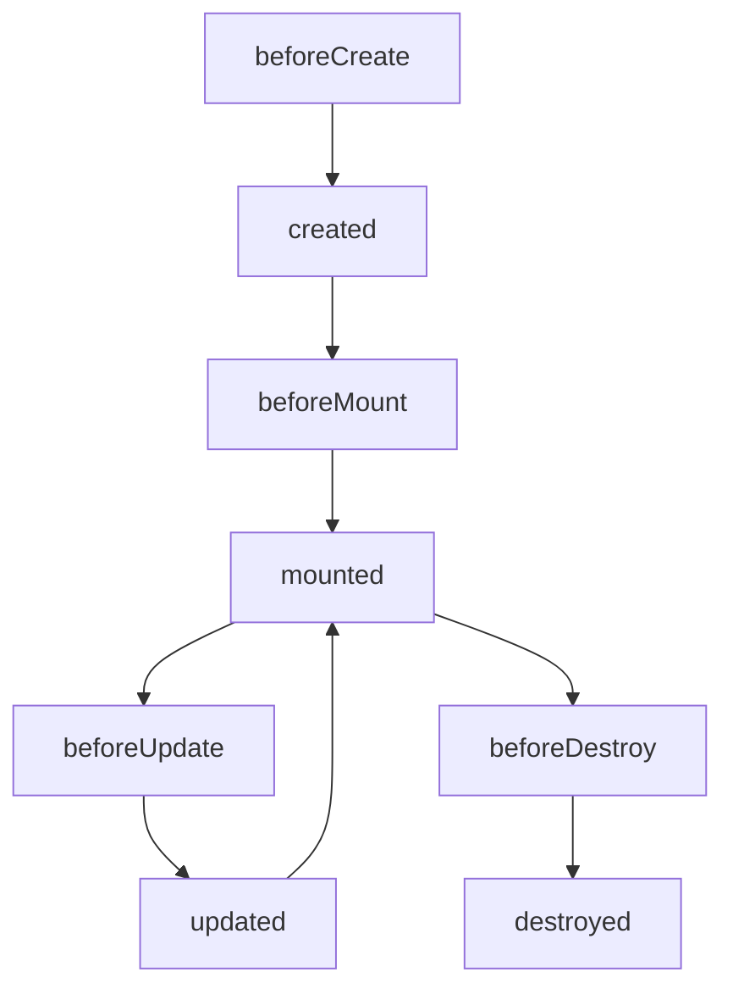

# 框架

## MVVM

mvvm的核心理念是：将vm层和view层进行双向绑定，并且将model层和viiew层之间的联系切断。所有的业务逻辑都放在viewmodel层进行处理。

它的演变过程是：mvc -> mvp -> mvvm。

**传统的MVC模式**

如图虚线所示，用户在view层进行操作，触发controller层的action，controller对model层进行修改，model层修改后，反馈到view层。这是一个单的数据流变化过程。

但是实际实现过程中，view层的变化是经过controller进行操作的。（比如对dom进行操作修改，如下图）

所以：实际开发过程中，所有的操作都是controller层在执行。

**MVP模式**

那么为了将数据划分的更清晰，索性就出现了mvp架构。将view和model层之间的联系彻底切断。

presenter负责准备展示view的数据；

view层所有的逻辑都通过presenter进行操作；

view和presenter强耦合，presenter对model进行操作；

这种模式带来的一个问题是：每新增一个view层就必须新增一个presenter层。

view层和presenter层强关联，不好拆分，也不好复用。

**MVVM模式**

mvvm用vm替代了presenter。不仅仅是名字上的替代，viewmodel也在presenter的基础上丰富了一些概念。

两者都会有一些业务逻辑的处理，起到了controller的作用。但是viewmodel强调的是和view的双向绑定，是对model层的数据封装处理。

presenter更像是一个中间代理者，用来分发view的事件、处理view需要的model数据结果。

## MVVM双向绑定

### 双向绑定原理

> Angular脏检测

通过zone来实现，做一个了解。实际没有看过，也没有用过。

## 生命周期

vue的组件的声明周期：

## Vue的父组件和子组件生命周期钩子执行顺序

## 数据绑定

Virtual Dom

