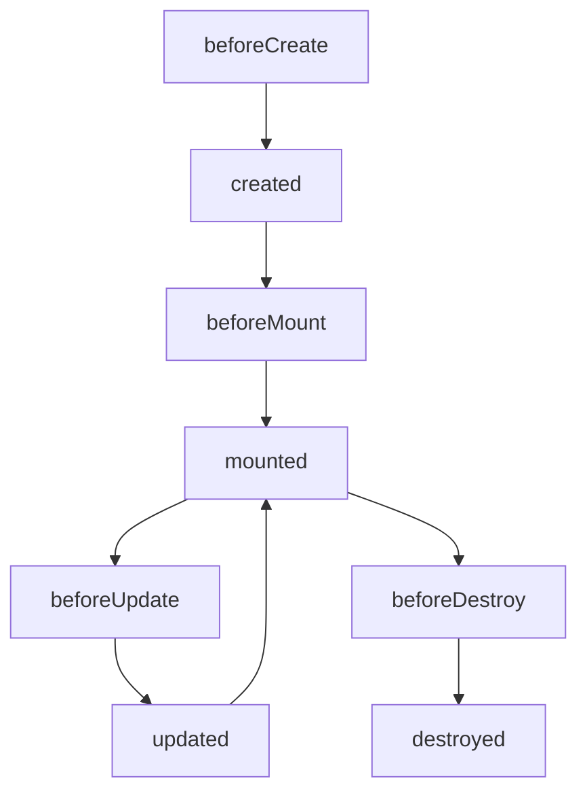

# 框架

## MVVM

mvvm的核心理念是：将vm层和view层进行双向绑定，并且将model层和viiew层之间的联系切断。所有的业务逻辑都放在viewmodel层进行处理。

它的演变过程是：mvc -> mvp -> mvvm。

**传统的MVC模式**

如图虚线所示，用户在view层进行操作，触发controller层的action，controller对model层进行修改，model层修改后，反馈到view层。这是一个单的数据流变化过程。

但是实际实现过程中，view层的变化是经过controller进行操作的。（比如对dom进行操作修改，如下图）

所以：实际开发过程中，所有的操作都是controller层在执行。

**MVP模式**

那么为了将数据划分的更清晰，索性就出现了mvp架构。将view和model层之间的联系彻底切断。

presenter负责准备展示view的数据；

view层所有的逻辑都通过presenter进行操作；

view和presenter强耦合，presenter对model进行操作；

这种模式带来的一个问题是：每新增一个view层就必须新增一个presenter层。

view层和presenter层强关联，不好拆分，也不好复用。

**MVVM模式**

mvvm用vm替代了presenter。不仅仅是名字上的替代，viewmodel也在presenter的基础上丰富了一些概念。

两者都会有一些业务逻辑的处理，起到了controller的作用。但是viewmodel强调的是和view的双向绑定，是对model层的数据封装处理。

presenter更像是一个中间代理者，用来分发view的事件、处理view需要的model数据结果。

## MVVM双向绑定

### 双向绑定原理

> Angular脏检测

通过zone来实现，做一个了解。实际没有看过，也没有用过。

## 生命周期

vue的组件的声明周期：

## Vue的父组件和子组件生命周期钩子执行顺序

### 挂载流程

`父组件created` -> `父组件beforeCreated` -> `父组件beforeMount` -> `子组件created` -> `子组件beforeCreated`

-> `子组件beforeMount` -> `子组件mounted` -> `父组件mounted`

因为vue的组件渲染经历了3个过程，都是通过递归的形式来的。

createComponent -> create vnode -> patch vnode -> 子组件初始化 -> 子组件render  -> 子组件patch

先创建父组件，然后在patch的时候，去初始化子组件，子组件渲染patch之后，才会去渲染父组件

## 数据绑定

## Virtual Dom

虚拟dom其实很简单，就是用js来模拟DOM对象的结构。将这些对象存放在内存中。

虚拟dom出现的原因：因为dom的操作很昂贵，浏览器的dom对象上有很多属性、很多事件。通过浏览器去修改dom，会造成页面的卡顿。

虚拟dom的原理：通过js来模拟基础的属性，只需要绑定属性、child、事件等。其他的都可以不用去关心。

虚拟dom的核心API

diff算法：

## Vue为什么不能用index作为key？

https://juejin.im/post/5e8694b75188257372503722?utm_source=gold_browser_extension#heading-10

针对于列表形式的组件，如果用index作为key，会导致两种情况的问题。

第一种：数据发生顺序上的变化，比如说，只是进行了数组的reverse。那么原本vue可以直接复用dom，只是改变一下顺序即可。但是因为key没有变化，导致vue做diff判断时，认为是子组件的props发生变化，所以进行了 patch-> render等一系列的变化操作。造成了性能损耗。

第二种：如果是删除了某一个数据。比如说，对数组进行了splice(0, 1)的操作。那么vue在diff比较时，同样因为key没有变化，所以复用了0~n-1的子组件。但是，再对props进行比较的时候，发现props都变化了，就对所有的子item组件进行了更新。 ==实际上，我们知道，vue只需要删除第0个子item就可以了。== 

以上，就是用index作为key带来的副作用。