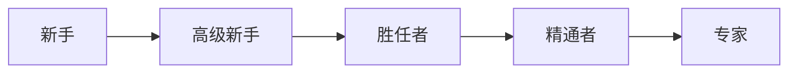

# 德雷福斯模型



新手靠规则，专家凭直觉办事


二街不胜任(不知道自己不知道)

> 很多程序员和项目经理都意识不到，有更好的方法或者实践存在，这是很可怕的问题；
>
> "无知往往来自于自信而不是知识"
>
> 所以我们需要知道自己不知道什么


勇于承担责任，不要只做执行者，不做任何思考


通过观察和模仿来学习

- 模仿
- 吸收
- 创新

在实践中保持技能，只靠问是永远学不会的；


模型只是工具，不是镜子。要避免陷入模型的陷阱中


新手需要快速成功和与情境无关的规则，你无法指望他们独自处理情况。他们也没法看到系统全局的部分，提供他们所需要的帮助即可，不需要让他们知道全貌，否则他们只会更糊涂；

专家需要全貌，不要用约束性、官僚的规则妨碍专家做出自己的判断；


Q: **怎么成为专家**？

- 培养更多的直觉
- 认识到情境和观察情境模式的重要性
- 更好的利用自己的经验；

Q: **自我评价**

胜任者：能够建立部分问题域的概念模型，并且能有效的应用。能够独立解决自己遇到的问题，并考虑如何解决问题。那些没有遇到的问题，能寻求专家的意见并有效利用。

Q：**想一想你的同事**：他们处于哪个技能水平？对你有何帮助？

 **彪哥**：专家级别。系统是他的一部分，他把这些事情当做是自己的事情，投入的精力无法想象。我可以向他学习、模仿。

**汉丫**：胜任者~精通者。对于系统业务层面，有全局的理解。并且会根据自己的表现，不断的尝试去优化，吸取经验教训。 

同时有足够的经验和判断力，很明确在何时采取什么行动。

**瓜瓜**：高级新手。没有全面的理解，也达不到这样的级别。可以独立尝试任务，但是碰到难题时，也很难解决问题；


# 学习是有目标的

## Smart目标

- Specific：明确的、具体的

  我想学习`多线程`是不够的，需要把事情具体化。比如："我想用java多线程编写一个可以订阅行情的服务器"；

- Measurable：可度量的

  我想知道你何时完成？

  为了努力实现目标，不管用什么办法，必须能够度量它。如果无法度量自己的目标任务，那么可能它还不够具体；

  但是度量的目标任务，必须要采用增量进步的方法。

- Achievable: 可完成的

  不能不切实际

- Relevant: 相关的

  目标对你重要么？你对此有热情么？是你控制之下的事情吗？

  目标需要相关的，需要在你掌控之中的。

- Time-boxed：有时间限制的

  没有最后期限，目标必定会逐步衰退，永远被每天更紧急的事情所排挤。这样永远都不会实现。

  

## 目标、任务和行动计划

设定目标是第一步。下一步行动是创建小任务（里程碑），帮助你每天或每隔一段时间都能达到某种程度。

创建的小任务越多，就越容易看清自己与目标的距离。


把技术和才干看做一个`知识投资组合`。学习的技术和掌握的知识都变成投资组合的一部分。

**管理知识投资**：

- 制定具体计划

  现在

  一年后

  五年后

  

- 多样化

  不要把鸡蛋放在同一个篮子里，要考虑多样化投资(语言、技术、行业、非技术领域[管理、公共演讲、音乐等]

  多样化也需要考虑风险和投资回报率

  所有的知识投资都是有价值的，但可能不是直接的

  

- 主动投资

  需要主动的随时重新评估你的投资，哪些发生了变化，哪些已经没有了意义；

  

- 定期投资

  比如定期购买股票，有时会付出很多，有时会收益很多。

  所以要养成一种习惯，比如每周六、周日；

  开始之前做好计划，这样一旦开始时就可以立即执行，而不是在开始后还在考虑下一步应该怎么做；


服务端渲染框架

# Next.js

> 一种服务端渲染的框架；功能比较简单，配置也很简单，不需要依赖别的服务。
>
> 内部应该整合了webpack和babel，可以支持热部署，以及es6


unzip

```javascript
function unzip(b64Data){
    var strData = atob(b64Data);
    // Convert binary string to character-number array
    var charData  = strData.split('').map(function(x){return x.charCodeAt(0);});
    // Turn number array into byte-array
    var binData   = new Uint8Array(charData);
    // // unzip
    var data    = pako.inflate(binData);
    // However, the Uint8Array has a limit of buffer size. It will crashes on big buffers, the rude max size is 246300 and sometimes it not correct in different browser.
    // Convert gunzipped byteArray back to ascii string:
  //	下面这个方法会报超过最大调用次数，造成堆溢出。
    // strData   = String.fromCharCode.apply(null, new Uint16Array(data));
    strData = new TextDecoder("utf-8").decode(data);
    return strData;
}
```

zip


# 单元测试


# Webpack

>  webpack是一个模块打包工具

Webpack 配置文件：webpack.config.js


# JavaScript事件循环模型

事件循环里 

主线程处理代码，判断是否是同步任务，同步任务会进入执行堆栈，异步任务把回调函数进入执行队列中


执行堆栈的任务结束后，判断队列中是否有任务，如果有，就将异步任务加入到执行队列中进行处理。


异步任务也有task 和 Microtask


# 框架原理

## MVVM双向绑定

> https://mp.weixin.qq.com/s/MCuryUvco5_86HsMmVa21

### MVC模式


第`3`步model返回视图实际上是 controller通过dom操作修改view；


**缺点**：model的频繁变化，需要同步通知，比如通过监听事件来修改view，附带大量的dom操作，

​			用户通过controller修改model，需要同步model的状态；


### MVVM模式

mvvm用vm替代了controller，而且也改变了数据传递的方向。 view不再直接关联model，而是通过viewmodel进行传递。


view变化时，viewmodel进行


### Angular脏检测

zone的实现方式


### Vue 数据劫持

原理

​	Object.defineProperty

​	Compile

​	Wathcer

​	Dep

怎么实现一个双向数据绑定

Vue3.0做了什么优化？—— Proxy

### React单项数据流


react怎么去简化setState和事件监听的代码