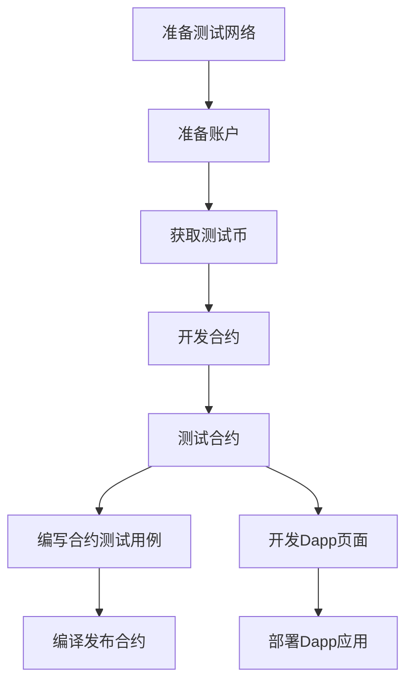

[TOC]


# ETH学习

文档

https://solidity.readthedocs.io/en/latest/solidity-by-example.html#voting

网上代码

[solidity-baby-steps](https://github.com/cyrusadkisson/solidity-baby-steps)

参考资料

[dapp入门文档](https://blog.csdn.net/qq_27500493/article/details/99822875)

https://kauri.io/collection/5bb65f0f4f34080001731dc2/ethereum-101

https://kauri.io/collection/5b8e401ee727370001c942e3

[一些别人整理的链接](https://blog.csdn.net/qq_27500493/article/details/99822875)


## 合约开发

### Fallback 函数

合约可以有一个未命名的函数。这个函数不能有参数也不能有返回值。 如果在一个到合约的调用中，没有其他函数与给定的函数标识符匹配（或没有提供调用数据），那么这个函数（fallback 函数）会被执行。

除此之外，每当合约收到以太币（没有任何数据），这个函数就会执行。此外，为了接收以太币，fallback 函数必须标记为 `payable`。 如果不存在这样的函数，则合约不能通过常规交易接收以太币。

在这样的上下文中，通常只有很少的 gas 可以用来完成这个函数调用（准确地说，是 2300 gas），所以使 fallback 函数的调用尽量廉价很重要。 请注意，调用 fallback 函数的交易（而不是内部调用）所需的 gas 要高得多，因为每次交易都会额外收取 21000 gas 或更多的费用，用于签名检查等操作。

具体来说，以下操作会消耗比 fallback 函数更多的 gas：

- 写入存储
- 创建合约
- 调用消耗大量 gas 的外部函数
- 发送以太币

请确保您在部署合约之前彻底测试您的 fallback 函数，以确保执行成本低于 2300 个 gas。


## Dapp开发

### ETH应用架构

首先来看一下基于以太坊的应用架构。最上层的API、WEBAPP是给用户去看的。中间一块是区块链的应用层：包括智能合约、DApp。底层是区块链的核心技术：P2P网络，共识机制，账本。


### 钱包账户

> 怎么理解钱包和账户？

通俗的理解：账户就是银行卡，卡里面有钱。映射到区块链上，账户它实际上就是一串地址，这个地址上面有余额，还有公钥，私钥由你保管，类似于银行卡的密码。只有有用私钥才能发起交易。

而钱包就是用来存放这些地址的。一个钱包上可以有多个地址。一般钱包应用可以发起转账交易，可以创建地址，还可以去自动扫描账户地址上的余额。

> Metamask 浏览器插件

metamask是一个pc浏览器上的扩展应用，是一个eth的钱包。


> ETH单位

```
1 wei = 1 * 10^-18  = 0.000000000000000001 ETHER

1 gwei = 1* 10^-8 = 0.000000001 ETHER

```


### 智能合约

> 什么是智能合约？

任何在以太坊虚拟机 (EVM) 上运行的程序通常被称作“智能合约”。 

智能合约本质上是一个被代码控制的账户，和普通的钱包账户一样，它也存在公钥、私钥。只不过智能合约账户的公私钥匙保存由合约部署者来保管的。


> 智能合约和eth账户的交互


用户想要参与合约，首先必须有一个eth的账户地址。通过向合约地址发起交易，来进行合约的交互。


> 如何编写智能合约应用

以太坊社区上最受欢迎的智能合约编程语言是 **Solidity** 和 **Vyper**。


> Dapp的交互流程

开发者通过编码，将合约部署到以太坊网络；这个可以理解成服务端；

然后开发者对外提供Dapp的客户端，可以使普通的html页面，也可以是app应用。用户通过浏览器或者app应用，与这个合约应用进行交互。这就是Dapp的主要流程。


> 一般Dapp的架构

普通的Dapp完全可以把ETH网络当做服务端来使用，只需要开发提供前端页面。

更复杂一点Dapp还是需要有自己的后台服务，并且有数据库。最后通过后台服务来向ETH网络发起交互。


// todo 补充一个复杂的dapp架构图；


### 测试网

以太坊社区维护了多个测试网。 开发者能够在应用程序部署到以太坊主网之前对其进行不同条件下的测试。

测试网络可以提供虚拟币，通过metamask插件也可以直接获取到。


## 简单Dapp Demo

>代码地址：https://gitee.com/dendi.ke/eth-learn

### 环境准备

介绍了那么多概念性的东西，现在来进入简单开发一个Dapp。

> 流程



> 测试网络

有大概3种方法准备测试网络，第一种方法：自己跑一个节点；需要安装[geth](#geth)客户端

第二种方法：可以使用 Ganache，在本地起一个节点来处理交易；或者使用Remix，它提供在浏览器内部的 JavaScript 测试网络。成本非常低，打开就可以用，本地测试非常的方便。

并且Ganache 和 Remix Javascript VM 都内置了已经解锁的帐户，不需要去关心帐户的私钥或助记词。

第三种方法：使用共享的测试网络，不过需要先准备好钱包和账户地址。


> 获取账户、测试币

以太坊上的任何操作都需要账户才能发起，所以需要准备好钱包和账户，还有币。


### 代码架构

> 后端服务

因为是demo，后端采用在以太坊上面粗暴的用智能合约代替，设定所有数据都存在链上。

实际复杂应用中所有的数据不应该全部存储在以太坊区块链上，有一部分数据是存在传统的数据库里面。

> 合约开发工具 - Remix
>
> https://remix.ethereum.org/#optimize=false&evmVersion=null&version=soljson-v0.5.12+commit.7709ece9.js

Remix 适合做快速的验证概念和原型。在 Remix中可以快速写合约代码，然后调用它的合约接口，测试它的行为；此外还可以测试已有的合约实例，可以从以太坊的线上环境和测试环境把合约实例加载到 Remix 里面然后测试；当然也可以通过 Remix 把合约部署到任何以太坊网络上面。

```sol
pragma solidity ^0.5.11;

contract Lottery {
    address public owner;
    // address payable: Same as address, but with the additional members transfer and send
    // address payable is an address you can send Ether to,
    // while a plain address cannot be sent Ether.
    address payable[] private participates;

    constructor() public {
        owner = msg.sender;
    }

    function participate() public payable {
        require(msg.value >= 0.1 ether, "不得少于0.1 eth");
        participates.push(msg.sender);
    }

    function random() private view returns(uint) {
       return uint(keccak256(abi.encodePacked(block.difficulty, block.timestamp, participates)));
    }

    function pickOne() public ownerOnly{

        require(participates.length > 0, "参与人少于1个，不能选择");
        uint index = random() % participates.length;
        address payable winner = participates[index];
        winner.transfer(address(this).balance);
        participates = new address payable[](0);
    }

    modifier ownerOnly() {
        require(msg.sender == owner, "必须是部署者");
        _;
    }

    function getParticipates() public view returns(address payable[] memory) {
        return participates;
    }
}
```


> 前端服务

前端服务实际上就是给用户去使用的界面。可以是html页面或者是app应用。这里采用比较熟悉的create-react-app cli来创建了一个应用，来开发简单的dapp页面。


> 测试用例


> 编译合约

通过node脚本来编译合约代码，最终生成2个文件，一个ABI文件，一个可以最终发布到以太坊网络上的字节码文件。


> 最终的目录结构


### 框架整理

> solc-js   编译合约代码

输入输出配置

```
const input = {
	language: 'Solidity',
	sources: {},
	settings: {
		outputSelection: {
			'*': {
				"*": [ "Metadata", "abi", "evm.bytecode" ]
			}
		}
	}
};
```


编译的结果

```
{
  contracts: { 'Lottery.sol': { Lottery: [Object] } },
  sources: { 'Lottery.sol': { id: 0 } }
}
```

编译出来其实最主要的是2个内容，都在Object里。其中一个是abi，一个是bytecode。

网上的solc教程都太老了，输出的格式其实已经完全变了，我也是参考了Remix的编译格式，才解析出来需要的文件。详细的后面会讲到。


> web3.js  *以太坊 JavaScript API*
>
> web3j     *以太坊 Java API* https://juejin.im/entry/5b448c57f265da0f93138ccb 

这两个框架其实是一种类型的框架，只不过是不同语言实现。web3主要做的事情就是提供provider


>ganache-cli

提供本地网络的provider


### 编译发布

#### 通过Remix来编译发布

如下图所示，打开合约代码文件。点击compile，等待编译结果；


点击查看编译明细，可以看到如下的的几个内容：

```
METADATA  编译器元数据,包含:编译器版本,编译器设置,源码信息等
BYTECODE  合约编译完整的字节码结果
ABI  应用程序接口,用于标识合约提供了哪些函数给外部调用
WEB3DEPLOY  Web3js版合约部署代码
METADATAHASH  元数据哈希
GASESTIMATES  编译器计算函数调用需要消耗的Gas表
RUNTIME BYTECODE  合约运行时字节码
ASSEMBLY  字节码反汇编
```

这些内容中真正需要用到的就是2个。一个是ABI接口，一个是BYTECODE字节码结果；

> ByteCode

字节码一般结构如下。真正发布合约时用到的也就是object里面的内容；


> ABI接口

ABI是用来对外提供的接口。Dapp应用和合约进行交互就是通过这些接口的RCP调用。


这里我截了一下demo合约里面的几个接口；

红色表示需要付钱的方法，黄色的表示不需要付钱的，蓝色表示一些pure、view的方法，或者constant属性。

具体参考：https://solidity.readthedocs.io/en/develop/miscellaneous.html?highlight=pure#modifiers


#### 通过脚本编译

> solc编译sol文件

如果需要自己写node脚本去编译发布的话，就比较麻烦，需要用到上面说到的`solc`框架。

首先要将合约代码编译出来，得到上面说的ABI接口和BYTECODE字节码。

具体的参考源码里面的`build/compile.js`，编译出来的二进制文件和abi文件都统一放到了compiled目录下面，以json的格式存储。

> 发布到测试网

编译完成后，需要发布合约。发布合约的话，有几种方式：

第一种通过本地节点来发布

```
// todo 待学习
```


第二种通过Infura来发布

首先，去[Infura](https://infura.io/dashboard)网站注册一个账号，并且建立一个项目，拿到项目地址。


因为我的metamask的账户是RINKEBY的测试网络的，所以这里选择的endpoint也需要选择对应的。


然后，编写脚本，通过`@truffle/hdwallet-provider` 来部署合约。

具体代码参考`build/deploy.js`。需要注意的是，这里部署合约是需要有一个eth的钱包账户。


最后拿到合约的地址，我保存在一个文件中，以便在dapp里使用。当然也可以选择不用文件保存，但是最终都需要在dapp里指明需要交互的合约地址。


### 编写Dapp

dapp其实就是就是一个普通的html应用，但是它通过web3的provider与合约进行了交互，

因为是学习Demo，所以我就直接参考了别人的应用设计，写了一个简单的彩票DAPP。参考的博客地址放在这：

[**以太坊智能合约 + DApp 从入门到上线：来自前端工程师的实战指南 - 王仕军 | Jeth 第一期**](https://juejin.im/post/5b230ff7f265da59780b7aed)

图片我就直接拿来用了：


页面都很简单，就不用解释了，重点和难点是怎么去和合约进行交互。

> 授权账户

前面说了，和合约的交互是需要有ETH的账户的。而这个DAPP是通过浏览器来打开的，所以首先需要向Metamask请求授权，允许该页面对Metamask的账户进行获取。 

早版本的Metamask是不需要授权的，所以网上很多博客里都是直接使用`web3.currentProvider`来去获取账户。但是如果是新版的Metamask插件，不加这段代码，调用`web3.eth.getAccounts()`返回的都是一个空数组，也就无法进行交互。


授权的页面如下：


> 调用接口


其次要注意的是，`new web3.eth.Contract`这个构造函数。

进行`已有的合约交互` vs`发布一个合约`的参数是不一样的。在部署时，需要传入当前的账户地址，而且还需要传入合约的字节码，表明你才是合约的发布者。

在和合约交互的时候，你要传入合约的地址，这样拿到的才是真正别人发布的合约。

这个也是我之前没理解的地方。因为我既发布了合约，又使用了合约。然后在使用合约的时候，直接将代码复制黏贴，一顿操作，结果一直没成功。


## 收尾

以上，就是我要分享的内容，希望能给像我一样的初学者带来帮助。

附上一些学习文档以及参考博客

**官方Example**

https://solidity.readthedocs.io/en/latest/solidity-by-example.html#voting

**合约手把手教程**

[solidity-baby-steps](https://github.com/cyrusadkisson/solidity-baby-steps)


参考资料

https://juejin.im/post/5b230ff7f265da59780b7aed

https://kauri.io/collection/5b8e401ee727370001c942e3


# ERC-20 

## erc-20是什么？

> https://eips.ethereum.org/EIPS/eip-20
>
> https://github.com/ethereum/EIPs/issues/20

erc-20是一个协议，是dapp开发者约定的一个规范。需要声明token、

满足这个规范的合约，才能被钱包、交易所认可。

```sol
pragma solidity ^0.4.24;

/**
 * @title ERC20 interface
 * @dev see https://github.com/ethereum/EIPs/issues/20
 */
interface IERC20 {

    /// @return token总发行数
    function totalSupply() external view returns (uint256);

    /// @param owner 需要查询余额的地址
    /// @return 余额
    function balanceOf(address owner) external view returns (uint256);

    /// 从`msg.sender`的账户转移`value`数量的代币到`to`这个地址上
    /// @notice 必须触发Transfer事件
    /// @notice 出错需抛出异常
    /// @param to 接收地址
    /// @param value 待转移的数量
    /// @return boolean 返回转账是否成功
    function transfer(address to, uint256 value) external returns (bool);


    /// 从`from`账户转移`value`数量的代币到`to`账户
    /// @notice 必须触发Transfer事件
    /// @param from 发送地址
    /// @param to 接收地址
    /// @param value 转移数量
    /// @return 是否转账成功
    function transferFrom(address from, address to, uint256 value) external returns (bool);

    /// 允许`spender`从`msg.sender`上提币，直到总数量超过value。
    /// 如果这个方法被多次调用，覆盖value的值。
    /// @param spender 被授权人，能够转移owner的代币
    /// @param value 被授权的金额，单位 wei
    /// @return 是否授权成功
    function approve(address spender, uint256 value) external returns (bool);


    /// @param owner 代币拥有者
    /// @param spender 被授权人，能够转移owner的代币
    /// @return 返回`spender`剩余能够转移的代币
    function allowance(address owner, address spender) external view returns (uint256);

    /// 记录转账事件
    event Transfer(
        address indexed from,
        address indexed to,
        uint256 value
    );

    /// 记录授权事件
    event Approval(
        address indexed owner,
        address indexed spender,
        uint256 value
    );
}
```


## 如何开发一个erc-20代币

实现一个代币最根本的是要维护一个帐本，然后根据交易来记录账本的变化。

```
pragma solidity ^0.4.24;

import "./IERC20.sol";
import "./SafeMath.sol";

contract BaseERC20 is IERC20 {

    using SafeMath for uint256;

    string public constant name = "KeYang Coin";
    string public constant symbol = "KYC";
    uint8 public constant decimals = 18;

    // 账本
    mapping(address => uint256) balances;

    // 授权
    mapping(address => mapping(address => uint256)) allowed;

    uint256 public totalSupply;

    function _mint(address account, uint256 value) internal {
        require(account != address(0));
        totalSupply = totalSupply.add(value);
        balances[account] = balances[account].add(value);
        emit Transfer(address(0), account, value);
    }

    /// @return token总发行数
    function totalSupply() external view returns (uint256) {
        return totalSupply;
    }

    /// @param owner 需要查询余额的地址
    /// @return 余额
    function balanceOf(address owner) external view returns (uint256) {
        return balances[owner];
    }

    function transfer(address to, uint256 value) external returns (bool) {
        require(value > 0);
        require(balances[msg.sender] >= value);
        require(to != address(0));

        balances[msg.sender] = balances[msg.sender].sub(value);
        balances[to] = balances[to].add(value);
        emit Transfer(msg.sender, to, value);

        return true;
    }

    function transferFrom(address from, address to, uint256 value) external returns (bool) {
        require(value > 0);
        require(balances[from] >= value);
        require(allowed[from][msg.sender] >= value);
        require(to != address(0));

        balances[from] = balances[from].sub(value);
        balances[to] = balances[to].add(value);
        allowed[from][msg.sender] = allowed[from][msg.sender].sub(value);
        emit Transfer(from, to, value);
        return true;
    }

    /// 允许`spender`从`msg.sender`上提币，直到总数量超过value。
    /// 如果这个方法被多次调用，覆盖value的值。
    /// @param spender 被授权人，能够转移owner的代币
    /// @param value 被授权的金额，单位 wei
    /// @return 是否授权成功
    function approve(address spender, uint256 value) external returns (bool) {
        require(spender != address(0));
        allowed[msg.sender][spender] = value;

        emit Approval(msg.sender, spender, value);
        return true;
    }


    /// @param owner 代币拥有者
    /// @param spender 被授权人，能够转移owner的代币
    /// @return 返回`spender`剩余能够转移的代币
    function allowance(address owner, address spender) external view returns (uint256) {
        return allowed[owner][spender];
    }
}
```


## 如何保证erc-20代币的安全性

### API接口的建议

在ERC-20的规范中，明确提出了一个建议：建议approve方法使用CAS机制；或者先设置value为0，再设置为另一个值。从而避免在2次approve之间，造成approve过的值的风险。

https://docs.google.com/document/d/1YLPtQxZu1UAvO9cZ1O2RPXBbT0mooh4DYKjA_jp-RLM/edit#


### 合约实现的建议

实现真正的合约时，使用经过别人验证的，安全的Library包 [Openzeppelin-contract](https://github.com/OpenZeppelin/openzeppelin-contracts/blob/9b3710465583284b8c4c5d2245749246bb2e0094/contracts/token/ERC20/ERC20.sol) 。


# 众筹

众筹其实也是基于代币的合约基础上，增加了募集资金的需求。所以相对于代币的业务，

> 增加了如下的字段：

- 众筹的时间期限、众筹的目标额度、已筹到的资金

- 众筹的收益人账户

- 代币兑换的价格

- 参与众筹的账户情况，根据这个明细来发放对应的代币

  

> 需要修改的逻辑：

- 众筹时，判断众筹时间是否已经到期，判断众筹额度是否已经达到目标

- 众筹结束时，判断众筹是否成功。

- 受益人提币时，判断众筹时间和众筹的结果，以及是否是受益人；

- 众筹结束后，如果成功，给参与众筹的人发放相应的代币

  ​	如果失败，允许参与众筹的人提取eth。


发布到SWARM


# geth

> https://juejin.im/post/5b0bbba46fb9a009de14c606

geth命令，主要的Ethereum CLI客户端，是Ethereum网(main-, test- 或 private网)的入口，有能力作为一个full node(默认)存档节点(保留所有历史数据)或者一个light node(现场检索数据)节点运行。经由暴露在HTTP, WebSocket 或 IPC传输的顶部的JSON RPC端点，它可以被其他过程用作Ethereum网的网关。


```
geth --rinkeby console 
```


