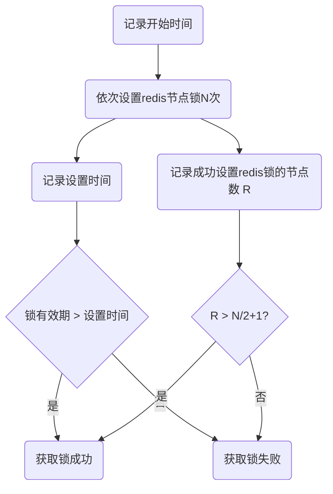
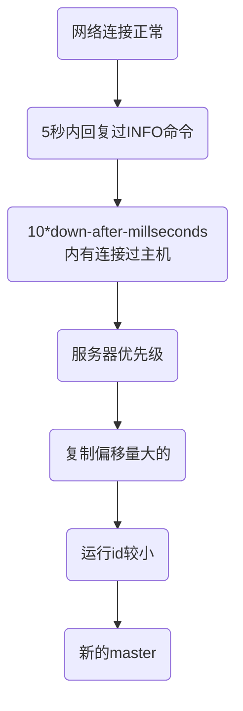

## 微服务

### 微服务架构概述


Q1:独立部署给业务带来什么好处？

A1:服务可以根据业务划分，不同业务之间可以独立开发，分开上线。和集中化部署相比，不会依赖于整体业务开发完成才能上线，业务拓展能力比较强。可以频繁发布不同的服务，同时保持系统其他部分可用。

Q2:独立数据源给微服务带来什么挑战？


### 微服务的利与弊

**利**

- 可以用微服务的模式来模块化开发业务，让每个团队的边界都很清晰，相互调用；
- 可以独立部署服务
- 技术可以多样性，每个团队可以用自己擅长的技术；

**弊**

- 分布式服务一般都很复杂；
- 测试复杂性很高；
- 最终一致性:  每个团队开发的服务，数据需要保证一致，所以需要同步。
- 运维部署很复杂，维护稳定性也很困难，对运维的要求也很高。要有固定的docker容器，也要有故障演练；


### **企业何时引入微服务架构？**

**前期不建议直接上手微服务**：

1.是前期对业务理解不深，业务不好拆分，而且系统一开始也不会很复杂；

2.是前期微服务投入成本过高，甚至业务模式都没被商业认证，可能开发出来都不会被市场接受，采用微服务代价太大。

3.前期微服务复杂度高，生产力并不高，应该在业务发展的过程中，找到一个点去切换微服务；

**中期逐渐转化成微服务**：

1.业务务不断拓展，复杂度增加，产品本身的生产力会下降

2.团队规模不断扩大，可以有更多的人投入到微服务上；


### 微服务的组织架构

> 康威法则: 设计系统的组织以及所产生的架构，等价于企业的组织架构；

~~传统的组织架构：产品部门、用户体验部门、研发部门、测试部门、。。。运维部门等；~~

微服务组织架构：跨职能微服务产品团队 

微服务架构实际上是组织架构的一种重组：从以前的职能部门，转换成跨职能部门的组织架构；

团队人员不再只是"围绕项目建立，当项目结束以后就回到职能部门”；而是围绕着微服务来建立团队，不断的开发迭代，从而提供一个API、平台产品。


微服务核心概念：**端到端 （End to End** **Ownership**）团队内部之间能够形成一个闭环。


每个团队自行负责产品的设计，架构，开发，构建，部署，运维，支持。团队各自发布自己的模块，团队间模块解耦，升级时向下版本兼容，互不影响。一个团队规模大致12人左右。


### 中台战略：

中台概念的由来：2013年，马云带领阿里的高管，参观了supercell。一家位于芬兰的移动游戏公司。发现他们公司的虽然团队特别小，但是居然能够在几周时间内就做出一款游戏。其中除了敏捷开发、快速试错以外，其成功还有一个最关键的要素就是supercell的中台能力。supercell的中台架构模式给阿里高管很大的震撼，这也催生了阿里巴巴的中台战略。

阿里中台战略："大中台、轻前台"。通过厚实的中台架构，来向前台输送弹药。让前台业务更加灵活，并且能快速适应市场的需求。


中台：

最后推荐一篇文章：互联网公司中所谓中台是怎么定义的？ -  知乎
https://www.zhihu.com/question/57717433/answer/719218827


### 一个清晰简洁的微服务分层


从业务逻辑上：我们把服务分为`聚合服务`和`基础服务`两层；

`基础服务`主要提供比较基础的、通用的接口服务。这些服务一般都是核心业务，比如港盛的订单服务、账户服务

聚合服务，一般也叫适配服务，BFF。根据业务需要，将多个基础服务组合在一起，或者对服务的返回数据进行相应裁剪。以减少基础服务的重复开发，也避免了客户端过多的请求调用，减少开销。


### 微服务的技术架构模型


### 服务发现机制

1. **传统模式：基于LB**


服务上线时，向运维申请域名，运维人员根据域名配置负载均衡，然后提供域名给客户端去调用；

客户端通过域名DNS解析到负载均衡服务器上，从而调用服务；

**特点**
成本低,需要运维介入,集中的一个LB,LB挂了损失会很大
性能损失,需要服务必须穿透LB。


2. **进程内LB模式**


### API网关

> 什么是网关
>
> 网关可以理解为一个系统与外界连接的入口。有点点类似于一个企业的大门，用来做安全防护，限制访问，请求路由等工作；


网关的作用：

网关服务最主要的作用，是为内部服务提供统一的对外出口，向外部访问者提供统一的服务入口。另外，网关可以对外界访问做一个安全防护，比如限制外部访问、统一鉴权、熔断等。


最上层是用户接入设备，通过负载均衡器，转发到网关服务，从而最终请求各个微服务。

- 反向路由：将内部的服务转化成为对外服务
- 安全认证：用于检测请求，识别身份
- 限流熔断：防止大流量的访问
- 日志监控：记录日志


### Zuul网关架构

核心模块：

​	前置路由Filter：可以做日志记录

​	路由Filter：主要就是找到具体的微服务，路由到具体的服务。

​	后置路由Filter：主要是处理需要返回给客户的消息，也可以做日志的统计

框架的特点：

​	Zuul的Filter可以很灵活的配置，来满足业务需求。只需要开发完过滤器后，通过publisher存储在`Filter Database`中，然后通过poller轮训上传到`Filter Directories`里。上层的`Filter File Manager`会定期扫描`Filter Directories`，通知loader将过滤器加载到Runner里。


### Netflix的微服务路由发现机制


Netflix服务注册中心组件： Eureka

Netflix网关组件：Zuul

两个组件支撑了整个netflix的路由发现体系：

基础服务启动时，会向Eureka注册服务，内部的聚合服务需要用到基础服务时，通过`服务注册中心`来发现服务。

同理，聚合服务也会向注册中心注册服务，网关层作为客户的统一接入点，会通过注册中心的路由表，来找到对应的聚合服务。


### 无状态服务

无状态服务：对于单次的请求，不依赖于其他请求数据就能完成。也就是，客户端每次发过来的请求，服务端只需要根据这次请求传入的信息，可能再加上一些外部的依赖服务（如数据库），就可以完成对请求处理，服务本身不存储任何信息。

有状态服务：服务端保存了一些数据信息，请求的先后有一定的关联性。比如发送验证码和校验验证码；


### RPC VS REST

|              | RPC                                  | REST                                      |
| ------------ | ------------------------------------ | ----------------------------------------- |
| 耦合性       | 强耦合                               | 松散耦合                                  |
| 消息协议     | 二进制协议                           | JSON 、XML文本协议                        |
| 通讯协议     | TCP                                  | HTTP/HTTP2                                |
| 性能         | 高                                   | 低于RPC                                   |
| 接口契约 IDL | thrift、profobuf IDL                 | Swagger,                                  |
| 客户端       | 强类型客户端，可以支持多语言客户端   | 一般http client可访问，支持多客户端语言。 |
| 案例         | Dubbo, motan, Tars, grpc, thrift     | SpringMVC, SpringBoot, jax-rs, dropwizard |
| 开发者友好   | 客户端比较方便，但是二进制消息不可读 | 文本可读，通过浏览器可访问                |
| 对外开放     | 对外一般需要转换成REST协议           | 直接对外开放                              |


### 微服务治理

#### 服务监控体系


**服务监控体系**一般都需要分层去监控，一般包括了5个层次，从下往上依次为：

基础设施监控: 一般都是服务运营商去进行监控；

系统层监控：主要监控对象为物理机、虚拟机、操作系统，监控指标一般是cpu、内存、网络、硬盘等；

应用层监控：应用层一般针对服务进行监控，主要关心`服务接口`是否可用、平均响应时间、（qbs）每秒钟处理请求数量、是否存在慢查询等等。

业务监控：主要监控核心业务，比如看下下单情况、注册登录情况。产品部门会针对业务层的监控数据进行分析，来判断产品是否满足市场需求、推广的效果是否符合预期等；

端用户体验监控：这个一般就是针对客户端进行监控。比如对客户端版本进行监控，接入的运营商是移动还是电信等等。用户体验监控主要是产品经理比较关心的地方；


#### 监控内容

- 健康检查
- 告警系统
- 调用链监控
- 日志监控
- Metrics监控


#### 监控方案


**方案理解：**

微服务一般会在进程内部或者主机上加一个agent（代理），这个代理主要的作用就是去收集分发日志。

如果日志量过大，可以通过消息队列（Kafka）做一个缓冲，然后通过`ELK`做日志查询；

`Metrics`用来监控度量，将数据存储在`InfluxDB` 的时间序列数据库中，Grafana针对数据进行可视化展示。

最后通过一个健康检查机制sensu/Nagios/Kubernetes，来去检查微服务的监控情况。


**方案技术框架**

	> `ELK`是Elasticsearch + logstash + kibana三个结合在起一起缩写；
	>
	>Elasticsearch是实时全文搜索和引擎分析
	>
	>logstash是用来搜集、分析、过滤日志的工具
	>
	>kibana是基于web的图形界面，用于搜索、分析和可视化数据。


### 调用链监控

> 调用链监控来源于google的一篇论文：Google Dapper


如图所示：http请求 经过 web 容器，再在内部经过一些列服务转换，进入service1 ，再到 DB 再返回；

每个请求经过一层调用，都会生成一个`span`;

每个span，会生成自己的trace_id，span_id, 并且关联上层的parent_id. 这样，通过这3个id的关系，来生成调用链；

#### 监控框架工具：


### 熔断限流

#### Hystrix框架


封装请求：熔断、隔离、限流、降级

如果打开了限流措施，直接短路。

如果线程满了

如果运行超时：降级；


### 容器技术


### 蓝绿部署和灰度发布


蓝绿部署：蓝色代表是老版本，绿色代表是新版本；

灰度发布：不是一次性把流量全部切换到新版本上，而是先切一部分流量，确保没问题后，再全部切换到新版本上。


微服务 

Mesos的服务框架

Master - Slaver 模式；


## 多线程

多线程应用场景

守护线程与非守护线程

多线程的几种状态

保证线程的执行顺序

使用多线程分批处理信息

多线程通信方式

怎么停止线程

ThreadLock原理


## 多线程安全问题

使用同步代码块解决线程安全

this锁

静态同步代码块

多线程死锁

java内存模型

volatile可见性

atomicInteger原子类


## 线程池

1.线程池概述

2.创建线程池的方式

3.线程池原理分析

4.线程池合理数量配置

5.悲观锁&乐观锁

6.重入锁

7.读写锁

8.CAS无锁机制

9.自旋锁


## 注解

1.注解概述

2.自定义注解

3.使用注解实现ORM框架(对象关系映射)

设计模式

饿汉式写法

工厂模式

代理模式

静态代理

JDK动态代理

CGLIB动态代理


## 网络通信

1.网络通信概述

2.TCP与UDP区别

3.UDP发送消息

4.TCP三次握手

5.TCP协议发送客户端与服务端

6.使用多线程支持多个线程同时访问


​	

IO与NIO的区别

Buffer的数据存储

make与rest用法

直接缓冲区与非缓冲区区别

分散读取聚集写入

编码格式


阻塞IO与非阻塞IO的区别

NIO客户端与服务端

Netty框架

Nettty服务端

Netty客户端


长连接与短连接区别

粘包与拆包

序列化


## 内存

内存结构——java

堆溢出

栈溢出

内存溢出与内存泄露的区别


## HTTP


## 数据库

mysql概述

mysql优化方案

数据库三大范式

分库分表

水平分割取模算法

索引概述

索引底层实现原理

普通索引&唯一索引区别

sql语句优化

mysql高可用

mysql主从复制原理

mysql读写分离概述

mycat读写分离


## 事物

事物概述

事物底层原理

事物传播行为

分布式事物


## Redis

### Redis5种基本类型

> String, Hash, List, Set,  ZSet

#### String

重要用法1：**`Expire Key`**

> **应用场景**

1、限时的优惠活动信息

2、网站数据缓存（对于一些需要定时更新的数据，例如：积分排行榜）

3、手机验证码

4、限制网站访客访问频率（例如：1分钟最多访问10次）  


重要用法2：**`SETNX key value` **

> **应用场景**

1、分布式锁


重要用法3：**`INCR KEY_Name`**

> **应用场景**

1.计数器

假如，在某种场景下有3个客户端同时读取了mynum的值（值为2），然后对其同时进行了加1的操作，那么，最后mynum的值一定是5。


**Key的命名建议**

> redis单个key 存入512M大小

1.key不要太长，尽量不要超过1024字节，这不仅消耗内存，而且会降低查找的效率；

 2.key也不要太短，太短的话，key的可读性会降低； 

3.在一个项目中，key最好使用统一的命名模式，例如user:123:password; 

4.key名称区分大小写


#### Hash

> 应用场景

1、存储一个对象

hash存储对象和string存储的区别

- stirng存储主要有2种方案：一种是用对象的id作为key，用对象的json序列化作为value。还有一种是用对象的id+属性名作为key，用对象属性值作为value。

  第一种的缺点是每次修改属性不方便，必须将对象反序列化出来再插入进去。而且需要考虑并发问题；

  第二种确定是key太多，造成存储空间过大；

- Redis提供的Hash很好的解决了这个问题，Redis的Hash实际是内部存储的Value为一个HashMap，并提供了直接存取这个Map成员的接口


#### List

> 应用场景

1、实现队列 lpush rpop 

2、实现堆栈 lpush lpop

3、实现分页 lrange start stop

​		大数据量的分页

4、对大数据进行删减、显示

​		如：关注列表、粉丝列表、留言评价等;

5、任务队列


#### Set

> 应用场景

1、常用于对两个集合间的数据做交集、并集、差集运算：

​	比如微信查看2个人的共同好友；

​	比如微博查看共同关注的人；

​	再高级一点，推荐你关注的人关注了谁；	

2、利用唯一性，统计网站的访问IP；


#### ZSet

> 应用场景

1、排行榜，如查看排名前10的人，或者查看所有人的排名，或者查看某一个分数段的人；

```java
System.out.println("       全部玩家排行榜                    ");
		Set<ZSetOperations.TypedTuple<String>> allPlayerList = redisTemplate.opsForZSet().reverseRangeWithScores(key, 0, -1);
		Iterator<ZSetOperations.TypedTuple<String>> iterator = allPlayerList.iterator();
		while(iterator.hasNext()) {
			ZSetOperations.TypedTuple<String> item = iterator.next();
			System.out.println("玩家ID："+item.getValue()+"， 玩家得分:"+Double.valueOf(item.getScore()).intValue());
		}

// reverseRangeWithScores
// reverseRangeByScoreWithScores
```


### Redis实现分布式锁

方案1：

```java
String lockKey = "product_100_stock";
String stockStr = stringRedisTemplate.opsForValue().get("stock");
// 实现关键是用到了setnx这个命令
boolean result = stringRedisTemplate.opsForValue().setIfAbsent(lockKey, "20");
if (!result) {
  return "locked";
}
int stock = Integer.parseInt(stockStr);
if (stock > 0) {
  stock--;
  stringRedisTemplate.opsForValue().set("stock", String.valueOf(stock));
} else {
  return "error";
}
stringRedisTemplate.delete(lockKey);
return "success";
```

1.如果程序运行中死机了怎么处理？

- 在代码块中加try finally，删除锁
- 增加锁的超时时间；

2.超时时间怎么去定比较合理？不会提前清除锁，从而造成`分布式锁`释放错误。

- 考虑在主线程里，开启一个子线程，去不断的定时轮询延迟锁的时间。主线程结束后，结束子线程；

3.如何避免误删锁？

​	line4:在设置锁的value的时候，设置一个随机值；删除锁时，先比较值，再去删除锁； 


方案2：redission

```
RLock rLock = redisson.getLock(lockKey);
```

1.如果是master-slaver模式的redis架构，会出现什么问题？

- redission写是用master，读是用slaver。如果写的时候，master挂掉，读取的slaver依然可以用，会导致锁一直无法释放，从而导致死锁。 

2.redis分布式锁怎么支持高并发？

Redlock算法：

假设有N个相同的redis节点，每个节点上的redis模式一样，但是互不关联。

1.记录时间戳；

2.为每个redis节点设置的超时时间，以及锁过期时间。 避免服务器挂掉后，客户端仍然去等待服务器响应；(比如5ms)

3.当设置锁时，向每个redis节点上都设置一次；

4.记录成功的节点数，以及累计的用时时间；

5.如果累计时间不超过锁过期时间，并且成功节点数大于总结点数的一半数量；

6.如果累计时间超过了锁的过期时间，那么锁可能已经失效了。或者获取了小于3个锁，必须释放，否则影响其他client获取锁。





### Redis事物

#### 两类错误

- 语法错误

  回滚操作——discard

- 执行错误

  跳过错误继续执行

  

redisTemplate执行

```java
SessionCallback sessionCallback = new SessionCallback() {
  @Override
  public Object execute(RedisOperations redisOperations) throws DataAccessException {
    redisOperations.multi();
    redisTemplate.opsForValue().set(key, "1");
    redisTemplate.opsForValue().decrement(key);
    redisTemplate.opsForValue().set(key, "2");
    redisTemplate.opsForValue().set(key, "6");
    return redisOperations.exec();
  }
};
redisTemplate.execute(sessionCallback);
```


### Redis缓存一致性

1.强一致性——实时同步

查询缓存，缓存不存在查询DB，保存到缓存。

更新缓存时，先更新数据库，再将缓存的数据设置为过期；

注意点：

**缓存穿透**

> 每次查询的时候，数据库都返回空，每次都没缓存数据，结果每次都从数据库中查询

解决方案
从缓存取不到的数据，在数据库中也没有取到，这时也可以将key-value对写为key-null，缓存有效时间可以设置短点，如30秒（设置太长会导致正常情况也没法使用）。这样可以防止攻击用户反复用同一个id暴力攻击

**缓存击穿**

> 某一个热点Key，在某一个时间里，缓存失效了。这时由于并发用户特别多，同时读缓存没读到数据，又同时去数据库去取数据，引起数据库压力瞬间增大，造成过大压力

解决方案

1. 设置热点数据永远不过期；
2. 加互斥锁，只有1个去数据库查询；

**缓存雪崩**

> 缓存中数据大批量到过期时间，而查询数据量巨大，引起数据库压力过大甚至down机。和缓存击穿不同的是，缓存击穿指并发查同一条数据，缓存雪崩是不同数据都过期了，很多数据都查不到从而查数据库。

解决方案：

1.设置不同的过期时间；

2.热点设置不过期


### Redis主从复制

master主节点用来写入数据，slaver子节点用来读取数据，`主节点`定期把数据同步到`从节点`来保证数据的一致性。

#### 主从复制架构

**a)  一主一从**：当`主节点`的“写”命令并发高且需要持久化时，可以只在`从节点`开启AOF（主节点不需要）。

 


**b) 一主多从**：当对"读"的要求比较大时，这种结构比较合适。主节点只负责写入，然后同步到从节点。但是对主节点的影响比较大，因为`主节点`会同步到多个`从节点`，会消耗带宽和内存。


c) **树形结构**：可以解决上面一主多从，主节点压力过大的问题；


#### 数据同步

a) 全量复制：一般用于初次复制场景（第一次建立SLAVE后全量）
b) 部分复制：网络出现问题，从节点再次连接主节点时，主节点补发缺少的数据，每次数据增量同步
c) 心跳：主从有长连接心跳，主节点默认每10S向从节点发ping命令，repl-ping-slave-period控制发送频率

#### 主从的缺点

**a)** 若主节点出现问题，则不能提供服务，需要人工修改配置将从变主。
**b)** `主节点`的写能力单机，能力有限
**c)** 单机节点的存储能力也有限


### 哨兵机制(Sentinel)

> 主要是为了解决主从复制的缺点，自动对节点进行监控。当主节点不可用时，自动将主节点的子节点转换为主节点，并且通知客户端。

#### 1.**高可用**

当主节点出现故障时，由sentinel自动完成故障发现和转移，并且通知应用。


**监控原理**：

1：每10s钟，哨兵向master节点获取一下信息，来确认主从节点的拓扑关系；


2：每2s钟，每个哨兵会向master节点的固定频道上发送主推消息(哨兵对master节点的判断、哨兵获取到的节点信息)。同时，每个哨兵也会去订阅这个固定频道，了解其他哨兵对这个节点的判断。


3：每s钟，每个哨兵也会向其他哨兵以及主、从节点发送ping命令；用来确定节点是否正常；


**下线状态**

1.主观下线：

哨兵每隔1s向其他节点发送ping命令，在down-after-milliseconds有效期内，如果没有响应，就会主观的将这个节点下线；并且向其他节点确认是否都是主观下线的。

2.客观下线：

当主观下线的客户数量超过quorum（quorum = (节点数量/2) + 1）时，则认为节点是客观下线状态。

当节点被哨兵客观下线以后，哨兵会通过选举算法，选出一个哨兵来负责进行故障转移。 每个发现节点客观下线的哨兵都有权限申请成为故障转移的哨兵；选举先到先得，成为故障转移的哨兵会选择一个主节点的从节点作为新的主节点；


**故障转移流程**

1.选举新的主节点



2.将其他节点设置为`新主节点`的从节点


3、通知客户端，新的主节点的ip、port等信息；


### Redis持久化

#### RDB存储

> 默认持久化机制

rdb相当于快照，将内存中的数据以快照的方式保存到二进制文件中，默认文件名为dump.rdb;

优点：

​	保存快，读取恢复快；

缺点：

​	做快照的时候，占用内存高；	

#### AOF

> Append of file，将redis的**写入命令**追加到文件中；

三种aof方式：

- ​	每次写入追加文件 appendfsync always 

缺点：有时我们只关注结果，并不想关注每次写入的过程；

- ​	每秒钟追加文件 appendfsync everysec

缺点：频率太高，容易占用磁盘太多；

- ​	永远不追加 appendfsync no

缺点: 容易丢失；


## Nginx

nginx安全体系架构

nginx搭建集群

nginx负载均衡策略

服务器宕机容错机制

nginx搭建企业API接口


分布式与集群的区别

Keepalived高可用概念

nginx+keepalived高可用

session共享解决方案

高并发解决方案


## 消息中间件

### 消息中间件使用场景

1.解耦

当A服务需要被多个服务引用时，不需要频繁的修改A服务的接口，只需要对外提供一个统一的消息队列，需要用到的服务去订阅这个消息队列就可以；


2.异步处理请求

有一些业务场景：比如发送邮件、发送短信等。如果是同步的情况，需要等邮件发送后再返回请求；那如果是异步的话，就可以将发送邮件、发送短信的任务加入到消息队列中，直接返回响应结果；

3.削峰


### 消息中间件通信方式

通信协议：amqp


### 消息队列模式

#### 简单消息队列


```java
// 生产者 -- Producer.java
connection = connectionFactory.newConnection();
channel = connection.createChannel();
// 声明通道
channel.queueDeclare(QUEUE_NAME, false, false, false, null);
String message = "Hello World";
channel.basicPublish("", QUEUE_NAME, null, message.getBytes());
System.out.println(" [x] Sent '" + message + "'");

// 消费者 -- Receiver.java
Consumer consumer = new Consumer() {
  @Override
  public void handleDelivery(String s, Envelope envelope, AMQP.BasicProperties basicProperties, byte[] bytes) throws IOException {
    String message = new String(bytes, "UTF-8");
    System.out.println("[X] recived" + message);
  }
};
channel.basicConsume(TASK_QUEUE_NAME, autoAck, consumer);
```


缺点：1.耦合性高，生产者1-1对应消费者。无法用多个消费者去处理消息队列；

2.队列名变更时，需要同时变更生产者和消费者的代码；


#### Worke Queues


##### Round-robin dispatching

> 消息客户端平均分配所有的消息队列，无论消费者的处理能力如何，都是每个消费者都会轮流处理一个消息；


##### Fair dispatching

> 限制每次消息发送者只发送1个消息，并且等待消费者发送消息确认ack，才会去删除消息队列；
>
> 注：需要关闭自动Ack, 并且手动返回Ack。


RabbitMQ发布订阅

RabbitMQ生产者

RabbitMQ消费者

RabbitMQ设置持久化机制


JMS 可靠消息

消息中间件幂

消费者集群


rocketmq概述

rocketmq集群

rocketmq重试


消息容灾


## 任务调度

任务调度概述

使用Quartz实现

分布式任务如何解决"幂等性"

XX-JOB环境

分布式任务平台执行原理

任务调度平台执行器运行

任务调度平台路由策略


## 分布式事物

分布式事物产生原因

分布式事物解决方案

CPA与Base理论

2PC-两段提交协议

使用MQ解决分布式事物

LCN框架概述

LCN框架原理

LCN框架流程

启动tx-mananger

演示分布式事物产景

使用LCN框架解决分布式事物


## 分布式框架1

SpringCloud概述

服务注册与服务发现

搭建Eureka注册中心(服务发现)

发布服务会员提供者

消费会员服务

springcloud调用服务原理

springcloud服务负载均衡实现原理

使用Ribbon搭建客户端负载均衡器

什么是接口网关

使用Zuul搭建服务接口网关 (智能路由)

使用Zuul网关拦截参数

分布式配置中心概述

使用fegin客户端

服务雪崩效应产生原因

雪崩效应解决方案

使用hystrix实现服务降级

使用hystrix解决服务雪崩原因


## 分布式框架2

Dubbo架构原理

Dubbo应用场景

Dubbo创建项目架构模式

发布会员服务

订单消费服务

Dubbo-Admin

Dubbo实现负载均衡、容错

Dubbx使用


## Zookeeper

Zookeeper概述

Zookeeper应用场景

Zookeeper临时节点

Watcher事件通知

Zookeeper实现分布式锁

解决生产订单号线程安全问题

Zookeeper实现分布式锁解决方案

Zookeeper实现负载均衡原理

如何实现负载均衡策略

如何实现负载均衡轮训算法

如何使用Zookeeper实现选举策略


## 移动端解决方案

移动APP登录

使用Token登录

使用token查询用户信息


