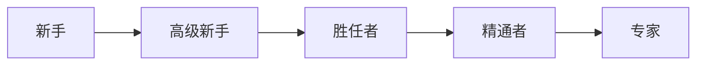

# 德雷福斯模型

新手靠规则，专家凭直觉办事

二街不胜任(不知道自己不知道)

> 很多程序员和项目经理都意识不到，有更好的方法或者实践存在，这是很可怕的问题；
>
> "无知往往来自于自信而不是知识"
>
> 所以我们需要知道自己不知道什么

勇于承担责任，不要只做执行者，不做任何思考

通过观察和模仿来学习

- 模仿
- 吸收
- 创新

在实践中保持技能，只靠问是永远学不会的；

模型只是工具，不是镜子。要避免陷入模型的陷阱中

新手需要快速成功和与情境无关的规则，你无法指望他们独自处理情况。他们也没法看到系统全局的部分，提供他们所需要的帮助即可，不需要让他们知道全貌，否则他们只会更糊涂；

专家需要全貌，不要用约束性、官僚的规则妨碍专家做出自己的判断；

Q: **怎么成为专家**？

- 培养更多的直觉
- 认识到情境和观察情境模式的重要性
- 更好的利用自己的经验；

Q: **自我评价**

胜任者：能够建立部分问题域的概念模型，并且能有效的应用。能够独立解决自己遇到的问题，并考虑如何解决问题。那些没有遇到的问题，能寻求专家的意见并有效利用。

Q：**想一想你的同事**：他们处于哪个技能水平？对你有何帮助？

 **彪哥**：专家级别。系统是他的一部分，他把这些事情当做是自己的事情，投入的精力无法想象。我可以向他学习、模仿。

**汉丫**：胜任者~精通者。对于系统业务层面，有全局的理解。并且会根据自己的表现，不断的尝试去优化，吸取经验教训。 

同时有足够的经验和判断力，很明确在何时采取什么行动。

**瓜瓜**：高级新手。没有全面的理解，也达不到这样的级别。可以独立尝试任务，但是碰到难题时，也很难解决问题；

# 学习是有目标的

服务端渲染框架

## Next.js

> 一种服务端渲染的框架；功能比较简单，配置也很简单，不需要依赖别的服务。
>
> 内部应该整合了webpack和babel，可以支持热部署，以及es6

路由

