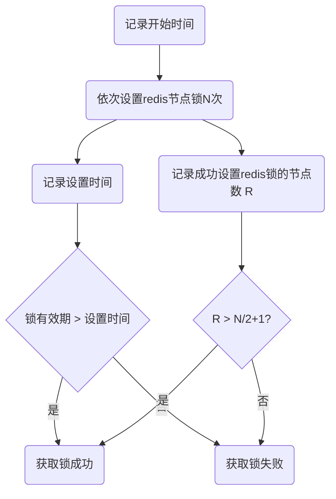
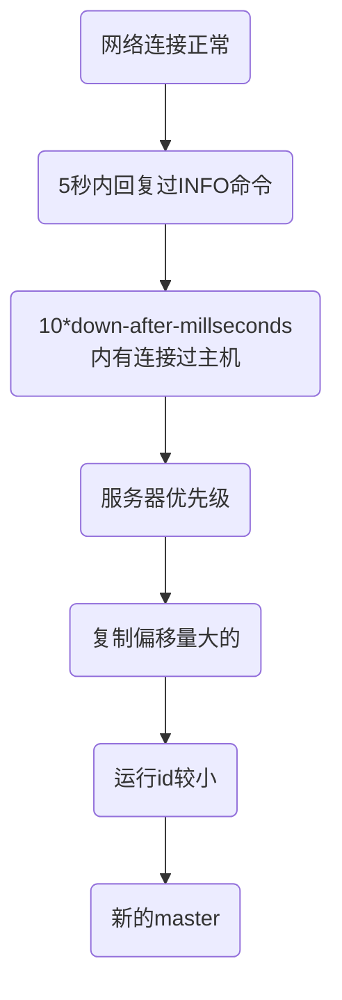

## 微服务架构

### 微服务架构概述


每个微服务团队能够选择自己擅长的技术栈；


Q1:独立部署给业务带来什么好处？

A1:服务可以根据业务划分，不同业务之间可以独立开发，分开上线。和集中化部署相比，不会依赖于整体业务开发完成才能上线，业务拓展能力比较强。可以频繁发布不同的服务，同时保持系统其他部分可用。

Q2:独立数据源给微服务带来什么挑战？


### 微服务与SOA的区别

**SOA**：面向服务的架构。服务之间通过相互依赖最终提供一系列的功能。每个服务独立存在于系统之中，各个服务之间通过网络调用。

**微服务**：它和SOA类似，是在SOA的基础上做的升华。但微服务架构强调的重点是==业务需要彻底的组件化和服务化==。业务需要更细粒度的拆分成可以独立开发、运行、部署的小应用。


主要区别

| 区别点           | SOA          | 微服务                     |
| ---------------- | ------------ | -------------------------- |
| **拆分依据**     | 大块业务逻辑 | 单独任务、小块业务逻辑     |
| **耦合**         | 通常是松耦合 | 总是松耦合，高内聚         |
| **适用公司架构** | 任何类型     | 小型、专注于功能交叉的团队 |
| **服务管理**     | 集中管理     | 分散管理                   |


### 微服务的利与弊

**利**

- 可以用微服务的模式来模块化开发业务，让每个团队的边界都很清晰，相互调用；
- 可以独立部署服务
- 技术可以多样性，每个团队可以用自己擅长的技术；

**弊**

- 分布式服务一般都很复杂；
- 测试复杂性很高；
- 最终一致性:  每个团队开发的服务，数据需要保证一致，所以需要同步。
- 运维部署很复杂，维护稳定性也很困难，对运维的要求也很高。要有固定的docker容器，也要有故障演练；


### **企业何时引入微服务架构？**

> 好的微服务架构是演变出来的，不是设计出来的；
>
> 应该设计一个合理的框架，在这个框架下可以慢慢演变出正确的系统；

**前期不建议直接上手微服务**：

1.是前期对业务理解不深，业务不好拆分，而且系统一开始也不会很复杂；

2.是前期微服务投入成本过高，甚至业务模式都没被商业认证，可能开发出来都不会被市场接受，采用微服务代价太大。

3.前期微服务复杂度高，生产力并不高，应该在业务发展的过程中，找到一个点去切换微服务；

**中期逐渐转化成微服务**：

1.业务务不断拓展，复杂度增加，产品本身的生产力会下降

2.团队规模不断扩大，可以有更多的人投入到微服务上；

**总结：**

过早的将一个系统划分成为微服务的代价非常高，尤其是面对新领域的时候。很多时候，将一个已有的系统划分成为微服务，要比从头开始构建微服务简单的多；


### 演进式架构师应该承担的职责

- 愿景

  确保在系统级有一个经过充分沟通的技术愿景，这个愿景应该可以帮助你满足客户和组织的需求；

- 同理心

  理解你所做的决定对客户和同事带来的影响；

- 合作

  和尽量多的同事进行沟通，从而更好地对愿景进行定义、修订以及执行

- 适应性

  确保在你的客户和组织需要的时候，调整基数愿景

- 自治性

  在标准化和团队自治之间寻找一个正确的平衡点

- 治理

  确保系统按照技术愿景的要求实现

成功要靠不断的取舍来实现。总会有一些原因需要你改变工作的方式，但是具体做哪些改变就只能依赖于自己的经验了。


### 微服务的组织架构

> 康威法则: 设计系统的组织以及所产生的架构，等价于企业的组织架构；

~~传统的组织架构：产品部门、用户体验部门、研发部门、测试部门、。。。运维部门等；~~

微服务组织架构：跨职能微服务产品团队 

微服务架构实际上是组织架构的一种重组：从以前的职能部门，转换成跨职能部门的组织架构；

团队人员不再只是"围绕项目建立，当项目结束以后就回到职能部门”；而是围绕着微服务来建立团队，不断的开发迭代，从而提供一个API、平台产品。


微服务核心概念：**端到端 （End to End** **Ownership**）团队内部之间能够形成一个闭环。


每个团队自行负责产品的设计，架构，开发，构建，部署，运维，支持。团队各自发布自己的模块，团队间模块解耦，升级时向下版本兼容，互不影响。一个团队规模大致12人左右。


### 中台战略

中台概念的由来：2013年，马云带领阿里的高管，参观了supercell。一家位于芬兰的移动游戏公司。发现他们公司的虽然团队特别小，但是居然能够在几周时间内就做出一款游戏。其中除了敏捷开发、快速试错以外，其成功还有一个最关键的要素就是supercell的中台能力。supercell的中台架构模式给阿里高管很大的震撼，这也催生了阿里巴巴的中台战略。

阿里中台战略："大中台、轻前台"。通过厚实的中台架构，来向前台输送弹药。让前台业务更加灵活，并且能快速适应市场的需求。


中台：

最后推荐一篇文章：互联网公司中所谓中台是怎么定义的？ -  知乎
https://www.zhihu.com/question/57717433/answer/719218827


### 一个清晰简洁的微服务分层


从业务逻辑上：我们把服务分为`聚合服务`和`基础服务`两层；

`基础服务`主要提供比较基础的、通用的接口服务。这些服务一般都是核心业务，比如港盛的订单服务、账户服务

聚合服务，一般也叫适配服务，BFF。根据业务需要，将多个基础服务组合在一起，或者对服务的返回数据进行相应裁剪。以减少基础服务的重复开发，也避免了客户端过多的请求调用，减少开销。


### 微服务的技术架构模型

6层架构模型


kubernets：资源调度平台

docker：镜像治理


### 服务发现机制

> 消费者发现生产者服务

1. **传统模式：基于LB**


服务上线时，向运维申请域名，运维人员根据域名配置负载均衡，然后提供域名给客户端去调用；

客户端通过域名DNS解析到负载均衡服务器上，从而调用服务；

**缺点：**

- 需要运维人工介入，每加一个服务，都需要去配置一下；

- 负载均衡器很可能是单节点的，如果 LB挂了，所有的服务都可能无法访问；
- 性能会有损失, 因为客户端所有需要访问的服务都必须穿透LB。


2. **进程内LB模式**


`服务提供方(Service Provider)`通过服务注册方式(服务注册表)向外发布服务，并且定期发送心跳，告诉服务注册表我还活着

`服务消费者Consumer`自带LB, 用来支持服务发现和负载均衡功能。LB发现并调用后台服务，同时定期去同步服务注册表中的服务；

好处：

1. 解决了单点的问题，没有集中LB。

2. 同时解决了LB消耗性能的问题，因为都是进程内服务；

缺点：

1.每个进程内有一个独立LB，那么LB需要开发不同的语言版本，支持多种开发语言；

2.升级维护很麻烦；


3. **主机独立LB**


把LB以独立进程部署, 和消费者放在一个主机上；LB可以支持多语言。

可以用容器的方式来部署服务+LB；

> 问题：以容器的方式来部署，是将LB部署在容器上，容器内服务共享？还是部署在容器主机上，所有容器共享？

容器部署的话，建议每个容器部署一个独立进程LB（如Service Mesh），这样隔离性更好，容器内的LB挂了，只影响那个容器，主机上其它容器不受影响。

如果容器共享主机上的独立进程LB的话，则如果主机上的LB挂了，则整个主机上的容器全部受影响。


### Service Mesh

> Service Mesh/服务网格，是一个基础层设施，功能在于处理服务间的通信，职责是负责实现请求的可靠传递；


#### SideCar

首先需要了解一下`SideCar/边车`的设计模式。他主要的作用是用来发现服务，转发客户端的请求，调用服务。

他的设计灵感有点类似于摩托车的边车，它不一定应用程序中的一部分，但是可以连接服务的一部分，也可以放在服务程序的任意一个位置。

看一下Service Mesh中SideCar的架构：


客户端通过简单RCP，来连接到Sidecar服务，Sidecar再通过服务注册中心发现服务，最后将客户端请求代理转发到最终的目标服务；

这里的Sidecar并不是传统意义上的Sidecar，而是Service Mesh单应用场景下的表现形式；

Sidecar和Service Mesh的区别主要有三点：

|          | Sidecar              | Service Mesh        |
| -------- | -------------------- | ------------------- |
| 整体性   | 单组件               | 强调整体的网络      |
| 适用性   | 只能适用于特定的框架 | 可以通用适配        |
| 可选择性 | 可选的，允许直连     | 必须经过ServiceMesh |


多个微服务调用的结构：


Service Mesh在所有的服务下面，负责处理所有的服务连接，这一层也称为：`服务间通讯专用基础设施层`

如果有大量的服务连接，呈现出来的就是一个网格状(Service Mesh)。绿色部分代表应用，蓝色部分代表SideCar。


大量服务连接的网格里，ServiceMesh不再被视为单个进程，而是强调整个代理连接形成的网络；这也是它和Sidecar的不同点。


#### Service Mesh的演变


似乎框架层帮我们解决了微服务的很多问题：负载均衡，限流熔断，安全限制等等。但是每个微服务都需要这些基础的功能，而微服务开发的语言可能又大不相同，并且类似于SpringCloud、Dubbo这些微服务框架也会造成很多痛点。

**痛点1**：门槛高。框架的学习门槛比较高，简单入门比较容易，但是熟练应用和深入了解需要大量的时间。而业务团队的优势往往不是技术，而是业务的理解和对系统的了解。

**痛点2**：功能不全

传统的Spring Cloud、Dubbo框架提供的功能有限，不具备一整套生态系统；基于Spring Cloud的基础版本做完整补充、扩展、加强需要巨大的精力；

**痛点3**: 跨语言

微服务可以采用最适合的语言来编写。理论上说，不同的团队，不同的微服务，可以根据实际情况选择团队最擅长，或者最适合当前应用的编程语言。但是这样就要提供不同语言的框架，实际需要面临巨大的开发工作量，代价极高；

**痛点4**：升级困难

当服务端数以百计起，客户端数以千计起时。服务端升级，客户端可能不会选择升级，那么就必须去兼容每个版本，再加上不同的语言版本，试想下需要消耗多大的精力，投入多少工作量！


借鉴当年TCP/IP的思路，对于服务间通讯，在传统的侵入式框架外，出现了另外一种思路：

既然我们可以把网络通讯的技术栈剥离并下沉为TCP，我们是否也可以用类似的方式来处理微服务中服务间通讯的技术栈。于是出现了上面的演变方案，通过配置文件来实现反向代理，将请求路由到服务；

虽然这个方案很简陋，但是依然有值得借鉴的地方：客户端和服务器端应该隔离，部分功能下沉到中间层来实现请求转发。


Sidecar借鉴了Proxy的模式，但是他的设计局限性很强，表现为**为特定的基础设施而设计**。只适用于特定的框架或者需求场景，很难对外推广。


**第一代Service Mesh**


**第二代Service Mesh**


**总结**

Service Mes应需而生，解决了传统微服务框架带来的4个痛点：

内容高，门槛多；——> 交给Service Mesh，应用只需要关注与业务逻辑；

服务治理功能不齐全； ——> Service Mesh功能齐全

升级困难； ——> 可单独升级

跨语言； ——> 客户端简化，通过rest或其他简单远程调用方式；服务端只需要做服务注册的事情；


### API网关

> 为什么要使用API网关？
>
> API网关是一个系统与外界连接的入口。可以理解为一个企业的大门，用来做安全防护，限制访问，请求路由等工作；


网关的作用：

网关服务最主要的作用，是为内部服务提供统一的对外出口，向外部访问者提供统一的服务入口。可以屏蔽内部的服务细节。

网关可以对外界访问做一个安全防护，比如限制外部访问、统一鉴权、熔断等。


最上层是用户接入设备

通过负载均衡器（一般网关服务都是无状态服务，无论通过哪一个网关服务，都可以提供同样的服务。所以做了一层负载均衡，避免单点故障）

转发到网关服务，从而最终请求各个微服务。

- **反向路由**：将内部的服务转化成为对外服务
- 安全认证：用于检测请求，识别身份
- 限流熔断：防止大流量的访问
- 日志监控：记录日志

#### 无状态服务VS有状态服务

无状态服务：对于单次的请求，不依赖于其他请求数据就能完成。也就是，客户端每次发过来的请求，服务端只需要根据这次请求传入的信息，可能再加上一些外部的依赖服务（如数据库），就可以完成对请求处理，服务本身不存储任何信息。

有状态服务：在服务端保存了一些数据信息，请求的先后顺序有一定的关联性。比如发送验证码和校验验证码；


### Zuul网关架构


框架的核心特点：

​	1. 3层Filter；

​	2. 可插拔Filter配置；

​	Zuul的Filter可以很灵活的配置。开发者开发完Filter过滤器后。

​	a. 首先通过publisher存储在`Filter Database`中，

​	b. 通过poller轮训上传到`Filter Directories`里。

​	c. 上层的`Filter File Manager`会定期扫描`Filter Directories`，

​	4. 最后通知loader将Filter加载到Runner里，应用起来；


核心模块：

​	Pre Filters前置路由：请求进来，先经过`Pre Filters`, 例如可以做日志记录；

​	Routing Filters路由：主要作用就是路由并找到具体的微服务，请求服务；

​	Post Filters后置路由：主要是处理需要返回给客户的消息;

​	Error Filters: 所有路由拦截的过程中出现的错误，都可以抛给Error Filter来统一处理，最后交给Post Filters来返回；


### Netflix的微服务路由发现机制


Netflix服务注册中心组件： Eureka

Netflix网关组件：Zuul

两个组件支撑了整个netflix的路由发现体系：

第一层服务发现机制：

基础服务启动时，会向Eureka注册服务，内部的聚合服务需要用到基础服务时，通过`服务注册中心`来发现服务。

第二层服务发现机制：

聚合服务也会向注册中心注册服务，网关层作为客户的统一接入点，会通过注册中心的路由表，来找到对应的聚合服务。

> 问题：现在市面上有很多组件，比如Zookeeper,Consul,还有nginx等等。那么用这些组件, 该如何做微服务发现机制呢?


### 配置中心

> 问题：问什么需要配置中心？

大部分时候，我们的配置都是写在配置文件中的。会有一些缺点或者会造成一些问题：

1. 配置不标准, 格式不统一
2. 生效周期长
3. 配置被修改了并不知道，往往部署到线上了才发现；
4. 而且没有审计功能,  很难追溯谁调整的，只能查看代码记录；

> 一般有哪些可以配置的项？

- 数据库连接字符串
- 超时参数
- 业务开关
- 功能开关等

#### 基本原理


开发人员可以对配置中心更改配置, 然后服务可以实时更改自己配置。
2种读取配置的方式：(各有优劣)

1. 自己不断的去拉,然后更新自己(这个可以保证拉到,这次没拉到,下次再拉)
2. 配置中心自己主动推送(这个可以实时,但是没推成功,就不是实时)


#### Apollo配置中心架构


### RPC VS REST

|             | RPC                                                  | REST                                      |
| ----------- | ---------------------------------------------------- | ----------------------------------------- |
| 耦合性      | 强耦合                                               | 松散耦合                                  |
| 消息协议    | 二进制协议                                           | JSON 、XML文本协议                        |
| 通讯协议    | TCP                                                  | HTTP/HTTP2                                |
| 性能        | 高                                                   | 低于RPC                                   |
| 接口契约    | thrift、profobuf                                     | Swagger 接口定义                          |
| 客户端      | 强类型客户端，可以支持多语言客户端                   | 一般http client可访问，支持多客户端语言。 |
| 案例 - 框架 | Dubbo, motan, Tars, grpc, thrift                     | SpringMVC, SpringBoot, jax-rs, dropwizard |
| 开发者友好  | 客户端比较方便，但是二进制消息不可读。调试比较麻烦； | 文本可读，通过浏览器可访问                |
| 对外开放    | 对外暴露时，一般需要转换成REST协议的形式             | 直接对外开放                              |

Dubbo —— 阿里

grpc —— google


### 微服务治理

> 服务治理一般包含哪些内容？


- **服务发现**：好的微服务框架需要能够有服务发现机制；

- **负载均衡**：大规模的服务发布需要负载均衡，保证服务不会单点故障；也可以应用到服务升级上，蓝绿升级。

- **监控**

  - **日志监控**：日志监控、日志查看用来排查线上问题；
  - **Metrics**：多角度去监控服务
  - **调用链监控**：在错综复杂的微服务系统中，调用逻辑往往很复杂，需要通过调用链监控系统查看具体哪个环节出现问题；

- **熔断限流**：高并发情况下，任意一个服务崩溃都会导致整个系统的崩溃；所以需要加入限流熔断，避免高频率的访问；

- **安全**&**访问控制**：网关的基础功能，限制功能访问；

- **REST**/**RPC**: 支持两种协议的访问；

- **统一异常处理**：统一规范错误模式，方便查看日志。

- **文档**：对外对内的API文档输出，最好能自动生成；

- **配置集成**：通过配置中心，来实现动态修改配置，实时发布服务；

  

### 服务监控体系


> 5个层次，从下往上依次为

**基础设施监控**: 一般都是服务运营商去进行监控；

**系统层监控**：主要监控对象为物理机、虚拟机、操作系统，监控指标一般是cpu、内存、网络、硬盘等；

**应用层监控**：应用层一般针对服务进行监控，主要关心`服务接口`是否可用、平均响应时间、（qbs）每秒钟处理请求数量、是否存在慢查询等等。

**业务监控**：主要监控核心业务，比如看下下单情况、注册登录情况。产品部门会针对业务层的监控数据进行分析，来判断产品是否满足市场需求、推广的效果是否符合预期等；

**端用户体验监控**：这个一般就是针对客户端进行监控。比如对客户端版本进行监控，接入的运营商是移动还是电信等等。用户体验监控主要是产品经理比较关心的地方；


#### 监控内容

- 健康检查
- 告警系统
- 调用链监控
- 日志监控
- Metrics监控


#### 监控方案


**方案理解：**

微服务一般会在进程内部或者主机上加一个`agent（代理）`，这个代理会去收集并分发日志

如果日志量过大，可以通过消息队列（Kafka）做一个缓冲，

所有的日志会通过`ELK`方案，进行全文搜索分析；

同时会通过`Metrics`来监控`度量`，将不同维度的度量数据存储在`InfluxDB` 的时间序列数据库中，Grafana针对数据进行可视化展示。

最后通过一个`健康检查机制`sensu/Nagios/Kubernetes，来去检查微服务的监控情况

**方案技术框架**

> `ELK`是Elasticsearch + logstash + kibana三个结合在起一起缩写；
>
> Elasticsearch是实时全文搜索和引擎分析
>
> logstash是用来搜集、分析、过滤日志的工具
>
> kibana是基于web的图形界面，用于搜索、分析和可视化数据


### 调用链监控

> 调用链监控来源于google的一篇论文：Google Dapper


如图所示：http请求 经过 web 容器，再在内部经过一些列服务转换，进入service1 ，再到 DB 再返回；

每个请求经过一层调用，都会生成一个`span`;

每个span，会生成自己的trace_id，span_id, 并且关联上层的parent_id. 这样，通过这3个id的关系，来生成调用链；

#### 监控框架工具：


### 熔断限流

#### Hystrix框架


封装请求：熔断、隔离、限流、降级

如果打开了限流措施，直接短路。

如果线程满了

如果运行超时：降级；


### 容器技术


### 蓝绿部署和灰度发布


蓝绿部署：蓝色代表是老版本，绿色代表是新版本；

灰度发布：不是一次性把流量全部切换到新版本上，而是先切一部分流量，确保没问题后，再全部切换到新版本上。


微服务 

Mesos的服务框架

Master - Slaver 模式；


------


# JVM

> https://www.processon.com/view/5c749debe4b0f9fba6921d15?fromnew=1

### JDK、JRE、JVM的区别

JDK包含JRE，JRE包含JVM。

JDK是Java开发的工具包（Java Develop Kit）

JRE提供了Java运行的环境（Java Runtime Enviorment)

JVM则是一台虚拟机，他从软件的层面上，在虚拟机内部帮我们把JDK编译出来的class文件，转换为可以被当前操作系统识别的机器码。换句话说，他内部帮助我们屏蔽了一些操作系统层面上的区别，让我们的程序能够**跨平台运行**。

JVM包含了3个部分：类加载器子系统、运行时数据区、执行引擎。


### JVM内存区域

运行时数据区是JVM的核心，整体的结构如下：


**Java栈**（虚拟机栈）：Java会给每一个运行的线程分配一个栈，这个栈是线程私有的。

​	**栈针**：在栈里面，存放有很多栈帧，每个方法运行时都会产生一个栈帧入栈，保证每个方法有自己独立的作用域；栈帧里存储了java方法运行时的相关信息（局部变量表，操作数栈，动态链接，方法出口等）


​	**局部变量表**：保存方法内部的临时变量，比如：a=1;b=2;c=new Math()`等

​	**操作数栈**：jvm执行引擎会用到，存放一些操作符运算；

**本地方法栈**：和Java栈的概念类似，也是每个线程私有。它里面存放的都是一些native的方法信息。

**程序计数器：**也是线程私有，作用主要是为了记录当前线程运行到哪一行代码。因为每个线程的执行都依赖于CPU的调度，是需要抢占CPU资源的，所以线程经常会因为失去CPU资源而被挂起。当线程重启获取到运行资源时，就要根据程序计数器来继续执行。

**堆**: 堆内存是线程共享的，用来存放java运行时创建出来的对象，对象的“内存地址”存放在栈局部变量表里面。

​	堆内存结构包括：新生代、form、to、永久代；


**方法区**：方法区里存放的是类元信息、静态变量、常量等。

​	静态变量

​	常量： static final的

​	类元信息：一个类的组成信息。（类名、类修饰符、方法名等）


### GC垃圾回收机制

Java垃圾回收分为minor回收和major回收，两种回收的机制不同，回收的对象主体在堆内存模型中也不一样。

👆Java堆内存模型分为新生代和老年代：

新生代大概占堆内存的1/3，老年代占内存的2/3。

**新生代**：

由Eden和Survior Space组成。初始大小由-Xmn参数设定。

工作机制：

Eden区大约占新生代内存空间的8/10，java new出来的对象都会先放入到Eden区；当Eden内存不够时，jvm会启动一次minor gc。Minor GC会把那些内存中不再有引用的对象都回收（回收算法下面会讲到），而那些有用的对象会被全部移动到`S0 Space`。第二次gc的时候，会把Eden区和S0 Space里存活的对象一起移动到S1 Space。

对象在s0 space和s1 space来回移动，每次转移时，这些对象都会更新gc的年龄标志。当gc年龄达到15时，会将该对象移动到老年代。

如果s0和s1的内存区域放不下存活的对象时，会去老年代内存中借用内存，等下一次gc后再还给老年代。而老年代也会为了确保minor gc操作能完成，预留了一部分内存作为保留区域。这种行为成为：`新生代搜集担保`。如果预留操作无法完成，也会触发Major GC。

**老年代**：

老年代区域中的对象存活率很高，一般回收的周期很长。

Major GC因为要对所有的对象进行回收，很消耗时间，所以要尽量避免Major GC。jvm调优的过程中，很大一部分工作就是减少Full GC的次数。


### GC回收判断

#### ~~引用计数法~~

#### 可达性分析

#### GC Roots根

java的垃圾回收机制中，判断1个对象是否可被回收，并不是看有没有对象对其引用，而是通过`可达性分析`，看这个对象有没有到GC Roots的引用链相连。怎么理解这段话？就是说，从GC Roots根向下找，看看能不能找到一条路，达到这个对象。如果找到了，说明是有引用链相连的。


可以作为GC Roots根的对象：

- 虚拟机栈（栈帧中的本地变量表）中引用的对象；任意方法里C c = new C();
- 方法区中静态变量引用的对象；static B b = new B();
- 方法区中常量引用的对象； static final A a = new A();
- Native方法引用的对象；


#### finalize抢救


#### GC log分析

免费的GC日志图形分析工具推荐下面2个：

- [GCViewer](https://juejin.im/post/[https://github.com/chewiebug/GCViewer](https://github.com/chewiebug/GCViewer))，下载jar包直接运行
- [gceasy](https://gceasy.io/)，web工具，上传GC日志在线使用


# JMM


# 多线程

### 多线程应用场景


### 守护线程与非守护线程

### 多线程的几种状态

多线程的生命周期：


### 保证线程的执行顺序

### 使用多线程分批处理信息

### 多线程通信方式

- #### wait & notify

**使用场景**：现在有A、B两个线程互斥，我们希望线程B运行到某一个状态通知线程A运行。如果线程A执行时，还没有达到预期的状态，先让线程A等待，等线程B到达这个状态后再通知线程A运行。

如图所示：


==注==：1.notify唤醒的线程不会在调用notify的一瞬间就执行，因为那个时候，线程的锁还没有被释放，其他线程还没有办法获取该实例的锁。

2.只有拥有锁的线程才能调用notify方法来唤醒其他线程；


- #### CountDownLatch 计数门闩

**应用场景**：CountDownLatch内部就是1个计数器。当线程A需要等待其他n个线程完成任务之后才能执行时，可以通过CountDownLatch来实现。

**使用介绍**：

```java
/**
* 构造方法：参数count为计数值
*/
public CountDownLatch(int count) {  };

/**
* 调用await()方法的线程会被挂起，它会等待直到count值为0才继续执行
*/
public void await() throws InterruptedException { };

/**
* 可以等待一定的时间，如果count依然没变成0，还是会继续执行
*/
public boolean await(long timeout, TimeUnit unit) throws InterruptedException { }; 

/**
* 每次调用都会将count值减1
*/
public void countDown() { };  //
```

**实际使用**：

>启动2个线程，线程1不断的add，线程2去监听容器的size，当size值=5时，终止线程2.

```java
CountDownLatch countDownLatch = new CountDownLatch(5);
new Thread(() -> {
  try {
    System.out.println("线程2开始");
    countDownLatch.await();
    System.out.println("线程2结束");
  } catch (InterruptedException e) {
    e.printStackTrace();
  }
}, "t2").start();
new Thread(() -> {
  System.out.println("线程1开始");
  synchronized (lock) {
    for (int i = 0; i < 10; i++) {
      myContainer.add(String.valueOf(i));
      System.out.println("容器增加：" + (i + 1));
      countDownLatch.countDown();
      try {
        Thread.sleep(100);
      } catch (InterruptedException e) {
        e.printStackTrace();
      }
    }
  }
}, "t1").start();
```


### 怎么停止线程


### 线程变量ThreadLocal

> 参考文章：https://www.jianshu.com/p/22be9653df3f

#### 作用

为每一个线程开辟一个单独的内存空间，用来存放线程独享的资源

#### 使用场景

线程需要存放变量，但是又不希望别的线程来修改自己的变量时，可以用ThreadLocal来存储变量的值；

#### 使用方式

```java
private static class MyRunnable implements Runnable {
  // 创建线程变量      
  ThreadLocal<String> threadLocal = new ThreadLocal<>();

        @Override
        public void run() {
            String name = Thread.currentThread().getName();
            threadLocal.set(name + "的ThreadLocal变量");
            try {
                Thread.sleep(1000);
            } catch (InterruptedException e) {
                e.printStackTrace();
            }
            System.out.println(name + ":" + threadLocal.get());
        }
    }

    public static void main(String[] args) {
        Runnable runnable = new MyRunnable();
        new Thread(runnable, "线程1").start();
        new Thread(runnable, "线程2").start();
    }
```

#### 原理

每个线程实例都会有一个threadLocals的变量，用来存放当前线程的ThreadLocalMap；

而当ThreadLocal创建时，会创建好ThreadLocalMap的实例，然后关联到线程t的threadLocals变量上；

每个ThreadLocalMap的key = 当前ThreadLocal对象本身，value是一个任意的值；


所以当ThreadLocal设置值时，当前线程会先拿到ThreadLocalMap，然后为这个map上设置值；

Debug记录

线程1：ThreadLocal@948


线程1：ThreadLocalMap@961


线程2：可以看到ThreadLocal的变量是同一个，但是map会创建新的；


## 多线程安全问题

先看问题：假设有10000张票，启动10个线程，每个线程都去买票；打印每个线程购买票的情况.


```java
/**
 * 场景：假设有10000张火车票
 * 启动10个线程，每个线程都去买票；打印购买情况
 *
 * @author keyang
 * 比较一下ArrayList、Vector、ConcurrentLinkedQueue区别
 */
public class ConcurrentQueue1 {
	
	public static void main(String[] args) {
    // 注解1
//		List<String> tickets = new ArrayList<>();
    // 注解2
//		Vector<String> tickets = new Vector<String>();
    // 注解3
		ConcurrentLinkedQueue<String> tickets = new ConcurrentLinkedQueue<>();
		for (int i = 0; i < 1000; i++) {
			tickets.add("火车票" + i);
		}
		System.out.println(tickets.size());
		for (int i = 0; i < 10; i++) {
			Thread thread = new Thread(() -> {
//				synchronized (tickets) {
				while (tickets.size() > 0) {
					try {
						Thread.sleep(10);
					} catch (InterruptedException e) {
						e.printStackTrace();
					}
//						System.out.println(Thread.currentThread().getId() + "——" + tickets.remove(0));
					String ticket = tickets.poll();
					if (ticket == null) {
						break;
					}
					System.out.println(Thread.currentThread().getId() + "——" + ticket);
				}
//				}
			});
			thread.start();
		}
	}
}

```

注解1：假设用ArrayList来存放队列，那么程序会出现越界的问题。而且还可能会卖出空票。

```verilog
21——null
19——null
17——null
18——null
Exception in thread "Thread-0" Exception in thread "Thread-9" Exception in thread "Thread-3" Exception in thread "Thread-7" Exception in thread "Thread-4" Exception in thread "Thread-1" Exception in thread "Thread-6" Exception in thread "Thread-8" Exception in thread "Thread-2" java.lang.IndexOutOfBoundsException: Index 0 out of bounds for length 0
	at java.base/jdk.internal.util.Preconditions.outOfBounds(Preconditions.java:64)
	at java.base/jdk.internal.util.Preconditions.outOfBoundsCheckIndex(Preconditions.java:70)
	at java.base/jdk.internal.util.Preconditions.checkIndex(Preconditions.java:248)
	at java.base/java.util.Objects.checkIndex(Objects.java:372)
	at java.base/java.util.ArrayList.remove(ArrayList.java:535)
	at com.gs.example.concurrentdemo.ConcurrentQueue1.lambda$main$0(ConcurrentQueue1.java:36)
	at java.base/java.lang.Thread.run(Thread.java:834)
```

因为ArrayList的`remove()`方法本身就没有原子性.

注解2：假设更换容器为Vector。Vector本身是线程安全的，`remove`方法是可以保证原子性的。但是程序中`size`判断和`remove`方法两个操作之间是无法保证不被打断的，所以系统也会判断错误，出现同样的越界问题。

注解3：ArrayList和Vector容器只能通过使用synchronize锁来保证线程安全,，者使用并发容器：`ConcurrentLinkedList`.


### Synchronized关键字

- #### 作用


保证同一时刻，只有1个线程能执行被Synchronize修饰的方法或代码块；

- #### 使用场景

保证线程安全，通过互斥锁、阻塞的形式解决并发问题；

- #### 使用介绍

**修饰代码块**:  需要传入一个被锁的对象。每个线程执行代码块时，需要获取到这个对象的锁。java的所有对象都有1个互斥锁，synchronize方法结束或者抛出异常时会自动释放锁。

**修饰实例方法**：锁的是当前调用方法的实例对象。每个实例对象拥有一把锁，线程调用方法时，必须获取该实例对象的锁。—— 和synchronize(this)的效果一样

**修饰类的静态方法**：锁的是Class类的对象。所以该Class的实例对象在调用该静态方法时，共用同一把锁。因为类只有1个，静态方法在内存中也只有1个


**不同锁之间的区别：**

| 类型   | 锁的对象  | 锁的数量                      | 表现形式 |
| ------ | --------- | ----------------------------- | -------- |
| 对象锁 | 实例对象  | 多个（1个类可以有多个实例）   | 普通方法 |
| 类锁   | Class对象 | 1个（因为1个类只有1个类对象） | 静态方法 |

**Demo**：

```java
public class Test{ 
    // 对象锁：形式1(方法锁) 
    public synchronized void Method1(){ 
        System.out.println("我是对象锁也是方法锁"); 
        try{ 
            Thread.sleep(500); 
        } catch (InterruptedException e){ 
            e.printStackTrace(); 
        } 
    } 
 
    // 对象锁：形式2（代码块形式） 
    public void Method2(){ 
        synchronized (this){ 
            System.out.println("我是对象锁"); 
            try{ 
                Thread.sleep(500); 
            } catch (InterruptedException e){ 
                e.printStackTrace(); 
            } 
        } 
    } 
      
      // 类锁：形式1 ：锁静态方法
    public static synchronized void Method1(){ 
        System.out.println("我是类锁一号"); 
        try{ 
            Thread.sleep(500); 
        } catch (InterruptedException e){ 
            e.printStackTrace(); 
        } 
    } 
 ｝
```


### ReentraLock 可重入锁

#### **使用场景**

1.替代synchronize的锁的方法；通过lock和unlock来实现synchronize的功能；

2.可以使用trylock尝试获取锁。当没有获取到锁时，不进行业务逻辑处理；

3.可以使用lockInterruptibly方法来响应线程的interrupt方法，避免线程因为无法获取锁而无法被打断；

4.通过绑定condition，可以实现对某一类线程的定向通知。

#### 使用介绍

**lock()**:  lock方法会获取锁，如果没有获取到就一直等待；

**tryLock()**:  tryLock不会等待，而是即返回获取锁的结果。获取到锁返回true，没有会返回false。

**lockInterruptibly()**:  这个方法也会一直等待锁的获取，和lock不同的是，我们可以通过thread.interrupt方法时，让线程响应中断，不再继续等待。

**unLock**():  释放锁，==使用lock一定要注意手动释放锁==

**newCondition**():  可以创建多个condition对象，实现await和signal组合。

#### Condition

**作用**：condition存在的意义是为了实现类似 object.wait()和object.notify()的功能。wiat和notify方法可以让线程等待、被唤醒。condition也一样，但是它可以更加有针对性的去让某一类线程被唤醒。

**使用介绍**：

await():  让当前线程进入condition的等待队列

signal()：唤醒condition队列上的某一个线程

signalAll(): 唤醒condition队列上的所有线程；

#### Demo

1.实现公平锁

```java
ReentrantLock reentrantLock = new ReentrantLock(true); // 公平锁
Runnable runnable = new Runnable() {
  @Override
  public void run() {
    for (int i = 0; i < 100; i++) {
      reentrantLock.lock();
      try {
        System.out.println("线程"  + Thread.currentThread().getName() + "获取锁");
      } finally {
        if (reentrantLock.isLocked()) {
          reentrantLock.unlock();
          //						System.out.println("线程" + Thread.currentThread().getName() + "释放锁");
        }
      }
    }
  }
};
new Thread(runnable, "t1").start();
new Thread(runnable, "t2").start();
```

如果ReentrantLock构造函数传入的是true，那么使用的是公平锁，打印结果会呈现线程1和线程2交替获取到锁的样子；

### 

2.ReentraLock实现阻塞队列的模式：

> https://gitee.com/dendi.ke/thread-demo/blob/master/src/main/java/com/gs/example/producerandconsumer/ProducerAndConsumerDemo2.java


### 多线程死锁

**死锁的原因**

主要是因为线程锁的等待：比如有2个线程，都需要获取2把锁才能执行。线程1获取了锁A，线程2获取到了锁B。那么线程1不断的在等锁B，线程2不断的在等锁A，就会导致死锁。

模拟的多线程死锁Demo：


java内存模型

volatile可见性

atomicInteger原子类


线程通信


## 并发容器

### Map

HashMap是线程不安全的

ConcurrentMap、ConcurrentSkipListMap 


队列：ConcurrentLinkedQueue


### List

ArrayList是线程不安全的，多个线程同步add，会出现添加丢失的问题；

因为ArrayList的add方法不是原子操作, 可能会出现数组越界或者数据重复放在一个位置上问题；

```java
public boolean add(E e) {
  ensureCapacityInternal(size + 1);
  elementData[size++] = e;
  return true;
}
```

Vector是线程安全的；


### 阻塞Queue

**LinkedBlockingQueue**

```java
/**
 * 需求：使用blockQueue，模拟生产者和消费者
 * @author keyang
 */
public class LinkedBlockQueue {
	
	private static LinkedBlockingQueue<String> queue = new LinkedBlockingQueue<>();
	
	public static void main(String[] args) {
		Random random = new Random();
		for (int i = 0; i < 2; i++) {
			new Thread(() -> {
				for (int j = 0; j < 100; j++) {
					try {
						queue.put(j + "");
						Thread.sleep(random.nextInt(1000));
					} catch (InterruptedException e) {
						e.printStackTrace();
					}
				}
			}, "p" + i).start();
		}
		
		for (int i = 0; i < 5; i++) {
			new Thread(() -> {
				while(true) {
					try {
						// 如果queue空了，会自动阻塞等待
						String str = queue.take();
						System.out.println("消费者取出了" + str);
					} catch (InterruptedException e) {
						e.printStackTrace();
					}
				}
			}, "c" + i).start();
		}
	}
}
```


**ArrayBlockingQueue**

> ArrayBlockingQueue是可以设定界限的

**方法区别**：

put会在队列满的时候，阻塞队列的加入。

add会在队列满的时候抛出异常

offer会返回到底是加入成功或者失败；


**DelayQueue**

应用场景： 处理一些定时任务。比如电商系统中的超时订单自动关闭；

使用介绍：DelayQueue队列里添加的item需要实现Delayed接口，实现2个方法：getDelay、compareTo

```java
public class DelayQueueDemo {
	static BlockingQueue<MyTask> queue = new DelayQueue<>();
	private static class MyTask implements Delayed {
		private long time;
		/**
		 * 返回当前的延迟时间, long类型
		 * @param timeUnit
		 * @return
		 */
		@Override
		public long getDelay(TimeUnit timeUnit) {
			return timeUnit.convert(time - System.currentTimeMillis(), TimeUnit.MILLISECONDS);
		}
		/**
		 * 比较两个task的超时时间
		 * @param delayed
		 * @return
		 */
		@Override
		public int compareTo(Delayed delayed) {
			return (int) (this.getDelay(TimeUnit.MILLISECONDS) - delayed.getDelay(TimeUnit.MILLISECONDS));
		}
		public MyTask(long time) {
			this.time = time;
		}
		@Override
		public String toString() {
			return time + "";
		}
	}
}
```


> 附：其他的定时任务解决方案；
>
> 1. 使用数据库定时任务，每隔几秒扫描订单表，找出超时订单后关闭。
> 2. 使用spring的@Scheduled注解启动定时任务或者使用Quartz任务管理器，定时触发任务，处理超时订单。
> 3. 使用消息中间件，通过mq提供的延迟消息队列，下单后往延迟消息队列中发消息，超时后，消费端会接收到一条延迟的订单消息，并做相应处理。
> 4. 按需处理。在用户查询的时候，检测订单是否超时，若超时，则关闭订单


**LinkedTransferQueue**

transfer方法必须直接传递给消费者，否则方法会阻塞住。

take方法如果没有取出数据也会被阻塞。

```java
TransferQueue<String> queue = new LinkedTransferQueue<String>();
		new Thread(() -> {
			try {
				System.out.println(queue.take());
			} catch (InterruptedException e) {
				e.printStackTrace();
			}
		}, "t1").start();
		try {
//			boolean a = queue.tryTransfer("transfer demo", 2, TimeUnit.SECONDS);
			queue.transfer("transfer demo");
		} catch (InterruptedException e) {
			e.printStackTrace();
		}
	}
```


**SynchronousQueue**

> 这个阻塞队列的容量是0；需要先启动消费者，
>
> take方法会阻塞;
>
> put方法需要马上被拿走，否则进入阻塞状态。底层也是用TransferQueue来实现的;

```java
public class SynchronousQueueDemo {
	
	static SynchronousQueue<String> queue = new SynchronousQueue<>();
	
	public static void main(String[] args) {
		new Thread(() -> {
			try {
				System.out.println(queue.take());
			} catch (InterruptedException e) {
				e.printStackTrace();
			}
		}, "t1").start();
		try {
//			queue.put("SynchronousQueue");
			boolean offered = queue.offer("SynchronousQueue", 2, TimeUnit.SECONDS);
			System.out.println(offered);
		} catch (Exception e) {
			e.printStackTrace();
		}
	}
}
```


## 线程池

### 1.线程池概述

**线程池作用**：可以避免线程的频繁的创建回收，减少系统的开销；

**API介绍**：ThreadPoolExecutor

**核心参数**：

| 参数            | 意义                     | 说明                                   |
| --------------- | ------------------------ | -------------------------------------- |
| corePoolSize    | 核心线程数量             | 默认情况下，主线程一直存在             |
| maximumPoolSize | 最大线程数量             | 当线程达到最大数量后，后续任务会被阻塞 |
| keepAliveTime   | 线程空闲时间             | 超过这个时间，非主线程会被回收         |
| unit            | 空闲时间单位             |                                        |
| workQueue       | 任务队列                 | 用来存储execute传入的任务              |
| threadFactory   | 线程工厂                 | 用来创建线程任务，可以指定线程名       |
| rejectHandler   | RejectedExecutionHandler | 当线程被拒绝时，放入的队列；           |

```java
/**
 * 线程池管理器
 * @author keyang
 *
 */
public final class ThreadPoolManager {
 
 static ThreadPoolManager threadPoolManager = new ThreadPoolManager();
 
 static final int CORE_POOL_SIZE = 4;
 static final int MAX_POOL_SIZE = 5;
 static final int KEEP_ALIVE_TIME = 5;
 private static final int SIZE_WORK_QUEUE = 1;
 
 
 private ThreadPoolManager() {
 }
 
 public static ThreadPoolManager getInstance() {
  return threadPoolManager;
 }
 
 /**
  * 用来存放排队的任务
  */
 private Queue<Runnable> mTaskQueue = new LinkedBlockingQueue<>();
 
 private final RejectedExecutionHandler myRejectHandler = new RejectedExecutionHandler() {
  
  @Override
  public void rejectedExecution(Runnable r, ThreadPoolExecutor executor) {
   mTaskQueue.offer(r);
  }
 };
 
 private ScheduledExecutorService scheduledThreadPool = Executors.newScheduledThreadPool(1);
 
 /**
  * 定时从排队任务队列中获取任务
  */
 private ScheduledFuture<?> scheduledFuture = scheduledThreadPool.scheduleAtFixedRate(new Runnable() {
  @Override
  public void run() {
   if (!mTaskQueue.isEmpty()) {
    threadPoolExecutor.execute(mTaskQueue.poll());
   }
  }
 }, 0, 5, TimeUnit.SECONDS);
 
 ThreadFactory namedThreadFactory = new ThreadFactoryBuilder().setNameFormat("Ky线程-%d").build();
 
 private final ThreadPoolExecutor threadPoolExecutor = new ThreadPoolExecutor(CORE_POOL_SIZE, MAX_POOL_SIZE, KEEP_ALIVE_TIME, TimeUnit.SECONDS, new ArrayBlockingQueue<Runnable>(SIZE_WORK_QUEUE),
  namedThreadFactory, myRejectHandler);
 
 public void addExecuteTask(Runnable task) {
  if (threadPoolExecutor != null) {
   threadPoolExecutor.execute(task);
  }
 }
 
 protected int getPoolSize() {
  return threadPoolExecutor.getPoolSize();
 }
 
 public void shutdown() {
  mTaskQueue.clear();
  scheduledThreadPool.shutdown();
  threadPoolExecutor.shutdown();
 }
}
```


### 2.创建线程池的方式

Java提供了4种创建线程池的方式, 都是通过Executors的静态方法：

#### FixedThreadPool

特点：只有核心线程数量，线程不会被回收，线程数量是固定的，任务队列没有大小限制

使用场景：控制线程的并发量


#### ScheduledThreadPool

特点：核心线程数量固定，非核心线程数量无限制

使用场景：执行定期的任务

内部队列是DelayedWorkQueue


#### CachedThreadPool

特点：线程池内只有非核心线程，线程最大数量没有限制，线程超过空闲时间后会因为闲置被回收。任务队列采用的是SynchronousQueue，加入的任务会马上被执行。

使用场景：执行大量、耗时少的任务


#### SingleThreadPool

特点：只有一个核心线程，保证线程任务按照顺序执行。任务队列采用的是LinkedBlockingQueue，又只有1个核心线程处理，所以无需处理线程同步问题；

使用场景：多个任务按顺序执行。


这4种线程池底层的原理都是通过ThreadPoolExecutor类来实现的；

另外还有一些特殊的线程池：

#### ForkJoinPool

特点：他的核心理念是分而治之，他的作用就是将一个大任务通过多线程来拆分成多子任务；

使用场景：适合做1个大数的计算；

```java
public class ForkJoinPoolDemo {

	static int MAX = 5000;
	
	private static class MyTask extends RecursiveAction {
		private int start;
		private int end;
		public MyTask(int start, int end) {
			this.start = start;
			this.end = end;
		}
		@Override
		protected void compute() {
			if ((end - start) < MAX) {
				System.out.println(Thread.currentThread().getName() + "从" + start + "到" + end + " = " + getSum(start, end));
			} else {
				MyTask task1 = new MyTask(start, (end + start) / 2);
				MyTask task2 = new MyTask((end + start) / 2 + 1, end);
//				task1.fork();
//				task2.fork();
				invokeAll(task1, task2);//执行给定的任务
				
			}
		}
	}
	
	private static class MyRecursiveTask extends RecursiveTask<Integer> {
		
		private int start;
		private int end;
		public MyRecursiveTask(int start, int end) {
			this.start = start;
			this.end = end;
		}
		@Override
		protected Integer compute() {
			if ((end - start) < MAX) {
				return getSum(start, end);
			} else {
				MyRecursiveTask task1 = new MyRecursiveTask(start, (end + start) / 2);
				MyRecursiveTask task2 = new MyRecursiveTask((end + start) / 2, end);
				task1.fork();
				task2.fork();
				return task1.join() + task2.join();
			}
		}
	}
	
	private static int getSum(int start, int end) {
		int sum = 0;
		for (int i = start; i < end; i++) {
			sum += i;
		}
		return sum;
	}
	public static void main(String[] args) {
		
		System.out.println(getSum(0, 100000));
		
		ForkJoinPool forkJoinPool = new ForkJoinPool();
//		MyTask myTask = new MyTask(0, 100000);
//		forkJoinPool.execute(myTask);
		
		MyRecursiveTask myRecursiveTask = new MyRecursiveTask(0, 100000);
		Future<Integer> future = forkJoinPool.submit(myRecursiveTask);
		try {
			System.out.println("多线程执行结果："+future.get());
			System.in.read();
		} catch (IOException | InterruptedException | ExecutionException e) {
			e.printStackTrace();
		}
	}
}
```

**使用介绍**：ForkJoinPool实例有两种方法：submit和execute，传入的参数类型都是ForkJoinTask；

但是execute方法无返回值，而submit方法会返回一个Future类的实例。

ForkJoinTask是一个抽象类，它有2个子类，特点也是和submit和execute方法对应。

RecursiveAction 的compute方法是无返回值的

RecursiveTask 的compute方法有返回值

**高级使用**：

使用ForkJoin的思想来实现一个快速排序

https://gitee.com/dendi.ke/thread-demo/blob/master/src/main/java/com/gs/example/threadpool/ForkJoinPoolDemo2.java


### 3.线程池原理分析

**线程池逻辑**


先判断`线程数量`是否达到`核心线程池数量`最大限制；

再判断线程的`任务队列数量`是否已满

最后再判断`线程数量`是否满足`最大线程数量`限制


**线程池关闭原理**：

a. 遍历线程池中的所有工作线程
b. 逐个调用线程的interrupt() 中断线程（注：无法响应中断的任务可能永远无法终止）


**关闭线程池方法**：

- shutdown（）

- shutdownNow（）

**二者区别**：

- shutdown：设置 线程池的状态 为 SHUTDOWN，然后**中断**所有没有正在执行任务的线程

- shutdownNow：设置 线程池的状态 为 STOP，然后尝试**停止**所有的正在执行或暂停任务的线程，并返回等待执行任务的列表


**使用建议**：

一般调用shutdown，正常的关闭线程池，

若任务不一定要执行完，则调用shutdownNow()


### 4.线程池合理数量配置


### 5.ExecutorService解析

#### Executor接口

```java
package java.util.concurrent;

public interface Executor {
  // 执行任务
  void execute(Runnable var1);
}
```

顶层接口，可以调用execute(Runnable r)的方法。


#### ExecutorService接口


#### Callable接口

类似于Runnable接口，区别是Callable里面是call() 方法，返回一个泛型。Runnable里面试run()方法，没有返回。


## 线程锁

>参考：https://zhuanlan.zhihu.com/p/71156910?utm_source=wechat_session&utm_medium=social&utm_oi=722156590005776384

java里面锁主要的作用就是解决多线程的安全性问题；java里有2种加锁的方式：

1.synchronize关键字。这种方式写代码很简单，但相对的，它使用锁的级别也很高；如果对性能没有要求，那么一般都会用synchronize关键来加锁

2.Lock实现类。另一种方式就是用java的`Lock`。Lock是一个接口，她的实现类在代码层面实现了锁的功能。常用的实现类如下：

ReentrantLock类，ReadLock类，WriteLock类；


### Synchronized  和 lock的区别

synchronize是java的关键字，可以用来修饰方法、代码块等。主要目的是保证方法或者方法块是线程安全的。

lock是java提供的一个接口，他有很多实现类、常用到的比如ReentantLock、ReentraReadWriteLock等。它们可以灵活的使用，主要也是保证线程安全。

手动使用lock需要注意几点：

1.lock必须手动释放unlock，而synchronize会自动释放锁；

2.lock可以实现公平锁，而synchronize是非公平的

3.lock的获取可以灵活判断，synchronize的锁获取只能一直等待。


### 悲观锁&乐观锁

锁的一种宏观分类方式。是指在并发的情况下，两种策略；

**悲观锁**：当多个线程有竞争关系时，我们总是认为某个共享数据会被其他线程修改（**很悲观**）；所以需要用到共享数据的线程就去把数据加一把锁，这样别的线程就只能等待当前线程释放锁后才能使用；

**乐观锁**：当线程修改某一个数据时，总认为当前数据不会被别的线程修改，所以不会去加锁（**很乐观**）。如果线程需要更新数据，会去检查从数据读取到更新这段时间类，数据有没有发生修改。如果这期间数据没有变化，那么就执行更新操作；否则回滚操作，重新读取更新一遍，并重复上次检查；

**使用场景比较**：

乐观锁一般适用于**写比较少**的情况下，这样线程冲突真的很少发生，可以省去加锁的开销；

悲观锁则比较适合冲突较多的情况；


### CAS无锁机制

乐观锁的底层机制就是CAS机制：**Compare and Set**

1. 首先比较值。比如读取到一个值为A，如果在将A更新为B的过程中，检查A是否发生了变化。
2. 如果相同，那么执行set操作，将值更新为B；否则不执行操作，重新读取值；

上面两步是原子性的，在CPU看来是一步操作；

乐观锁的机制就是CAS的重试算法，整个过程没有“加锁”和“解锁”操作，所以乐观锁策略也被称为**无锁编程**。

```java
// 伪代码
	public volatile int value;

    public int getValue() {
        return value;
    }

    public final int getAndIncrement() {
        for(;;) {
            int current = getValue();
            int next = current + 1;
            // CAS操作
            if (compareAndSet(current, next)) {
                return current;
            }
        }
    }

    public final int getAndDecrement() {
        for (;;) {
            int current = getValue();
            int next = current - 1;
            if (compareAndSet(current, next)) {
                return current;
            }
        }
    }
```


### 自旋锁

当线程占用某一个锁时，其他的线程会一直不断的循环获取锁；怎么理解这个概念？需要先了解一下java的synchronize锁升级机制：

#### synchronized锁升级：偏向锁 → 轻量级锁 → 重量级锁

初次执行到synchronize代码块时，使用的是偏向锁。

当其他线程也进入到synchronize代码块时，如果获取不到锁，就会进入等待状态。锁会升级为轻量级锁，也就是`自旋锁`

自旋锁也有限制，因为线程不断的空循环也会消耗性能。所以当线程循环的次数超过一定次数，线程会进入挂起状态等待被唤醒，自旋锁会升级为重量级锁。后面的线程当发现锁级别是重量级锁时，直接挂起。


### 可重入锁

> 可以重复获取的锁；

synchronize是可重入锁。当1个线程执行某一个synchronize代码块时，它会先获取到对象的锁。如果在这个代码块中还调用了另一个synchronize的方法，该线程就需要再次申请这个对象的锁。java里是允许连续两次申请synchronize锁，释放锁时也是依次释放；

Java还提供了一个ReerantLock的实现类：`java.util.concurrent.locks.ReentrantLock`


### 可中断锁


### 读写锁

读写锁是一对儿锁。一个`读锁`和一个`写锁`

**读锁**：共享锁；

**写锁**：互斥锁；

线程读取数据时候，知道自己是需要做==更新操作==还是做==只读操作==。当需要更新时，加写锁，这样别的线程**无论是读取还是写入都会阻塞**。当需要读取时，加读锁，其他线程如果也要加读锁，不需要等待，可以直接获取，但是**读锁计数器要+1**。


## 多线程设计模式

### 线程安全的Singleton

```java
/**
 * 线程安全的单例模式
 * @author keyang
 */
public class SingletonDemo {
	
	private static SingletonDemo singletonDemo = null;
	
	private SingletonDemo() {
	
	}
	
	public static SingletonDemo getInstance() {
		
		if (singletonDemo == null) {
			synchronized (SingletonDemo.class) {
//			singletonDemo = new SingletonDemo();
				try {
					Thread.sleep(10000);
				} catch (InterruptedException e) {
					e.printStackTrace();
				}
			}
		}
		return singletonDemo;
	}
	
	public static void main(String[] args) {
		for (int i = 0; i < 1000; i++) {
			new Thread(() -> {
				SingletonDemo singletonDemo = SingletonDemo.getInstance();
				System.out.println(singletonDemo.hashCode());
			}).start();
		}
	}
}
```


# 注解

1.注解概述

2.自定义注解

3.使用注解实现ORM框架(对象关系映射)

设计模式

饿汉式写法

工厂模式

代理模式

静态代理

JDK动态代理

CGLIB动态代理


# 网络通信

1.网络通信概述

2.TCP与UDP区别

3.UDP发送消息

4.TCP三次握手

5.TCP协议发送客户端与服务端

6.使用多线程支持多个线程同时访问


​	

IO与NIO的区别

Buffer的数据存储

make与rest用法

直接缓冲区与非缓冲区区别

分散读取聚集写入

编码格式


阻塞IO与非阻塞IO的区别

NIO客户端与服务端


# Netty框架 (游戏服务器)

Nettty服务端

Netty客户端


长连接与短连接区别

粘包与拆包

序列化


## 内存

内存结构——java

堆溢出

栈溢出

内存溢出与内存泄露的区别


## HTTP


## 数据库

mysql概述

mysql优化方案

数据库三大范式

分库分表

水平分割取模算法

索引概述

索引底层实现原理

普通索引&唯一索引区别

sql语句优化

mysql高可用

mysql主从复制原理

mysql读写分离概述

mycat读写分离


## 事物

事物概述

事物底层原理

事物传播行为

分布式事物


# Redis

### Redis5种基本类型

> String, Hash, List, Set,  ZSet

#### String

重要用法1：**`Expire Key`**

> **应用场景**

1、限时的优惠活动信息

2、网站数据缓存（对于一些需要定时更新的数据，例如：积分排行榜）

3、手机验证码

4、限制网站访客访问频率（例如：1分钟最多访问10次）  


重要用法2：**`SETNX key value` **

> **应用场景**

1、分布式锁


重要用法3：**`INCR KEY_Name`**

> **应用场景**

1.计数器

假如，在某种场景下有3个客户端同时读取了mynum的值（值为2），然后对其同时进行了加1的操作，那么，最后mynum的值一定是5。


**Key的命名建议**

> redis单个key 存入512M大小

1.key不要太长，尽量不要超过1024字节，这不仅消耗内存，而且会降低查找的效率；

 2.key也不要太短，太短的话，key的可读性会降低； 

3.在一个项目中，key最好使用统一的命名模式，例如user:123:password; 

4.key名称区分大小写


#### Hash

> 应用场景

1、存储一个对象

hash存储对象和string存储的区别

- stirng存储主要有2种方案：一种是用对象的id作为key，用对象的json序列化作为value。还有一种是用对象的id+属性名作为key，用对象属性值作为value。

  第一种的缺点是每次修改属性不方便，必须将对象反序列化出来再插入进去。而且需要考虑并发问题；

  第二种确定是key太多，造成存储空间过大；

- Redis提供的Hash很好的解决了这个问题，Redis的Hash实际是内部存储的Value为一个HashMap，并提供了直接存取这个Map成员的接口


#### List

> 应用场景

1、实现队列 lpush rpop 

2、实现堆栈 lpush lpop

3、实现分页 lrange start stop

​		大数据量的分页

4、对大数据进行删减、显示

​		如：关注列表、粉丝列表、留言评价等;

5、任务队列


#### Set

> 应用场景

1、常用于对两个集合间的数据做交集、并集、差集运算：

​	比如微信查看2个人的共同好友；

​	比如微博查看共同关注的人；

​	再高级一点，推荐你关注的人关注了谁；	

2、利用唯一性，统计网站的访问IP；


#### ZSet

> 应用场景

1、排行榜，如查看排名前10的人，或者查看所有人的排名，或者查看某一个分数段的人；

```java
System.out.println("       全部玩家排行榜                    ");
		Set<ZSetOperations.TypedTuple<String>> allPlayerList = redisTemplate.opsForZSet().reverseRangeWithScores(key, 0, -1);
		Iterator<ZSetOperations.TypedTuple<String>> iterator = allPlayerList.iterator();
		while(iterator.hasNext()) {
			ZSetOperations.TypedTuple<String> item = iterator.next();
			System.out.println("玩家ID："+item.getValue()+"， 玩家得分:"+Double.valueOf(item.getScore()).intValue());
		}

// reverseRangeWithScores
// reverseRangeByScoreWithScores
```


### Redis实现分布式锁

方案1：

```java
String lockKey = "product_100_stock";
String stockStr = stringRedisTemplate.opsForValue().get("stock");
// 实现关键是用到了setnx这个命令
boolean result = stringRedisTemplate.opsForValue().setIfAbsent(lockKey, "20");
if (!result) {
  return "locked";
}
int stock = Integer.parseInt(stockStr);
if (stock > 0) {
  stock--;
  stringRedisTemplate.opsForValue().set("stock", String.valueOf(stock));
} else {
  return "error";
}
stringRedisTemplate.delete(lockKey);
return "success";
```

1.如果程序运行中死机了怎么处理？

- 在代码块中加try finally，删除锁
- 增加锁的超时时间；

2.超时时间怎么去定比较合理？不会提前清除锁，从而造成`分布式锁`释放错误。

- 考虑在主线程里，开启一个子线程，去不断的定时轮询延迟锁的时间。主线程结束后，结束子线程；

3.如何避免误删锁？

​	line4:在设置锁的value的时候，设置一个随机值；删除锁时，先比较值，再去删除锁； 


方案2：redission

```
RLock rLock = redisson.getLock(lockKey);
```

1.如果是master-slaver模式的redis架构，会出现什么问题？

- redission写是用master，读是用slaver。如果写的时候，master挂掉，读取的slaver依然可以用，会导致锁一直无法释放，从而导致死锁。 

2.redis分布式锁怎么支持高并发？

Redlock算法：

假设有N个相同的redis节点，每个节点上的redis模式一样，但是互不关联。

1.记录时间戳；

2.为每个redis节点设置的超时时间，以及锁过期时间。 避免服务器挂掉后，客户端仍然去等待服务器响应；(比如5ms)

3.当设置锁时，向每个redis节点上都设置一次；

4.记录成功的节点数，以及累计的用时时间；

5.如果累计时间不超过锁过期时间，并且成功节点数大于总结点数的一半数量；

6.如果累计时间超过了锁的过期时间，那么锁可能已经失效了。或者获取了小于3个锁，必须释放，否则影响其他client获取锁。





### Redis事物

#### 两类错误

- 语法错误

  回滚操作——discard

- 执行错误

  跳过错误继续执行

  

redisTemplate执行

```java
SessionCallback sessionCallback = new SessionCallback() {
  @Override
  public Object execute(RedisOperations redisOperations) throws DataAccessException {
    redisOperations.multi();
    redisTemplate.opsForValue().set(key, "1");
    redisTemplate.opsForValue().decrement(key);
    redisTemplate.opsForValue().set(key, "2");
    redisTemplate.opsForValue().set(key, "6");
    return redisOperations.exec();
  }
};
redisTemplate.execute(sessionCallback);
```


### Redis缓存一致性

1.强一致性——实时同步

查询缓存，缓存不存在查询DB，保存到缓存。

更新缓存时，先更新数据库，再将缓存的数据设置为过期；

注意点：

**缓存穿透**

> 每次查询的时候，数据库都返回空，每次都没缓存数据，结果每次都从数据库中查询

解决方案
从缓存取不到的数据，在数据库中也没有取到，这时也可以将key-value对写为key-null，缓存有效时间可以设置短点，如30秒（设置太长会导致正常情况也没法使用）。这样可以防止攻击用户反复用同一个id暴力攻击

**缓存击穿**

> 某一个热点Key，在某一个时间里，缓存失效了。这时由于并发用户特别多，同时读缓存没读到数据，又同时去数据库去取数据，引起数据库压力瞬间增大，造成过大压力

解决方案

1. 设置热点数据永远不过期；
2. 加互斥锁，只有1个去数据库查询；

**缓存雪崩**

> 缓存中数据大批量到过期时间，而查询数据量巨大，引起数据库压力过大甚至down机。和缓存击穿不同的是，缓存击穿指并发查同一条数据，缓存雪崩是不同数据都过期了，很多数据都查不到从而查数据库。

解决方案：

1.设置不同的过期时间；

2.热点设置不过期


### Redis主从复制

master主节点用来写入数据，slaver子节点用来读取数据，`主节点`定期把数据同步到`从节点`来保证数据的一致性。

#### 主从复制架构

**a)  一主一从**：当`主节点`的“写”命令并发高且需要持久化时，可以只在`从节点`开启AOF（主节点不需要）。

 


**b) 一主多从**：当对"读"的要求比较大时，这种结构比较合适。主节点只负责写入，然后同步到从节点。但是对主节点的影响比较大，因为`主节点`会同步到多个`从节点`，会消耗带宽和内存。


c) **树形结构**：可以解决上面一主多从，主节点压力过大的问题；


#### 数据同步

a) 全量复制：一般用于初次复制场景（第一次建立SLAVE后全量）
b) 部分复制：网络出现问题，从节点再次连接主节点时，主节点补发缺少的数据，每次数据增量同步
c) 心跳：主从有长连接心跳，主节点默认每10S向从节点发ping命令，repl-ping-slave-period控制发送频率

#### 主从的缺点

**a)** 若主节点出现问题，则不能提供服务，需要人工修改配置将从变主。
**b)** `主节点`的写能力单机，能力有限
**c)** 单机节点的存储能力也有限


### 哨兵机制(Sentinel)

> 主要是为了解决主从复制的缺点，自动对节点进行监控。当主节点不可用时，自动将主节点的子节点转换为主节点，并且通知客户端。

#### 1.**高可用**

当主节点出现故障时，由sentinel自动完成故障发现和转移，并且通知应用。


**监控原理**：

1：每10s钟，哨兵向master节点获取一下信息，来确认主从节点的拓扑关系；


2：每2s钟，每个哨兵会向master节点的固定频道上发送主推消息(哨兵对master节点的判断、哨兵获取到的节点信息)。同时，每个哨兵也会去订阅这个固定频道，了解其他哨兵对这个节点的判断。


3：每s钟，每个哨兵也会向其他哨兵以及主、从节点发送ping命令；用来确定节点是否正常；


**下线状态**

1.主观下线：

哨兵每隔1s向其他节点发送ping命令，在down-after-milliseconds有效期内，如果没有响应，就会主观的将这个节点下线；并且向其他节点确认是否都是主观下线的。

2.客观下线：

当主观下线的客户数量超过quorum（quorum = (节点数量/2) + 1）时，则认为节点是客观下线状态。

当节点被哨兵客观下线以后，哨兵会通过选举算法，选出一个哨兵来负责进行故障转移。 每个发现节点客观下线的哨兵都有权限申请成为故障转移的哨兵；选举先到先得，成为故障转移的哨兵会选择一个主节点的从节点作为新的主节点；


**故障转移流程**

1.选举新的主节点



2.将其他节点设置为`新主节点`的从节点


3、通知客户端，新的主节点的ip、port等信息；


### Redis持久化

#### RDB存储

> 默认持久化机制

rdb相当于快照，将内存中的数据以快照的方式保存到二进制文件中，默认文件名为dump.rdb;

优点：

​	保存快，读取恢复快；

缺点：

​	做快照的时候，占用内存高；	

#### AOF

> Append of file，将redis的**写入命令**追加到文件中；

三种aof方式：

- ​	每次写入追加文件 appendfsync always 

缺点：有时我们只关注结果，并不想关注每次写入的过程；

- ​	每秒钟追加文件 appendfsync everysec

缺点：频率太高，容易占用磁盘太多；

- ​	永远不追加 appendfsync no

缺点: 容易丢失；


## Nginx

nginx安全体系架构

nginx搭建集群

nginx负载均衡策略

服务器宕机容错机制

nginx搭建企业API接口


分布式与集群的区别

Keepalived高可用概念

nginx+keepalived高可用

session共享解决方案

高并发解决方案


## MQ消息中间件

### 使用场景

1.解耦

当A服务需要被多个服务引用时，不需要频繁的修改A服务的接口，只需要对外提供一个统一的消息队列，需要用到的服务去订阅这个消息队列就可以；

2.异步处理请求

有一些业务场景：比如发送邮件、发送短信等。如果是同步的情况，需要等邮件发送后再返回请求；那如果是异步的话，就可以将发送邮件、发送短信的任务加入到消息队列中，直接返回响应结果；

3.削峰

场景: 秒杀活动，一般会因为流量过大，导致应用挂掉。为了解决这个问题，一般会将请求加入消息队列。 

1.用户的请求,服务器收到之后,首先写入消息队列,加入消息队列长度超过最大值,则直接抛弃用户请求或跳转到错误页面. 

2.秒杀业务根据消息队列中的请求信息，再做后续处理.


### MQ通信方式

**通信协议**：`amqp协议`


### 消息队列

#### 简单消息队列


```java
// 生产者 -- Producer.java
connection = connectionFactory.newConnection();
channel = connection.createChannel();
// 声明通道队列
channel.queueDeclare(QUEUE_NAME, false, false, false, null);
String message = "Hello World";
channel.basicPublish("", QUEUE_NAME, null, message.getBytes());
System.out.println(" [x] Sent '" + message + "'");

// 消费者 -- Receiver.java
Consumer consumer = new Consumer() {
  @Override
  public void handleDelivery(String s, Envelope envelope, AMQP.BasicProperties basicProperties, byte[] bytes) throws IOException {
    String message = new String(bytes, "UTF-8");
    System.out.println("[X] recived" + message);
  }
};
channel.basicConsume(TASK_QUEUE_NAME, autoAck, consumer);
```


缺点：1.耦合性高，生产者1-1对应消费者。无法用多个消费者去处理消息队列；

2.队列名变更时，需要同时变更生产者和消费者的代码；


#### Work Queues(消息分发)


一个队列可以分配给多个消费者

##### Round-robin dispatching (轮询分发)

> 消息客户端平均分配所有的消息队列，无论消费者的处理能力如何，每个消费者都会轮流处理一个消息；
>
> 消息发送后会自动删除队列的消息；

```java
// consumer.java 消费者
try {
	Connection connection = connectionFactory.newConnection();
  Channel channel = connection.createChannel();
  // 声明队列
  channel.queueDeclare(TASK_QUEUE_NAME, true, false, false, null);
  DeliverCallback deliverCallback = (tag, delivery) -> {
    String message = new String(delivery.getBody(), "UTF-8");
    try {
      doWork(message);
      System.out.println("[X] recived" + message);
    } finally {
    }
  };
  // 自动发送确认回执
  boolean autoAck = true;
  channel.basicConsume(TASK_QUEUE_NAME, autoAck, deliverCallback, consumerTag -> {
  });
} catch (Exception e) {
  e.printStackTrace();
}
```


##### Fair dispatching (公平分发)

> 限制每次消息发送者只发送1个消息，并且等待消费者发送消息确认ack，才会去删除消息队列；
>
> 注：需要关闭自动Ack, 并且当消费者处理完消息后，手动返回Ack确认。

**关键设置**：qos

在非自动确认消息的前提下，如果一定数量的消息未被确认，不进行新的消息消费；

- void BasicQos(uint prfetchSize,ushort prefetchCount,bool global);

**参数解释：**
*prefetchSize*: 消息的限制大小，消息多少兆。一般不做限制，设置为0

*prefetchCount*: 会告诉RabbitMQ不要同时给一个消费者推送多于N个消息，即一旦有N个消息还没有ack，则该consumer将block掉，直到有消息ack。一般设置为1

*global*:  true\false 是否将上面设置应用于channel。true 表示channel级别，false表示在consumer级别

```java
// Consumer.java
Connection connection = connectionFactory.newConnection();
Channel channel = connection.createChannel();
// 声明队列
channel.queueDeclare(TASK_QUEUE_NAME, true, false, false, null);
// qos(服务质量保证)功能
channel.basicQos(1);
DeliverCallback deliverCallback = (tag, delivery) -> {
  String message = new String(delivery.getBody(), "UTF-8");
  System.out.println("[X] recived" + message);
  try {
    doWork(message);
  } finally {
    // 手动确认，如果忘记，消息一直无法确认，会内存溢出
    channel.basicAck(delivery.getEnvelope().getDeliveryTag(), false);
  }
};
// 取消自动发送确认回执
boolean autoAck = false;
channel.basicConsume(TASK_QUEUE_NAME, autoAck, deliverCallback, consumerTag -> {
});
```

如果忘了确认消息，那么会堵塞住：


##### 


#### MQ发布订阅

##### Exchange消息交换机

> Exchange主要用来将消息转发到不同的队列

- direct模式：处理routing key.

  `Direct`要求该消息的路由键**完全匹配**。


- topic模式：通配符来匹配routing key


- fanout: 不处理routing key, 所有消息都会通过exchange转发到绑定的queue


##### Fanout模式

所有的消息都会转发到所有绑定的队列上去


1.一个生产者对应多个消费者

2.每个消费者有自己的消息队列

3.生产者的消息不直接发往队列，而是通过交换机(exchange)来发送

4.每个队列的要和交换机绑定

```java
//Publisher.java
// 声明交换机
 channel.exchangeDeclare(EXCHANGE_NAME, BuiltinExchangeType.FANOUT);
 channel.basicPublish(EXCHANGE_NAME, "", null, message.getBytes());
  
// Sub.java
// 声明exchange
channel.exchangeDeclare(EXCHANGE_NAME, BuiltinExchangeType.FANOUT);
String queueName = channel.queueDeclare().getQueue();
// 绑定exchange
channel.queueBind(queueName, EXCHANGE_NAME, "");
DeliverCallback deliverCallback = (consumerTag, delivery) -> {
  String message = new String (delivery.getBody(), "UTF-8");
  System.out.println(" [x] Receive '" + message + "'");
};
channel.basicConsume(queueName, true, deliverCallback, consumerTag -> {});
```

控制台界面：


##### Routing模式

> Routing也是订阅-发布模式一种，只不过增加了一层 `routing-key`和`消息-key`的绑定关系


```java
// Publishe.java
try {
  connrection = connectionFactory.newConnection();
  channel = connection.createChannel();
  // 声明交换机类型
  channel.exchangeDeclare(EXCHANGE_NAME, BuiltinExchangeType.DIRECT);
  channel.basicPublish(EXCHANGE_NAME, routingKey, null, message.getBytes());
} catch (Exception e) {
  e.printStackTrace();
}

// Subscriber.java
try {
  connection = connectionFactory.newConnection();
  channel = connection.createChannel();
  // 声明exchange
  channel.exchangeDeclare(EXCHANGE_NAME, BuiltinExchangeType.DIRECT);
  String queueName = channel.queueDeclare("queue_info", false, false, false, null)
    .getQueue();
  // 绑定exchange，最后参数是routing-key
  channel.queueBind(queueName, EXCHANGE_NAME, "info");
  channel.queueBind(queueName, EXCHANGE_NAME, "error");
  channel.queueBind(queueName, EXCHANGE_NAME, "warning");

  DeliverCallback deliverCallback = (consumerTag, delivery) -> {
    String message = new String (delivery.getBody(), "UTF-8");
    System.out.println(" [x] Receive '" + message + "'");
  };
  channel.basicConsume(queueName, true, deliverCallback, consumerTag -> {});
} catch (Exception e) {
  e.printStackTrace();
}

```


##### Topic模式

将routing-key和bingd-key用通配符的模式订阅

- \* (star) 能匹配任意1个词.
- \# (hash) 可以匹配0或者多个词.


```java
// Publisher.java
try {
  connection = connectionFactory.newConnection();
  channel = connection.createChannel();
  // 声明交换机
  channel.exchangeDeclare(EXCHANGE_NAME, BuiltinExchangeType.TOPIC);
  channel.basicPublish(EXCHANGE_NAME, type, null, message.getBytes());
  System.out.println(" [x] Sent '" + message + "'");
} catch (Exception e) {
  e.printStackTrace();
}

// Sub.java
try {
  connection = connectionFactory.newConnection();
  channel = connection.createChannel();
  // 声明exchange
  channel.exchangeDeclare(EXCHANGE_NAME, BuiltinExchangeType.TOPIC);
  String queueName = channel.queueDeclare("queue_kern.*", false, false, false, null)
    .getQueue();
  // 绑定exchange
  channel.queueBind(queueName, EXCHANGE_NAME, "kern.*");

  DeliverCallback deliverCallback = (consumerTag, delivery) -> {
    String message = new String (delivery.getBody(), "UTF-8");
    System.out.println(" [x] Receive '" + message + "'");
  };
  channel.basicConsume(queueName, true, deliverCallback, consumerTag -> {});
} catch (Exception e) {
  e.printStackTrace();
}
```


### 消息持久化与消息确认机制

>  问题：为什么要消息持久化？
>
>  MQ接收到消息后，可以本地持久化消息，这样可以避免因为服务器宕机导致的消息丢失。
>
>  问题：为什么需要消息确认？
>
>  因为我们无法保证消息发布者在将消息发布出去后，消息能够正确到达消息队列里。消息确认的最主要的目的就是为了确保消息要100%传递到MQ中，避免消息在到达MQ的阶段已经丢失。

如何确保消息100%投递成功？

- 保障消息的成功发出

- 保障MQ节点的成功接收
- 发送端收到MQ节点（Broker）确认应答
- 完善的消息进行补偿机制

因为前3步分别从生产者、消息队列、消费者3个环节进行确认，但是都不能100%保证消息投递成功，因此需要加上第4步。

一般的补偿机制方案如下：

方案1：`消息落库`


在互联网大厂，一般都会采用`消息落库`的方案，来进行消息补偿，避免消息丢失。

- 消息状态分为3种，`未发送`、`已发送`、`已送达`。发送消息的同时，将消息持久化到数据库中，并且给消息设置好状态`已发送`。当消息状态发生变化的时候，将数据库中的消息状态同步变更。

- 对于已发送未到达的消息，会定时去做轮询操作，调用生产者重新发送。但是重新发送的次数也需要做个限制，保持在3-5次。

这个方案主要缺点有2个：

- 性能瓶颈：消息落库、以及消息状态变更都会落库，会造成数据库压力过大；

- 事物一致性：发送消息、消息落库2个动作需要有事物机制保护，这点也会造成性能下降；

  

方案2： 延迟确认


- 第一步，生产者发送消息到消息队列
- 第二步，消息队列监听消费者消息确认
- 第三步，消费者发送消息确认信息
- 第四步，callback监听mq的消息确认
- 第五步，更新消息状态，确定消息发送成功；
- ==在第一步中，生产者发送消息后，可以设置延迟2-5分钟，再次发送消息，确认上次发送的消息否已经送达==
- ==callback会去监听mq的这个确认消息，并对需要确认的消息进行检查；==
- ==如果消息已经发送成功，不做处理；如果消息没有成功，会远程调用生产者服务再次发送消息==；


### 消息Return机制

> 消息重回机制是为了对没有处理成功的消息，把消息重新传递给MQ Broker。
>
> Return Listener就是用来实现这一机制的；


当生产者将消息发送到消息队列时，MQ找不到任何匹配的消息Exchange，或者匹配到了Exchange却无法找到对应`Routing-Key`的消费队列Queue。

那么MQ无法处理这些消息，所以需要还给生产者重新处理这些消息（比如重新发送）；

因此MQ Broker提供了这种Return机制，通过设置Return Listener来去处理这些不可送达的消息。

```java
// Producer.java
Connection connection = connectionFactory.newConnection();
Channel channel = connection.createChannel();
String exchange = "return_true_exchange";
String routingKey = "all";
String routingKeyError = "all-error";
channel.exchangeDeclare(exchange, BuiltinExchangeType.DIRECT);
channel.addReturnListener((int replyCode, String replyText, String exchange1, String routingKey1, AMQP.BasicProperties properties, byte[] body) -> {
  String txt = new String(body, "UTF-8");
  System.out.format("消息被返回%s, exhcange: %s, routingKey: %s\n",txt, exchange1, routingKey1);
});
// 当routingKey匹配不上的时候，mq会通过ReturnListener来自动返回消息；
if (isReturn) {
  channel.basicPublish(exchange, routingKeyError, true, null, message.getBytes());
} else {
  channel.basicPublish(exchange, routingKey, true, null, message.getBytes());
}
```


### 消息事物

事务主要是保证消息要发送到Broker当中。

- amqp协议自带支持的事物

  > - txSelect() 将当前channel设置成transaction模式
  > - txCommit() 提交事务
  > - txRollback() 回滚事务

  ```java
  // Producer.java
  connection = connectionFactory.newConnection();
  channel = connection.createChannel();
  // 声明交换机
  channel.queueDeclare(QUEUE_NAME, false, false, false, null);
  channel.txSelect();
  String message = "this result is: ";
  channel.basicPublish("", QUEUE_NAME, null, message.getBytes());
  double count = dividend / divisor;
  channel.basicPublish("", QUEUE_NAME, null, String.valueOf(count).getBytes());
  channel.txCommit();
  System.out.println(" [x] Sent '" + message + "'");
  ```

  

- confirm模式

  - 串行确认模式

    ```java
  // Producer.java
    // 单个确认
    connection = connectionFactory.newConnection();
    channel = connection.createChannel();
    channel.queueDeclare(QUEUE_NAME, false, false, false, null);
    channel.confirmSelect();
    long start = System.nanoTime();
    for (int i = 0; i < MESSAGE_COUNT; i++) {
      String body = String.valueOf(i);
      channel.basicPublish("", QUEUE_NAME, null, body.getBytes());
      channel.waitForConfirmsOrDie(5_000);
    }
    long end = System.nanoTime();
    
    =============
      // 批量确认
    connection = connectionFactory.newConnection();
    channel = connection.createChannel();
    channel.queueDeclare(QUEUE_NAME, false, false, false, null);
    channel.confirmSelect();
    connection = connectionFactory.newConnection();
    for (int i = 0; i < MESSAGE_COUNT; i++) {
      String body = String.valueOf(i);
      channel.basicPublish("", QUEUE_NAME, null, body.getBytes());
    }
    channel.waitForConfirmsOrDie(5_000);
    long end = System.nanoTime();
    ```
  
    

  - 异步确认模式

    ```java
  connection = connectionFactory.newConnection();
    channel = connection.createChannel();
    channel.queueDeclare(QUEUE_NAME, false, false, false, null);
    // 开启确认模式
    channel.confirmSelect();
    ConcurrentNavigableMap<Long, String> outstandingConfirms = new ConcurrentSkipListMap<>();
    // 成功的处理
    ConfirmCallback cleanOutstandingConfirms = (sequenceNumber, multiple) -> {
      if (multiple) {
        ConcurrentNavigableMap<Long, String> confirmed = outstandingConfirms.headMap(sequenceNumber, true);
        confirmed.clear();
      } else {
        outstandingConfirms.remove(sequenceNumber);
      }
      System.out.println("消息发送成功：" + sequenceNumber);
    };
    // 添加确认监听器listener
    channel.addConfirmListener(cleanOutstandingConfirms, (sequenceNumber, multiple) -> {
      // 失败的处理
      String body = outstandingConfirms.get(sequenceNumber);
      System.err.format(
        "Message with body %s has been nack-ed. Sequence number: %d, multiple: %b%n",
        body, sequenceNumber, multiple
      );
      // 失败了，交给cleanOutstandingConfirms再次处理
      cleanOutstandingConfirms.handle(sequenceNumber, multiple);
    });
    long start = System.nanoTime();
    for (int i = 0; i < MESSAGE_COUNT; i++) {
      String body = String.valueOf(i);
      outstandingConfirms.put(channel.getNextPublishSeqNo(), body);
      channel.basicPublish("", QUEUE_NAME, null, body.getBytes());
    }
    long end = System.nanoTime();
    System.out.format("Published %,d messages and handled confirms asynchronously in %,d ms%n", MESSAGE_COUNT, Duration.ofNanos(end - start).toMillis());
    ```


> 不同模式的运行效果：
>
> Published 50,000 messages individually in 13,080 ms
>
> Published 50,000 messages in batch in 2,935 ms
>
> Published 50,000 messages and handled confirms asynchronously in 3,446 ms
>
> 可以看出来，单个运行的效率比较慢，批量确认以及异步确认的模式效率较高；


### 集成Spring

#### RabbitAdmin

> RabbitAdmin类可以很好的支持RabbitMQ, 在Spring中直接进行注入即可
>
> - autoStartUp必须要设置为true,否则Spring容器不会加载RabbitAdmin类
> - RabbitAdmin底层实现就是从Spring容器中获取Exchange、Bingding、RoutingKey以及Queue的@Bean声明

```java
//直连监听
rabbitAdmin.declareExchange(new DirectExchange("test.direct", false, false));

rabbitAdmin.declareExchange(new TopicExchange("test.topic", false, false));

rabbitAdmin.declareExchange(new FanoutExchange("test.fanout", false, false));

rabbitAdmin.declareQueue(new Queue("test.direct.queue", false));

rabbitAdmin.declareQueue(new Queue("test.topic.queue", false));

rabbitAdmin.declareQueue(new Queue("test.fanout.queue", false));

//第一个参数：具体的队列 第二个参数：绑定的类型 第三个参数：交换机 第四个参数：路由key 第五个参数：arguments 参数
rabbitAdmin.declareBinding(new Binding("test.direct.queue",
                                       Binding.DestinationType.QUEUE,
                                       "test.direct", "direct", new HashMap<>()));

//BindingBuilder 链式编程
rabbitAdmin.declareBinding(
  BindingBuilder
                .bind(new Queue("test.topic.queue", false))     //直接创建队列
                .to(new TopicExchange("test.topic", false, false))  //直接创建交换机 建立关联关系
                .with("user.#"));   //指定路由Key


rabbitAdmin.declareBinding(
          BindingBuilder
                .bind(new Queue("test.fanout.queue", false))        
          .to(new FanoutExchange("test.fanout", false, false)));

//清空队列数据
rabbitAdmin.purgeQueue("test.topic.queue", false);
```


#### RabbitTemplate

> 消息模板
>
> 该类提供了丰富的发送消息方法，包括可靠性投递消息方法、回调监听消息接口ConfirmCallback、返回值确认接口ReturnCallback等等。同样我们需要进行注入到Spring容器中，然后直接使用。


#### SimpleMessageListenerContainer

**简单消息监听容器**

- 监听队列(多个队列)、自动启动、自动声明功能
- 设置事务特性、事务管理器、事务属性、事务容器(并发)、是否开启事务、回滚消息等
- 设置消费者数量、最小最大数量、批量消费
- 设置消息确认和自动确认模式、是否重回队列、异常捕捉handler函数
- 设置消费者标签生成策略、是否独占模式、消费者属性等
- 设置具体的监听器、消息转换器等等。

```java
@Bean
	public SimpleMessageListenerContainer messageListenerContainer(ConnectionFactory connectionFactory) {
		SimpleMessageListenerContainer container = new SimpleMessageListenerContainer(connectionFactory);
		container.setQueues(queue1());
		container.setConcurrentConsumers(1);
		container.setMaxConcurrentConsumers(5);
		container.setDefaultRequeueRejected(false);
		container.setAcknowledgeMode(AcknowledgeMode.AUTO);
		container.setExposeListenerChannel(true);
		container.setConsumerTagStrategy(queue ->  queue + "_" + UUID.randomUUID().toString());
    // 设置具体的监听器
		container.setMessageListener(message -> {
				String msg = new String(message.getBody());
				System.err.println("----------消费者: " + msg);
		});
}
```


#### MessageListenerAdapter 消息监听适配器

**默认handleMessage**

```java
// 同样在SimpleMessageListenerContainer 这个方法里
MessageListenerAdapter adapter = new MessageListenerAdapter(new MessageDelegate());
container.setMessageListener(adapter);

// MessageDelegate类
public class MessageDelegate {
    public void handleMessage(byte[] messageBody) {
        System.err.println("默认方法, 消息内容:" + new String(messageBody));
    }
}
```

MessageDelegate类中，方法名与参数`handleMessage(byte[] messageBody)`是固定的。为什么呢？

**MessageListenerAdapter源码分析**

我们来看下MessageListenerAdapter底层代码

默认方法名就是叫handleMessage，当然也可以自己去指定设置

**自定义方法名**

```java
MessageListenerAdapter adapter = new MessageListenerAdapter(new MessageDelegate());
adapter.setDefaultListenerMethod("consumeMessage");
container.setMessageListener(adapter);

//对应也要修改MessageDelegate类
public class MessageDelegate {
    public void consumeMessage(byte[] messageBody) {
        System.err.println("字节数组方法, 消息内容:" + new String(messageBody));
    }
}
```


#### MessageConverter消息转换器

我们在进行发送消息的时候，正常情况下消息体为二进制的数据方式进行传输。对应的adapter的方法入参也是二进制数组。如果希望进行转换，指定自定义的转换器，就需要用到MessageConverter

- 自定义常用转换器：MessageConverter，一般来讲都需要实现这个接口
- 重写下面两个方法：
  `toMessage`: java对象转换为Message
  `fromMessage`: Message对象转换为java对象
- Json转换器：Jackson2JsonMessageConverter:可以进行Java对象的转换功能
- DefaultJackson2JavaTypeMapper映射器：可以进行java对象的映射关系
- 自定义二进制转换器：比如图片类型、PDF、PPT、流媒体

```java
// 文字转化器
public class TextMessageConverter implements MessageConverter {

    @Override
    public Message toMessage(Object object, MessageProperties messageProperties) throws MessageConversionException {
        return new Message(object.toString().getBytes(), messageProperties);
    }

    @Override
    public Object fromMessage(Message message) throws MessageConversionException {
        String contentType = message.getMessageProperties().getContentType();
        if(null != contentType && contentType.contains("text")) {
            return new String(message.getBody());
        }
        return message.getBody();
    }

}
```


### 消息的幂等性

> 幂等（idempotent、idempotence）是一个数学与计算机学概念，常见于抽象代数中，即f(f(x)) = f(x)。简单的来说就是**一个操作多次执行产生的结果与一次执行产生的结果一致**。

**冥等性的作用**：

在高并发的情况下，会有大量的消息到达MQ，消费端会接受到大量的消息。这样的情况下，难免会出现消息的重复投递，网络异常等情况。如果不去做幂等处理，很有可能会出现消息的**重复消费**。

**幂等性的方案**：

- 唯一ID+指纹码机制，利用数据库主键去重
- 利用Redis的原子性实现


### TTL 生存时间

- TTL是Time To Live的缩写，也就是生存时间
- RabbitMQ支持消息的过期时间，在消息发送时可以进行指定生存时间；从消息进入队列开始计算，只要超过了队列的时间配置，消息会自动删除；


```java
// TTL Demo
String exchangName = "demo_ttl_exchange";
String queueName = "demo_ttl_queue";
// 删除队列
rabbitAdmin.deleteQueue(queueName);
// 删除Exchange
rabbitAdmin.deleteExchange(exchangName);
Map<String, Object> arguments = new HashMap<>();
arguments.put("x-message-ttl", 10000);
arguments.put("x-max-length", 1);
Queue queue = new Queue(queueName, true, false, false, arguments);
rabbitAdmin.declareExchange(new TopicExchange(exchangName));
rabbitAdmin.declareQueue(queue);
rabbitAdmin.declareBinding(new Binding(queueName, Binding.DestinationType.QUEUE, exchangName, "ttl.#", null));
org.springframework.amqp.core.MessageProperties messageProperties = new org.springframework.amqp.core.MessageProperties();
Message messageObj = new Message(message.getBytes(), messageProperties);
rabbitTemplate.convertAndSend(exchangName, "ttl.message", messageObj);

```


### 死信队列 DLX

>当消息被拒收(basic.reject / basic.nack) 并且requeue = false时
>
>或者当消息TTL到期
>
>或者当消息队列达到最大的长度
>
>这些消息能够重新发送到一个Exchange里，这个Exchange就是DLX

**Demo**

声明一个死信队列和RoutingKey

> Exchange: dlx.exchange; (Exchange名称随意)；
>
> RoutingKey: dlx (RoutingKey名称随意，只需要和队列能接受到即可)

正常声明 Exchange、Queue、RoutingKey，并且设置Queue参数：("x-dead-letter-exchange","dlx.exchange");

这样消息在TTL过期、或者当队列达到最大长度时，消息就可以直接路由到死信队列！


```java
// RabbitMqConfig.java
@Bean
public Exchange dlxExchange() {
  return new DirectExchange(DEAD_EXCHANGE_NAME);
}

@Bean
public Queue dlxQueue() {
  Queue queue = new Queue(QUEUE_NAME);
  return queue;
}

@Bean
public Binding bindDlxQueue(Queue dlxQueue, Exchange dlxExchange) {
  return BindingBuilder.bind(dlxQueue).to(dlxExchange).with("dlx").noargs();
}

// Producer.java
String exchangeName = "test_dlx_exchange";
String queueName = "test_dlx_queue";
String routingKey = "demo_dlx";
String message = "Hello RabbitMQ DLX Message";
Map<String, Object> args = new HashMap<>(2);
args.put("x-dead-letter-exchange", "dlx_exchange");
args.put("x-dead-letter-routing-key", "dlx");
rabbitAdmin.declareQueue(new Queue(queueName, true, false, false, args));
rabbitAdmin.declareExchange(new TopicExchange(exchangeName));
rabbitAdmin.declareBinding(new Binding(queueName, Binding.DestinationType.QUEUE, exchangeName, routingKey, null));
for(int i = 0; i< 1; i ++){
  MessageProperties messageProperties = new MessageProperties();
  messageProperties.setDeliveryMode(MessageProperties.DEFAULT_DELIVERY_MODE);
  messageProperties.setExpiration("10000");
  Message msg = new Message((message + i).getBytes(), messageProperties);
  rabbitTemplate.convertAndSend(exchangeName, routingKey, msg);
}
```

注：`test_dlx_queue`声明了参数，设置了死信exchange为`dlx_exchange`

当`test_dlx_queue`消息变成死信时，消息会自动转向`dlx_exchange` -> `dlx_queue`;


## 任务调度

任务调度概述

使用Quartz实现

分布式任务如何解决"幂等性"

XX-JOB环境

分布式任务平台执行原理

任务调度平台执行器运行

任务调度平台路由策略


## 分布式事物

分布式事物产生原因

分布式事物解决方案

CPA与Base理论

2PC-两段提交协议

使用MQ解决分布式事物

LCN框架概述

LCN框架原理

LCN框架流程

启动tx-mananger

演示分布式事物产景

使用LCN框架解决分布式事物


## 分布式框架1

SpringCloud概述

服务注册与服务发现

搭建Eureka注册中心(服务发现)

发布服务会员提供者

消费会员服务

springcloud调用服务原理

springcloud服务负载均衡实现原理

使用Ribbon搭建客户端负载均衡器

什么是接口网关

使用Zuul搭建服务接口网关 (智能路由)

使用Zuul网关拦截参数

分布式配置中心概述

使用fegin客户端

服务雪崩效应产生原因

雪崩效应解决方案

使用hystrix实现服务降级

使用hystrix解决服务雪崩原因


## 分布式框架2

Dubbo架构原理

Dubbo应用场景

Dubbo创建项目架构模式

发布会员服务

订单消费服务

Dubbo-Admin

Dubbo实现负载均衡、容错

Dubbx使用


## Zookeeper

Zookeeper概述

Zookeeper应用场景

Zookeeper临时节点

Watcher事件通知

Zookeeper实现分布式锁

解决生产订单号线程安全问题

Zookeeper实现分布式锁解决方案

Zookeeper实现负载均衡原理

如何实现负载均衡策略

如何实现负载均衡轮训算法

如何使用Zookeeper实现选举策略


# 移动端解决方案

移动APP登录

使用Token登录

使用token查询用户信息


移动端渲染

减少CPU、GPU的计算时间。

减少重绘时间、渲染次数

较少IO传输时间，增加缓存内存；


# 撮合系统

## 订单模块

### 订单类型

限价单

市价单

止盈止损

### 订单队列

订单队列排序

价格优先: 买单从高往低，卖单从低往高

同等价格时间优先

撮合顺序：


### 自动成交

撮合订单

生成交易记录


### 撮合算法

公平性、

高效性

扩展性


