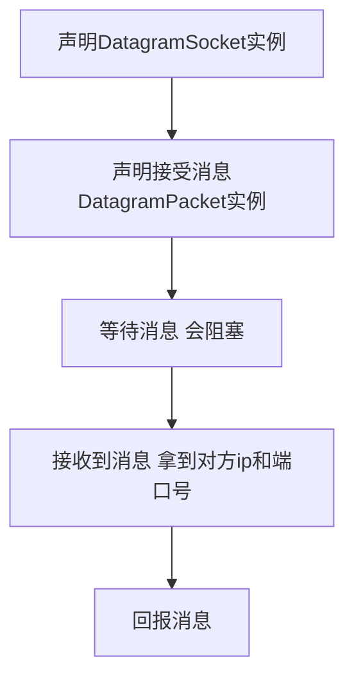
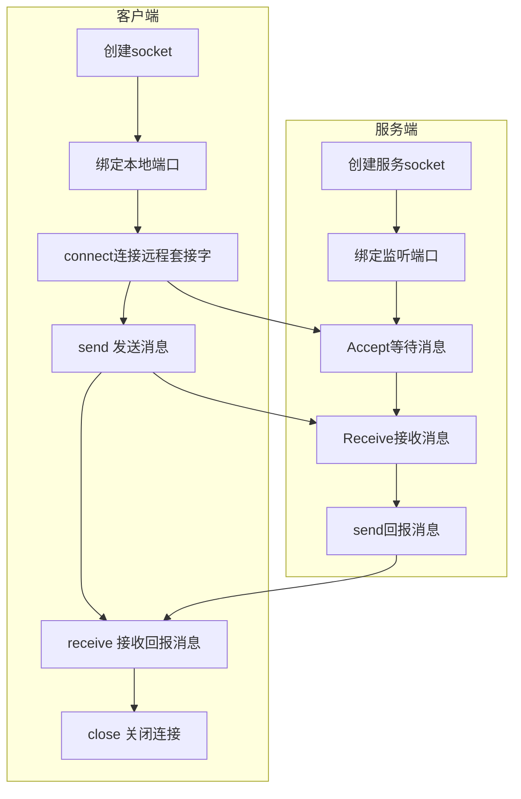
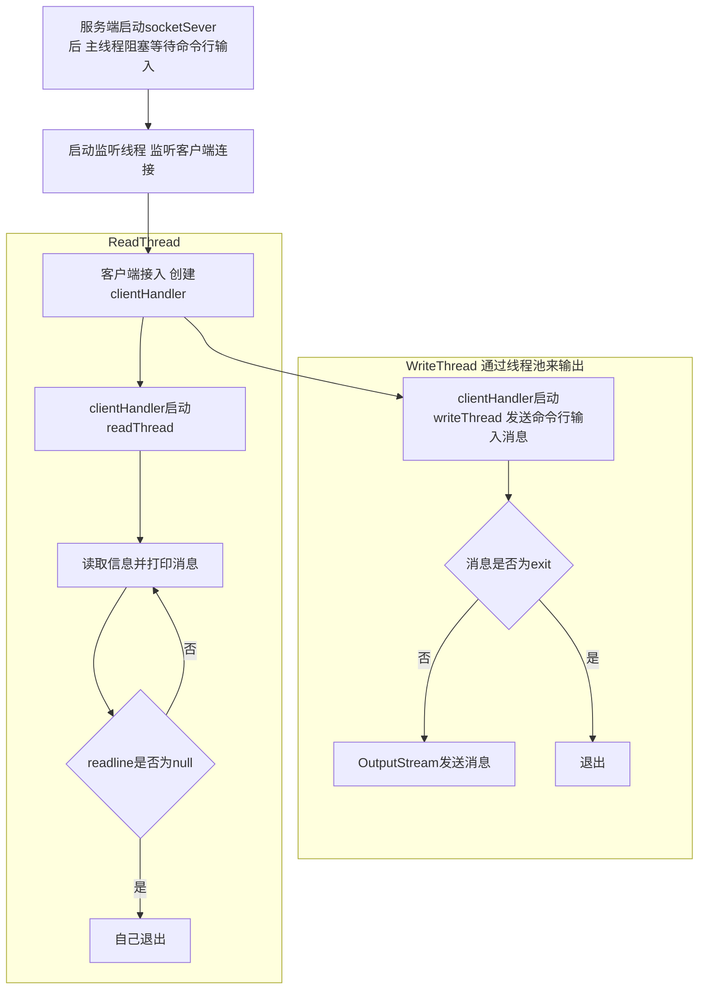
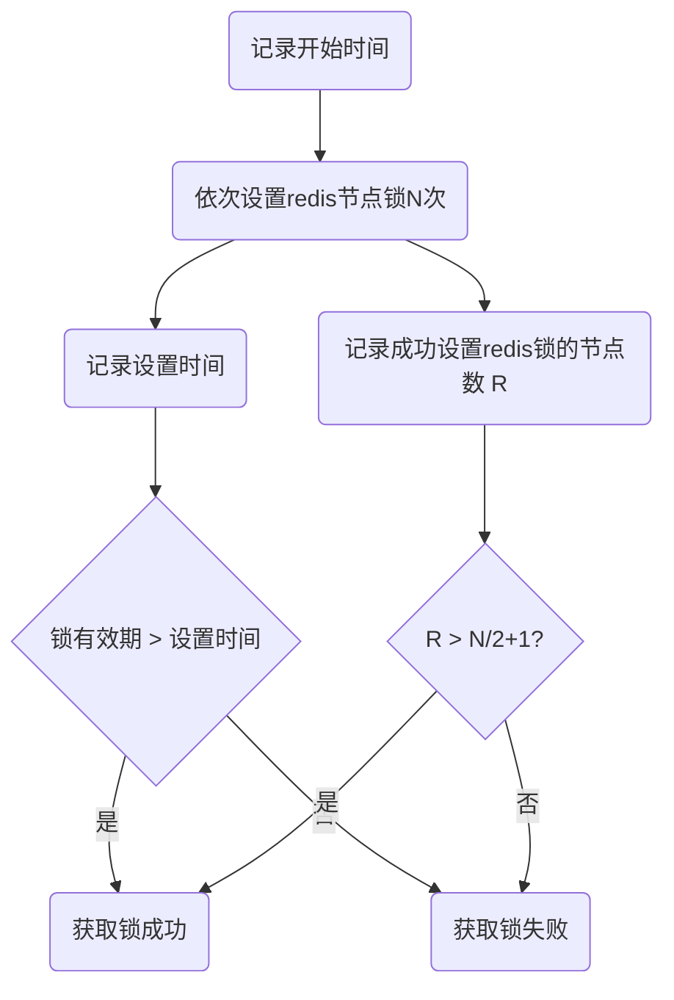
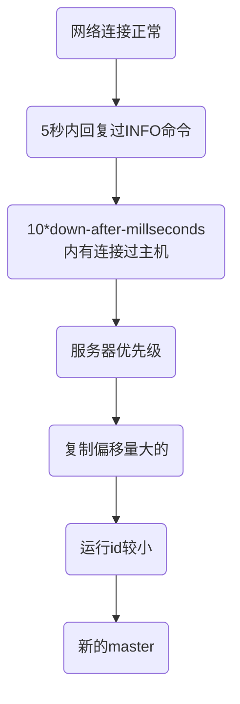

# 计算机基础

前言

> 这篇笔记旨在将工作中、学习中遇到的知识点都详细的记录下来。慢慢巩固基础，掌握了扎实的基础，才能在工作、面试中游刃有余。

[TOC]

## 操作系统

### 进程 vs 线程

不同点：

从范围上讲，线程是比进程更小更细的运行单位。一个程序有多个进程，一个进程又包含了多个线程。但是真正执行体还是线程。

从通信上讲，线程之间可以共享内存，相互通信，而进程之间内存独立。

从运行时的内存占用上讲，线程不会占用系统资源，没有自己独立地址空间，只需要运行堆栈，来存放临时变量和程序计数器等信息。而进程是需要分配独立内存。


### 存储

#### CPU缓存模型

现代CPU为了提高运行速度，减少从内存中读取数据的次数，大多设计了3层缓存机制。整体架构如下：


CPU一般都是多核CPU，每一个CPU内核里都有一个寄存器，寄存器主要用来存放当前CPU的操作符、计算结果等信息。

多个CPU内核通过总线来传递、共享数据。

#### 3级缓存

> https://www.jb51.net/hardware/cpu/610074.html

CPU高速缓存的出现主要是为了解决==CPU运算速度==与==内存读写速度==不匹配的矛盾。内存的读取太慢，导致CPU经常需要等待，无法发挥CPU的高速效果。

通常CPU都会设计3级缓存，每个缓存的命中率大概在80%左右，即80%的数据可以从L1缓存中读取，20%的数据在L2缓存里读，依次类推。

L1的缓存大小会 小于 L2 小于 L3。L1分2块区域：L1i用来缓存指令，L1d用来缓存数据。

L3是所有CPU内核共享的


#### MESI协议

> https://juejin.im/post/5da33288518825646c50f18c

多核cpu的缓存会存在缓存不一致的问题，想要解决这个问题，最好的方法就是加锁，保证每次只有一个cpu的缓存在被读取。

早期的加锁策略是把整个内存总线锁定了起来，这样锁定期间，所有其他的CPU无法去修改内存中的地址，但是造成的问题就是性能很慢。

现在的方案都是通过MESI协议来解决。

MESI协议整体架构如下：


MESI定义了**缓存行**的4种缓存状态：

> 缓存行：缓存的基本数据单位，在Intel的CPU上一般是64字节

| 状态           | 描述                                    |
| -------------- | --------------------------------------- |
| M（Modified）  | 当前缓存有效，且值被修改了              |
| E（Exculsive） | 当前缓存有效，只存在当前CPU内核的缓存里 |
| S（Shared）    | 当前缓存有效，存在于多个CPU的缓存中     |
| I（Invalid）   | 当前存储无效                            |

**读取规则**：

每个CPU上面都维护了某一个数据的缓存状态。

处于M状态的缓存行，必须在其他CPU读取 该缓存行对应的内存地址之前，将修改的值写回缓存。

处于S状态的缓存行，必须监听着让该缓存行无效 或 独享该缓存行 的请求，如果监听到以后，把缓存行状态设置为I。

处于E状态的缓存行，如果监听到其他读取该缓存行对应的内存地址的操作，需要把该缓存行状态设置为S。

如果缓存行的缓存状态是I，需要存内存中重新读取，然后把状态改为S。


 **状态机**

MESI协议实际上是一种有限状态机，缓存状态会根据事件进行相应状态的改变。事件分成2类，

`cpu对cache的请求事件`，`总线对cache请求事件`。所有的事件都被`总线嗅探器`监听。

cpu对cache的请求事件：

1. PrRd: 处理器请求**读**一个缓存块
2. PrWr: 处理器请求**写**一个缓存块

总线对cache的请求事件:

1. BusRd：探器监听到 这块缓存块被其他cpu读了
2. BusRdX：嗅探器监听到 该缓存块被别的cpu改了
3. Flush：嗅探器通知 回写整个缓存到主内存


### 寻址空间

> [虚拟内存与物理内存的联系与区别](https://blog.csdn.net/lvyibin890/article/details/82217193)

👆这篇文章很好的解释了虚拟内存和物理内存的关系；


寻址步骤：


这里的逻辑内存指的是虚拟地址!!!;程序时使用的地址称为**虚拟地址或逻辑地址**；

而计算机物理内存的访问地址则称为**实地址或物理地址**；


假设一段程序为：`int n = *p; ` 编译为汇编指令后为：`mov eax,[ebx] `。将ebx地址里的数据读取出来，放到eax这个寄存器里。

计算机寻址就是去逻辑内存（**虚拟地址**）里面寻找**ebx**这个地址的值。

每一个进程都分配有一个固定大小的**虚拟地址**，这个大小和操作系统有关，比如4g。但是这个大小对应的物理内存可能很小。

CPU在执行指令时需要先将指令的逻辑地址变换为物理地址，才能对相应的存储单元进行数据的读取或者写入。

但逻辑地址的值并不一定会和物理内存一一对应，也就是说它可能不存在物理内存里。

如果不存在物理内存上，就会通过分页，和做交换处理。 （==这一块的原理还不是很理解==）


## 计算机网络

网络7层架构的由来

### TCP协议 - 滑动窗口方案

> 解决的问题

因为网络传输的是不可靠的，为了避免丢包，发送方和接收方发送的数据需要进行相互确认的；

但如果每次发送一个包，就得等待确认再发下一个包，就会出现效率很低、吞吐量很小的问题。

所以需要并行发送，由此引入了滑动窗口的概念。


> 滑动窗口基本概念

发送方和接收方各自维护了自己的缓冲区。

双发确定了`发送`和`接收ack`的协议；

双发确定了同时发送的最大数量；


⬆️图所示，窗口里始终只有7个包的大小。只有数据包经过发送确认后，窗口才可以滑动到下一位。


> 丢包的解决办法


## JVM

> https://www.processon.com/view/5c749debe4b0f9fba6921d15?fromnew=1

### JDK、JRE、JVM的区别

JDK包含JRE，JRE包含JVM。

JDK是Java开发的工具包（Java Develop Kit）

JRE提供了Java运行的环境（Java Runtime Enviorment)

JVM则是一台虚拟机，他从软件的层面上，在虚拟机内部帮我们把JDK编译出来的class文件，转换为可以被当前操作系统识别的机器码。换句话说，他内部帮助我们屏蔽了一些操作系统层面上的区别，让我们的程序能够**跨平台运行**。

JVM包含了3个部分：类加载器子系统、运行时数据区、执行引擎。


### JVM内存区域

运行时数据区是JVM的核心，整体的结构如下：


**Java栈**（虚拟机栈）：Java会给每一个运行的线程分配一个栈，这个栈是线程私有的。

​	**栈针**：在栈里面，存放有很多栈帧，每个方法运行时都会产生一个栈帧入栈，保证每个方法有自己独立的作用域；栈帧里可以存储了java方法运行时的相关信息（局部变量表，操作数栈，动态链接，方法出口等）


​	**局部变量表**：保存方法内部的临时变量，比如：a=1;b=2;c=new Math()`等

​	**操作数栈**：jvm执行引擎会用到，存放一些操作符运算；

**本地方法栈**：和Java栈的概念类似，也是每个线程私有。但是它里面存放的都是一些native的方法信息。

**程序计数器：**也是线程私有，作用主要是为了记录当前线程运行到哪一行代码。因为每个线程的执行都依赖于CPU的调度，是需要抢占CPU资源的，所以线程经常会因为失去CPU资源而被挂起。当线程重启获取到运行资源时，就要根据程序计数器来继续执行。

**方法区**：方法区里存放的是类元信息、静态变量、常量等。

​	静态变量

​	常量： static final的

​	类元信息：一个类的组成信息。（类名、类修饰符、方法名等）

**堆**: 堆内存是线程共享的，用来存放java运行时创建出来的对象，对象的“内存地址”存放在栈局部变量表里面。

​	堆内存结构包括：新生代、form、to、永久代；


堆溢出

栈溢出

内存溢出与内存泄露的区别


### GC垃圾回收机制

Java垃圾回收分为minor回收和major回收，两种回收的机制不同，回收的对象主体在堆内存模型中也不一样。

👆Java堆内存模型分为新生代和老年代：

新生代大概占堆内存的1/3，老年代占内存的2/3。

**新生代**：

由Eden和Survior Space组成。初始大小由-Xmn参数设定。

工作机制：

Eden区大约占新生代内存空间的8/10，java new出来的对象都会先放入到Eden区；当Eden内存不够时，jvm会启动一次minor gc。Minor GC会把那些内存中不再有引用的对象都回收（回收算法下面会讲到），而那些有用的对象会被全部移动到`S0 Space`。第二次gc的时候，会把Eden区和S0 Space里存活的对象一起移动到S1 Space。

对象在s0 space和s1 space来回移动，每次转移时，这些对象都会更新gc的年龄标志。当gc年龄达到15时，会将该对象移动到老年代。

如果s0和s1的内存区域放不下存活的对象时，会去老年代内存中借用内存，等下一次gc后再还给老年代。而老年代也会为了确保minor gc操作能完成，预留了一部分内存作为保留区域。这种行为成为：`新生代搜集担保`。如果预留操作无法完成，也会触发Major GC。

**老年代**：

老年代区域中的对象存活率很高，一般回收的周期很长。

Major GC因为要对所有的对象进行回收，很消耗时间，所以要尽量避免Major GC。jvm调优的过程中，很大一部分工作就是减少Full GC的次数。


### GC回收判断

#### ~~引用计数法~~

#### 可达性分析

#### GC Roots根

java的垃圾回收机制中，判断1个对象是否可被回收，并不是看有没有对象对其引用，而是通过`可达性分析`，看这个对象有没有到GC Root的引用链相连。

怎么理解这段话？就是说，从GC Roots根向下找，看看能不能找到一条路，达到这个对象。如果找到了，说明是有引用链相连的。


可以作为GC Roots根的对象：

- 虚拟机栈（栈帧中的本地变量表）中引用的对象；任意方法里C c = new C();
- 方法区中静态变量引用的对象；static B b = new B();
- 方法区中常量引用的对象； static final A a = new A();
- Native方法引用的对象；


#### 引用关系

> https://blog.csdn.net/luzhensmart/article/details/81431212

⑴强引用（StrongReference）

```
A a = new A()
```

强引用是使用最普遍的引用。如果一个对象具有强引用，那垃圾回收器绝不会回收它。当内存空间不足，Java虚拟机宁愿抛出OutOfMemoryError错误，使程序异常终止，也不会靠随意回收具有强引用的对象来解决内存不足的问题。

⑵软引用（SoftReference）

```java
SoftReference<String> sr = new SoftReference<String>(new String("hello"));
```

如果一个对象只具有软引用，则内存空间足够，垃圾回收器就不会回收它；如果内存空间不足了，就会回收这些对象的内存。只要垃圾回收器没有回收它，该对象就可以被程序使用。

应用场景：软引用可用来搭配缓存来做，同时避免内存溢出。

⑶弱引用（WeakReference）

```java
WeakReference<String> sr = new WeakReference<String>(new String("hello"));
```

弱引用与软引用的区别在于：只具有弱引用的对象拥有更短暂的生命周期。在垃圾回收器线程扫描它所管辖的内存区域的过程中，一旦发现了只具有弱引用的对象，不管当前内存空间足够与否，都会回收它的内存。不过，由于垃圾回收器是一个优先级很低的线程，因此不一定会很快发现那些只具有弱引用的对象。


#### finalize抢救


#### GC log分析

免费的GC日志图形分析工具推荐下面2个：

- [GCViewer](https://juejin.im/post/[https://github.com/chewiebug/GCViewer](https://github.com/chewiebug/GCViewer))，下载jar包直接运行
- [gceasy](https://gceasy.io/)，web工具，上传GC日志在线使用


## JMM——Java内存模型


### JMM架构规范

JMM是一种架构，也是一套规范。它屏蔽了不同CPU内核的架构问题，通过实现MESI协议，解决了缓存一致性问题，同时也解决了多并发编程的可见性问题。


从上图里可以看到，多线程读写主内存变量经过了一系列操作。这些操作都是原子性的，是JMM封装的原子性指令，主要就是用来解决内存同步。

**读操作**

read操作：从主内存中读取变量

load操作：将读取的值复制并加载到缓存中

use：线程使用缓存中的变量；


**写操作**

assign：修改缓存中变量

store：将修改的值保存到缓存中；

write：将缓存里面修改过的值写回主内存里；


**lock和unlock操作**

lock：作用于主内存的变量，作用是把一个共享变量标识为一个线程独占状态。

unlock：作用于主内存变量，作用是把一个处于锁定状态的变量释放，然后可以被其他线程锁定

JMM中锁的都是缓存行。


volatile关键底层的原理就是通过上面的指令来通知线程更新缓存。


### 并发的三大特性——原子性、可见性、一致性


#### 有序性

在Java内存模型中，允许编译器和处理器对指令进行**重排序**，但是重排序过程不会影响到单线程程序的执行，却会影响到多线程并发执行的正确性。

##### 重排序

> https://blog.csdn.net/liuguangqiang/article/details/52153096


虽然JMM允许编译器进行重排序，但是也需要遵循对应的规则：happens-before规则。

```java
1）程序顺序规则：一个线程中的每个操作，happens-before于该线程中的任意后续操作。
2）监视器锁规则：对一个锁的解锁，happens-before于随后对这个锁的加锁。
3）volatile变量规则：对一个volatile域的写，happens-before于任意后续对这个volatile域的读。
4）传递性：如果A happens-before B，且B happens-before C，那么A happens-before C。
5）start()规则：如果线程A执行操作ThreadB.start()（启动线程B），那么A线程的ThreadB.start()操作happens-before于线程B中的任意操作。
6）join()规则：如果线程A执行操作ThreadB.join()并成功返回，那么线程B中的任意操作happens-before于线程A从ThreadB.join()操作成功返回。1）程序顺序规则：一个线程中的每个操作，happens-before于该线程中的任意后续操作。

```

需要注意的是：

1）如果一个操作happens-before另一个操作，那么第一个操作的执行结果将对第二个操作可见，而且第一个操作的执行顺序排在第二个操作之前。
2）两个操作之间存在happens-before关系，并不意味着Java平台的具体实现必须要按照happens-before关系指定的顺序来执行。==如果重排序之后的执行结果，与按happens-before关系来执行的结果一致，那么这种重排序并不非法。==

所以：

从单个线程的角度看，是可以保证有序的。但是如果观察多线程，整个程序就无法保证有序。

`volatile`关键字可以保证一定的“有序性”，因为`volatile`关键字会禁止指令重排。

`synchronized`和`lock`关键字保证同一时刻只允许一条线程操作，从而也保证了有序性。


## 多线程

### 多线程应用场景


### 守护线程与非守护线程

### 多线程的几种状态

多线程的生命周期：


### 保证线程的执行顺序

### 使用多线程分批处理信息

### 多线程通信方式

- #### wait & notify

**使用场景**：现在有A、B两个线程互斥，我们希望线程B运行到某一个状态通知线程A运行。如果线程A执行时，还没有达到预期的状态，先让线程A等待，等线程B到达这个状态后再通知线程A运行。

如图所示：


==注==：1.notify唤醒的线程不会在调用notify的一瞬间就执行，因为那个时候，线程的锁还没有被释放，其他线程还没有办法获取该实例的锁。

2.只有拥有锁的线程才能调用notify方法来唤醒其他线程；


- #### CountDownLatch 计数门闩

**应用场景**：CountDownLatch内部就是1个计数器。当线程A需要等待其他n个线程完成任务之后才能执行时，可以通过CountDownLatch来实现。

**使用介绍**：

```java
/**
* 构造方法：参数count为计数值
*/
public CountDownLatch(int count) {  };

/**
* 调用await()方法的线程会被挂起，它会等待直到count值为0才继续执行
*/
public void await() throws InterruptedException { };

/**
* 可以等待一定的时间，如果count依然没变成0，还是会继续执行
*/
public boolean await(long timeout, TimeUnit unit) throws InterruptedException { }; 

/**
* 每次调用都会将count值减1
*/
public void countDown() { };  //
```

**实际使用**：

>启动2个线程，线程1不断的add，线程2去监听容器的size，当size值=5时，终止线程2.

```java
CountDownLatch countDownLatch = new CountDownLatch(5);
new Thread(() -> {
  try {
    System.out.println("线程2开始");
    countDownLatch.await();
    System.out.println("线程2结束");
  } catch (InterruptedException e) {
    e.printStackTrace();
  }
}, "t2").start();
new Thread(() -> {
  System.out.println("线程1开始");
  synchronized (lock) {
    for (int i = 0; i < 10; i++) {
      myContainer.add(String.valueOf(i));
      System.out.println("容器增加：" + (i + 1));
      countDownLatch.countDown();
      try {
        Thread.sleep(100);
      } catch (InterruptedException e) {
        e.printStackTrace();
      }
    }
  }
}, "t1").start();
```


### 怎么停止线程


### 线程变量ThreadLocal

> 参考文章：https://www.jianshu.com/p/22be9653df3f

#### 作用

为每一个线程开辟一个单独的内存空间，用来存放线程独享的资源

#### 使用场景

线程需要存放变量，但是又不希望别的线程来修改自己的变量时，可以用ThreadLocal来存储变量的值；

#### 使用方式

```java
private static class MyRunnable implements Runnable {
  // 创建线程变量      
  ThreadLocal<String> threadLocal = new ThreadLocal<>();

        @Override
        public void run() {
            String name = Thread.currentThread().getName();
            threadLocal.set(name + "的ThreadLocal变量");
            try {
                Thread.sleep(1000);
            } catch (InterruptedException e) {
                e.printStackTrace();
            }
            System.out.println(name + ":" + threadLocal.get());
        }
    }

    public static void main(String[] args) {
        Runnable runnable = new MyRunnable();
        new Thread(runnable, "线程1").start();
        new Thread(runnable, "线程2").start();
    }
```

#### 原理

每个线程实例都会有一个threadLocals的变量，用来存放当前线程的ThreadLocalMap；

而当ThreadLocal创建时，会创建好ThreadLocalMap的实例，然后关联到线程t的threadLocals变量上；

每个ThreadLocalMap的key = 当前ThreadLocal对象本身，value是一个任意的值；


所以当ThreadLocal设置值时，当前线程会先拿到ThreadLocalMap，然后为这个map上设置值；

Debug记录

线程1：ThreadLocal@948


线程1：ThreadLocalMap@961


线程2：可以看到ThreadLocal的变量是同一个，但是map会创建新的；


## 多线程安全问题

先看问题：假设有10000张票，启动10个线程，每个线程都去买票；打印每个线程购买票的情况.


```java
/**
 * 场景：假设有10000张火车票
 * 启动10个线程，每个线程都去买票；打印购买情况
 *
 * @author keyang
 * 比较一下ArrayList、Vector、ConcurrentLinkedQueue区别
 */
public class ConcurrentQueue1 {
	
	public static void main(String[] args) {
    // 注解1
//		List<String> tickets = new ArrayList<>();
    // 注解2
//		Vector<String> tickets = new Vector<String>();
    // 注解3
		ConcurrentLinkedQueue<String> tickets = new ConcurrentLinkedQueue<>();
		for (int i = 0; i < 1000; i++) {
			tickets.add("火车票" + i);
		}
		System.out.println(tickets.size());
		for (int i = 0; i < 10; i++) {
			Thread thread = new Thread(() -> {
//				synchronized (tickets) {
				while (tickets.size() > 0) {
					try {
						Thread.sleep(10);
					} catch (InterruptedException e) {
						e.printStackTrace();
					}
//						System.out.println(Thread.currentThread().getId() + "——" + tickets.remove(0));
					String ticket = tickets.poll();
					if (ticket == null) {
						break;
					}
					System.out.println(Thread.currentThread().getId() + "——" + ticket);
				}
//				}
			});
			thread.start();
		}
	}
}

```

注解1：假设用ArrayList来存放队列，那么程序会出现越界的问题。而且还可能会卖出空票。

```verilog
21——null
19——null
17——null
18——null
Exception in thread "Thread-0" Exception in thread "Thread-9" Exception in thread "Thread-3" Exception in thread "Thread-7" Exception in thread "Thread-4" Exception in thread "Thread-1" Exception in thread "Thread-6" Exception in thread "Thread-8" Exception in thread "Thread-2" java.lang.IndexOutOfBoundsException: Index 0 out of bounds for length 0
	at java.base/jdk.internal.util.Preconditions.outOfBounds(Preconditions.java:64)
	at java.base/jdk.internal.util.Preconditions.outOfBoundsCheckIndex(Preconditions.java:70)
	at java.base/jdk.internal.util.Preconditions.checkIndex(Preconditions.java:248)
	at java.base/java.util.Objects.checkIndex(Objects.java:372)
	at java.base/java.util.ArrayList.remove(ArrayList.java:535)
	at com.gs.example.concurrentdemo.ConcurrentQueue1.lambda$main$0(ConcurrentQueue1.java:36)
	at java.base/java.lang.Thread.run(Thread.java:834)
```

因为ArrayList的`remove()`方法本身就没有原子性.

注解2：假设更换容器为Vector。Vector本身是线程安全的，`remove`方法是可以保证原子性的。但是程序中`size`判断和`remove`方法两个操作之间是无法保证不被打断的，所以系统也会判断错误，出现同样的越界问题。

注解3：ArrayList和Vector容器只能通过使用synchronize锁来保证线程安全,，者使用并发容器：`ConcurrentLinkedList`.


### Synchronized关键字

- #### 作用


保证同一时刻，只有1个线程能执行被Synchronize修饰的方法或代码块；

- #### 使用场景

保证线程安全，通过互斥锁、阻塞的形式解决并发问题；

- #### 使用介绍

**修饰代码块**:  需要传入一个被锁的对象。每个线程执行代码块时，需要获取到这个对象的锁。java的所有对象都有1个互斥锁，synchronize方法结束或者抛出异常时会自动释放锁。

**修饰实例方法**：锁的是当前调用方法的实例对象。每个实例对象拥有一把锁，线程调用方法时，必须获取该实例对象的锁。—— 和synchronize(this)的效果一样

**修饰类的静态方法**：锁的是Class类的对象。所以该Class的实例对象在调用该静态方法时，共用同一把锁。因为类只有1个，静态方法在内存中也只有1个


**不同锁之间的区别：**

| 类型   | 锁的对象  | 锁的数量                      | 表现形式 |
| ------ | --------- | ----------------------------- | -------- |
| 对象锁 | 实例对象  | 多个（1个类可以有多个实例）   | 普通方法 |
| 类锁   | Class对象 | 1个（因为1个类只有1个类对象） | 静态方法 |

**Demo**：

```java
public class Test{ 
    // 对象锁：形式1(方法锁) 
    public synchronized void Method1(){ 
        System.out.println("我是对象锁也是方法锁"); 
        try{ 
            Thread.sleep(500); 
        } catch (InterruptedException e){ 
            e.printStackTrace(); 
        } 
    } 
 
    // 对象锁：形式2（代码块形式） 
    public void Method2(){ 
        synchronized (this){ 
            System.out.println("我是对象锁"); 
            try{ 
                Thread.sleep(500); 
            } catch (InterruptedException e){ 
                e.printStackTrace(); 
            } 
        } 
    } 
      
      // 类锁：形式1 ：锁静态方法
    public static synchronized void Method1(){ 
        System.out.println("我是类锁一号"); 
        try{ 
            Thread.sleep(500); 
        } catch (InterruptedException e){ 
            e.printStackTrace(); 
        } 
    } 
 ｝
```


### ReentraLock 可重入锁

#### **使用场景**

1.替代synchronize的锁的方法；通过lock和unlock来实现synchronize的功能；

2.可以使用trylock尝试获取锁。当没有获取到锁时，不进行业务逻辑处理；

3.可以使用lockInterruptibly方法来响应线程的interrupt方法，避免线程因为无法获取锁而无法被打断；

4.通过绑定condition，可以实现对某一类线程的定向通知。

#### 使用介绍

**lock()**:  lock方法会获取锁，如果没有获取到就一直等待；

**tryLock()**:  tryLock不会等待，而是即返回获取锁的结果。获取到锁返回true，没有会返回false。

**lockInterruptibly()**:  这个方法也会一直等待锁的获取，和lock不同的是，我们可以通过thread.interrupt方法时，让线程响应中断，不再继续等待。

**unLock**():  释放锁，==使用lock一定要注意手动释放锁==

**newCondition**():  可以创建多个condition对象，实现await和signal组合。

#### Condition

**作用**：condition存在的意义是为了实现类似 object.wait()和object.notify()的功能。wiat和notify方法可以让线程等待、被唤醒。condition也一样，但是它可以更加有针对性的去让某一类线程被唤醒。

**使用介绍**：

await():  让当前线程进入condition的等待队列

signal()：唤醒condition队列上的某一个线程

signalAll(): 唤醒condition队列上的所有线程；

#### Demo

1.实现公平锁

```java
ReentrantLock reentrantLock = new ReentrantLock(true); // 公平锁
Runnable runnable = new Runnable() {
  @Override
  public void run() {
    for (int i = 0; i < 100; i++) {
      reentrantLock.lock();
      try {
        System.out.println("线程"  + Thread.currentThread().getName() + "获取锁");
      } finally {
        if (reentrantLock.isLocked()) {
          reentrantLock.unlock();
          //						System.out.println("线程" + Thread.currentThread().getName() + "释放锁");
        }
      }
    }
  }
};
new Thread(runnable, "t1").start();
new Thread(runnable, "t2").start();
```

如果ReentrantLock构造函数传入的是true，那么使用的是公平锁，打印结果会呈现线程1和线程2交替获取到锁的样子；

### 

2.ReentraLock实现阻塞队列的模式：

> https://gitee.com/dendi.ke/thread-demo/blob/master/src/main/java/com/gs/example/producerandconsumer/ProducerAndConsumerDemo2.java


### 多线程死锁

**死锁的原因**

主要是因为线程锁的等待：比如有2个线程，都需要获取2把锁才能执行。线程1获取了锁A，线程2获取到了锁B。那么线程1不断的在等锁B，线程2不断的在等锁A，就会导致死锁。

模拟的多线程死锁Demo：


atomicInteger原子类


线程通信


## 容器的并发

>  https://juejin.im/post/5aeebd02518825672f19c546

### Map

首先确定一点，HashMap是线程不安全的，原因可以参考另一篇HashMap的原理分析；

ConcurrentMap

ConcurrentSkipListMap 

几个java常见容器的比较

Map：

LinkedHashMap：继承于HashMap，主要为了解决HashMap读取顺序不能和插入顺序一致的问题。

HashMap


### List

ArrayList是线程不安全的，多个线程同步add，会出现添加丢失的问题；

因为ArrayList的add方法不是原子操作, 可能会出现数组越界或者数据重复放在一个位置上问题；

```java
public boolean add(E e) {
  ensureCapacityInternal(size + 1);
  elementData[size++] = e;
  return true;
}
```

Vector是线程安全的；


ConcurrentLinkedQueue：是线程安全队列

add() 和 offer() 的区别：

add()和offer()都是向队列中添加一个元素。如果一个queue是有大小限制的，调用add方法会抛出异常，而调用offer方法会返回false；


#### ConcurrentSkipListSet：是排序的队列；


### BlockingQueue


**LinkedBlockingQueue**

```java
/**
 * 需求：使用blockQueue，模拟生产者和消费者
 * @author keyang
 */
public class LinkedBlockQueue {
	
	private static LinkedBlockingQueue<String> queue = new LinkedBlockingQueue<>();
	
	public static void main(String[] args) {
		Random random = new Random();
		for (int i = 0; i < 2; i++) {
			new Thread(() -> {
				for (int j = 0; j < 100; j++) {
					try {
						queue.put(j + "");
						Thread.sleep(random.nextInt(1000));
					} catch (InterruptedException e) {
						e.printStackTrace();
					}
				}
			}, "p" + i).start();
		}
		
		for (int i = 0; i < 5; i++) {
			new Thread(() -> {
				while(true) {
					try {
						// 如果queue空了，会自动阻塞等待
						String str = queue.take();
						System.out.println("消费者取出了" + str);
					} catch (InterruptedException e) {
						e.printStackTrace();
					}
				}
			}, "c" + i).start();
		}
	}
}
```


**ArrayBlockingQueue**

> ArrayBlockingQueue是可以设定界限的

**方法区别**：

put会在队列满的时候，阻塞队列的加入。

add会在队列满的时候抛出异常

offer会返回到底是加入成功或者失败；


**DelayQueue**

应用场景： 处理一些定时任务。比如电商系统中的超时订单自动关闭；

使用介绍：DelayQueue队列里添加的item需要实现Delayed接口，实现2个方法：getDelay、compareTo

```java
public class DelayQueueDemo {
	static BlockingQueue<MyTask> queue = new DelayQueue<>();
	private static class MyTask implements Delayed {
		private long time;
		/**
		 * 返回当前的延迟时间, long类型
		 * @param timeUnit
		 * @return
		 */
		@Override
		public long getDelay(TimeUnit timeUnit) {
			return timeUnit.convert(time - System.currentTimeMillis(), TimeUnit.MILLISECONDS);
		}
		/**
		 * 比较两个task的超时时间
		 * @param delayed
		 * @return
		 */
		@Override
		public int compareTo(Delayed delayed) {
			return (int) (this.getDelay(TimeUnit.MILLISECONDS) - delayed.getDelay(TimeUnit.MILLISECONDS));
		}
		public MyTask(long time) {
			this.time = time;
		}
		@Override
		public String toString() {
			return time + "";
		}
	}
}
```

DelayQueue是一个存放实现Delayed接口的数据的无界阻塞队列，只有当数据对象的延时时间达到时才能插入到队列进行存储。如果当前所有的数据都还没有达到创建时所指定的延时期，则队列没有队头，并且线程通过poll等方法获取数据元素则返回null。

> 附：其他的定时任务解决方案；
>
> 1. 使用数据库定时任务，每隔几秒扫描订单表，找出超时订单后关闭。
> 2. 使用spring的@Scheduled注解启动定时任务或者使用Quartz任务管理器，定时触发任务，处理超时订单。
> 3. 使用消息中间件，通过mq提供的延迟消息队列，下单后往延迟消息队列中发消息，超时后，消费端会接收到一条延迟的订单消息，并做相应处理。
> 4. 按需处理。在用户查询的时候，检测订单是否超时，若超时，则关闭订单


**LinkedTransferQueue**

transfer方法必须直接传递给消费者，否则方法会阻塞住。

take方法如果没有取出数据也会被阻塞。

```java
TransferQueue<String> queue = new LinkedTransferQueue<String>();
		new Thread(() -> {
			try {
				System.out.println(queue.take());
			} catch (InterruptedException e) {
				e.printStackTrace();
			}
		}, "t1").start();
		try {
//			boolean a = queue.tryTransfer("transfer demo", 2, TimeUnit.SECONDS);
			queue.transfer("transfer demo");
		} catch (InterruptedException e) {
			e.printStackTrace();
		}
	}
```


**SynchronousQueue**

> 这个阻塞队列的容量是0；需要先启动消费者，
>
> take方法会阻塞;
>
> put方法需要马上被拿走，否则进入阻塞状态。底层也是用TransferQueue来实现的;

```java
public class SynchronousQueueDemo {
	
	static SynchronousQueue<String> queue = new SynchronousQueue<>();
	
	public static void main(String[] args) {
		new Thread(() -> {
			try {
				System.out.println(queue.take());
			} catch (InterruptedException e) {
				e.printStackTrace();
			}
		}, "t1").start();
		try {
//			queue.put("SynchronousQueue");
			boolean offered = queue.offer("SynchronousQueue", 2, TimeUnit.SECONDS);
			System.out.println(offered);
		} catch (Exception e) {
			e.printStackTrace();
		}
	}
}
```


## 线程池

### 1.线程池概述

**线程池作用**：可以避免线程的频繁的创建回收，减少系统的开销；

**API介绍**：ThreadPoolExecutor

**核心参数**：

| 参数            | 意义                     | 说明                                   |
| --------------- | ------------------------ | -------------------------------------- |
| corePoolSize    | 核心线程数量             | 默认情况下，主线程一直存在             |
| maximumPoolSize | 最大线程数量             | 当线程达到最大数量后，后续任务会被阻塞 |
| keepAliveTime   | 线程空闲时间             | 超过这个时间，非主线程会被回收         |
| unit            | 空闲时间单位             |                                        |
| workQueue       | 任务队列                 | 用来存储execute传入的任务              |
| threadFactory   | 线程工厂                 | 用来创建线程任务，可以指定线程名       |
| rejectHandler   | RejectedExecutionHandler | 当线程被拒绝时，放入的队列；           |

```java
/**
 * 线程池管理器
 * @author keyang
 *
 */
public final class ThreadPoolManager {
 
 static ThreadPoolManager threadPoolManager = new ThreadPoolManager();
 
 static final int CORE_POOL_SIZE = 4;
 static final int MAX_POOL_SIZE = 5;
 static final int KEEP_ALIVE_TIME = 5;
 private static final int SIZE_WORK_QUEUE = 1;
 
 
 private ThreadPoolManager() {
 }
 
 public static ThreadPoolManager getInstance() {
  return threadPoolManager;
 }
 
 /**
  * 用来存放排队的任务
  */
 private Queue<Runnable> mTaskQueue = new LinkedBlockingQueue<>();
 
 private final RejectedExecutionHandler myRejectHandler = new RejectedExecutionHandler() {
  
  @Override
  public void rejectedExecution(Runnable r, ThreadPoolExecutor executor) {
   mTaskQueue.offer(r);
  }
 };
 
 private ScheduledExecutorService scheduledThreadPool = Executors.newScheduledThreadPool(1);
 
 /**
  * 定时从排队任务队列中获取任务
  */
 private ScheduledFuture<?> scheduledFuture = scheduledThreadPool.scheduleAtFixedRate(new Runnable() {
  @Override
  public void run() {
   if (!mTaskQueue.isEmpty()) {
    threadPoolExecutor.execute(mTaskQueue.poll());
   }
  }
 }, 0, 5, TimeUnit.SECONDS);
 
 ThreadFactory namedThreadFactory = new ThreadFactoryBuilder().setNameFormat("Ky线程-%d").build();
 
 private final ThreadPoolExecutor threadPoolExecutor = new ThreadPoolExecutor(CORE_POOL_SIZE, MAX_POOL_SIZE, KEEP_ALIVE_TIME, TimeUnit.SECONDS, new ArrayBlockingQueue<Runnable>(SIZE_WORK_QUEUE),
  namedThreadFactory, myRejectHandler);
 
 public void addExecuteTask(Runnable task) {
  if (threadPoolExecutor != null) {
   threadPoolExecutor.execute(task);
  }
 }
 
 protected int getPoolSize() {
  return threadPoolExecutor.getPoolSize();
 }
 
 public void shutdown() {
  mTaskQueue.clear();
  scheduledThreadPool.shutdown();
  threadPoolExecutor.shutdown();
 }
}
```


### 2.创建线程池的方式

JDK提供了很多种创建线程池的方式, 都是通过Executors的静态方法来实现。

#### FixedThreadPool

特点：只有核心线程数量，线程不会被回收，线程数量是固定的，任务队列没有大小限制

使用场景：控制线程的并发量


#### ScheduledThreadPool

特点：核心线程数量固定，非核心线程数量无限制

使用场景：执行定期的任务

内部队列是DelayedWorkQueue


#### CachedThreadPool

特点：线程池内只有非核心线程，线程最大数量没有限制，线程超过空闲时间后会因为闲置被回收。任务队列采用的是SynchronousQueue，加入的任务会马上被执行。

使用场景：执行大量、耗时少的任务


#### SingleThreadPool

特点：只有一个核心线程，保证线程任务按照顺序执行。任务队列采用的是LinkedBlockingQueue，又只有1个核心线程处理，所以无需处理线程同步问题；

使用场景：多个任务按顺序执行。


这4种线程池底层的原理都是通过ThreadPoolExecutor类来实现的；

另外还有一些特殊的线程池：

#### ForkJoinPool

特点：他的核心理念是分而治之，他的作用就是将一个大任务通过多线程来拆分成多子任务；

使用场景：适合做1个大数的计算；

```java
public class ForkJoinPoolDemo {

	static int MAX = 5000;
	
	private static class MyTask extends RecursiveAction {
		private int start;
		private int end;
		public MyTask(int start, int end) {
			this.start = start;
			this.end = end;
		}
		@Override
		protected void compute() {
			if ((end - start) < MAX) {
				System.out.println(Thread.currentThread().getName() + "从" + start + "到" + end + " = " + getSum(start, end));
			} else {
				MyTask task1 = new MyTask(start, (end + start) / 2);
				MyTask task2 = new MyTask((end + start) / 2 + 1, end);
//				task1.fork();
//				task2.fork();
				invokeAll(task1, task2);//执行给定的任务
				
			}
		}
	}
	
	private static class MyRecursiveTask extends RecursiveTask<Integer> {
		
		private int start;
		private int end;
		public MyRecursiveTask(int start, int end) {
			this.start = start;
			this.end = end;
		}
		@Override
		protected Integer compute() {
			if ((end - start) < MAX) {
				return getSum(start, end);
			} else {
				MyRecursiveTask task1 = new MyRecursiveTask(start, (end + start) / 2);
				MyRecursiveTask task2 = new MyRecursiveTask((end + start) / 2, end);
				task1.fork();
				task2.fork();
				return task1.join() + task2.join();
			}
		}
	}
	
	private static int getSum(int start, int end) {
		int sum = 0;
		for (int i = start; i < end; i++) {
			sum += i;
		}
		return sum;
	}
	public static void main(String[] args) {
		
		System.out.println(getSum(0, 100000));
		
		ForkJoinPool forkJoinPool = new ForkJoinPool();
//		MyTask myTask = new MyTask(0, 100000);
//		forkJoinPool.execute(myTask);
		
		MyRecursiveTask myRecursiveTask = new MyRecursiveTask(0, 100000);
		Future<Integer> future = forkJoinPool.submit(myRecursiveTask);
		try {
			System.out.println("多线程执行结果："+future.get());
			System.in.read();
		} catch (IOException | InterruptedException | ExecutionException e) {
			e.printStackTrace();
		}
	}
}
```

**使用介绍**：ForkJoinPool实例有两种方法：submit和execute，传入的参数类型都是ForkJoinTask；

但是execute方法无返回值，而submit方法会返回一个Future类的实例。

ForkJoinTask是一个抽象类，它有2个子类，特点也是和submit和execute方法对应。

RecursiveAction 的compute方法是无返回值的

RecursiveTask 的compute方法有返回值

**高级使用**：

使用ForkJoin的思想来实现一个快速排序

https://gitee.com/dendi.ke/thread-demo/blob/master/src/main/java/com/gs/example/threadpool/ForkJoinPoolDemo2.java

​	


### 3.线程池原理分析

**线程池逻辑**


先判断`线程数量`是否达到`核心线程池数量`最大限制；

再判断线程的`任务队列数量`是否已满

最后再判断`线程数量`是否满足`最大线程数量`限制

**任务丢弃策略**
handler：表示当拒绝处理任务时的策略，有以下四种取值： 
ThreadPoolExecutor.AbortPolicy:丢弃任务并抛出RejectedExecutionException异常。 
ThreadPoolExecutor.DiscardPolicy：也是丢弃任务，但是不抛出异常。 
ThreadPoolExecutor.DiscardOldestPolicy：丢弃队列最前面的任务，然后重新尝试执行任务（重复此过程） 
ThreadPoolExecutor.CallerRunsPolicy：由调用线程处理该任务

**线程池容量的动态调整**
ThreadPoolExecutor提供了动态调整线程池容量大小的方法：setCorePoolSize()和setMaximumPoolSize()， 
setCorePoolSize：设置核心池大小 
setMaximumPoolSize：设置线程池最大能创建的线程数目大小 
当上述参数从小变大时，ThreadPoolExecutor进行线程赋值，还可能立即创建新的线程来执行任务。

**线程池关闭原理**：

a. 遍历线程池中的所有工作线程
b. 逐个调用线程的interrupt() 中断线程（注：无法响应中断的任务可能永远无法终止）


**关闭线程池方法**：

- shutdown（）

- shutdownNow（）

**二者区别**：

- shutdown：设置 线程池的状态 为 SHUTDOWN，然后**中断**所有没有正在执行任务的线程。它不会立即终止线程池，但是再也不会接受新的任务 

- shutdownNow：设置 线程池的状态 为 STOP，然后尝试**打断**所有的正在执行或暂停任务的线程，并且清空任务缓存队列，**返回等待执行任务的列表**。


**使用建议**：

一般调用shutdown，正常的关闭线程池，

若任务不一定要执行完，则调用shutdownNow()


### 4.线程池合理数量配置

遵循两原则： 

1、如果是[CPU密集型任务](#CPU密集型（CPU-bound）)，就需要尽量压榨CPU，参考值可以设为 NCPU+1 
2、如果是[IO密集型任务](#IO密集型（I/O bound）)，参考值可以设置为2*NCPU 

当然，这只是一个参考值，具体的设置还需要根据实际情况进行调整，比如可以先将线程池大小设置为参考值，再观察任务运行情况和系统负载、资源利用率来进行适当调整。


### 5.ExecutorService解析


#### Executor接口

```java
package java.util.concurrent;

public interface Executor {
  // 执行任务
  void execute(Runnable var1);
}
```

顶层接口，可以调用execute(Runnable r)的方法。


#### ExecutorService接口


#### Callable接口

类似于Runnable接口，区别是Callable里面是call() 方法，返回一个泛型。Runnable里面试run()方法，没有返回。


### 6.Executors

Executors 是一个Java中的工具类。提供工厂方法来创建不同类型的线程池。



从上图中也可以看出，Executors的创建线程池的方法，创建出来的线程池都实现了ExecutorService接口。常用方法有以下几个：

`newFiexedThreadPool(int Threads)`：创建固定数目线程的线程池。

`newCachedThreadPool()`：创建一个可缓存的线程池，调用execute 将重用以前构造的线程（如果线程可用）。如果没有可用的线程，则创建一个新线程并添加到池中。终止并从缓存中移除那些已有 60 秒钟未被使用的线程。

`newSingleThreadExecutor()`创建一个单线程化的Executor。

`newScheduledThreadPool(int corePoolSize)`创建一个支持定时及周期性的任务执行的线程池，多数情况下可用来替代Timer类。

类看起来功能还是比较强大的，又用到了工厂模式、又有比较强的扩展性，重要的是用起来还比较方便，如：

```text
ExecutorService executor = Executors.newFixedThreadPool(nThreads) ;
```

即可创建一个固定大小的线程池。

但是Alibaba禁止使用Executors来创建线程池；


可以看到，手册中提到Executors创建的线程池会造成OOM（Out of Memory）。

为什么会造成OOM呢？为了理解这个文档，写了个例子：

```java
import java.util.concurrent.ExecutorService;
import java.util.concurrent.Executors;

@SuppressWarnings("AlibabaThreadPoolCreation")
public class OOMDemo {
  // LinkedBlockingQueue
  private ExecutorService executorService1 = Executors.newFixedThreadPool(15);
  // LinkedBlockingQueue
  private ExecutorService executorService2 = Executors.newSingleThreadExecutor();
  
  // SynchronousQueue
  private ExecutorService executorService3 = Executors.newCachedThreadPool();
  // DelayedWorkQueue
  private ExecutorService executorService4 = Executors.newScheduledThreadPool(15);
  
  public static void main(String[] args) {
    
    new OOMDemo().createThread();
  }
  
  public void createThread() {
    for (int i = 0; i < Integer.MAX_VALUE; i++) {
      executorService1.execute(new Runnable() {
        @Override
        public void run() {
          try {
            Thread.sleep(10000);
          } catch (InterruptedException e) {
            e.printStackTrace();
          }
        }
      });
    }
  }
}

```

运行时设置jvm参数：-Xmx8m -Xms8m 


## 线程锁

>参考：https://zhuanlan.zhihu.com/p/71156910?utm_source=wechat_session&utm_medium=social&utm_oi=722156590005776384

java里面锁主要的作用就是解决多线程的安全性问题；java里有2种加锁的方式：

1.synchronize关键字。这种方式写代码很简单，但相对的，它使用锁的级别也很高；如果对性能没有要求，那么一般都会用synchronize关键来加锁

2.Lock实现类。另一种方式就是用java的`Lock`。Lock是一个接口，她的实现类在代码层面实现了锁的功能。常用的实现类如下：

ReentrantLock类，ReadLock类，WriteLock类；


### Synchronized  和 lock的区别

synchronize是java的关键字，可以用来修饰方法、代码块等。主要目的是保证方法或者方法块是线程安全的。

lock是java提供的一个接口，他有很多实现类、常用到的比如ReentantLock、ReentraReadWriteLock等。它们可以灵活的使用，主要也是保证线程安全。

手动使用lock需要注意几点：

1.lock必须手动释放unlock，而synchronize会自动释放锁；

2.lock可以实现公平锁，而synchronize是非公平的

3.lock的获取可以灵活判断，synchronize的锁获取只能一直等待。


### 悲观锁&乐观锁

锁的一种宏观分类方式。是指在并发的情况下，两种策略；

**悲观锁**：当多个线程有竞争关系时，我们总是认为某个共享数据会被其他线程修改（**很悲观**）；所以需要用到共享数据的线程就去把数据加一把锁，这样别的线程就只能等待当前线程释放锁后才能使用；

**乐观锁**：当线程修改某一个数据时，总认为当前数据不会被别的线程修改，所以不会去加锁（**很乐观**）。如果线程需要更新数据，会去检查从数据读取到更新这段时间类，数据有没有发生修改。如果这期间数据没有变化，那么就执行更新操作；否则回滚操作，重新读取更新一遍，并重复上次检查；

**使用场景比较**：

乐观锁一般适用于**写比较少**的情况下，这样线程冲突真的很少发生，可以省去加锁的开销；

悲观锁则比较适合冲突较多的情况；


### CAS无锁机制

乐观锁的底层机制就是CAS机制：**Compare and Set**

1. 首先比较值。比如读取到一个值为A，如果在将A更新为B的过程中，检查A是否发生了变化。
2. 如果相同，那么执行set操作，将值更新为B；否则不执行操作，重新读取值；

上面两步是原子性的，在CPU看来是一步操作；

乐观锁的机制就是CAS的重试算法，整个过程没有“加锁”和“解锁”操作，所以乐观锁策略也被称为**无锁编程**。

```java
// 伪代码
	public volatile int value;

    public int getValue() {
        return value;
    }

    public final int getAndIncrement() {
        for(;;) {
            int current = getValue();
            int next = current + 1;
            // CAS操作
            if (compareAndSet(current, next)) {
                return current;
            }
        }
    }

    public final int getAndDecrement() {
        for (;;) {
            int current = getValue();
            int next = current - 1;
            if (compareAndSet(current, next)) {
                return current;
            }
        }
    }
```


### 自旋锁

当线程占用某一个锁时，其他的线程会一直不断的循环获取锁；怎么理解这个概念？需要先了解一下java的synchronize锁升级机制：

#### synchronized锁升级：偏向锁 → 轻量级锁 → 重量级锁

初次执行到synchronize代码块时，使用的是偏向锁。

当其他线程也进入到synchronize代码块时，如果获取不到锁，就会进入等待状态。锁会升级为轻量级锁，也就是`自旋锁`

自旋锁也有限制，因为线程不断的空循环也会消耗性能。所以当线程循环的次数超过一定次数，线程会进入挂起状态等待被唤醒，自旋锁会升级为重量级锁。后面的线程当发现锁级别是重量级锁时，直接挂起。


### 可重入锁

> 可以重复获取的锁；

synchronize是可重入锁。当1个线程执行某一个synchronize代码块时，它会先获取到对象的锁。如果在这个代码块中还调用了另一个synchronize的方法，该线程就需要再次申请这个对象的锁。java里是允许连续两次申请synchronize锁，释放锁时也是依次释放；

Java还提供了一个ReerantLock的实现类：`java.util.concurrent.locks.ReentrantLock`


### 可中断锁


### 读写锁

读写锁是一对儿锁。一个`读锁`和一个`写锁`

**读锁**：共享锁；

**写锁**：互斥锁；

线程读取数据时候，知道自己是需要做==更新操作==还是做==只读操作==。当需要更新时，加写锁，这样别的线程**无论是读取还是写入都会阻塞**。当需要读取时，加读锁，其他线程如果也要加读锁，不需要等待，可以直接获取，但是**读锁计数器要+1**。


## 多线程设计模式

### 线程安全的Singleton

```java
/**
 * 线程安全的单例模式
 * @author keyang
 */
public class SingletonDemo {
	
	private static SingletonDemo singletonDemo = null;
	
	private SingletonDemo() {
	
	}
	
	public static SingletonDemo getInstance() {
		
		if (singletonDemo == null) {
			synchronized (SingletonDemo.class) {
//			singletonDemo = new SingletonDemo();
				try {
					Thread.sleep(10000);
				} catch (InterruptedException e) {
					e.printStackTrace();
				}
			}
		}
		return singletonDemo;
	}
	
	public static void main(String[] args) {
		for (int i = 0; i < 1000; i++) {
			new Thread(() -> {
				SingletonDemo singletonDemo = SingletonDemo.getInstance();
				System.out.println(singletonDemo.hashCode());
			}).start();
		}
	}
}
```


多线程框架

aqs


#### CPU密集型（CPU-bound）

CPU密集型也叫计算密集型，指的是系统的硬盘、内存性能相对CPU要好很多，此时，系统运作大部分的状况是CPU Loading 100%，CPU要读/写I/O(硬盘/内存)，I/O在很短的时间就可以完成，而CPU还有许多运算要处理，CPU Loading很高。

在多重程序系统中，大部份时间用来做计算、逻辑判断等CPU动作的程序称之CPU bound。例如一个计算圆周率至小数点一千位以下的程序，在执行的过程当中绝大部份时间用在三角函数和开根号的计算，便是属于CPU bound的程序。

CPU bound的程序一般而言CPU占用率相当高。这可能是因为任务本身不太需要访问I/O设备，也可能是因为程序是多线程实现因此屏蔽掉了等待I/O的时间。

#### IO密集型（I/O bound）

IO密集型指的是系统的CPU性能相对硬盘、内存要好很多，此时，系统运作，大部分的状况是CPU在等I/O (硬盘/内存) 的读/写操作，此时CPU Loading并不高。

I/O bound的程序一般在达到性能极限时，CPU占用率仍然较低。这可能是因为任务本身需要大量I/O操作，而pipeline做得不是很好，没有充分利用处理器能力。

#### CPU密集型 vs IO密集型

我们可以把任务分为计算密集型和IO密集型。

计算密集型任务的特点是要进行大量的计算，消耗CPU资源，比如计算圆周率、对视频进行高清解码等等，全靠CPU的运算能力。这种计算密集型任务虽然也可以用多任务完成，但是任务越多，花在任务切换的时间就越多，CPU执行任务的效率就越低，所以，要最高效地利用CPU，计算密集型任务同时进行的数量应当等于CPU的核心数。

计算密集型任务由于主要消耗CPU资源，因此，代码运行效率至关重要。Python这样的脚本语言运行效率很低，完全不适合计算密集型任务。对于计算密集型任务，最好用C语言编写。

第二种任务的类型是IO密集型，涉及到网络、磁盘IO的任务都是IO密集型任务，这类任务的特点是CPU消耗很少，任务的大部分时间都在等待IO操作完成（因为IO的速度远远低于CPU和内存的速度）。对于IO密集型任务，任务越多，CPU效率越高，但也有一个限度。常见的大部分任务都是IO密集型任务，比如Web应用。


# 文件句柄

什么是文件句柄？


# 注解

1.注解概述

2.自定义注解

3.使用注解实现ORM框架(对象关系映射)


# [设计模式](../设计模式.md)


# 网络编程

> https://gitee.com/dendi.ke/thread-demo/tree/master/src/main/java/com/gs/example/udp


## 1.网络编程概述

网络编程底层就是字节的传输

### **基础数据结构**

`byte`是网络传输中最基本的数据类型

1byte占`8位`2进制数，大小范围是 -127 ~ 127.  (2^7 -1)  


char和byte可以相关转换

1short = 2byte

boolean=1byte

int = 4byte

long = 8byte

float = 4byte

double=8byte

string字符长度可变


### 源码、补码、反码

> http://ckjava.com/2018/05/03/java-byte-0XFF/

在网络编程的过程中，出现了一些`位操作`，还包括了一些与、或操作，所以在这里做一些笔记。

#### 1. 原码

原码就是符号位加上真值的绝对值, 即用第一位表示符号, 其余位表示值. 比如如果是8位二进制:

```
[+1]原 = 0000 0001
[-1]原 = 1000 0001
```

第一位是符号位. 因为第一位是符号位, 所以8位二进制数的取值范围就是:

```
[1111 1111 , 0111 1111]
```

即

```
[-127 , 127]
```

#### 2. 反码

反码的表示方法是:

正数的反码是其本身

负数的反码是在其原码的基础上, 符号位不变，其余各个位取反.

```
[+1] = [00000001]原 = [00000001]反
[-1] = [10000001]原 = [11111110]反
```

可见如果一个反码表示的是负数, 人脑无法直观的看出来它的数值. 通常要将其转换成原码再计算.

#### 3. 补码

补码的表示方法是:

正数的补码就是其本身

负数的补码是在其原码的基础上, 符号位不变, 其余各位取反, 最后+1. (即在反码的基础上+1)

补码转换为原码：符号位不变，数值位按位取反,末位再加1。(补码的补码就是源码)

```
[+1] = [00000001]原 = [00000001]反 = [00000001]补
[-1] = [10000001]原 = [11111110]反 = [11111111]补
```

从上面可以看到, 对于正数: 原码, 反码, 补码都是一样的, 对于负数:原码, 反码, 补码都不一样.


#### 为何要使用原码, 反码和补码

首先, 因为人脑可以知道第一位是符号位, 在计算的时候我们会根据符号位, 选择对真值区域的加减.

 但是对于计算机, 加减乘数已经是最基础的运算, 要设计的尽量简单. 计算机辨别"符号位"显然会让计算机的基础电路设计变得十分复杂! 

于是人们想出了将符号位也参与运算的方法. 我们知道, 根据运算法则减去一个正数等于加上一个负数, 即: 1-1 = 1 + (-1) = 0 , 所以机器可以只有加法而没有减法, 这样计算机运算的设计就更简单了.

于是人们开始探索 将符号位参与运算, 并且只保留加法的方法. 首先来看原码:

计算十进制的表达式: 1-1=0

> 1 - 1 = 1 + (-1) = [00000001]原 + [10000001]原 = [10000010]原 = -2

如果用原码表示, 让符号位也参与计算, 显然对于减法来说, 结果是不正确的.这也就是为何计算机内部不使用原码表示一个数.

为了解决原码做减法的问题, 出现了反码:

计算十进制的表达式: 1-1=0

> 1 - 1 = 1 + (-1) = [0000 0001]原 + [1000 0001]原= [0000 0001]反 + [1111 1110]反 = [1111 1111]反 = [1000 0000]原 = -0

发现用反码计算减法, 结果的真值部分是正确的. 而唯一的问题其实就出现在"0"这个特殊的数值上. 虽然人们理解上+0和-0是一样的, 但是0带符号是没有任何意义的. 而且会有[0000 0000]原和[1000 0000]原两个编码表示0.

于是补码的出现, 解决了0的符号以及两个编码的问题:

> 1-1 = 1 + (-1) = [0000 0001]原 + [1000 0001]原 = [0000 0001]补 + [1111 1111]补 = [0000 0000]补=[0000 0000]原

这样0用[0000 0000]表示, 而以前出现问题的-0则不存在了.而且可以用[1000 0000]表示-128:

> (-1) + (-127) = [1000 0001]原 + [1111 1111]原 = [1111 1111]补 + [1000 0001]补 = [1000 0000]补

-1-127的结果应该是-128, 在用补码运算的结果中, [1000 0000]补 就是-128. 但是注意因为实际上是使用以前的-0的补码来表示-128, 所以-128并没有原码和反码表示.(对-128的补码表示[1000 0000]补算出来的原码是[0000 0000]原, 这是**不正确**的)

使用补码, 不仅仅修复了0的符号以及存在两个编码的问题, 而且还能够多表示一个最低数. 这就是为什么8位二进制, 使用原码或反码表示的范围为[-127, +127], 而使用补码表示的范围为[-128, 127].

因为机器使用补码, 所以对于编程中常用到的32位int类型, 可以表示范围是: [-2^31, 2^31-1] 因为第一位表示的是符号位.而使用补码表示时又可以多保存一个最小值.


### 关于`&与`运算

`&`运算是二进制数据的计算方式, 两个操作位都为1，结果才为1，否则结果为0. 

**为何要 & 0xff？**

其本质原因就是想保持二进制补码的一致性。

在计算机中，数据都是以补码的方式保存的。byte有8位，而int有32位。当byte转换为int的时候，计算机会自动进行补位。 

如果是负数，高位都会补1，如果是正数，高位都会补0；

举个例子：

> 当将-127赋值给a[0]时候，a[0]作为一个byte类型，其计算机存储的补码是10000001（8位）。

> 将a[0] 作为int类型向控制台输出的时候，计算机做了一个补位的处理，因为int类型是32位所以补位后的补码就是11111111 11111111 11111111 10000001（32位），这个32位二进制补码表示的也是-127.

虽然byte->int计算机背后存储的二进制补码由10000001（8位）转化成了11111111 11111111 11111111 10000001（32位）很显然这两个补码表示的十进制数字依然是相同的。

但是计算机的二进制不仅仅只用来表示十进制数，十进制数只是它的数值，二进制才代表了计算机真正的数据性。

我们发现，如果byte转换为int，计算机会改变它的数据性，导致数据发生了变化。那为了保证了二进制数据性，我们需要将高位补0，低8位保持不变。所以需要&0xff。

其实如果byte是正数那么是否进行&0xff结果都一样；如果是负数就一定需要&0xff。


如果b[0]为 `-10`, 那么其原码表示为

> 00000000 00000000 00000000 10001010

反码为

> 11111111 11111111 11111111 11110101

补码为 （计算机存储的数值）

> 11111111 11111111 11111111 11110110 

这个时候如果做位运算，数据会错乱。比如右移>>，平白多出了很多1.

`0XFF` 表示16进制的数据255, 原码, 反码, 补码都是一样的, 其二进制数据为

> 00000000 00000000 00000000 11111111

`0XFF` 和 `-10 `进行`&`运算后结果为：（补码进行运算）

> 11111111 11111111 11111111 11110110 & 00000000 00000000 00000000 11111111 = 00000000 00000000 00000000 11110110

这样就可以保证二进制数据不变。


### 关于位移运算

**计算机中存的都是数的补码**，所以位移运算都是对补码而言的。

**<< 左移 低位补0**

**>> 右移 高位补符号位，即：如果符号位是1 就补1，如果符号位是0 就补0**

**>>>无符号右移 ，高位统一补0**


## 2.TCP与UDP区别

TCP协议是==面向连接==的通讯协议；发送消息时必须建立了连接（3次握手），通讯完成时需要断开连接（4次挥手）；

TCP是可靠的，基于字节流的传输协议。

而UDP协议是面向无连接的通讯协议，没有sever、client之分，只需要知道对方的ip地址和端口号；

基于数字数据报传输；

UDP可以实现单播、广播、多播；

## 3.UDP发送消息

UDP没有sever、client之分，在java实现里，通过`DatagramSocket`类实现。

### 发送消息的步骤



代码实例：UdpProvider监听在2000端口接受消息，打印消息，回报消息；UdpSearch向Provider发送消息，打印回报消息；

```java
/**
 * @author keyang
 */
public class UdpProvider {
	
	public static void main(String[] args) throws IOException {
		System.out.println("UdpProvider服务启动成功");
		
		DatagramSocket datagramSocket = new DatagramSocket(2000);
		byte[] bytes = new byte[512];
		DatagramPacket datagramPacket = new DatagramPacket(bytes, bytes.length);
		
		// This method blocks until a datagram is received
		datagramSocket.receive(datagramPacket);
		byte[] receivedBytes = datagramPacket.getData();
		String message = new String(receivedBytes, 0, datagramPacket.getLength(), "utf-8");
		System.out.println("UdpProvider接受到消息：" + message + ", 字节长度：" + datagramPacket.getLength() + "，端口号：" + datagramPacket.getPort());
		// 回写消息；
		InetAddress inetAddress = datagramPacket.getAddress();
		int port = datagramPacket.getPort();
		String responseMsg = "response from udp";
		DatagramPacket responsePack = new DatagramPacket(responseMsg.getBytes(), responseMsg.getBytes().length);
		responsePack.setAddress(inetAddress);
		responsePack.setPort(port);
		datagramSocket.send(responsePack);
		
		System.out.println("UdpProvider服务关闭");
		
	}
}

/**
 * @author keyang
 */
public class UdpSearcher {
	
	public static void main(String[] args) throws IOException {
		System.out.println("UdpSearcher服务启动成功");
		// 搜索方可以绑定任意端口
		DatagramSocket datagramSocket = new DatagramSocket();
		String sendMsg = "你好，UDP";
		DatagramPacket sendPack = new DatagramPacket(sendMsg.getBytes(), sendMsg.getBytes().length);
		sendPack.setAddress(InetAddress.getLocalHost());
		sendPack.setPort(2000);
		datagramSocket.send(sendPack);
		
		// This method blocks until a datagram is received
		byte[] bytes = new byte[512];
		DatagramPacket receiverPack = new DatagramPacket(bytes, bytes.length);
		datagramSocket.receive(receiverPack);
		byte[] receivedBytes = receiverPack.getData();
		String message = new String(receivedBytes, 0, receiverPack.getLength(), "utf-8");
		System.out.println("UdpSearcher接受到消息：" + message + ", 字节长度：" + receiverPack.getLength() + "，端口号：" + receiverPack.getPort());
		
		System.out.println("UdpSearcher服务关闭");
		
	}
}

```


### UDP广播搜索

udp最大的优点是可以广播信息，只需要向局域网对应的广播地址传输信息即可。广播地址一般根据网段地址和默认网关计算出来，大部分的广播地址是`255.255.255.255`;

**代码实例**：https://gitee.com/dendi.ke/thread-demo/blob/master/src/main/java/com/gs/example/udp/UdpProvider.java

udpSearch向广播地址发送2000端口的消息，udpProvider监听2000端口的信息，接收到消息后回报给udpSearch自身的信息。

```java
public class UdpProvider {
	
	public static void main(String[] args) throws IOException {
		System.out.println("UdpProvider服务启动成功");
		String sn = UUID.randomUUID().toString();
		ProviderThread providerThread = new ProviderThread(sn);
		providerThread.start();
		System.in.read();
		providerThread.close();
		System.out.println("UdpProvider服务关闭");
	}
	
	private static class ProviderThread extends Thread {
		private boolean done;
		private final String sn;
		public ProviderThread(String sn) {
			super();
			this.sn = sn;
			this.done = false;
		}
		
		@Override
		public void run() {
			super.run();
			while (!done) {
				DatagramSocket datagramSocket = null;
				try {
					datagramSocket = new DatagramSocket(2000);
					byte[] bytes = new byte[512];
					DatagramPacket datagramPacket = new DatagramPacket(bytes, bytes.length);
					// This method blocks until a datagram is received
					datagramSocket.receive(datagramPacket);
					byte[] receivedBytes = datagramPacket.getData();
					String message = new String(receivedBytes, 0, datagramPacket.getLength(), "utf-8");
					System.out.println("UdpProvider接受到消息：" + message + ", 字节长度：" + datagramPacket.getLength() + "，端口号：" + datagramPacket.getPort());
					// 回写消息；
					InetAddress inetAddress = datagramPacket.getAddress();
					int port = MessageFactory.parsePort(message);
					String responseMsg = MessageFactory.generateString(sn);
					DatagramPacket responsePack = new DatagramPacket(responseMsg.getBytes(), responseMsg.getBytes().length);
					responsePack.setAddress(inetAddress);
					responsePack.setPort(port);
					datagramSocket.send(responsePack);
				} catch (SocketException e) {
					e.printStackTrace();
				} catch (UnsupportedEncodingException e) {
					e.printStackTrace();
				} catch (IOException e) {
					e.printStackTrace();
				} finally {
					datagramSocket.close();
				}
			}
		}
		
		void close() {
			done = true;
		}
	}
  
  public class UdpSearcher {
	
	private static int PORT = 3000;
	
	public static void main(String[] args) throws IOException, InterruptedException {
		System.out.println("UdpSearcher服务启动成功");
		SeacherThread listener = listen();
		search();
		// 阻塞主线程
		System.in.read();
		List<String> sns = listener.getSns();
		System.out.println("组织解散了，特工一共有：" + Arrays.toString(sns.toArray()));
		listener.close();
		System.out.println("UdpSearcher服务关闭");
		
	}
	
	private static SeacherThread listen() throws InterruptedException {
		CountDownLatch countDownLatch = new CountDownLatch(1);
		SeacherThread seacherThread = new SeacherThread(countDownLatch);
		seacherThread.start();
		// 等待监听服务启动好
		countDownLatch.await();
		return seacherThread;
	}
	
	private static void search() throws IOException {
		// 搜索方可以绑定任意端口
		System.out.println("UDPSearcher sendBroadcast started.");
		DatagramSocket datagramSocket = new DatagramSocket();
		String sendMsg = MessageFactory.generatePort(PORT);
		DatagramPacket sendPack = new DatagramPacket(sendMsg.getBytes(), sendMsg.getBytes().length);
		sendPack.setAddress(InetAddress.getByName("255.255.255.255"));
		sendPack.setPort(2000);
		datagramSocket.send(sendPack);
		datagramSocket.close();
		System.out.println("UDPSearcher sendBroadcast end.");
	}
	
	private static class SeacherThread extends Thread {
		
		private boolean done;
		private final List<String> sns = new ArrayList<>();
		private final CountDownLatch countDownLatch;
		private DatagramSocket datagramSocket = null;
		
		public SeacherThread(CountDownLatch countDownLatch) {
			super();
			this.countDownLatch = countDownLatch;
			this.done = false;
		}
		
		@Override
		public void run() {
			System.out.println("UdpSearcher 监听服务启动成功");
			countDownLatch.countDown();
			try {
				datagramSocket = new DatagramSocket(PORT);
				while (!done) {
					// This method blocks until a datagram is received
					byte[] bytes = new byte[512];
					DatagramPacket receiverPack = new DatagramPacket(bytes, bytes.length);
					datagramSocket.receive(receiverPack);
					byte[] receivedBytes = receiverPack.getData();
					String message = new String(receivedBytes, 0, receiverPack.getLength(), "utf-8");
					System.out.println("UdpSearcher接受到消息：" + message + ", 字节长度：" + receiverPack.getLength() + "，端口号：" + receiverPack.getPort());
					String sn = MessageFactory.parseSn(message);
					if (sn != null) {
						sns.add(sn);
					}
				}
				System.out.println("UdpSearcher 监听服务停止");
			} catch (Exception ignored) {
			} finally {
				close();
			}
		}
		void close() {
			done = true;
			if (datagramSocket != null) {
				datagramSocket.close();
				datagramSocket = null;
			}
		}
		public List<String> getSns() {
			return sns;
		}
	}
  
```


## 4.TCP （Transmission Control Protocol）

**概念**：基于连接的、可靠的传输控制协议。

**应用场景**：

- 消息传输、推送；
- 单人语音、视频消息；

- 但可以实现udp所有的功能，但是无法进行广播、多播；

### 三次握手


### 四次挥手


ACK：确认序号有效。 

SYN：发起一个新连接。

 FIN：释放一个连接。


### TCP发送消息 （客户端与服务端）



TCP**的连接可靠性原理**

- 3次握手——为什么是3次握手？

  三次握手主要是保证客户端和服务端都能确认 **自己的消息能被对方接受，并且别人的消息能被对方接受**；

  

- 4次挥手——为什么是4次挥手？

  

  四次挥手的第二次和第三次之所以分开，其实是因为有可能服务端接收到客户端的FIN请求时，服务端数据并没有发送完，或者说不能马上发送未完成的数据。这个时候并不能保证服务端能立马回复客户端的FIN信号，因此接收方的`ACK消息`和`FIN消息`一般分开发送，所以是4次挥手。

  > 2019.12.1 日补充：

  TCP是全双工模式，意味着客户端和服务端的发送、接收是分开的，因此每个方向的连接都必须单独进行关闭。客户端发起主动关闭后，表示客户端不再有数据需要发送，但是客户端仍然可以接收服务端的消息；

  


- 为什么TIME_WAIT状态需要经过2MSL(最大报文段生存时间)才能返回到CLOSE状态？

  答：因为Client最后的ACK可能会被丢失，Server如果没有收到ACK，将不断重复发送FIN片段。所以Client不能立即关闭，它必须确认Server接收到了该ACK。

  所以TIME_WAIT状态就是用来重发可能丢失的ACK报文。

  Client会设置一个计时器，等待2MSL的时间。如果在该时间内再次收到FIN，那么Client会重发ACK并再次等待2MSL。所谓的2MSL是两倍的MSL(Maximum Segment Lifetime)。MSL指一个片段在网络中最大的存活时间，2MSL就是一个发送和一个回复所需的最大时间。如果直到2MSL，Client都没有再次收到FIN，那么Client推断ACK已经被成功接收，则结束TCP连接。

  

TCP**的传输可靠性原理**

- 排序、顺序发送、顺序组装

  数据包会被分片，接收方接受的顺序可能和发送顺序不同，所以接受端会对接受到的消息重新排序；

- 丢弃、超时

  当数据包出现了丢包，或者连接被断开的情况，tcp会经过一定的时间进行重发；

- 定时重发

  linux的判断时间30s，如果超过30s没有得到回应，发送端会认为数据丢失了，重新发送；

  


**使用ByteBuffer来发送各种类型的消息**

**TCP案例**

```java
// server
public class MySocketServer {
	public static final int PORT = 20000;
	public static void main(String[] args) throws UnknownHostException {
		try {
			ServerSocket server = new ServerSocket();
			initSocketServer(server);
			server.bind(new InetSocketAddress(InetAddress.getLocalHost(),PORT));
			System.out.println("服务端启动就绪，等待连接");
			while(true) {
				Socket client = server.accept();
				ClientHandleThread clientHandleThread = new ClientHandleThread(client);
				clientHandleThread.start();
			}
		} catch (IOException e) {
			e.printStackTrace();
		}
	}
	
	private static void initSocketServer(ServerSocket server) throws SocketException {
			server.setSoTimeout(60 * 1000);
			server.setReuseAddress(true);
			// bufferSize: 默认是8kbyte = 8*1024
			server.setReceiveBufferSize(64 * 1024 * 1024);
	}
	
	private static class ClientHandleThread extends Thread{
		private final Socket client;
		public ClientHandleThread(Socket client) {
			this.client = client;
		}
		@Override
		public void run() {
			super.run();
			System.out.println("客户端连接成功");
			
			InputStream inputStream = null;
			try {
				inputStream = client.getInputStream();
				byte[] buffer = new byte[256];
				int size = inputStream.read(buffer);
				ByteBuffer byteBuffer = ByteBuffer.wrap(buffer);
				// 按顺序获取数据
				byte byteMsg = byteBuffer.get();
				char charMsg = byteBuffer.getChar();
				short shortMsg = byteBuffer.getShort();
				int intMsg = byteBuffer.getInt();
				long longMsg = byteBuffer.getLong();
				String stringMsg = new String(buffer, byteBuffer.position(), size - byteBuffer.position() - 1);
				System.out.println("服务端接收到：" + byteMsg);
				System.out.println("服务端接收到：" + charMsg);
				System.out.println("服务端接收到：" + shortMsg);
				System.out.println("服务端接收到：" + intMsg);
				System.out.println("服务端接收到：" + longMsg);
				System.out.println("服务端接收到：" + stringMsg);
				
			} catch (IOException e) {
				e.printStackTrace();
			} finally {
				if (inputStream != null) {
					try {
						inputStream.close();
					} catch (IOException e) {
						e.printStackTrace();
					}
				}
			}
			System.out.println("客户端连接断开");
		}
	}
}

// client
public class MySocketClient {
	private static final int CLIENT_PORT = 20001;
	
	public static void main(String[] args) throws IOException {
		Socket socket = new Socket();
		
		initClientSocket(socket);
		socket.connect(new InetSocketAddress(InetAddress.getLocalHost(), MySocketServer.PORT));
		System.out.println("客户端连接成功");
		try {
			sendMessage(socket);
			// 释放资源
			socket.close();
			System.out.println("客户端已退出～");
		} catch (Exception e) {
			e.printStackTrace();
			System.out.println("客户端异常退出～");
		}
	}
	
	private static void sendMessage(Socket socket) throws IOException {
		// 向服务器发送数据
		byte[] buffer = new byte[256];
		OutputStream outputStream = socket.getOutputStream();
		// 使用ByteBuffer
		ByteBuffer byteBuffer = ByteBuffer.wrap(buffer);
		byte byteMsg = 125;
		char charMsg = 'a';
		short shortMsg = 4343;
		int intMsg = 34343243;
		long longMsg = 3234827524L;
		byteBuffer.put(byteMsg);
		byteBuffer.putChar(charMsg);
		byteBuffer.putShort(shortMsg);
		byteBuffer.putInt(intMsg);
		byteBuffer.putLong(longMsg);
		String msg = "你好，服务端";
		byteBuffer.put(msg.getBytes());
		outputStream.write(buffer, 0, byteBuffer.position() + 1);
	
		// 接收服务器返回
		InputStream inputStream = socket.getInputStream();
		int read = inputStream.read(buffer);
		System.out.println("收到数量：" + read);
		inputStream.close();
		outputStream.close();
	}
	
	private static void initClientSocket(Socket socket) throws IOException {
		socket.setKeepAlive(true);
		socket.setSoTimeout(5000);
//		socket.setSendBufferSize(64*1024*1024);
		socket.bind(new InetSocketAddress(InetAddress.getLocalHost(), CLIENT_PORT));	
	}
}
```


## 5.UDP辅助TCP进行服务发现

**实现方案**：

1. 首先，服务端定义统一的服务发现端口：`PROVIDER_PORT`. 比如说是 30010。

2. 服务端启动server-socket服务。然后启动UDP-DatagramSocket，监听在`PROVIDER_PORT`端口上, 当监听到客户端向这个端口广播的消息，回送服务端server-socket地址；
3. 客户端searcher通过udp广播来搜索服务。它向当前局域网广播地址的30010端口上广播消息；
4. 服务端接受到广播消息后，解析消息体。如果是之前约定好的消息格式，那么就通过udp协议，向发送者回送一条消息，传送自己的tcp服务地址和端口；
5. 服务Searcher接收到消息后，解析出服务地址和端口，通过本地tcp客户端去进行连接，保持通信；

**代码示例**：

https://gitee.com/dendi.ke/thread-demo/tree/2795f1429ab5431f5b05c88268b41c033a58450b/src/main/java/com/gs/example/servicefind	

**总结**：

​	udp的DatagramSocket读取和发送都是通过DatagramPacket的对象来进行，Packet得到的数据都是byte[], 可以用ByteBuffer包装一层。

​	socket的数据读取可以通过BufferReader来包装socket的outputStream；

​	socket的数据发送，可以通过PrintStream来包装socket的inputStream;


- #### 优化改进：使用多线程，来同时处理服务端的发送和信息读取

实现方案：




**代码路径**：https://gitee.com/dendi.ke/thread-demo/commit/1c8b87ab45b6ce38956d27bd3e32738023b11228


## 6.BIO与NIO

> 背景：服务端影响性能的最大瓶颈在于IO的处理。单纯的使用线程并发处理，当客户端连接过多时，创建的线程数量过多，导致cpu频繁调度线程，同样会影响性能。

### **网络模型**：**BIO**

基于流的传输


1.服务端启动监听线程，等待客户端连接；

2.客户端发送连接请求。

3.客户端通过创建线程的方式，处理客户端的读、写操作；

4.服务端线程不断等待客户端的消息；


**缺点**：BIO最大的问题在于，当客户端连接过多时，服务端会建立过多的线程，导致服务器端无法承受压力而崩溃。；


### **网络模型：NIO**

NIO是面向buffer的传输；

NIO核心思想：NIO提供单线程的selector，多路复用，用来注册事件和监听事件；selector循环检测，当注册的channel状态变化时，再通知各个channel进行对应处理；


1.首先在selector上注册监听客户端连接事件；

2.客户端发送连接请求；

3.selector通知启动线程，处理客户端连接，并且建立与客户端的连接；

4.同时客户端与服务端连接的socket向selector注册监听“socket可读”事件

5.客户端发送数据，selector通知事件，启动线程（比如是线程池），处理客户端的读写操作，响应客户端的请求；

6.最后，这个线程也会向selector注册“sokcet可写”事件；


**NIO的优点**：所有的阻塞操作都是集中在selector上。客户端与服务端的处理线程都几乎是非阻塞的，不需要去等待连接，等待读取。大大减少了服务端的线程数量；


### NIO的相关概念

#### Selector

> Selector是Java NIO核心组件中的一个，用于检查一个或多个NIO Channel的状态是否处于可读、可写；

**SelectionKey**

- Connect, 连接事件(TCP 连接), 对应于SelectionKey.OP_CONNECT

- Accept, 确认事件, 对应于SelectionKey.OP_ACCEPT

- Read, 读事件, 对应于SelectionKey.OP_READ。

  - 当一个`channel`**准备**好可以被读取(比如socket已经读到了新的字节，其Read Buffer有尚未被应用读取的数据，可通知应用程序从读取缓冲区进行读取）；

  - 已经到达数据流的结尾

  - 远程另一端已经关闭或者发生错误时，都会将该事件加入到该`key`的`ready set`中，并将该`key`加入到`selected-key set`中。

- Write, 写事件, 对应于SelectionKey.OP_WRITE。

  - 当一个`channel` **准备**好进行写入操作（比如原先socket写入缓冲已满，现在已经发送了部分数据，写入缓冲腾出了一些空间，就会通知应用程序进行写入）
  - 远程另一端已经关闭或者发生错误时，都会将该事件加入到该`key`的`ready set`中，并将该`key`加入到`selected-key set`中。 

  

**相关操作**

open： 创建一个selector，selector由系统层面的方法调用；

wakeup: 可以从非select调用的线程去唤醒阻塞在select调用上的线程

select：当注册的事件到达时，返回。否则，会一直阻塞；


#### SelectionKey

`interest集合`: key关联的channel所选择的感兴趣的事件集合。可以通过SelectionKey读写interest集合。

`ready集合`：通道已经准备就绪的操作的集合。在一次选择(Selection)之后，你会首先访问这个ready set。

#### Channel

ServerSocketChannel: 服务端socket channel。一般只注册Accept事件；

SocketChannel：客户端socket channel。一般连接后，注册connect事件。


**注意**：

注册事件只是告诉`selector`在检测到各种事件准备好可以执行时告诉应用，应用可以执行相应的事件，但是注册感兴趣的事件**并不是必须的**！！没有注册事件依然可以进行读取、写入操作。

比如读取操作，如果不注册`OP_READ`事件，应用程序依然可以随时尝试从`channel`中读取数据，但是并不能保证读取成功，因为可能`socket`读取缓冲区中可能并不存在数据。但是如果注册了`OP_READ`事件，在`selector`检测到该事件准备好了再去读取，则可以最大程度上的保证可以读到数据。

写入也是一样的道理，不注册`OP_WRITE`应用程序也可以随时进行写入，只是可能因为缓冲区满而写入失败。注册`OP_WRITE`事件，在`selector`检测到该事件时再进行写入，可以最大程度上保证写入成功。


#### Buffer

> Buffer是唯一操作channel的方式，是用户数据处理的基础单元。
>
> http://blog.ztgreat.cn/article/43

4个关键属性：

- capacity 容量
- position 当前位置
- limit 限制
- mark 标记位置

读写切换时：position会重置为0，limit会切换为写的位置；

读模式：每次get后，position都会后移一位；


写模式：


flip操作：flip会进行翻转，把limit设置为当前position位置，把position变为0，可以从初始位置开始进行读操作；


reset操作：可以用mark方法可以当前标记位置，reset后回到标记位置；


#### Zero-Copy

> https://mp.weixin.qq.com/s?__biz=MzU0MzQ5MDA0Mw==&mid=2247483913&idx=1&sn=2da53737b8e8908cf3efdae9621c9698&chksm=fb0be89dcc7c618b0d5a1ba8ac654295454cfc2fa81fbae5a6de49bf0a91a305ca707e9864fc&scene=21#wechat_redirect

概述：


传统的IO读写中，系统读写文件时，经历了以下步骤：

1.从IO设备拷贝到kernel space。

2.从kernel space copy 到 user space

3.接下来，如果系统需要对文件进行write操作，系统会再把user space的内容拷贝到kernel space中，最后再往对方的sock发送这些数据。

整个过程总共发生了四次拷贝。并且发生了四次的用户态和内核态切换。

但是我们可以发现一个问题

*为什么IO需要将数据从kernel（系统内核态）拷贝到user（用户态），再拷贝回kernel态？*

带着这个问题，我们可以提出以下改进


改进1：可以很容易的发现，2，3的copy操作实际上是浪费资源，可以省略。


1. 首先（通过DMA）将数据从磁盘读取到kernel buffer中；
2. 然后将kernel buffer拷贝到socket buffer中；
3. 最后将socket buffer中的数据copy到网卡设备（protocol engine）中发送

但这并不是`zero-copy`，因为第2步的copy其实也是没有必要的。


改进2：


1. 将文件拷贝到kernel buffer中；
2. 向socket buffer中追加当前要发生的数据在kernel buffer中的位置和偏移量；
3. 根据socket buffer中的位置和偏移量直接将kernel buffer的数据copy到网卡设备（protocol engine）中；

实际上，上面的操作就是真正的NIO原理


### NIO的相关操作

#### 1.读取SocketChannel

```java
ByteBuffer buf = ByteBuffer.allocate(48);

int bytesRead = socketChannel.read(buf);
```

1. 分配buffer，用来保存socketchannel读取到的数据
2. 调用read方法，将 `SocketChannel`的数据读取到 `Buffer`。返回的`int`值告诉我们有多少字节写到了Buffer里，如果返回了-1，表示已经连接已关闭，到了数据流结尾

#### 2. 写入SocketChannel

```java
String newData = "New String to write to file..." + System.currentTimeMillis();

ByteBuffer buf = ByteBuffer.allocate(48);
buf.clear();
buf.put(newData.getBytes());

buf.flip();

while(buf.hasRemaining()) {
    channel.write(buf);
}
```

注意 `SocketChannel.write()` 方法是在循环里被调用的。由于无法保证每次有多少数据被读取到了SocketChannel里，因此需要重复调用write()方法直到`Buffer`里不再有字节输出。


**踩坑记录**1：

初学的时候，经常傻乎乎的在建立连接后马上注册Write等事件，期待等写事件通知到再去发送数据。实际上对这些特别不理解；

写操作的就绪条件为底层缓冲区有空闲空间，而写缓冲区绝大部分时间都是有空闲空间的，所以当你注册写事件后，写操作一直是就绪的，选择处理线程全占用整个CPU资源。

最好的方法是，当你确实有数据要写时，再注册写操作，并在写完以后马上取消注册。


或者**不去注册写事件**，有要写的数据则直接写数据至`Channel`即可，写入失败则表示`Channel`暂时没有准备好被写入，此时应用可以向`Channel`注册写事件，让`Channel`在准备好接收写事件时告诉应用，但是一旦应用写完所有的数据，则一般会取消注册的写事件，因为如果数据写完了，但是没有取消注册的写事件，`Selector.select`方法可能会经常因为有写事件准备完毕而返回，但是应用却无数据需要写。


**踩坑记录**2：

起初对`OP_CONNECT`事件还有`finishConnect`不理解，`OP_CONNECT`事件何时触发，特别是为什么要在`key.isConnectable()`分支里调用`finishConnect`方法后才能进行读写操作。

首先，在`non-blocking`模式下调用`socketChannel.connect(new InetSocketAddress("127.0.0.1",8080));`连接远程主机，如果连接能立即建立就像本地连接一样，该方法会立即返回`true`，否则该方法会立即返回`false`,然后系统底层进行三次握手建立连接。连接有两种结果，一种是成功连接，第二种是异常，但是`connect`方法已经返回，无法通过该方法的返回值或者是异常来通知用户程序建立连接的情况，所以由`OP_CONNECT`事件和`finishConnect`方法来通知用户程序。不管系统底层三次连接是否成功，`selector`都会被唤醒继而触发`OP_CONNECT`事件，如果握手成功，并且该连接未被其他线程关闭，`finishConnect`会返回`true`，然后就可以顺利的进行`channle`读写。如果网络故障，或者远程主机故障，握手不成功，用户程序可以通过`finishConnect`方法获得底层的异常通知，进而处理异常。


**踩坑记录3：处理OP_WRITE**
OP_WRITE处理不当很容易导致CPU 100%
**OP_WRITE触发条件**：
  前提: interest了OP_WRITE
  **触发条件**:

-  socket发送缓冲区可写    

-  远端关闭
-  有错误发生

**正确的处理方式**：

-   仅在已经连接的channel上注册
-   仅在有数据可写的时候才注册
-   触发之后立即取消注册，否则会继续触发导致循环
-   处理完成后视情况决定是否继续注册，
    如果没有完全写入，继续注册
    如果全部写入，无需注册


eg: 有写数据需求时订阅OP_WRITE事件,数据发送完成取消订阅.

[https://tech.fenxiangz.com/topic/77/nio-%E5%90%84%E7%A7%8D%E4%BD%BF%E7%94%A8%E6%B3%A8%E6%84%8F%E7%82%B9](https://tech.fenxiangz.com/topic/77/nio-各种使用注意点)


## 7.NIO客户端与服务端

### NIO实现CS模型的流程

#### 服务端


#### 客户端


#### 代码实例

监听客户端的到达；

```java
Selector selector = Selector.open();
ServerSocketChannel serverChannel = ServerSocketChannel.open();
serverChannel.configureBlocking(false);
serverChannel.bind(new InetSocketAddress(InetAddress.getLocalHost(), 8000));
// 监听
serverChannel.register(selector, SelectionKey.OP_ACCEPT);
System.out.println("服务端地址:" + serverChannel.getLocalAddress());

while(true) {
  int length = selector.select();
  if (length >= 0) {
    Set<SelectionKey> selectionKeys = selector.selectedKeys();
    Iterator<SelectionKey> selectionKeyIterator = selectionKeys.iterator();
    while (selectionKeyIterator.hasNext()) {
      SelectionKey selectionKey = selectionKeyIterator.next();
      // 移除key
      selectionKeyIterator.remove();
      if (selectionKey.isAcceptable()) {
        ServerSocketChannel serverSocketChannel = (ServerSocketChannel) selectionKey.channel();
        // 一定可以拿到客户端
        SocketChannel clientChannel = serverSocketChannel.accept();
        clientChannel.configureBlocking(false);
        new ClientHandler(clientChannel).start();
      }
    }
  }
}
```


接受客户端数据：

```java
readSelector = Selector.open();
				socketChannel.register(readSelector, SelectionKey.OP_READ);
				while(true) {
					int readCount = readSelector.select();
					if (readCount > 0) {
						Set<SelectionKey> selectionKeys = readSelector.selectedKeys();
						Iterator<SelectionKey> selectionKeyIterator = selectionKeys.iterator();
						while (selectionKeyIterator.hasNext()) {
							SelectionKey selectionKey = selectionKeyIterator.next();
							// 移除key
							selectionKeyIterator.remove();
							if (selectionKey.isReadable()) {
								SocketChannel socketChannel = (SocketChannel) selectionKey.channel();
								ByteBuffer byteBuffer = ByteBuffer.allocate(256);
								socketChannel.read(byteBuffer);
								String receiveData = new String(byteBuffer.array(), 0, byteBuffer.position());
//							String receiveData= Charset.forName("UTF-8").decode(byteBuffer).toString();
								System.out.println("服务端接收到数据：" + receiveData);
								// 回送客户端数据
                writeBuffer.clear();
								writeBuffer.put(("服务端接收到数据：" + receiveData).getBytes());
								writeBuffer.flip();
								while(writeBuffer.hasRemaining()){
									int len = socketChannel.write(writeBuffer);
									if (len > 0) {
										System.out.println("写入数据:" + len);
									} else {
										System.out.println("客户端已无法发送数据！");
										break;
									}
								}
							}
						}
					}
				}
```


客户端监听连接成功：

```java
Selector selector = Selector.open();
			SocketChannel socketChannel = SocketChannel.open();
			socketChannel.configureBlocking(false);
			boolean connected = socketChannel.connect(new InetSocketAddress(InetAddress.getLocalHost(), 2000));
			if (connected) {
				socketChannel.register(selector, SelectionKey.OP_READ);
				byte[] req = "你好，nio服务端342".getBytes();
				//为字节缓冲区分配指定字节大小的容量
				ByteBuffer writeBuffer = ByteBuffer.allocate(req.length);
				//将内容写入缓冲区
				writeBuffer.put(req);
				//反转缓冲区
				writeBuffer.flip();
				//输出打印缓冲区的可读大小
				System.out.println(writeBuffer.remaining());
				//将内容写入管道中
				socketChannel.write(writeBuffer);
				if (!writeBuffer.hasRemaining()) {
					System.out.println("Send 2 server succeed.");
				}
			} else {
				socketChannel.register(selector, SelectionKey.OP_CONNECT);
			}
			System.out.println("客户端启动成功");
			System.out.println("服务器信息：" + socketChannel.getRemoteAddress().toString());
			// 拿到客户端数据
			while (true) {
				int length = selector.select();
				if (length > 0) {
					Set<SelectionKey> selectionKeys = selector.selectedKeys();
					Iterator<SelectionKey> selectionKeyIterator = selectionKeys.iterator();
					while (selectionKeyIterator.hasNext()) {
						SelectionKey selectionKey = selectionKeyIterator.next();
						selectionKeyIterator.remove();
						if (selectionKey.isConnectable()) {
							SocketChannel channel = (SocketChannel) selectionKey.channel();
							if (channel.finishConnect()) {
								channel.register(selector, SelectionKey.OP_READ);
								ByteBuffer byteBuffer = ByteBuffer.allocate(256);
								byteBuffer.clear();
								byteBuffer.put("你好，nio服务端23432".getBytes());
								byteBuffer.flip();
								while (byteBuffer.hasRemaining()) {
									int len = channel.write(byteBuffer);
									if (len >= 0) {
										System.out.println("写入数据:" + len);
									} else {
										System.out.println("客户端已无法发送数据！");
										break;
									}
								}
							}
						}
						if (selectionKey.isReadable()) {
							selectionKey.interestOps(selectionKey.interestOps() | ~SelectionKey.OP_READ);
							SocketChannel channel = (SocketChannel) selectionKey.channel();
							ByteBuffer buffer = ByteBuffer.allocate(256);
							buffer.clear();
							channel.read(buffer);
							buffer.flip();
							String msg = Charset.forName("utf-8").decode(buffer).toString();
							System.out.println("客户端接收到返回数据[" + msg + "]");
						}
					}
				}
			}
```


### 消息到达重复触发事件

selecotr监听到read事件后，需要取消继续对keyOps的监听。


否则，selector下次select的时候，依然能够查询到有selection-key


## 8.粘包与拆包

### 8.1基本概念


tcp是面向连接、依靠字节流传输的协议。

tcp本身在传输过程中，是有序的且可靠的。

tcp在传输过程中不存在粘包或拆包的说法。粘包和拆分主要是站在上层（应用场景、业务逻辑）的角度来说的。

举个例子：


客户端向服务端传输2个数据包，正常情况下，服务端接受到的也是2个数据包。

但是客户端在发送过程中，由于缓存的原因，两个数据包同时到达。那么服务端接受的情况就变成了：


还有一种情况，由于服务端的接收缓存比较小，虽然客户端发送了1个数据包，但是服务端必须通过两次来接收，这样就必须拆包：


### 8.2解决方案

由于粘包和拆包的现象产生，客户端与服务端的数据传输会出现以下几个问题：

a.传输字符串时，字符串自动拼接在一起，造成解析错误；（粘包问题）

b.传递长字符串时，自动拆分成了多个小的字符串，甚至还会自动丢弃中间的字符串。（拆包问题）

一般解决方案有以下几种：

a.在传输过程中标记开始和结束位置，比如通过换行符来判断是否结束；


b.数据传输时，使用固定的头部，在消息头中指明消息的长度；


c.混合模式：通过固定头部信息，并且加上数据描述，最后对数据进行加密；


### 8.3代码实例

首先来看一下异常情况下，我们的消息是怎么样的一个形式。

> 粘包情况

我们先连续发送多个消息


结果控制台打印的消息为：服务端接收到数据:test1test2test3test4


> **拆包情况**

我们将读取的buffer设置为4，然后看服务端接收的情况。


可以看出，服务端接受到的数据时拆分开的，导致数据错乱了。


> 方案介绍

那么如何对数据进行封包和拆包呢？

**1**.首先定义一个packet的规则


packet分为2种情况。如果是首包，我们会用前面4位来存储这次packet的大小信息，后面所有的都用来存放包体信息，直到消息发送完成；


**2**.定义packet类。这里先定义`StringSendPacket`和`StringReceivePacket`的结构。

```java
public class StringReceivePacket extends ReceivePacket<ByteArrayOutputStream> {
	
	private String string;
	
	/**
	 * 构造方法
	 * @param len 接收的packet长度，根据packet的头部信息获取
	 */
	public StringReceivePacket(int len) {
		this.length = len;
	}
	
	@Override
	protected ByteArrayOutputStream createStream() {
		return new ByteArrayOutputStream(length);
	}
	
	@Override
	protected void closeStream(ByteArrayOutputStream stream) throws IOException {
		super.closeStream(stream);
		this.string = new String(stream.toByteArray());
	}
	
	public String string() {
		return string;
	}
}

// 字符串发送Packet
public class StringSendPacket extends SendPacket<ByteArrayInputStream> {
	// 发送的字符串 - 字节数组
	private byte[] buffer;
	
	public StringSendPacket(String msg) {
		this.buffer = msg.getBytes();
		this.length = buffer.length;
	}
	
	@Override
	public void close() throws IOException {
	}
	
	@Override
	protected ByteArrayInputStream createStream() {
		return new ByteArrayInputStream(buffer);
	}
}
```


**3**.实现服务端接收packet、以及客户端发送packet的逻辑

类图

 https://www.processon.com/diagraming/5dcbff07e4b0754822a4b47b


发送逻辑


先将string转化为InputStream，通过ReadableByteChannel传输到buffer，最后通过socketChannel写出去。

映射到代码上面：

i. TCPClient发送一个字符串

ii. 通过SendPacket构造方法包装成packet，然后调用senderDispatcher来发送

iii. 第三步比较复杂，dispatcher的`send(SendPacket packet)`方法实际上是将packet加入到发送队列里面，

然后启动发送线程。发送线程不断的取出packet，并且判断packet是否为null，存入临时变量中，等待被socketChannel读取。

然后调用sender的sendAsync方法。

iv.  sender的sendAsync方法其实就是向socketChannel注册一个socket writeable事件。这个过程通过IoProvider的registOutput方法来实现。当事件触发后，执行回调BaseHandleOutputCallback方法。

vi. 在callback方法里，通过`IOArgsProcessor`的`provideIoArgs`来得到`ioargs`实例。 `provideIoArgs` 的实现方法世纪上也是在在`AsyncSendDispatcher`里。它实际上，是拿到发送线程取出的packet，将packet读取到ioArgs的buffer里，然后将ioArgs的buffer写入到socketChannel里，完成发送流程。


接收逻辑

和发送逻辑相反


**代码地址**

> https://gitee.com/dendi.ke/thread-demo/tree/master/socket-packet


## 9.分片数据发送

之前发送数据时，无论是字符串或者是文件，都是先读取到内存中，以byte[]数组的形式存储。当需要发送时，再将byte[]写入ByteBuffer里，交给channel发送出去。

但是如果发送的是一个比较大的文件，读取到内存中去就会占用太多内存，很可能造成内存溢出。所以需要采取文件分片发送的方案，将一个文件分成多个数据包分开发送。

### 9.1 基本方案

> 定义基本Frame类型

和Packet类似，我们也定义了Frame的规则。


> 首帧逻辑

但是和Packet不同的是，frame的发送分为`首帧`和`body帧`。

首帧帧头里的信息包含：

整个需要发送文件的大小，发送类型，唯一标识，标准，其他信息。


首帧的帧体里存放的信息其实就是packet的信息，这里我们修改了一下packet的规则。


如果是首包的话，我们用前面5位用来记录包体的大小，第6位记录包的类型，是文件还是字符串或者其他的。从第7位开始都是实际的包体信息。

所以头帧的帧体大小是一般是固定的6位，只需要告诉一下发送的packet的整个大小和类型即可。

> 帧逻辑


## 10.Socket并发

### 客户端服务器连接数量限制

49152 ~ 65535 端口号是不允许被占用的，是动态分配的。

系统单进程“**[文件句柄](#文件句柄)**”最大限制


### 


## HTTP

http是如果识别请求的？

http是如果接受数据包的？

http是如何判断请求数据接收到底的？


1.x和2.x的区别


# Netty框架 (游戏服务器)

Nettty服务端

Netty客户端


长连接与短连接区别

消息序列化


## 数据库

mysql安装

> https://www.jianshu.com/p/4fc53d7d7620


mysql概述

mysql优化方案

数据库三大范式

分库分表

水平分割取模算法

索引概述

索引底层实现原理

普通索引&唯一索引区别

sql语句优化

mysql高可用

mysql主从复制原理

mysql读写分离概述

mycat读写分离


## 事物

事物概述

事物底层原理

事物传播行为

分布式事物


# Redis

## Redis-Desktop-Manager安装

> https://github.com/qishibo/AnotherRedisDesktopManager


### Redis5种基本类型

> String, Hash, List, Set,  ZSet

#### String

重要用法1：**`Expire Key`**

> **应用场景**

1、限时的优惠活动信息

2、网站数据缓存（对于一些需要定时更新的数据，例如：积分排行榜）

3、手机验证码

4、限制网站访客访问频率（例如：1分钟最多访问10次）  


重要用法2：**`SETNX key value` **

> **应用场景**

1、分布式锁


重要用法3：**`INCR KEY_Name`**

> **应用场景**

1.计数器

假如，在某种场景下有3个客户端同时读取了mynum的值（值为2），然后对其同时进行了加1的操作，那么，最后mynum的值一定是5。


**Key的命名建议**

> redis单个key 存入512M大小

1.key不要太长，尽量不要超过1024字节，这不仅消耗内存，而且会降低查找的效率；

 2.key也不要太短，太短的话，key的可读性会降低； 

3.在一个项目中，key最好使用统一的命名模式，例如user:123:password; 

4.key名称区分大小写


#### Hash

> 应用场景

1、存储一个对象

hash存储对象和string存储的区别

- stirng存储主要有2种方案：一种是用对象的id作为key，用对象的json序列化作为value。还有一种是用对象的id+属性名作为key，用对象属性值作为value。

  第一种的缺点是每次修改属性不方便，必须将对象反序列化出来再插入进去。而且需要考虑并发问题；

  第二种确定是key太多，造成存储空间过大；

- Redis提供的Hash很好的解决了这个问题，Redis的Hash实际是内部存储的Value为一个HashMap，并提供了直接存取这个Map成员的接口


#### List

> 应用场景

1、实现队列 lpush rpop 

2、实现堆栈 lpush lpop

3、实现分页 lrange start stop

​		大数据量的分页

4、对大数据进行删减、显示

​		如：关注列表、粉丝列表、留言评价等;

5、任务队列


#### Set

> 应用场景

1、常用于对两个集合间的数据做交集、并集、差集运算：

​	比如微信查看2个人的共同好友；

​	比如微博查看共同关注的人；

​	再高级一点，推荐你关注的人关注了谁；	

2、利用唯一性，统计网站的访问IP；


#### ZSet

> 应用场景

1、排行榜，如查看排名前10的人，或者查看所有人的排名，或者查看某一个分数段的人；

```java
System.out.println("       全部玩家排行榜                    ");
		Set<ZSetOperations.TypedTuple<String>> allPlayerList = redisTemplate.opsForZSet().reverseRangeWithScores(key, 0, -1);
		Iterator<ZSetOperations.TypedTuple<String>> iterator = allPlayerList.iterator();
		while(iterator.hasNext()) {
			ZSetOperations.TypedTuple<String> item = iterator.next();
			System.out.println("玩家ID："+item.getValue()+"， 玩家得分:"+Double.valueOf(item.getScore()).intValue());
		}

// reverseRangeWithScores
// reverseRangeByScoreWithScores
```


### Redis实现分布式锁

方案1：通过setnx这个命令，在每次要执行redis操作时加一个锁；如果能拿到这个锁，就继续执行，否则等待。

```java
String lockKey = "product_100_stock";
String stockStr = stringRedisTemplate.opsForValue().get("stock");
// 实现关键是用到了setnx这个命令
boolean result = stringRedisTemplate.opsForValue().setIfAbsent(lockKey, "20");
if (!result) {
  return "locked";
}
int stock = Integer.parseInt(stockStr);
if (stock > 0) {
  stock--;
  stringRedisTemplate.opsForValue().set("stock", String.valueOf(stock));
} else {
  return "error";
}
stringRedisTemplate.delete(lockKey);
return "success";
```

常见的坑：

1.如果程序运行中死机了怎么处理？

- 在代码块中加try finally，删除锁
- 增加锁的超时时间，避免程序异常无法释放锁；

2.超时时间怎么去定比较合理？不会提前清除锁，从而造成`分布式锁`释放错误。

- 考虑在主线程里，开启一个子线程，去不断的定时轮询延迟锁的时间。主线程结束后，结束子线程；

3.如何避免误删锁？多个线程处理，很有可能一个线程删除了另一个线程的锁；

​	line4:在设置锁的value的时候，设置一个随机值，保证不同的机器处理的锁名不相同；

​	删除锁时，先比较值，再去删除锁； 


方案2：redission框架了提供了一个分布式锁的解决方案

```
RLock rLock = redisson.getLock(lockKey);
```

1.如果是master-slaver模式的redis架构，会出现什么问题？

- redission写是用master，读是用slaver。如果写的时候，master挂掉，读取的slaver依然可以用，会导致锁一直无法释放，从而导致死锁。 

2.redis分布式锁怎么支持高并发？

**Redlock算法：**

假设有N个相同的redis节点，每个节点上的redis模式一样，但是互不关联。

1.记录时间戳；

2.为每个redis节点设置的超时时间，以及锁过期时间。 避免服务器挂掉后，客户端仍然去等待服务器响应；(比如5ms)

3.当设置锁时，向每个redis节点上都设置一次；

4.记录成功的节点数，以及累计的用时时间；

5.如果累计时间不超过锁过期时间，并且成功节点数大于总结点数的一半数量；

6.如果累计时间超过了锁的过期时间，那么锁可能已经失效了。或者获取了小于3个锁，必须释放，否则影响其他client获取锁。





### Redis事物

#### 两类错误

- 语法错误

  回滚操作——discard

- 执行错误

  跳过错误继续执行

  

redisTemplate执行

```java
SessionCallback sessionCallback = new SessionCallback() {
  @Override
  public Object execute(RedisOperations redisOperations) throws DataAccessException {
    redisOperations.multi();
    redisTemplate.opsForValue().set(key, "1");
    redisTemplate.opsForValue().decrement(key);
    redisTemplate.opsForValue().set(key, "2");
    redisTemplate.opsForValue().set(key, "6");
    return redisOperations.exec();
  }
};
redisTemplate.execute(sessionCallback);
```


### Redis缓存一致性

1.强一致性——实时同步

查询缓存，缓存不存在查询DB，保存到缓存。

更新缓存时，先更新数据库，再将缓存的数据设置为过期；

注意点：

**缓存穿透**

> 每次查询的时候，数据库都返回空，每次都没缓存数据，结果每次都从数据库中查询

解决方案
从缓存取不到的数据，在数据库中也没有取到，这时也可以将key-value对写为key-null，缓存有效时间可以设置短点，如30秒（设置太长会导致正常情况也没法使用）。这样可以防止攻击用户反复用同一个id暴力攻击

**缓存击穿**

> 某一个热点Key，在某一个时间里，缓存失效了。这时由于并发用户特别多，同时读缓存没读到数据，又同时去数据库去取数据，引起数据库压力瞬间增大，造成过大压力

解决方案

1. 设置热点数据永远不过期；
2. 加互斥锁，只有1个去数据库查询；

**缓存雪崩**

> 缓存中数据大批量到过期时间，而查询数据量巨大，引起数据库压力过大甚至down机。和缓存击穿不同的是，缓存击穿指并发查同一条数据，缓存雪崩是不同数据都过期了，很多数据都查不到从而查数据库。

解决方案：

1.设置不同的过期时间；

2.热点设置不过期


### Redis主从复制

master主节点用来写入数据，slaver子节点用来读取数据，`主节点`定期把数据同步到`从节点`来保证数据的一致性。

#### 主从复制架构

**a)  一主一从**：当`主节点`的“写”命令并发高且需要持久化时，可以只在`从节点`开启AOF（主节点不需要）。

 


**b) 一主多从**：当对"读"的要求比较大时，这种结构比较合适。主节点只负责写入，然后同步到从节点。但是对主节点的影响比较大，因为`主节点`会同步到多个`从节点`，会消耗带宽和内存。


c) **树形结构**：可以解决上面一主多从，主节点压力过大的问题；


#### 数据同步

a) 全量复制：一般用于初次复制场景（第一次建立SLAVE后全量）
b) 部分复制：网络出现问题，从节点再次连接主节点时，主节点补发缺少的数据，每次数据增量同步
c) 心跳：主从有长连接心跳，主节点默认每10S向从节点发ping命令，repl-ping-slave-period控制发送频率

#### 主从的缺点

**a)** 若主节点出现问题，则不能提供服务，需要人工修改配置将从变主。
**b)** `主节点`的写能力单机，能力有限
**c)** 单机节点的存储能力也有限


### 哨兵机制(Sentinel)

> 主要是为了解决主从复制的缺点，自动对节点进行监控。当主节点不可用时，自动将主节点的子节点转换为主节点，并且通知客户端。

#### 1.**高可用**

当主节点出现故障时，由sentinel自动完成故障发现和转移，并且通知应用。


**监控原理**：

1：每10s钟，哨兵向master节点获取一下信息，来确认主从节点的拓扑关系；


2：每2s钟，每个哨兵会向master节点的固定频道上发送主推消息(哨兵对master节点的判断、哨兵获取到的节点信息)。同时，每个哨兵也会去订阅这个固定频道，了解其他哨兵对这个节点的判断。


3：每s钟，每个哨兵也会向其他哨兵以及主、从节点发送ping命令；用来确定节点是否正常；


**下线状态**

1.主观下线：

哨兵每隔1s向其他节点发送ping命令，在down-after-milliseconds有效期内，如果没有响应，就会主观的将这个节点下线；并且向其他节点确认是否都是主观下线的。

2.客观下线：

当主观下线的客户数量超过quorum（quorum = (节点数量/2) + 1）时，则认为节点是客观下线状态。

当节点被哨兵客观下线以后，哨兵会通过选举算法，选出一个哨兵来负责进行故障转移。 每个发现节点客观下线的哨兵都有权限申请成为故障转移的哨兵；选举先到先得，成为故障转移的哨兵会选择一个主节点的从节点作为新的主节点；


**故障转移流程**

1.选举新的主节点



2.将其他节点设置为`新主节点`的从节点


3、通知客户端，新的主节点的ip、port等信息；


### Redis持久化

#### RDB存储

> 默认持久化机制

rdb相当于快照，将内存中的数据以快照的方式保存到二进制文件中，默认文件名为dump.rdb;

优点：

​	保存快，读取恢复快；

缺点：

​	做快照的时候，占用内存高；	

#### AOF

> Append of file，将redis的**写入命令**追加到文件中；

三种aof方式：

- ​	每次写入追加文件 appendfsync always 

缺点：有时我们只关注结果，并不想关注每次写入的过程；

- ​	每秒钟追加文件 appendfsync everysec

缺点：频率太高，容易占用磁盘太多；

- ​	永远不追加 appendfsync no

缺点: 容易丢失；


## Nginx

```nginx
server {
    listen 80;
    server_name ~^(manage|om|broker|risk|sms)\.pre\.gsoms\.top$;

    #根据regex(正则表达式)来匹配内容跳转到replacement

    if ($http_host ~ ^(.*)) {
        set $domain $1;
       rewrite ^(.*) https://$domain break; #将所有请求都重定向到https
  }
}
```


nginx安全体系架构

nginx搭建集群

nginx负载均衡策略

服务器宕机容错机制

nginx搭建企业API接口


分布式与集群的区别

Keepalived高可用概念

nginx+keepalived高可用

session共享解决方案

高并发解决方案


# MQ消息中间件

### 使用场景

1.解耦

当A服务需要被多个服务引用时，不需要频繁的修改A服务的接口，只需要对外提供一个统一的消息队列，需要用到的服务去订阅这个消息队列就可以；

2.异步处理请求

有一些业务场景：比如发送邮件、发送短信等。如果是同步的情况，需要等邮件发送后再返回请求；那如果是异步的话，就可以将发送邮件、发送短信的任务加入到消息队列中，直接返回响应结果；

3.削峰

场景: 秒杀活动，一般会因为流量过大，导致应用挂掉。为了解决这个问题，一般会将请求加入消息队列。 

1.用户的请求,服务器收到之后,首先写入消息队列,加入消息队列长度超过最大值,则直接抛弃用户请求或跳转到错误页面. 

2.秒杀业务根据消息队列中的请求信息，再做后续处理.


### MQ安装部署

MQ安装

> https://www.jianshu.com/p/60c358235705

MQ启动

```
➜  ~ sudo rabbitmq-server -detached
```

MQ管理端

```
http://localhost:15672/
guest
guest
```


### MQ通信方式

**通信协议**：`amqp协议`


### 消息队列

#### 简单消息队列


```java
// 生产者 -- Producer.java
connection = connectionFactory.newConnection();
channel = connection.createChannel();
// 声明通道队列
channel.queueDeclare(QUEUE_NAME, false, false, false, null);
String message = "Hello World";
channel.basicPublish("", QUEUE_NAME, null, message.getBytes());
System.out.println(" [x] Sent '" + message + "'");

// 消费者 -- Receiver.java
Consumer consumer = new Consumer() {
  @Override
  public void handleDelivery(String s, Envelope envelope, AMQP.BasicProperties basicProperties, byte[] bytes) throws IOException {
    String message = new String(bytes, "UTF-8");
    System.out.println("[X] recived" + message);
  }
};
channel.basicConsume(TASK_QUEUE_NAME, autoAck, consumer);
```


缺点：1.耦合性高，生产者1-1对应消费者。无法用多个消费者去处理消息队列；

2.队列名变更时，需要同时变更生产者和消费者的代码；


#### Work Queues(消息分发)


一个队列可以分配给多个消费者

##### Round-robin dispatching (轮询分发)

> 消息客户端平均分配所有的消息队列，无论消费者的处理能力如何，每个消费者都会轮流处理一个消息；
>
> 消息发送后会自动删除队列的消息；

```java
// consumer.java 消费者
try {
	Connection connection = connectionFactory.newConnection();
  Channel channel = connection.createChannel();
  // 声明队列
  channel.queueDeclare(TASK_QUEUE_NAME, true, false, false, null);
  DeliverCallback deliverCallback = (tag, delivery) -> {
    String message = new String(delivery.getBody(), "UTF-8");
    try {
      doWork(message);
      System.out.println("[X] recived" + message);
    } finally {
    }
  };
  // 自动发送确认回执
  boolean autoAck = true;
  channel.basicConsume(TASK_QUEUE_NAME, autoAck, deliverCallback, consumerTag -> {
  });
} catch (Exception e) {
  e.printStackTrace();
}
```


##### Fair dispatching (公平分发)

> 限制每次消息发送者只发送1个消息，并且等待消费者发送消息确认ack，才会去删除消息队列；
>
> 注：需要关闭自动Ack, 并且当消费者处理完消息后，手动返回Ack确认。

**关键设置**：qos

在非自动确认消息的前提下，如果一定数量的消息未被确认，不进行新的消息消费；

- void BasicQos(uint prfetchSize,ushort prefetchCount,bool global);

**参数解释：**
*prefetchSize*: 消息的限制大小，消息多少兆。一般不做限制，设置为0

*prefetchCount*: 会告诉RabbitMQ不要同时给一个消费者推送多于N个消息，即一旦有N个消息还没有ack，则该consumer将block掉，直到有消息ack。一般设置为1

*global*:  true\false 是否将上面设置应用于channel。true 表示channel级别，false表示在consumer级别

```java
// Consumer.java
Connection connection = connectionFactory.newConnection();
Channel channel = connection.createChannel();
// 声明队列
channel.queueDeclare(TASK_QUEUE_NAME, true, false, false, null);
// qos(服务质量保证)功能
channel.basicQos(1);
DeliverCallback deliverCallback = (tag, delivery) -> {
  String message = new String(delivery.getBody(), "UTF-8");
  System.out.println("[X] recived" + message);
  try {
    doWork(message);
  } finally {
    // 手动确认，如果忘记，消息一直无法确认，会内存溢出
    channel.basicAck(delivery.getEnvelope().getDeliveryTag(), false);
  }
};
// 取消自动发送确认回执
boolean autoAck = false;
channel.basicConsume(TASK_QUEUE_NAME, autoAck, deliverCallback, consumerTag -> {
});
```

如果忘了确认消息，那么会堵塞住：


#### MQ发布订阅

##### Exchange消息交换机

> Exchange主要用来将消息转发到不同的队列


**Fanout模式**

> 不处理routing key, 所有消息都会到绑定的queue。所有的消息都通过exchange转发到所有绑定的队列上去


1.一个生产者对应多个消费者

2.每个消费者有自己的消息队列

3.生产者的消息不直接发往队列，而是通过交换机(exchange)来发送

4.每个队列的要和交换机绑定

```java
//Publisher.java
// 声明交换机
 channel.exchangeDeclare(EXCHANGE_NAME, BuiltinExchangeType.FANOUT);
// 发送了一个routingKey是“空字符串”的消息
 channel.basicPublish(EXCHANGE_NAME, "", null, message.getBytes());
  
// Sub.java
// 声明exchange
channel.exchangeDeclare(EXCHANGE_NAME, BuiltinExchangeType.FANOUT);
String queueName = channel.queueDeclare().getQueue();
// 绑定exchange
channel.queueBind(queueName, EXCHANGE_NAME, "");
DeliverCallback deliverCallback = (consumerTag, delivery) -> {
  String message = new String (delivery.getBody(), "UTF-8");
  System.out.println(" [x] Receive '" + message + "'");
};
channel.basicConsume(queueName, true, deliverCallback, consumerTag -> {});
```

控制台界面：


##### 路由模式

> 路由模式增加了一层 `routing-key`和`消息-key`的绑定关系
> 实际上，routing模式声明的exchange type是DIRECT类型

direct模式：处理routing key.

`Direct`要求该消息的路由键**完全匹配**。


```java
// Publishe.java
try {
  connrection = connectionFactory.newConnection();
  channel = connection.createChannel();
  // 声明交换机类型
  channel.exchangeDeclare(EXCHANGE_NAME, BuiltinExchangeType.DIRECT);
  // 发布了一个routingKey的消息
  channel.basicPublish(EXCHANGE_NAME, routingKey, null, message.getBytes());
} catch (Exception e) {
  e.printStackTrace();
}

// Subscriber.java
try {
  connection = connectionFactory.newConnection();
  channel = connection.createChannel();
  // 声明exchange
  channel.exchangeDeclare(EXCHANGE_NAME, BuiltinExchangeType.DIRECT);
  String queueName = channel.queueDeclare("queue_info", false, false, false, null)
    .getQueue();
  // 绑定exchange，最后参数是routing-key
  channel.queueBind(queueName, EXCHANGE_NAME, "info");
  channel.queueBind(queueName, EXCHANGE_NAME, "error");
  channel.queueBind(queueName, EXCHANGE_NAME, "warning");

  DeliverCallback deliverCallback = (consumerTag, delivery) -> {
    String message = new String (delivery.getBody(), "UTF-8");
    System.out.println(" [x] Receive '" + message + "'");
  };
  channel.basicConsume(queueName, true, deliverCallback, consumerTag -> {});
} catch (Exception e) {
  e.printStackTrace();
}

```

控制台结果


##### Topic模式

> topic模式：可以用通配符来匹配routing key。将routing-key和bingd-key用通配符的模式订阅


- \* (star) 能匹配任意1个词.
- \# (hash) 可以匹配0或者多个词.


```java
// Publisher.java
try {
  connection = connectionFactory.newConnection();
  channel = connection.createChannel();
  // 声明交换机
  channel.exchangeDeclare(EXCHANGE_NAME, BuiltinExchangeType.TOPIC);
  channel.basicPublish(EXCHANGE_NAME, type, null, message.getBytes());
  System.out.println(" [x] Sent '" + message + "'");
} catch (Exception e) {
  e.printStackTrace();
}

// Sub.java
try {
  connection = connectionFactory.newConnection();
  channel = connection.createChannel();
  // 声明exchange
  channel.exchangeDeclare(EXCHANGE_NAME, BuiltinExchangeType.TOPIC);
  String queueName = channel.queueDeclare("queue_kern.*", false, false, false, null)
    .getQueue();
  // 绑定exchange
  channel.queueBind(queueName, EXCHANGE_NAME, "kern.*");

  DeliverCallback deliverCallback = (consumerTag, delivery) -> {
    String message = new String (delivery.getBody(), "UTF-8");
    System.out.println(" [x] Receive '" + message + "'");
  };
  channel.basicConsume(queueName, true, deliverCallback, consumerTag -> {});
} catch (Exception e) {
  e.printStackTrace();
}
```


### 消息持久化与消息确认机制

>  问题：为什么要消息持久化？
>
>  MQ接收到消息后，Binding可以本地持久化消息，这样可以避免因为服务器宕机导致的消息丢失。
>
>  问题：为什么需要消息确认？
>
>  因为我们无法保证消息发布者在将消息发布出去后，消息能够正确到达消息队列里。消息确认的最主要的目的就是为了确保消息要100%传递到MQ中，避免消息在到达MQ的阶段已经丢失。

如何确保消息100%投递成功？

- 保障消息的成功发出

- 保障MQ节点的成功接收
- 发送端收到MQ节点（Broker）确认应答
- 完善的消息进行补偿机制

因为前3步分别从生产者、消息队列、消费者3个环节进行确认，但是都不能100%保证消息投递成功，因此需要加上第4步。

一般的补偿机制方案如下：

方案1：`消息落库`


在互联网大厂，一般都会采用`消息落库`的方案，来进行消息补偿，避免消息丢失。

- 消息状态分为3种，`未发送`、`已发送`、`已送达`。发送消息的同时，将消息持久化到数据库中，并且给消息设置好状态`已发送`。当消息状态发生变化的时候，将数据库中的消息状态同步变更。

- 对于已发送未到达的消息，会定时去做轮询操作，调用生产者重新发送。但是重新发送的次数也需要做个限制，保持在3-5次。

这个方案主要缺点有2个：

- 性能瓶颈：消息落库、以及消息状态变更都会落库，会造成数据库压力过大；

- 事物一致性：发送消息、消息落库2个动作需要有事物机制保护，这点也会造成性能下降；

  

方案2： 延迟确认


- 第一步，生产者发送消息到消息队列
- 第二步，消息队列监听消费者消息确认
- 第三步，消费者发送消息确认信息
- 第四步，callback监听mq的消息确认
- 第五步，更新消息状态，确定消息发送成功；
- ==在第一步中，生产者发送消息后，可以设置延迟2-5分钟，再次发送消息，确认上次发送的消息否已经送达==
- ==callback会去监听mq的这个确认消息，并对需要确认的消息进行检查；==
- ==如果消息已经发送成功，不做处理；如果消息没有成功，会远程调用生产者服务再次发送消息==；


### 消息Return机制

> 消息重回机制是为了对没有处理成功的消息，把消息重新传递给MQ Broker。
>
> Return Listener就是用来实现这一机制的；


当生产者将消息发送到消息队列时，MQ找不到任何匹配的消息Exchange，或者匹配到了Exchange却无法找到对应`Routing-Key`的消费队列Queue。

那么MQ无法处理这些消息，所以需要还给生产者重新处理这些消息（比如重新发送）；

因此MQ Broker提供了这种Return机制，通过设置Return Listener来去处理这些不可送达的消息。

```java
// Producer.java
Connection connection = connectionFactory.newConnection();
Channel channel = connection.createChannel();
String exchange = "return_true_exchange";
String routingKey = "all";
String routingKeyError = "all-error";
channel.exchangeDeclare(exchange, BuiltinExchangeType.DIRECT);
channel.addReturnListener((int replyCode, String replyText, String exchange1, String routingKey1, AMQP.BasicProperties properties, byte[] body) -> {
  String txt = new String(body, "UTF-8");
  System.out.format("消息被返回%s, exhcange: %s, routingKey: %s\n",txt, exchange1, routingKey1);
});
// 当routingKey匹配不上的时候，mq会通过ReturnListener来自动返回消息；
if (isReturn) {
  channel.basicPublish(exchange, routingKeyError, true, null, message.getBytes());
} else {
  channel.basicPublish(exchange, routingKey, true, null, message.getBytes());
}
```


### 消息事物

事务主要是保证消息要发送到Broker当中。

- amqp协议自带支持的事物

  > - txSelect() 将当前channel设置成transaction模式
  > - txCommit() 提交事务
  > - txRollback() 回滚事务

  ```java
  // Producer.java
  connection = connectionFactory.newConnection();
  channel = connection.createChannel();
  // 声明交换机
  channel.queueDeclare(QUEUE_NAME, false, false, false, null);
  channel.txSelect();
  String message = "this result is: ";
  channel.basicPublish("", QUEUE_NAME, null, message.getBytes());
  double count = dividend / divisor;
  channel.basicPublish("", QUEUE_NAME, null, String.valueOf(count).getBytes());
  channel.txCommit();
  System.out.println(" [x] Sent '" + message + "'");
  ```

  

- confirm模式

  - 串行确认模式

    ```java
    // Producer.java
    // 单个确认
    connection = connectionFactory.newConnection();
    channel = connection.createChannel();
    channel.queueDeclare(QUEUE_NAME, false, false, false, null);
    channel.confirmSelect();
    long start = System.nanoTime();
    for (int i = 0; i < MESSAGE_COUNT; i++) {
      String body = String.valueOf(i);
      channel.basicPublish("", QUEUE_NAME, null, body.getBytes());
      channel.waitForConfirmsOrDie(5_000);
    }
    long end = System.nanoTime();
    
    =============
      // 批量确认
    connection = connectionFactory.newConnection();
    channel = connection.createChannel();
    channel.queueDeclare(QUEUE_NAME, false, false, false, null);
    channel.confirmSelect();
    connection = connectionFactory.newConnection();
    for (int i = 0; i < MESSAGE_COUNT; i++) {
      String body = String.valueOf(i);
      channel.basicPublish("", QUEUE_NAME, null, body.getBytes());
    }
    channel.waitForConfirmsOrDie(5_000);
    long end = System.nanoTime();
    ```

    

  - 异步确认模式

    ```java
    connection = connectionFactory.newConnection();
    channel = connection.createChannel();
    channel.queueDeclare(QUEUE_NAME, false, false, false, null);
    // 开启确认模式
    channel.confirmSelect();
    ConcurrentNavigableMap<Long, String> outstandingConfirms = new ConcurrentSkipListMap<>();
    // 成功的处理
    ConfirmCallback cleanOutstandingConfirms = (sequenceNumber, multiple) -> {
      if (multiple) {
        ConcurrentNavigableMap<Long, String> confirmed = outstandingConfirms.headMap(sequenceNumber, true);
        confirmed.clear();
      } else {
        outstandingConfirms.remove(sequenceNumber);
      }
      System.out.println("消息发送成功：" + sequenceNumber);
    };
    // 添加确认监听器listener
    channel.addConfirmListener(cleanOutstandingConfirms, (sequenceNumber, multiple) -> {
      // 失败的处理
      String body = outstandingConfirms.get(sequenceNumber);
      System.err.format(
        "Message with body %s has been nack-ed. Sequence number: %d, multiple: %b%n",
        body, sequenceNumber, multiple
      );
      // 失败了，交给cleanOutstandingConfirms再次处理
      cleanOutstandingConfirms.handle(sequenceNumber, multiple);
    });
    long start = System.nanoTime();
    for (int i = 0; i < MESSAGE_COUNT; i++) {
      String body = String.valueOf(i);
      outstandingConfirms.put(channel.getNextPublishSeqNo(), body);
      channel.basicPublish("", QUEUE_NAME, null, body.getBytes());
    }
    long end = System.nanoTime();
    System.out.format("Published %,d messages and handled confirms asynchronously in %,d ms%n", MESSAGE_COUNT, Duration.ofNanos(end - start).toMillis());
    ```


> 不同模式的运行效果：
>
> Published 50,000 messages individually in 13,080 ms
>
> Published 50,000 messages in batch in 2,935 ms
>
> Published 50,000 messages and handled confirms asynchronously in 3,446 ms
>
> 可以看出来，单个运行的效率比较慢，批量确认以及异步确认的模式效率较高；


## 集成Spring

> https://gitee.com/dendi.ke/thread-demo/blob/master/pom.xml

相关依赖

```xml
<dependency>
  <groupId>org.springframework.boot</groupId>
  <artifactId>spring-boot-starter-amqp</artifactId>
</dependency>
```

Spring配置文件

```properties
#rabbitmq
spring.rabbitmq.username=user
spring.rabbitmq.password=Abc123123
spring.rabbitmq.addresses=127.0.0.1
spring.rabbitmq.port=5672
spring.rabbitmq.publisher-confirms=true
spring.rabbitmq.virtual-host=/
```

MqConfig.java

可以单独声明一个类，作为mq的配置类。这个类里面可以定义比如MqFactory、RabbitAdmin等工厂类。

```java
/**
 * @Author: Coda
 * @Create Date: 2019-09-29 14:35
 * @Update Date: 2019-09-29 14:35
 */
@Configuration
public class RabbitMqConfig {

	@Value("${spring.rabbitmq.addresses}")
	private String host;

	@Value("${spring.rabbitmq.port}")
	private int port;

	@Value("${spring.rabbitmq.username}")
	private String username;

	@Value("${spring.rabbitmq.password}")
	private String password;

	@Value("${spring.rabbitmq.virtual-host}")
	private String virtualHost;

	@Value("${spring.rabbitmq.publisher-confirms}")
	private boolean publisherConfirms;

	@Bean
	public ConnectionFactory connectionFactory() {
		CachingConnectionFactory cachingConnectionFactory = new CachingConnectionFactory();
		cachingConnectionFactory.setHost(host);
		cachingConnectionFactory.setPort(port);
		cachingConnectionFactory.setUsername(username);
		cachingConnectionFactory.setPassword(password);
		cachingConnectionFactory.setVirtualHost(virtualHost);
		cachingConnectionFactory.setPublisherConfirms(publisherConfirms);
		cachingConnectionFactory.setPublisherReturns(true);
		return cachingConnectionFactory;
	}

	@Bean
	public RabbitAdmin rabbitAdmin(ConnectionFactory connectionFactory) {
		RabbitAdmin rabbitAdmin = new RabbitAdmin(connectionFactory);
		rabbitAdmin.setAutoStartup(true);
		return rabbitAdmin;
	}


	@Bean
	@Scope(ConfigurableBeanFactory.SCOPE_PROTOTYPE)
	public RabbitTemplate rabbitTemplate(ConnectionFactory connectionFactory) {
		RabbitTemplate rabbitTemplate = new RabbitTemplate(connectionFactory);
		return rabbitTemplate;
	}
}
```


#### RabbitAdmin

> RabbitAdmin类可以很好的支持RabbitMQ, 在Spring中直接进行注入即可
>
> - autoStartUp必须要设置为true,否则Spring容器不会加载RabbitAdmin类
> - RabbitAdmin底层实现就是从Spring容器中获取Exchange、Bingding、RoutingKey以及Queue的@Bean声明

RabbitAdmin的使用：通过@Autowired导入到类里，然后利用rabbitAdmin来定义队列

```java
//直连监听
rabbitAdmin.declareExchange(new DirectExchange("test.direct", false, false));

rabbitAdmin.declareExchange(new TopicExchange("test.topic", false, false));

rabbitAdmin.declareExchange(new FanoutExchange("test.fanout", false, false));

rabbitAdmin.declareQueue(new Queue("test.direct.queue", false));

rabbitAdmin.declareQueue(new Queue("test.topic.queue", false));

rabbitAdmin.declareQueue(new Queue("test.fanout.queue", false));

//第一个参数：具体的队列 第二个参数：绑定的类型 第三个参数：交换机 第四个参数：路由key 第五个参数：arguments 参数
rabbitAdmin.declareBinding(new Binding("test.direct.queue",
                                       Binding.DestinationType.QUEUE,
                                       "test.direct", "direct", new HashMap<>()));

//BindingBuilder 链式编程
rabbitAdmin.declareBinding(
  BindingBuilder
                .bind(new Queue("test.topic.queue", false))     //直接创建队列
                .to(new TopicExchange("test.topic", false, false))  //直接创建交换机 建立关联关系
                .with("user.#"));   //指定路由Key


rabbitAdmin.declareBinding(
          BindingBuilder
                .bind(new Queue("test.fanout.queue", false))        
          .to(new FanoutExchange("test.fanout", false, false)));

//清空队列数据
rabbitAdmin.purgeQueue("test.topic.queue", false);
```


#### 声明消息队列


#### RabbitTemplate

> 消息模板
>
> 该类提供了丰富的发送消息方法，包括可靠性投递消息方法、回调监听消息接口ConfirmCallback、返回值确认接口ReturnCallback等等。同样我们需要进行注入到Spring容器中，然后直接使用。


#### SimpleMessageListenerContainer

**简单消息监听容器**

- 监听队列(多个队列)、自动启动、自动声明功能
- 设置事务特性、事务管理器、事务属性、事务容器(并发)、是否开启事务、回滚消息等
- 设置消费者数量、最小最大数量、批量消费
- 设置消息确认和自动确认模式、是否重回队列、异常捕捉handler函数
- 设置消费者标签生成策略、是否独占模式、消费者属性等
- 设置具体的监听器、消息转换器等等。

```java
@Bean
	public SimpleMessageListenerContainer messageListenerContainer(ConnectionFactory connectionFactory) {
		SimpleMessageListenerContainer container = new SimpleMessageListenerContainer(connectionFactory);
		container.setQueues(queue1());
		container.setConcurrentConsumers(1);
		container.setMaxConcurrentConsumers(5);
		container.setDefaultRequeueRejected(false);
		container.setAcknowledgeMode(AcknowledgeMode.AUTO);
		container.setExposeListenerChannel(true);
		container.setConsumerTagStrategy(queue ->  queue + "_" + UUID.randomUUID().toString());
    // 设置具体的监听器
		container.setMessageListener(message -> {
				String msg = new String(message.getBody());
				System.err.println("----------消费者: " + msg);
		});
}
```


#### MessageListenerAdapter 消息监听适配器

**默认handleMessage**

```java
// 同样在SimpleMessageListenerContainer 这个方法里
MessageListenerAdapter adapter = new MessageListenerAdapter(new MessageDelegate());
container.setMessageListener(adapter);

// MessageDelegate类
public class MessageDelegate {
    public void handleMessage(byte[] messageBody) {
        System.err.println("默认方法, 消息内容:" + new String(messageBody));
    }
}
```

MessageDelegate类中，方法名与参数`handleMessage(byte[] messageBody)`是固定的。为什么呢？

**MessageListenerAdapter源码分析**

我们来看下MessageListenerAdapter底层代码

默认方法名就是叫handleMessage，当然也可以自己去指定设置

**自定义方法名**

```java
MessageListenerAdapter adapter = new MessageListenerAdapter(new MessageDelegate());
adapter.setDefaultListenerMethod("consumeMessage");
container.setMessageListener(adapter);

//对应也要修改MessageDelegate类
public class MessageDelegate {
    public void consumeMessage(byte[] messageBody) {
        System.err.println("字节数组方法, 消息内容:" + new String(messageBody));
    }
}
```


#### MessageConverter消息转换器

我们在进行发送消息的时候，正常情况下消息体为二进制的数据方式进行传输。对应的adapter的方法入参也是二进制数组。如果希望进行转换，指定自定义的转换器，就需要用到MessageConverter

- 自定义常用转换器：MessageConverter，一般来讲都需要实现这个接口
- 重写下面两个方法：
  `toMessage`: java对象转换为Message
  `fromMessage`: Message对象转换为java对象
- Json转换器：Jackson2JsonMessageConverter:可以进行Java对象的转换功能
- DefaultJackson2JavaTypeMapper映射器：可以进行java对象的映射关系
- 自定义二进制转换器：比如图片类型、PDF、PPT、流媒体

```java
// 文字转化器
public class TextMessageConverter implements MessageConverter {

    @Override
    public Message toMessage(Object object, MessageProperties messageProperties) throws MessageConversionException {
        return new Message(object.toString().getBytes(), messageProperties);
    }

    @Override
    public Object fromMessage(Message message) throws MessageConversionException {
        String contentType = message.getMessageProperties().getContentType();
        if(null != contentType && contentType.contains("text")) {
            return new String(message.getBody());
        }
        return message.getBody();
    }

}
```


### 消息的幂等性

> 幂等（idempotent、idempotence）是一个数学与计算机学概念，常见于抽象代数中，即f(f(x)) = f(x)。简单的来说就是**一个操作多次执行产生的结果与一次执行产生的结果一致**。

**冥等性的作用**：

在高并发的情况下，会有大量的消息到达MQ，消费端会接受到大量的消息。这样的情况下，难免会出现消息的重复投递，网络异常等情况。如果不去做幂等处理，很有可能会出现消息的**重复消费**。

**幂等性的方案**：

- 唯一ID+指纹码机制，利用数据库主键去重
- 利用Redis的原子性实现


### TTL 生存时间

- TTL是Time To Live的缩写，也就是生存时间
- RabbitMQ支持消息的过期时间，在消息发送时可以进行指定生存时间；从消息进入队列开始计算，只要超过了队列的时间配置，消息会自动删除；


```java
// TTL Demo
String exchangName = "demo_ttl_exchange";
String queueName = "demo_ttl_queue";
// 删除队列
rabbitAdmin.deleteQueue(queueName);
// 删除Exchange
rabbitAdmin.deleteExchange(exchangName);
Map<String, Object> arguments = new HashMap<>();
arguments.put("x-message-ttl", 10000);
arguments.put("x-max-length", 1);
Queue queue = new Queue(queueName, true, false, false, arguments);
rabbitAdmin.declareExchange(new TopicExchange(exchangName));
rabbitAdmin.declareQueue(queue);
rabbitAdmin.declareBinding(new Binding(queueName, Binding.DestinationType.QUEUE, exchangName, "ttl.#", null));
org.springframework.amqp.core.MessageProperties messageProperties = new org.springframework.amqp.core.MessageProperties();
Message messageObj = new Message(message.getBytes(), messageProperties);
rabbitTemplate.convertAndSend(exchangName, "ttl.message", messageObj);

```


### 死信队列 DLX

>当消息被拒收(basic.reject / basic.nack) 并且requeue = false时
>
>或者当消息TTL到期
>
>或者当消息队列达到最大的长度
>
>这些消息能够重新发送到一个Exchange里，这个Exchange就是DLX

**Demo**

声明一个死信队列和RoutingKey

> Exchange: dlx.exchange; (Exchange名称随意)；
>
> RoutingKey: dlx (RoutingKey名称随意，只需要和队列能接受到即可)

正常声明 Exchange、Queue、RoutingKey，并且设置Queue参数：("x-dead-letter-exchange","dlx.exchange");

这样消息在TTL过期、或者当队列达到最大长度时，消息就可以直接路由到死信队列！


```java
// RabbitMqConfig.java
@Bean
public Exchange dlxExchange() {
  return new DirectExchange(DEAD_EXCHANGE_NAME);
}

@Bean
public Queue dlxQueue() {
  Queue queue = new Queue(QUEUE_NAME);
  return queue;
}

@Bean
public Binding bindDlxQueue(Queue dlxQueue, Exchange dlxExchange) {
  return BindingBuilder.bind(dlxQueue).to(dlxExchange).with("dlx").noargs();
}

// Producer.java
String exchangeName = "test_dlx_exchange";
String queueName = "test_dlx_queue";
String routingKey = "demo_dlx";
String message = "Hello RabbitMQ DLX Message";
Map<String, Object> args = new HashMap<>(2);
args.put("x-dead-letter-exchange", "dlx_exchange");
args.put("x-dead-letter-routing-key", "dlx");
rabbitAdmin.declareQueue(new Queue(queueName, true, false, false, args));
rabbitAdmin.declareExchange(new TopicExchange(exchangeName));
rabbitAdmin.declareBinding(new Binding(queueName, Binding.DestinationType.QUEUE, exchangeName, routingKey, null));
for(int i = 0; i< 1; i ++){
  MessageProperties messageProperties = new MessageProperties();
  messageProperties.setDeliveryMode(MessageProperties.DEFAULT_DELIVERY_MODE);
  messageProperties.setExpiration("10000");
  Message msg = new Message((message + i).getBytes(), messageProperties);
  rabbitTemplate.convertAndSend(exchangeName, routingKey, msg);
}
```

注：`test_dlx_queue`声明了参数，设置了死信exchange为`dlx_exchange`

当`test_dlx_queue`消息变成死信时，消息会自动转向`dlx_exchange` -> `dlx_queue`;


## 任务调度

任务调度概述

使用Quartz实现

分布式任务如何解决"幂等性"

XX-JOB环境

分布式任务平台执行原理

任务调度平台执行器运行

任务调度平台路由策略


## 分布式事物

分布式事物产生原因

分布式事物解决方案

CPA与Base理论

2PC-两段提交协议

使用MQ解决分布式事物

LCN框架概述

LCN框架原理

LCN框架流程

启动tx-mananger

演示分布式事物产景

使用LCN框架解决分布式事物


## 分布式框架1

SpringCloud概述

服务注册与服务发现

搭建Eureka注册中心(服务发现)

发布服务会员提供者

消费会员服务

springcloud调用服务原理

springcloud服务负载均衡实现原理

使用Ribbon搭建客户端负载均衡器

什么是接口网关

使用Zuul搭建服务接口网关 (智能路由)

使用Zuul网关拦截参数

分布式配置中心概述

使用fegin客户端

服务雪崩效应产生原因

雪崩效应解决方案

使用hystrix实现服务降级

使用hystrix解决服务雪崩原因


## 分布式框架2

Dubbo架构原理

Dubbo应用场景

Dubbo创建项目架构模式

发布会员服务

订单消费服务

Dubbo-Admin

Dubbo实现负载均衡、容错

Dubbx使用


## Zookeeper

Zookeeper概述

Zookeeper应用场景

Zookeeper临时节点

Watcher事件通知

Zookeeper实现分布式锁

解决生产订单号线程安全问题

Zookeeper实现分布式锁解决方案

Zookeeper实现负载均衡原理

如何实现负载均衡策略

如何实现负载均衡轮训算法

如何使用Zookeeper实现选举策略


# 移动端解决方案

移动APP登录

使用Token登录

使用token查询用户信息


移动端渲染

减少CPU、GPU的计算时间。

减少重绘时间、渲染次数

较少IO传输时间，增加缓存内存；


# UML类图


**关联关系**描述的是**不同类的对象**之间的**结构**关系。这种关系是一种==强关联==关系，比如 `乘客 - 车票`之间的关系，`老师 - 学生` 之间的关系。关联关系默认不强调方向，表示对象之间相互知道。如果需要强调关系，比如A知道B，B不知道A，那么用 A -> B来表示。

**依赖关系**描述的是一种==临时性==的关系，它会在运行期间发生，随着运行时的变化，可能也发生变化。比如用户登录系统。LoginService就是依赖User对象，但这种关系是不需要保存的。

判断到底是关联关系还是依赖关系，一般就是先看看是不是存在关联关系，不是的话就是依赖关系。

在代码里，依赖关系体现为**类构造方法**及**类方法的入参**，箭头的方向表示了调用关系。 比如 A --> B ，表示了A调用的B的方法或者属性。 通常我们要**避免双向依赖关系**的出现。


# 撮合系统

## 订单模块

用户订单通过网关进入到系统；

系统接收到订单后，生成订单编号，加入到发送队列中；

发送者单独启动线程，向mq队列中发送消息；

mq消费者监听队列消息，一部分消费者将订单落库，还有一部分消费者按symbol来订阅订单；

订单系统主要工作完成；

## 撮合模块

撮合模块里有2块服务，1个服务监听mq的队列，用撮合算法进行计算，计算完以后，按币对、排序后保存到内存中；

如果

撮合逻辑：

有一笔新的订单进入系统，判断订单是否是撤单？如果是撤单，将订单从内存中删除。

否则的话先判断买卖方向

再判断订单类型

如果是买单，先取卖单的第一个订单，比较价格，如果买单价格大于等于卖单价格，成交两个订单中较小的一个。

生成并推送成交信息到mq里。

删除内存队列里的订单

然后判断这比买单是否完成，如果没有完成，继续取下一个订单。

 **队列肯定要加锁，防止删除错误，或者读取脏数据**

如果判断不满足条件，向买方队列里加入订单，并且重新排序。


## 数据表设计

### 订单类型

限价单

市价单

止盈止损

### 订单队列

订单队列排序

价格优先: 买单从高往低，卖单从低往高

同等价格时间优先

撮合顺序：


### 自动成交

撮合订单

生成交易记录


### 撮合算法

公平性、

高效性

扩展性


难点:

1. 分布式全局唯一id。每个订单应该有一个全局唯一的定序的id，不能用时间戳，不方便阅读，而且可能存在多个相同的。


