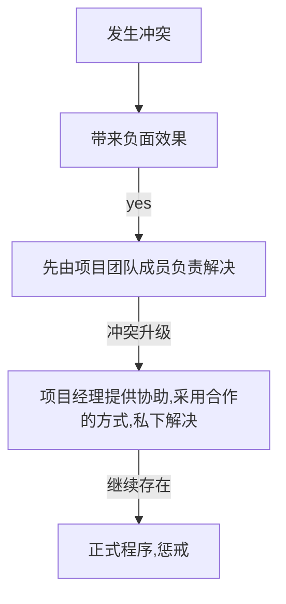
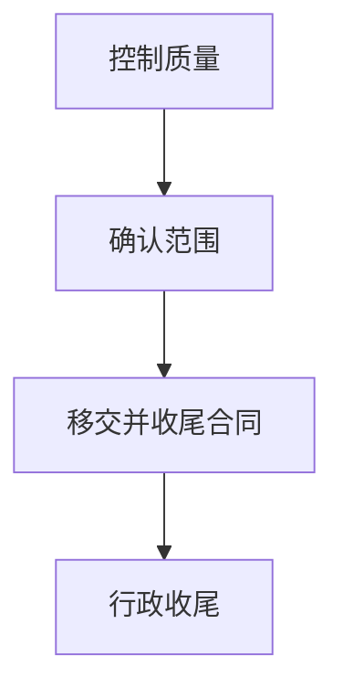

第一次考试


第二次考试


### **错题教训总结**：

PM自己能找到答案，不要找领导解决。这种答案都是错的。

下一步：强调流程；

应该：强调结果；

非标准表达：往往都是捏造的

某一领域的问题往往都是审查该领域的管理计划

#### 冲突解决

相关方如果有分歧，首先解决冲突，选达成共识的答案。可选工具：会议、协议沟通

#### 变更

对于已经发生的变更，先通知相关方，获得事后的批准。

CCB是建立有效的进行变更管理流程的关键

批准的变更应该纳入到项目范围基准里面

变更登记册只记录了进行了哪些变更，不会记录实际的变更处理

#### 需求

收集需求阶段产出：需求文件和需求跟踪矩阵

执行过程中，按范围基准实现可交付成果。如果客户不满意，先查看需求文件


#### 沟通

考试中，一旦出现相关方对沟通不满意的，比如报告看不懂、没及时收到信息、信息详细程度不够、汇报周期不对等。首先审查沟通管理计划；然后找出不满足沟通需求的原因，更新沟通管理计划；最后看是否对成本、进度、范围基准产生影响，从而决定是否走变更。


#### 风险

风险与问题的区别：

*风险*：是指未来**不确定事件**的发生，可能会对项目有积极或者消极的影响，这个不确定事件尚未发生！！

eg: 项目人员可能离职，可能造成项目延期

*问题*：已发生的事件，该事件已经或可能对项目有积极或消极的影响；

eg: 项目人员已经离职，项目可能延误；

其他：

- 对于已发生的风险，要在风险登记册里面更新状态，并且纳入问题管理日志中。

- 在项目中途，识别了一个新风险，应该在先评估风险，然后在风险登记册中记录，然后观察。
- 制定风险应对方案，是输出到**风险登记册**中，而非风险应对计划。
- 若风险应对策略无效，或者发生已接受风险，需要制定应急计划。
- 识别并实施风险应对策略是一个变更，需要按照整体变更控制流程来处理。

发生了一个未识别风险的大问题。先评估问题的影响，再建立权变措施。


总结是全员、全过程执行的 ，需要在整个过程中随时记录

作用：避免遗忘，避免重复发生。


### 2项目运行环境

#### 事业环境因素

团队不能控制的，对项目产生影响的

- 内部：
  - 员工的技能属于内部事业环境因素
  - 资源的可用性，比如合同的限制、规范，供应商以及合作协议等，也属于内部事业环境因素
  - 组织文化、组织结构和治理：如领导风格，公司价值观，公司规范等。
  - 基础设施
  - 设施和资源的地理位置
- 外部
  - 市场条件：比如公司的品牌认知度，竞争对手。
  - 法律限制
  - 政府或行业的标准

#### 组织过程资产

- 过程、政策、流程程序：如变更控制程序、收尾的要求；
- 组织知识库

​		

------


### 4整合管理

#### 整合管理7大过程

- 制定项目章程
- 制定项目管理计划
- 指导与管理项目工作
- 管理项目知识
- 监控项目工作
- 实施整体变更控制
- 结束项目或阶段

#### 制定项目章程

项目章程里包含了：

- 项目目的
- 可测量的项目目标和相关的成功标准
- 高层级需求，
- 高层级的项目描述、项目边界和主要可交付成果
- 整体项目风险
- 关键相关方名单
- 总体里程碑进度计划

#### 制定项目管理计划

**工具：**

*项目启动大会：* 召开时间：项目管理计划获得批准后

​							目的：阐述项目目标、获得团队对项目的承诺、阐明每个相关方的角色和职责、建立双方的沟通渠道。

​							

项目管理计划和项目文件：

| 项目管理计划    | 项目文件    |
| --------------- | ----------- |
| 1.范围管理计划  | 1. 活动属性 |
| 2.需求管理计划  | 2. 活动清单 |
| 3. 进度管理计划 |             |
| 。。。          |             |


#### 指导与管理项目工作

工作绩效数据：执行项目工作过程中，收集到的原始观察结果和测量值。

问题日志：记录并跟进项目过程中发生所有问题的项目文件，既可以用于沟通问题，又有解决问题过程的记录。可以帮助项目经理有效跟进和管理问题，确保得到解决。

变更请求：关于修改任何文件、可交付成果或基准的正式提议。变更请求包括：

- ​	纠正措施：针对于小问题，**过程的更正。**
- ​	预防措施：未来不再发生，以后不再发生。
- ​	缺陷补救：针对于大问题，**事后产品的缺陷**
- ​	更新：对项目文件或者计划等进行的变更。


#### 监控项目工作

输入：工作绩效信息：项目管理计划中规定关于范围、进度、预算和质量的具体工作绩效测量指标，与实际控制过程中的绩效数据进行比较，得出的差异。

输出：工作绩效报告：用实体或者电子形式进行合并、记录、分发，用以制定决策、采取行动或引起关注。


#### 结束项目或阶段

在结束项目时，项目经理需要回顾项目管理计划，确保项目所有工作都已完成并且项目目标都已实现。

**收尾五大件事**：

1. ​	验收确认：确保所有文件和可交付成果都是最新版本，且所有问题都已得到解决，确保可交付成果已得到客户的正式验收。 (**收尾第一步就是对本阶段的成果进行评估，是否达到收尾条件**)
2. ​	成果移交：将产品或服务向下一阶段转移。(**移交给甲方的所有信息都应该在移交文档之中的**)
3. ​	合同收尾
4. ​	行政收尾：对员工进行评价，总结经验教训
5. ​	满意度调查，并释放资源。 (**庆功晚宴又叫散伙饭，饭后就散伙，解散团队，释放资源**)

**项目文件：**

- 假设日志
- 变更日志
- 问题日志
- 经验教训登记册
- 里程碑清单
- 需求文件
- 质量控制测量结果
- 风险登记册
- 风险报告

------


### 5范围管理

#### 范围管理6大过程

- 规划范围管理
- 收集需求
- 定义范围
- 创建WBS
- 确认范围
- 控制范围

#### 收集需求

原型法是收集需求的一个工具，用来获取用户对需求的早期反馈，这个阶段产生的变化不需要走变更。

需求跟踪矩阵是从需求到可交付成果的关联表格，如：“商业价值→项目目标→需求→可交付成果→当前状态（完成情况/变更信息等）” ，可以在过程中始终如一地跟踪核实从需求到验收成果。

#### 定义范围

**输出**：项目范围说明书

项目范围说明书：内容包括了产品范围，可交付成果和验收标准、假设和制约，除外责任。作用：对项目范围与相关方达成共识，提供基准。

#### 创建WBS

**创建工作分解结构(WBS)是把项目可交付成果和项目工作分解成更小、更易于管理的组件的过程**。

不同的可交付成果和项目工作可以分解到不同的层次。工作分解的更细，更有利于工作的规划、管理和控制。但是过细的分解会造成管理努力的无效耗费，资源使用效率低下，工作实施效率降低。

**输出**：范围基准

范围基准：经过批准的(范围说明书+WBS+WSB词典)，是范围变更的基础。

**工具**：分解

**工作包**：WBS的最低层级是带有独特标识号的工作包。标识号为进行成本、进度和资源信息的逐层汇总提供了层级结构，构成账户编码。

**控制账户**：控制账户是一个管理控制点。在该控制点上，把范围、预算、实际成本和进度加以整合，并与挣值相比较，以测量绩效。每个工作包都是控制账户的一部分，控制账户拥有两个或多个工作包，但每个工作包只能与一个控制账户关联。

创建WBS是都是为了估算成本和进度，再设置计划

#### 确认范围

**正式验收已完成的项目可交付成果！！**

**输出**：验收的可交付成功

#### 控制范围

**管理范围基准变更，确保范围方面的变更都遵循变更流程。**


------


### 6进度管理

#### 进度管理6大过程

- 规划进度管理
- 定义活动
- 排列活动顺序
- 估算活动持续时间
- 制定进度计划
- 控制进度

#### 制定进度计划

**关键路径法**

资源优化：主要是调整任务的开始和结束时间，以调整计划使用的资源。分为资源平衡和资源平滑。

| 资源优化技术 | 概念                                                         | 关键点                                                       |
| ------------ | ------------------------------------------------------------ | ------------------------------------------------------------ |
| 资源平衡     | 在资源需求和资源供给之间取得平衡，往往是因为关键资源或者共享资源的时间受到限制，需要进行调整。 | 会造成关键路径发生改变，也会改变项目完成工期                 |
| 资源平滑     | 只在活动的自由浮动时间内或者总浮动时间内进行调整。           | 不会改变关键路径，也不会影响项目工期，但是可能无法实现所有的资源优化。 |

**数据分析:**

​	模拟分析——蒙特卡洛分析

> ​	使用模型，来对`单个项目的风险`和`不确定性进行的因素`进行模拟评估，以确定该因素对目标的影响。
>
> 通过计算机的迭代运行，来得出直方图或者累积概率分布曲线。

**进度压缩技术**：

> **赶工**： 增加资源，以最小成本的代价来压缩工期。比如加班、支付加急费用，来加快关键路径上的活动。
>
> **快速跟进**：将正常情况下按顺序执行的活动改为至少是部分并行开展的。例如：设计没做完就开始编程。

| 进度压缩技术 | 适用范围                                                     | 风险                                                         |
| ------------ | ------------------------------------------------------------ | ------------------------------------------------------------ |
| 赶工         | 适用于通过增加资源就可以缩短持续时间的，且位于关键路径上的活动 | 会导致成本增加                                               |
| 快速跟进     | 通过并行活动来缩短关键路径上的工期                           | 会造成返工<br />会增加相关活动之间的协调工作量，增加质量风险<br /> |


### 7成本管理

#### 成本管理4大过程

- 规划成本管理
- 估算成本
- 制定预算
- 控制成本

#### 规划成本管理

**规划成本管理——输入**

> 规划成本管理的主要输入是项目管理计划：

项目管理计划中包括（不限于）进度管理计划、风险管理计划。

#### 估算成本

类比估算：采用历史类似项目的成本进行估算

参数估算：用一些历史的数据分析得出的统计关系，进行**模型**估算。

自下而上估算：对工作包进行具体细致的估算，然后向上汇总，得到更高层次的估算。

三点估算： 最悲观、最乐观、最可能三个值进行估算。计算公式分为两种：三角公式(/3)  **贝塔公式(/6)**

PERT 首选贝塔公式


#### 制定预算

#### 控制成本

> 控制成本的目的是为了监督项目的状态，在整个项目期间，保持成本基准的维护。
>
> 它输入包含成本基准，输出也有成本基准。
>
> 监督成本绩效，分析成本绩效与成本基准之间的偏差，以决定是否执行变更控制过程，更新经批准的成本基准。

**输入项**

> - 绩效测量基准
> - 工作绩效数据

**工具——数据分析**

**挣值分析**：

​	计划价值：PV  是指项目实施过程中，某阶段计划要求完成的工作量所需的预算工时。  （计划工作量*计划单价）

​	挣值：EV  指项目实施过程中，在某阶段里实际完成工作量，按预算定额计算出来的工时。（已完成工作量*计划单价）

​	实际成本：AC 给定的时间段内，为了完成EV而实际发生的成本。

**偏差分析**：

​	进度偏差`Schedule Variance`：SV=EV-PV  实际挣得价值 减去 计划挣得的价值

​	成本偏差`Cost Variance`：CV=EV-AC  给定时间点，计划的 减去 实际的成本

​	成本绩效指数`Cost Performed Index`：CPI = EV/AC

​	进度绩效指数`Schedule Performed Index`：SPI=EV/PV

​	完工偏差：VAC=BAC-EAC 

**预测：**

​	完工预算BAC `Budget cost at completion`： 就是计划完成时的PV

​	完工估算EAC `Estimate at Completion`： 按照实际情况，预测项目未来计划完成时，需要多少成本。计算公式会根据预测的策略来定，可能是考虑当前成本绩效指数，可能忽略。

​	完工尚需估算ETC:  完工的估算 减去 现在已经花去的成本  ETC = EAC - AC 

​	完工尚需绩效指数TCPI：  剩余的估算必须达到的绩效指数 = $\frac{剩余工作}{剩余资金}$   $\frac{BAC-EV}{BAC - AC或EAC - AC}$

​		*按预算单价来完成ETC*：EAC = AC + (BAC - EV);    ETC = BAC - EV;   意味着需要提高你的CPI，否则肯定无法实现

​		*按照当前CPI来完成ETC*:   EAC = BAC / CPI;   ETC =  ( BAC - EV )/ CPI;  保持当前的CPI，相应会需要提高预算

​		按照SPI和CPI来计算： 假设SPI和CPI同时影响着ETC的工作。

------

### 8质量管理

#### 质量管理3大过程

- 规划质量管理
- 管理质量
- 控制质量


#### 规划质量管理

**输入：**

**范围基准**

范围说明书里面的验收标准是确定质量要求的基础

**工具：**

成本效益分析

**质量成本**

| 一致性成本                           | 不一致性成本                           |
| ------------------------------------ | -------------------------------------- |
| 预防成本：培训、流程写成文档、花时间 | 内部失败成本： 返工、废品              |
| 评估成本：测试、破坏性测试损失、检查 | 外部失败成本：客户流失、保修服务、责任 |

**输出：**

*质量管理计划*：包含质量管理标准、质量管理目标、质量角色和职责、如何开展质量管理与控制质量管理方法。

*质量测量指标*：它定义了测量质量的标准，包含允许偏差范围。类似于体检中的血常规表格。更新质量测量指标不用走变更流程**。


#### 管理质量

管理质量包含了所有质量保证的活动，强调的是过程。并且还与产品的设计和改进过程有关。

**工具：**

*核对单*：用来核实要求的事情是否都已执行

**输出：**

*质量报告*

*测试与评估文件*： 这是控制质量的输入，用于指导如何开展对结果的检查与测试。


#### 控制质量

为避免在验收时由于缺陷使客户拒收，那么在交付前最好对可交付成果进行质量控制。

**工具：**

*核查表：*用于收集质量数据

*问卷调查*：用来收集客户满意度信息

*控制图：*用来确定一个过程是否稳定。

*质量审计*：突出问题识别和后续纠正

------


### 9项目资源管理

#### 项目资源管理6大过程

- 规划资源管理
- 估算活动资源
- 获取资源(招募)
- 建设团队
- 管理团队
- 控制资源

#### 规划资源管理

**输出**

资源管理计划：团队管理计划和实物资源管理计划

团队章程：对团队可接受行为作出明确规定，尽早制定并且遵守，可减少误解，提高效率


#### 估算活动资源

估算活动资源是估算活动持续时间和估算活动成本的基础

**输入：**

*资源日历*：


#### 获取资源

**工具**：

*预分派*：事先确定项目的实物或者团队资源。

*谈判*：谈判顺序——与职能经理谈、组织内其他项目管理团队、外部组织谈判

*虚拟团队*：不同地区，通过信息技术沟通协作。可以节约成本，纳入更多的专家。但是沟通比较困难，难以分享知识，可能存在文化差异。**要特别加强沟通规划与管理**


#### 建设团队

**建设团队的目的**：

> 1.为了提高团队成员的能力，
>
> 2.提高团队间的认同感和信任度。
>
> 3.提高协作率，从而提高个人和团队生产效率，促进合作；
>
> 4.提高知识分享；
>
> 5.提高团队的决策能力，承担起责任，从而提高团队的生成效率；

**建设团队的工具**：

> 1.集中办公：把团队集中到一起办公，可以加强团队的工作能力
>
> 2.虚拟团队：减低成本，拉近团队成员的距离。虚拟团队的优势是提高资源的利用率及减少成本。 **遇见问题，首选沟通**
>
> 3.沟通技术
>
> 4.人际关系与技能
>
> 5.认可与奖励：可以是正式的或者非正式的奖励，也可以是有形的或者无形的奖励。有效的激励团队成员，获得成就感。
>
> 6.培训：培训可以提高团队成员的能力

项目经理的六种权力

- 1.法定权：项目章程授予的正式权利 
- 2.专家权：技术人员最爱，PMI 推荐
- 3.奖赏权：推荐多用
- 4.强制权：冲突影响严重时使用，最后的招数 
- 5.指示性权利：狐假虎威，借力
-  6.感召权：PMI推荐


#### 管理团队

**工具：**

**冲突管理**

一般步骤：



项目环境中，**解决冲突**有5种方式：

- 撤退/回避：暂时不解决，或者等待时机去解决

- 缓和/包容：双方各退一步，**求同存异**，强调一致而非差异

- 妥协/调解：为了暂时解决问题，寻找各方一定程度上满意的解决方案，有时候会导致"双输"

- 强迫/命令：强迫一方使用另一方的方案

- 合作/解决问题：过程友好开放，考虑问题比较全面

#### 控制资源

**工具：**

*问题解决*：识别问题——定义问题——调查——分析——解决——评估解决结果

------


### 10沟通管理

#### 沟通管理3大过程

- 规划沟通管理
- 管理沟通
- 监督沟通

#### 规划沟通管理

**工具：**

*沟通需求分析*：用来确定相关方的信息需求，合适时间以合适的方式发送合适的消息。

*沟通渠道*：计算公式：n*(n-1)/2

*沟通方法：*

​	推式：固定的接收方

​	拉式：大量的接收方

​	互动式: 需要确定一致

*沟通风格评估：*识别相关方喜欢的沟通方式和内容

*相关方参与度评估：*找出相关方参与度的差距

**输出：**

*沟通管理计划*：制定沟通策略，执行必要措施以落实沟通策略。

#### 管理沟通

#### 监督沟通


------


### 11风险管理

> 项目风险管理旨在强化正面风险(机会)，规避或减轻负面风险(威胁)，把风险敞口保持在可接受的范围内；
>
> 项目团队应该知道，相对于项目目标，可接受的风险敞口究竟是多大；
>
> 每个项目相关方的风险偏好会有所不同，应明确规定风险临界值，并且传达给项目团队。
>

#### 风险管理6大过程

1. 规划风险管理
2. 识别风险
3. 风险定性分析
4. 风险定量分析
5. 规划风险应对
6. 实施风险应对
7. 监督风险

#### 规划风险管理

**输出：**

​	***风险管理计划***：风险管理的流程和指南，它不针对具体的风险应对措施。包括风险分解结构RBS

​	**风险类别：**可以借助风险分解结构（RBS）来构建风险类别，有助于团队考虑单个项目的全部风险来源，用来识别风险、归类已识别风险。

​	**相关方风险偏好**：记录相关方的风险偏好，并把相关方的风险偏好描述成可测量的风险临界值。这些临界值会联合决定项目的风险敞口，也可以用于制定概率和影响定义。

#### 识别风险

**输出**：

***风险报告***：提供关于整体项目风险的信息，也有关于已识别单个项目风险的概述信息。 风险报告是风险登记册的归纳和总结，是用来向相关方汇报的

***风险登记册：***：已识别风险清单，**潜在**的风险责任人，**潜在**的应对措施。

#### 风险定性

评估风险发生的概率和影响，对风险进行一个优先级排序。这个过程会为每一个风险指定一个负责人，由负责人来规划风险应对措施。

**工具：**

| 量级 | 概率    | 时间影响 | 成本影响       | 质量影响               |
| ---- | ------- | -------- | -------------- | ---------------------- |
| 很高 | >70%    | >6个月   | >500万RMB      | 对整理功能影响非常重大 |
| 高   | 50%~70% | 3~6个月  | 100万~500万RMB | 对整理功能影响重大     |
| 中   | 30%~50% | 1~3个月  | 50~100万       | 对关键功能有影响       |
| 低   | 10%~30% | 1~4周    | 10~50万        | 对整体功能有小影响     |
| 很低 | 0%~10%  | 1周      | <10万          | 对非关键功能有小影响   |

​	***概率和影响矩阵***：它是一种把风险发生的概率和发生后对项目的影响进行映射起来的表格，如上图。基于风险的概率和影响，可以对风险进行优先级排序，以便进一步制定应对措施。组织可以事先排序，也可以针对于某一个项目，进行量身定制的排序。		

​	***风险数据质量：***对风险评估数据的可信度进行评估

**输出：**

​	***更新的风险登记册***：对风险评级，指定风险责任人

​	***更新的风险报告***

#### 风险定量

针对于在定性分析中，被确定为重大影响的风险。

**工具：**

- 贝塔分布与三角分布：估算概率

- 敏感性分析：确定哪些风险有最大的潜在影响，龙卷风图
- 决策树：通过决策树，来计算预期的价值，确定最佳方案。
- 建模与模拟：用分析目标完成的概率分布情况。认为目标不能按时完成，需要具体了解完成的可能性是多少?最终要100%完成预期需要多少天？

**输出：**

​	***更新的风险登记册***：对项目风险进行概率分析；得到实现的成本和事件的概率；

​	***更新的风险报告***

#### 规划风险应对

**概念：**

制定风险应对方案，输出到**风险登记册**中，而非风险应对计划。

有效的风险应对措施可以最小化单个威胁，最大化单个机会，降低整体项目风险敞口。

应该为每一个风险制定最有效的策略或策略组合，制定具体的应对行动。

如果选定的策略无效，或者发生了已接受的风险，需要制定应急计划(或弹回计划)

需要识别次生风险，为风险分配**应急储备**。

发生次生风险后，首先要**评估风险情况**，然后进行处理。

**工具：**

**威胁应对策略**：

- 上报
- 规避：采取行动来**消除威胁**，**保护项目不受到影响**。 可能会涉及到变更项目计划，或者改变目标，以便于彻底消除威胁，或者降低概率。(比如分包给专业公司)
- 转移：不承担风险的影响，将消极影响连同责任转移给第三方，让第三方来管理风险。比如买保险，使用担保、保证书。(移交给第三方)
- 减轻：通过采取措施来降低威胁发生的概率或者减轻影响。提前采取措施：比如更多的测试，更稳定的供应商。
- 接受：等到风险发生再采取措施。比如增加应急储备。

**机会应对策略**：

- 上报
- 拓展： 确保机会发生，投入最好的资源
- 分享：将机会的责任给能抓住机会的第三方。
- 提高：提高机会的发生概率和影响。
- 接受

**整体项目应对策略**：

- 规避
- 开拓
- 转移或风险
- 减轻或提高
- 接受

**输出：**

***更新风险登记册*：**具体的应对措施，具体行动，触发因素，责任人，次生风险，弹回计划，应急储备等


#### 实施风险应对

按风险登记册的内容，执行风险应对措施。确保按计划执行风险应对措施，管理整体风险敞口，最大化项目机会，最小化项目威胁。

注意：如果已知风险发生，导致项目进度延误，首先要实施应对计划，其次应该通过实施整体变更控制过程对延误进行处理。

#### 监督风险(控制风险)

**目的**：

监督风险应对计划的实施，判断风险的应对措施是否有效；

评估风险管理的有效性、适用性。

识别是否出现新的风险，识别项目整体风险级别是否发生改变，已识别的单个风险级别是否发生改变。

**工具：**

***风险审查会***：在风险审查中，可以识别出新的单个项目风险（包括商定应对措施所引发的次生风险，重新评估当前风险，关闭已过时风险）。总结经验教训。

***储备分析***：分析储备的多少和项目风险情况。风险大，储备多；反之，储备小。不确定性用储备分析来应对。

**输出：**

***风险登记册***：监督风险过程中，可能出现新识别风险，风险已过时，风险已发生采取了应对的措施。这些都需要更新记录在风险登记册里。

***风险报告***：更新项目的整体风险级别，更新当个项目风险的当前状态。


------


### 12采购管理

#### 采购管理3大过程：

- 规划采购管理
- 实施采购
- 控制采购

#### 规划采购管理：

**典型的步骤：**

```
准备采购说明说或者工作大纲
准备高层级的成本估算
发布招标广告
确定合格卖方的短名单
准备并发布招标文件(信息邀请书、报价邀请书、建议邀请书)
由卖方准备并提交建议书
对建议书展开技术、质量、成本评估，选出中标建议书
结束谈判，买卖方签署合同
```

**工具：**

***自制或外购分析：***

**输出**：

> **采购管理计划**：采购管理计划需要包含如何协调、整合 `采购` 与`项目的其他工作安排`，会牵扯到**`项目进度计划`**和**`风险管理事项`**
>
> **采购策略**：一旦完成自制或外购分析，并决定从项目外部渠道采购，那就需要制定一套**采购策略**。包括有：交付方法、合同类型等
>
> **招标文件**：信息邀请书、报价邀请书、建议邀请书
>
> **采购工作说明书：**采购工作说明书(SOW)会充分详细的描述采购的产品、服务、成果。内容包括：规格、数量、质量要求、绩效数据、时间、工作地点和其他要求；**`工作大纲`**与**`采购说明书`**类似，只是形式和内容不同。
>
> **供方选择标准**
>
> **自制或外购决策**
>
> **独立成本估算**

**合同类型**

> 合同关系分为总价类合同、成本补偿类合同。
>
> **总价类合同**：
>
> - 固定总价：一般买方都希望是这种合同，尽可能减少风险。
> - 固定总价加激励：给买卖双方提供了一定的灵活性，允许有一定的绩效偏离。成本激励，避免预算偏差。
> - 固定总价加经济价格调整：一般是合同持续几年，可能会出现通货膨胀，商品成本调整的情况。对事先确定的合同价格进行调整。
>
> **成本补偿合同：**
>
> - 成本加固定费用
> - 成本加激励费用
> - 成本加奖励费用

**成本加成本百分比合同**的计算公式：支付酬金 = （成本 + 成本 * 约定的百分比）

**注意**：赔偿和项目成功与否没有关系，按合同约定的计算规则结算。


#### 实施采购

投标人会议

**输出：**

***协议***：协议主要是采购合同。它包含了主要的可交付成果、进度计划、里程碑、绩效报告、质量和**验收标准**。

***选定的卖方：***


#### 控制采购

**输入：**

***协议*：**控制采购的输入，实施采购的输出。

**工具**：

***绩效审查***：依照协议，对资源、进度、成本和质量进行测量、比较和分析，以审查工作绩效。

***索赔管理：***

> 如果买卖双方产生分歧，产生有争议的变更，这类变更成为索赔。
>
> 如果合同双方无法自行解决，那么会用替代争议解决方法（ADR）去处理。
>
> 谈判是处理所有争议和索赔的首选方法

***检查***：检查是指对承包商正在执行的工作进行结构化审查。比如在工地里，巡视现场。

***审计***：审计是对采购的过程进行结构化审查，确定采购活动是否遵循了组织和项目的政策。一般审计活动有项目外部来执行。调查团队在过程中不符合既定的规则与流程的问题都是审计。

------


### 13相关方管理

> 涉及到员工的态度

相关方管理4大过程：

- 识别相关方

- 规划相关方参与

- 管理相关方参与
- 监督相关方参与

当组织结构发生变化的同时，需要重新规划相关方参与计划。因为这个时候可能相关方发生了变化，相关方的期望也可能发生了变化。


#### 识别相关方

> 定期识别项目相关方，分析记录相关方的利益、参与度、相互依赖性、影响力以及对项目的潜在影响过程。

**组织过程资产能影响识别相关方过程**

**权利利益矩阵**

|        | 利益高   | 利益低   |
| ------ | -------- | -------- |
| 权利高 | 重点管理 | 令其满意 |
| 权利低 | 随时告知 | 监督他   |

**权利动力矩阵**

|        | 可预测性高             | 预测新低             |
| ------ | ---------------------- | -------------------- |
| 权利高 | 影响大，可以预测和应对 | **最大的危险和机会** |
| 权利低 | 问题少                 | 不可预测，但可以管理 |

**影响方向**：

- 向上：执行组织或客户组织、发起人和指导委员会的高级高级管理层
- 向下：临时贡献知识或技能的团队或专家
- 向外：项目团队外的相关方群体及其代表，如供应商、政府部门、公众、最终用户和监部门
- 横向：项目经理的同级人员，如其他项目经理或中层管理人员，他们与项目经理竞争稀缺项目资源或者合作共享资源或信息

**相关方登记册**

#### 规划相关方参与

相关方参与计划：鼓励相关方出席会议并积极参与，用于促进相关方有效参与决策和执行的策略。

相关方参与评估矩阵：

- ​	不知晓
- ​	抵制
- ​	中立
- ​	支持
- ​	领导


#### 管理相关方参与

是与相关方沟通协作，以满足其需求与期望、处理问题并促进相关方合理参与的过程

目的：让项目经理能提高相关方的支持，并尽可能降低相关方的抵制。


#### 监督相关方参与

出现了新的相关方，首先更新相关方登记册与相关方参与计划。	


------


## 常见工具

### 人际关系与团队技能

#### 名义小组

促进头脑风暴的一种技术。通过投票来选出最有用的创意，以便进行更深一层次的头脑风暴和**优先排序**。

形式步骤：

1. 主持人向小组提出问题
2. 小组沉思后写下自己的想法
3. 主持人记录所有的想法，集体讨论所有想法，直到所有人清晰的理解。
4. 对所有想法进行5分制投票，选出票数最高的想法，进行进一步的讨论。

### 收集需求

#### 问卷调查

试用于地理位置比较分散的，能快速获得团队的统计分析反馈          

#### 焦点小组

召集专家，了解他们对讨论的焦点的期望和态度。针对焦点来发散。

#### 原型法

收集需求的一个工具，用来获取用户对需求的早期反馈，这个阶段产生的变化不需要走变更。


#### 关键链法

关键链法特点就是在确定了关键路径之后，再考虑资源可用性调整计划。是资源约束型关键路径


#### 思维导图

把头脑风暴中的创意整合成一张图，用来反映创意之间的共性与差异，激发新的创意。

#### 核对单

根据要点进行确认

#### 亲和图

> 对大量的想法进行**分类分组**，以便进一步的进行分析。可以用来对潜在的缺陷成因进行分类，以关注最需要关注的领域


#### 鱼骨图

> 又称为"因果图"，"石川图"，用来分析问题最根本的原因

#### 散点图

> 散点图是一种展示**两种变量之间的关系**的图形。可以用来确定两个变量之间是否存在一定的关联

#### 直方图

> 对结果进行统计，直方图可以清楚的展示数据的差异
>
> 目的就是通过观察图的形状，判断生产过程是否稳定，预测生产过程的质量


#### 控制图

> 用来确定一个过程**是否稳定**，评价过程改进是否达到预期改进效果，或者是**否有可预测的绩效**。


1点原则

7点原则


#### 思维导图

把从头脑风暴中获得的创意整合成一张图，用以反映创意之间的共性与差异，激发新创意，主要是整合输入


#### 外四分位法

11个人的外四分位法是，首先，每个人都提出自己的估算；然后对11个人的时间估算进行从大到小的排序，如：1、2、3、4、5、6、7、8、9、10、11；最后，进行四分位法排列，即分四组，如：①② 3 ④⑤ 6 ⑦⑧ 9 ⑩⑪，那么11个人4组的分隔点在 ：3-6-9，3的位置是最悲观的估算，6位置的是最可能估算，9位置是最乐观估算。这是典型的三点估算的方式。


#### 帕累托图

 2、8原则：当存在大量缺陷时，需要按原因对缺陷数量进行排序，找出大量缺陷的关键原因。

审题关键：最常见的问题的改进领域，也就是识别导致最多问题的主要原因。


#### 流程图


#### 过程决策程序图（PDPC）

用于理解一个目标与达成此目标的步骤之间的关系


#### SIPOC图

又称高级过程流程图，它以简洁直观的形式表现了一个流程的结构和概况，可以用来展示整个组织的业务流程。

为后续的分析及研究奠定了基础。


#### 德尔菲法

在对所要预测的问题征得**专家**的意见之后，进行整理、归纳、统计，再匿名反馈给各专家，再次征求意见，再集中，再反馈，直至**得到一致的意见**。

它有三个明显区别于其他专家预测方法的特点，即匿名性、多次反馈、小组的统计回答。


### 数据分析技术

#### 蒙特卡洛分析

可以用来做风险的定量分析，也可以用来估算项目的整体进度的概率分布

一般步骤：对每一项活动，进行大量的随机抽样、统计分析，得出大致的时间概率分布，从而计算出整个项目的工期概率分布。

#### 成本效益分析：

比较可能的成本与预期的效益，确定改进某质量是否值得投入。


#### RACI矩阵

谁负责（R = Responsible）

谁批准（A = Accountable）

咨询谁（C = Consulted）

通知谁 (I =Informed)

注意点：

- 在每一项任务当中，你要看一下是否有 A 和 R。没有的话，说明任务没人负责
- 如果一件事情有两个 A 或两个 R，那也是有问题的，那就意味着同样的问题有多个负责人，最终也会是无人负责。


#### 决策树分析

清楚显示出项目所有可供选择的行动方案，行动方案之间的关系，行动方案的后果，后果发生的概率，以及每种方案的损益期望值；  遇见多个风险的时候


#### 精益六西格玛 

确定改进的方面


​                                                                                                                               

#### 

------


### 项目管理过程组

#### 规划过程组：

- 制定项目管理计划
- 规划范围管理
- 收集需求
- 创建WBS
- 规划进度管理
- 定义活动
- 排列活动顺序

。。。

**项目管理计划**：

有许多的组成部分，如子管理计划、基准和项目生命周期描述。子管理计划是项目某一个特定方面知识领域相关的计划：如进度管理计划、风险管理计划和变更管理计划等等。

题目中出现项目管理计划和其他的计划，肯定选项目管理计划。因为项目管理计划是一个大的概述


#### 收尾过程组

一般流程：



行政收尾：开内部总结会，编制并且分发项目最终报告，存档项目信息

如果项目提前终止，需要制定程序，记录原因，并且按程序移交。

